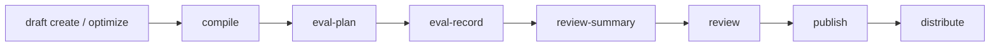
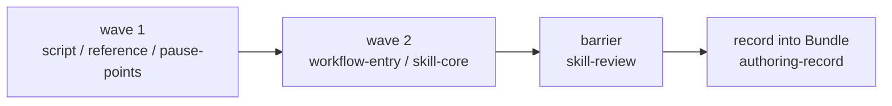

`comet bundle` is the advanced backend that `/comet-any` and `comet publish` build on. It creates the platform-agnostic Skill Bundle, compiles it into install plans for target platforms, and manages Engine metadata, Eval evidence, and human-approval state.

For day-to-day creation, use `/comet-any`; for recovery or state inspection, use [comet creator](/en/cli/creator); for review and distribution, use `comet publish`. Run Bundle commands directly only for backend audits or low-level debugging (compile, capability gaps, eval evidence, executable disclosure).

<Warning>
  If you just want to create, evaluate, and publish a Skill, do not start from{' '}
  <code>comet bundle</code>. The normal path is: <code>/comet-any</code> creates,{' '}
  <code>comet eval</code> verifies, <code>comet creator next/status</code> tells you the next step, and
  <code>comet publish</code> finishes review, publish, and distribution.
</Warning>

## Where to look for daily use

| What you want to do | What to use |
| --- | --- |
| Create or compose a Skill | [`/comet-any`](/en/skill-creator/getting-started) |
| Read creation state or the next step | [`comet creator`](/en/cli/creator) |
| Run pre-publish evaluation | [`comet eval`](/en/cli/eval) |
| Review, approve, publish, distribute | [`comet publish`](/en/cli/publish) |
| Audit Bundle backend state | This page |

## When you need to use it directly

- Audit the Bundle draft and compile output.
- Debug a platform compile, capability gap, or executable disclosure.
- Record structured eval evidence by hand.
- Automation that needs the JSON backend commands.

## Common backend phases



## Skill Creator commands moved to `comet creator`

Since 0.4.0-beta.1, `comet creator` is the command-line entry that corresponds to Skill Creator. These older pre-release Bundle aliases are no longer the current commands:

```text
comet bundle factory-*
comet bundle authoring-*
comet bundle list
comet bundle status
```

The mapping is:

| Old pre-release command | Current command |
| --- | --- |
| `comet bundle factory-guide` | `comet creator guide` |
| `comet bundle candidates` | `comet creator candidates` |
| `comet bundle factory-propose` | `comet creator propose` |
| `comet bundle factory-init` | `comet creator init` |
| `comet bundle factory-resolve` | `comet creator resolve` |
| `comet bundle factory-generate` | `comet creator generate` |
| `comet bundle authoring-plan` | `comet creator authoring-plan` |
| `comet bundle authoring-record` | `comet creator authoring-record` |
| `comet bundle list/status` | `comet creator list/status` |

## Authoring protocol

Since 0.4.0-beta.1, Skills generated by `/comet-any` no longer carry only a fixed flow skeleton; they carry real human-authored content. This works through an **authoring protocol**: a directed acyclic flow of **authoring lanes**, where each lane's output passes schema validation and a final Skill review with multiple rounds of voting.

### Authoring pipeline

Authoring advances in **waves**, and each lane is a sub-task that can run in parallel:



| Lane | Output | Notes |
| --- | --- | --- |
| `script` | Runtime scripts (workflow-state, workflow-guard, workflow-handoff, comet-plan, comet-check, comet-hook-guard) | The 6 core scripts |
| `reference` | workflow-protocol, resolved-skills, composition-report, authoring-lanes | Protocol and composition evidence |
| `pause-points` | decision-points, recovery | Decision points and recovery |
| `workflow-entry` | Entry Skill content | Entry authoring |
| `skill-core` | Node Skill content | Node authoring |
| `skill-review` | skill-review | Voting review (the barrier) |

When the authoring protocol runs, use `comet creator authoring-plan` and `comet creator authoring-record`. These commands:

- Return the authoring plan: which lanes to run, the expected output of each lane, and the depth (`quick` covers only the necessary lanes, `full` covers all).
- Validate and record a lane's output.

- **Schema validation**: the lane's output JSON must match the lane's schema (status ∈ `DONE`/`DONE_WITH_CONCERNS`/`NEEDS_CONTEXT`/`BLOCKED`, with `artifacts`, `findings`, `evidence`, and other fields present).
- **Claim validation**: the outputs a lane claims (claims) must correspond to actual artifact files that exist and match.
- **Writing state**: after validation, the lane's output is committed to the Bundle's authoring state (`BundleAuthoringState`), recording the lane status, findings (severity ∈ `critical`/`important`/`minor`), and review evidence.
- **Review evidence**: the `skill-review` lane's evidence source ∈ `deterministic-check-only`/`llm-single`/`llm-multivote`, and it records the real review conclusion (voters, lenses, findings) instead of hardcoding `approved`.

### Authored content zones

A generated SKILL.md is made of two parts:

- **Auto zone**: frontmatter, the routing table, Entry/Exit checks, evidence format, and recovery — the control plane that never changes, generated from templates.
- **Authored zone**: the entry's `## Decision Core` and a node's `## Guidance` — dynamically authored by the skill-core / workflow-entry sub-agents.

Nodes are split into `delegates` (overlay layers → install a rich Skill, so thin guidance is correct) and `substance` (the workflow kernel, which must have rich authored guidance). A `substance` node that lacks authored content renders an explicit `AUTHORING PENDING` stub and appears in `unauthoredSubstanceNodes` — **this blocks publishing readiness**, so the generator can no longer pass a fake-complete thin Skill off as finished.

## draft and compile commands

```bash
# Manually create or optimize the draft (for troubleshooting or explicit optimization)
comet bundle draft create <name> --default-locale en --json
comet bundle draft optimize <bundle> --name <name> --json

# Compile against the reference platform
comet bundle compile <name> --platform <id> --json
```

## eval commands

```bash
# Plan the eval workload
comet bundle eval-plan <name> --level quick --json
comet bundle eval-plan <name> --level full --json

# Record eval evidence
comet bundle eval-record <name> --result <file> --json
```

### eval-plan

Returns `BundleEvalPlan { level, components[], estimatedRuns, tokenWorkload, explanation }`. This is a **descriptive estimate**, not a token commitment:

| Level | components | estimatedRuns |
| --- | --- | --- |
| `quick` | static, entry-smoke, baseline, assertion-grading, platform-compile | `4 + entries*2` |
| `full` | everything in quick, plus trigger-accuracy, routing-overlap, failure-analysis, etc. | `quick + 6 + entries*3` |

### eval-record

The result must be bound to the current draft hash and the current eval manifest hash. The validation rules are:

- `result.schemaVersion !== 2` or `result.provider !== "comet-eval"` → rejected.
- `result.draftHash !== state.currentHash` → the file is written, but state does not advance.
- `result.evalManifestHash` does not equal the currently generated `comet/eval.yaml` hash → the file is written, but state does not advance.
- Everything passes (`result.passed` is true and `failures` is empty) → status advances to `eval-passed`.
- Otherwise it falls back to `draft`, clearing review/ready/conflict.

The schema of the eval-result JSON is in [Publishing and distributing Skills: The eval-record evidence contract](/en/skill-creator/publishing#the-eval-record-evidence-contract).

## review and publish commands

```bash
# Generate a review summary
comet bundle review-summary <name> --platform <id> --json

# Approve or reject
comet bundle review <name> --approve --reviewer <reviewer> --json
comet bundle review <name> --reject --reviewer <reviewer> --json

# Publish
comet bundle publish <name> --platform <id> --json

# Distribute
comet bundle distribute <name> --platform <id> --scope project --preview --json
comet bundle distribute <name> --platform <id> --scope project --json
```

Before publishing you must read the readiness in the review summary, and you must not publish a ready when the publishing gates are not met. [Publishing and distributing Skills](/en/skill-creator/publishing) is the authority on the meaning, trigger conditions, and recovery suggestions of each blocker code; the user-facing publish command reference is [comet publish](/en/cli/publish).

## Common options

| Option | Description |
| --- | --- |
| `--project <dir>` | Project root (default `.`) |
| `--json` | Output structured JSON |
| `--platform <id>` | Target platform (repeatable) |
| `--scope <project\|global>` | Distribution scope |
| `--level <quick\|full>` | Eval workload level |
| `--result <path>` | Eval result file path |
| `--approve` / `--reject` | Approve or reject |
| `--reviewer <name>` | Reviewer |
| `--preview` | Distribution preview |
| `--confirm-executables` | Confirm executable disclosure |
| `--skip-capability <cap>` | Skip an optional capability |
| `--default-locale <locale>` | Default language (`draft create`) |
| `--locale-option <locale>` | Language options (repeatable) |
| `--engine` | Enable Engine (`draft create`) |

## The relationship between bundle and publish

`comet creator` is the creation and recovery entry, and `comet publish` is the publishing entry. `comet bundle` is the advanced backend that operates on internal state directly.

| Command | Role | Who it is for |
| --- | --- | --- |
| `comet creator` | Creation state and recovery entry | Daily use, automation |
| `comet publish` | User publishing entry | Daily use |
| `comet bundle` | Advanced Bundle backend | Audit, debugging, automation integration |

<Info>
  For the user-facing publishing path, prefer <a href="/en/cli/publish">comet publish</a>. Use{' '}
  <code>comet bundle</code> directly only when troubleshooting or auditing.
</Info>

## Next steps

- [comet publish](/en/cli/publish) — the user publishing entry
- [comet creator](/en/cli/creator) — the `/comet-any` creation state and recovery entry
- [Skill Creator overview](/en/skill-creator/overview) — how `/comet-any` uses Bundle internally
- [Publishing and distributing Skills](/en/skill-creator/publishing) — readiness and the distribution flow
