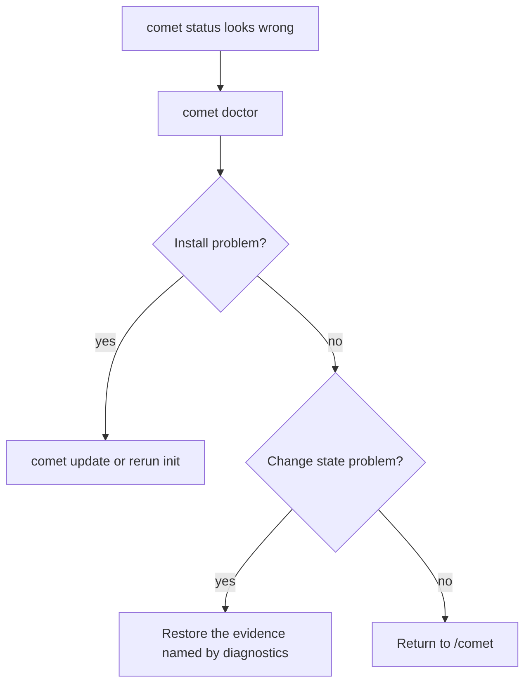

`comet doctor` is the health-check entry point. It covers both installation health and workflow state.

## Basic usage

```bash
comet doctor
```

| Option | Description |
| --- | --- |
| `--json` | Output structured diagnostics. |
| `--scope <scope>` | Diagnose `auto`, `project`, or `global` scope. |

## What it checks

- Project-level and global installation.
- Target platform Skill directories.
- Comet Skills, rules, Node runtime scripts, and hooks.
- The active change `.comet.yaml`.
- Current step, runtime mode, and missing evidence.

## Troubleshooting order


