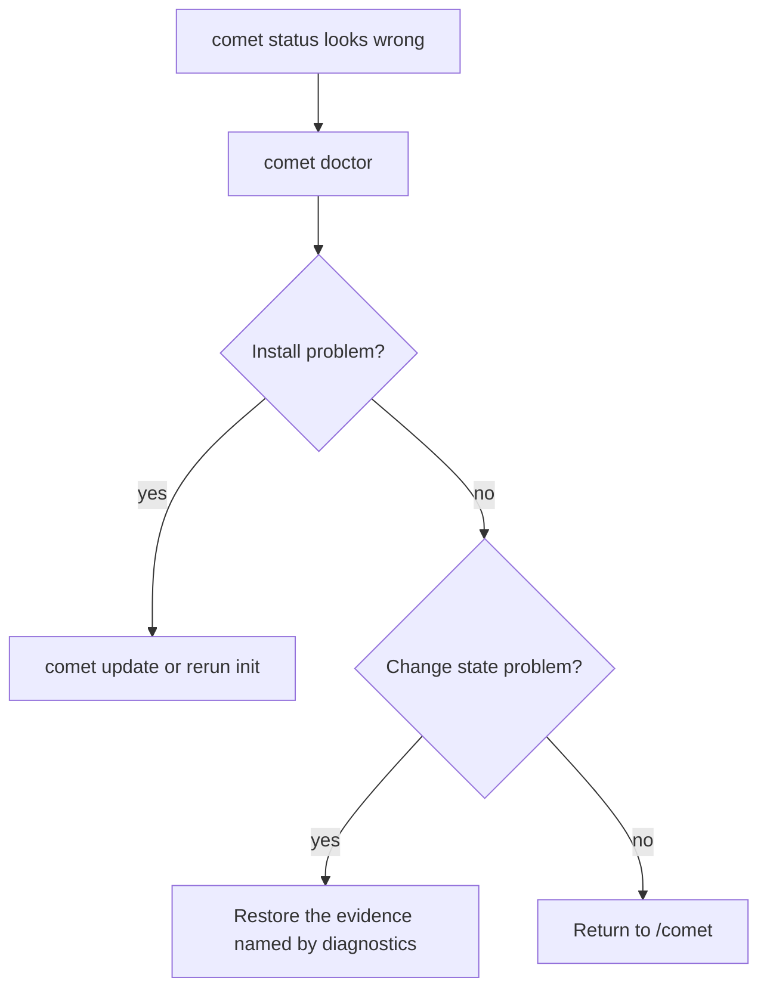

`comet doctor` is the health-check entry point. It covers both installation health and workflow state.

## Basic usage

```bash
comet doctor
```

| Option | Description |
| --- | --- |
| `--json` | Output structured diagnostics. |
| `--scope <scope>` | Diagnose `auto`, `project`, or `global` scope. |

## What it checks

- Project-level and global installation.
- Target platform Skill directories.
- Comet Skills, rules, Node runtime scripts, and hooks.
- The active change `.comet.yaml`.
- Current step, runtime mode, and missing evidence.

## Scope diagnostics

By default, `comet doctor` uses `--scope auto`. Auto scope checks the current project first, then checks the global install when it lives somewhere else.

When the global Comet install is complete but the current project has no project-local Skill copy, `doctor` reports the global install as available and treats the project-local copy as optional. Run `comet init --scope project` only when this project needs its own checked-in Comet setup.

The diagnostics also include the Node version, platform, project path, and effective global home directory so environment-specific install issues are easier to compare.

## Troubleshooting order


