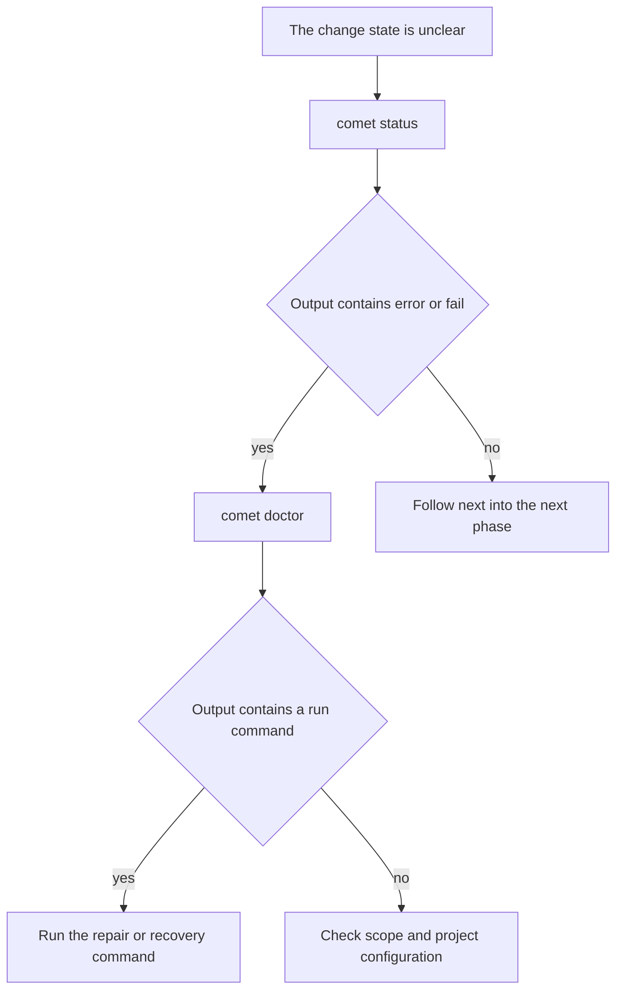

`comet doctor` locates the cause when Comet cannot work normally.

It checks the installation environment, CLI dependencies, project directories, Skills/Rules/Hooks, Runtime, CodeGraph, and the current change. `comet status` shows how far a change has progressed; `comet doctor` shows which part of the environment or project is incomplete.

The default check is read-only. It does not repair or rewrite the project. Repair actions run only when you explicitly pass `--repair`.

CodeGraph is reported across four separate dimensions: CLI installation, current project-index status, MCP registration for detected Agents, and effective capability for each detected Agent. A current project index does not by itself mean that an Agent has a valid CodeGraph MCP registration; use the `codegraph` object in JSON output when you need the detailed status.

## Basic usage

```bash
comet doctor
comet doctor --scope project
comet doctor --json
```

| Option                  | Description                                                                          |
| ----------------------- | ------------------------------------------------------------------------------------ |
| `--json`                | Output structured diagnostics.                                                       |
| `--scope <scope>`       | Diagnose `auto`, `project`, or `global`. The default is `auto`.                      |
| `--repair`              | Repair Comet-managed Hooks, Rules, and deterministic selection state.                |
| `--strategy <strategy>` | Recover a Classic root move with `continue` or `rollback`; requires `--repair`.      |
| `--yes`                 | Authorize supported project repairs such as CodeGraph indexing; requires `--repair`. |

## Start with the text output

For example, when the project Skill is not installed, the Classic root is missing, and CodeGraph has pending changes, `comet doctor --scope project` prints:

```text
Comet Doctor (scope: project)

  ✓ Environment: node v22.20.0; platform win32/x64; project D:\Project\Comet; global C:\Users\BENYM
  ✓ Comet CLI: installed (0.4.0-beta.20)
  ✓ openspec CLI: installed (1.7.0)
  ✓ Superpowers: detected (Claude Code project, Codex project, Antigravity project, Antigravity 2.0 project; version not recorded by skills installer)
  ✗ Classic artifact layout: docs: configured docs/openspec/ missing; alternate openspec/ missing — run: comet classic root show, then restore the configured root or use comet classic root move
  ✓ Classic platform tool assets: no OpenSpec platform tool assets under docs/
  ✗ Classic OpenSpec root: Configured Classic OpenSpec root is missing: docs/openspec (alternate openspec is missing)
  ⚠ working directories: partial (missing: docs/openspec/changes, docs/openspec/changes/archive, docs/openspec/specs)
  ⚠ Comet skills: not installed in project scope — run: comet init --scope project
  ✓ scripts present: OK (12 scripts)
  ✓ CodeGraph CLI: CodeGraph CLI is installed
  ⚠ CodeGraph project index: CodeGraph index has 1 pending change(s) — run: codegraph sync
  ⚠ CodeGraph MCP registration: no supported Agent configuration detected
  ✓ current selection: no active Comet change
```

Versions, paths, and counts vary by environment, but the output structure is the same. Read the markers as follows:

- `✓`: The check passed. No action is required.
- `⚠`: The check found a warning or an optional component is missing. The output usually includes a suggested action.
- `✗`: The check failed. Prioritize that line and the command after `run:`.

In this example, the primary issue is the Classic root. The configuration points to `docs/openspec/`, but the directory does not exist. Run `comet classic root show` to inspect the actual configuration, then restore the directory or use `comet classic root move`. `current selection: no active Comet change` is not an error; it means that no Comet change is currently selected.

## What each check covers

Each output line corresponds to one diagnostic area:

| Output item                                         | What it checks                                                                        |
| --------------------------------------------------- | ------------------------------------------------------------------------------------- |
| `Environment`                                       | The current Node version, platform, project path, and global directory.               |
| `Comet CLI` / `openspec CLI`                        | Whether the CLIs are installed and which versions are active.                         |
| `Superpowers`                                       | Whether external Superpowers integrations are available.                              |
| `Classic artifact layout` / `Classic OpenSpec root` | Whether the configured Classic root exists and is readable.                           |
| `working directories`                               | Whether `changes`, the archive directory, and `specs` are complete.                   |
| `Comet skills` / `scripts present`                  | Whether the current scope has complete Skills and Runtime scripts.                    |
| `CodeGraph CLI`                                     | Whether the CodeGraph CLI is installed.                                               |
| `CodeGraph project index`                           | Whether the current project index is current, incomplete, stale, or uninitialized.    |
| `CodeGraph MCP registration`                        | Whether detected Agents have a valid CodeGraph MCP registration.                       |
| `CodeGraph effective for <Agent>`                   | Whether a detected Agent has the CLI, current index, and valid MCP registration.       |
| `current selection`                                 | Whether a Comet change currently owns the next write.                                 |

## Choose the diagnostic scope

- `--scope auto`: The default. Check the current project first, then check an available global installation when the project installation is incomplete.
- `--scope project`: Check only the current project. Use it to verify local initialization.
- `--scope global`: Check only the global installation. Use it to diagnose global Skills, Rules, Hooks, or Runtime files.

When the global Comet installation is complete but the current project has no project-local Skill copy, `--scope auto` reports the global installation as available and treats the project copy as optional. Initialize a project-local copy only when the project needs its own Comet configuration and Skills:

```bash
comet init --scope project
```

## Read JSON output

Use JSON for automation:

```bash
comet doctor --json
```

The top-level fields provide the overall result first:

```json
{
  "scope": "project",
  "status": "failed",
  "healthy": false,
  "repaired": [],
  "results": [
    {
      "check": "Comet CLI",
      "status": "pass",
      "message": "installed (0.4.0-beta.19)"
    },
    {
      "check": "Classic OpenSpec root",
      "status": "fail",
      "message": "Configured Classic OpenSpec root is missing: docs/openspec"
    }
  ]
}
```

`healthy: false` means that at least one result has `fail`. The specific action appears in `results[].message`. Only `status: passed` with `healthy: true` means that this diagnostic run has no failed checks. The `runtime` and `codegraph` fields provide additional Runtime and CodeGraph details.

The `codegraph` object includes `cliStatus`, `indexStatus`, `mcpStatus`, `agents`, and `effectiveForAgent`. An Agent is effective only when the CLI is installed, the project index is current, and its MCP entry points to the CodeGraph server.

## When to use `--repair`

Run `comet doctor` without `--repair` first to confirm the problem and suggested action. Use `--repair` only when the output points to a repair, or when you have confirmed that Comet-managed Hooks, Rules, selection state, or migration state should be repaired:

```bash
comet doctor --repair
```

`--repair` is a write operation, not an alias for another diagnostic pass. For an interrupted Classic root move, choose `continue` or `rollback` based on the recorded state. Add `--yes` for project repairs that require authorization, such as CodeGraph operations.

## Troubleshooting order


