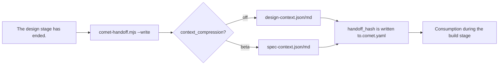

context compression controls how much OpenSpec context is passed to Superpowers during the handover from design to build. It is a beta feature aimed at reducing token consumption without compromising the correctness of implementation. In the Spec Coding task, it is different from the traditional context summary compression. The traditional context summary compression summarizes the key contents, which often leads to the problems of missing tasks and details in the Spec task. This will cause the Spec to drift, thereby completely affecting the task implementation of the downstream Agent. Comet's context compression mechanism ensures the integrity of Spec tasks and reduces token consumption through structured projection and hash reference.

## What problem does it solve

At the end of the design phase, the OpenSpec requirement specifications (proposal, design, tasks, delta spec) need to be handed over to the build phase as the implementation basis. By default, all these contents are fully passed in, resulting in high token overhead. Context compression reduces redundant transmission through hash references and structured projections.

## Two modes

|"Mode"|"Behavior"|token savings|"Status"|
| --- | --- | --- | --- |
|`off` (Default)|Generate a traceable complete summary (truncating files with more than 80 lines|Baseline|Stable|
| `beta` |Structured spec projection, delta spec verbatim retention, proposal/design/tasks only store hash references|About 25 to 30 percent| beta |

<p align="center">
  
</p>

<p align="center">off retains the complete summary, beta retains the delta spec and references the supporting file </p> with hash

### "off mode"

Generate a complete but traceable summary

- `design-context.json` - Machine Index (change, phase, canonical spec, Source File path, per-file sha256, context_hash)
- `design-context.md` - Superpowers readable context, each file with source path, line range, sha256 and deterministic digest. Files with more than 80 lines are truncated and marked with `[TRUNCATED]` and `Full source:` Pointers.

The `--full` flag can be used to output the complete verbatim content without truncation.

### beta Mode

Generate structured spec projection

- `spec-context.json` - Machine index, with each file labeled as `role: spec` (delta spec) or `role: supporting` (proposal/design/tasks)
- `spec-context.md` - Compact Context: ** verbatim projection of delta spec file ** (fully retaining the acceptance scenario), proposal/design/tasks only store hash references

<Note>
In beta mode, <code>--full</code> is ignored (a warning will be output). beta only performs verbatim projection on the delta spec, and other files are referenced by hash, thus saving the full text from Proposals/designs /tasks that are not repeatedly transmitted.
</Note>

## How the delta spec is handled

The OpenSpec delta spec (`specs/<capability>/spec.md`) contains requirements and acceptance scenarios. Beta writes it verbatim and uses hash references for proposal, design, and tasks files:

- The delta spec is not summarized.
- Proposal, design, and tasks remain linked to their source files by sha256 and can be read again when needed.

<Warning>
OpenSpec delta spec is always the authoritative source. When the beta projection is missing or expired, the source spec must be regenerated or directly read. It is absolutely not allowed to replace it with an Agent summary.
</Warning>

## When to trigger

Context compression is triggered at the "design→build handover" and is generated by `comet-handoff.mjs <change> design --write`.



The design guard will check the existence and validity of the handover package: `handoff_context`/`handoff_hash` must be written to `.comet.yaml`, and the markdown package must carry the `Generated-by:` tag and a traceable source /hash reference. In beta mode, `spec-context.json` must also have a valid structure and reference the current source file.

## Active compression

During the design phase, after writing `brainstorm-summary.md` and before creating the Design Doc, the platform's native compact/compaction mechanism will be triggered (if supported by the platform), or it will be paused for you to execute manually. Compress and reload the handover file. This is a runtime optimization independent of `context_compression`.

## Current benchmark

The table records the current Comet benchmark. Results apply only to this task set and test configuration:

|Indicator| off | beta |
| --- | --- | --- |
|Test pass rate| 100% | 100% |
|spec coverage| 100% | 95% |
|token savings|Baseline|About 25 to 30 percent|
|Large-scale task savings| — |At most approximately 15,000 tokens|

In this benchmark, beta reduced token use by about 25–30% and spec coverage changed from 100% to 95% because supporting files (proposal/design/tasks) keep hash references instead of full text.

## How to enable beta

### Project level (Recommended

Editor: `.comet/config.yaml`

```yaml
classic:
  context_compression: beta
```

When a new change is created, this value will be snapshots to its own `.comet.yaml`.

### "Single change"

Through the `comet-state` command:

```bash
node "$COMET_STATE" set <change-name> context_compression beta
```

### Temporary overwriting of environment variables

```bash
export COMET_CONTEXT_COMPRESSION=beta
```

It takes effect only when the change-level field is empty.

## How to choose

|Scene|Recommendation mode|
| --- | --- |
|token cost-sensitive, large-scale projects|`beta` (Save 25% - 30%)|
|Complete spec coverage is required, with accuracy taking priority| `off` |
|"Uncertain"|First, use `off` to benchmark, and then switch to `beta`|

## Next step

- [Classic configuration ](/en/classic/configuration) - context_compression field and configuration priority
- Code review mechanism ](/en/concepts/review-mode) - Another project configuration item
- The position of the workflow concept ](/en/concepts/workflow) - design→build handover in the five stages
- comet-handoff](/en/scripts/comet-handoff) - Script details for generating handover packages
