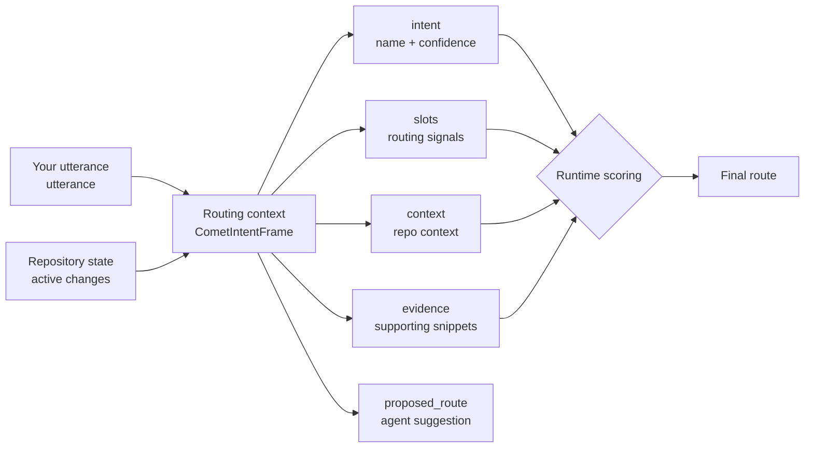

Every time you type `/comet` plus a sentence, Comet has to answer one question: which workflow should this request use? Should it start the full five-phase workflow, run a fast bug fix, use the OpenSpec-backed tweak path, resume an existing change, or stop and ask you?

Starting in 0.4.0, that decision no longer depends on a long list of natural-language heuristics in the Skill text. Comet organizes your utterance, repository state, and risk signals into a structured **routing context** (implemented as `CometIntentFrame`), then lets the runtime rescore it and produce an explainable route.

<p align="center">
  
</p>

<p align="center">Routing context turns the request and repository evidence into a decision the runtime can review.</p>

## Why routing context exists

<Note>
  In one sentence: routing context makes <code>/comet</code> routing <strong>explainable, reviewable, and recoverable</strong> instead of a black-box guess.
</Note>

Before routing context, `/comet` relied on prose rules such as “if this is a bug, use hotfix; if this is a copy tweak, use tweak.” That created three problems:

| Problem | What it felt like |
| --- | --- |
| **Not explainable** | Users and agents could not tell why a route was selected. |
| **Not reviewable** | There was no structured record of the signals that drove the decision. |
| **Not recoverable** | After interruption, the agent had to read the prompt again and guess again. |

Routing context turns “what the user wants” into structured data with fields, evidence, and confidence. The runtime does not blindly trust the agent's proposed route. It rescores the context, returns the final route, and writes disagreements into diagnostics.

## Route results

| Route | Meaning | Next Skill | Requires confirmation |
| --- | --- | --- | --- |
| `full` | Run the full open -> design -> build -> verify -> archive workflow | `comet-open` | No |
| `hotfix` | Fix existing behavior quickly, skipping brainstorming | `comet-hotfix` | No |
| `tweak` | Use the OpenSpec-backed medium-change path | `comet-tweak` | No |
| `resume` | Resume an active change | Depends on that change's phase | No |
| `ask_user` | Evidence is insufficient or conflicting | None | **Yes** |
| `out_of_scope` | The user is asking a question, not starting work | None | **Yes** |

Comet asks when it cannot prove a path is safe. It does not force an uncertain request into `full`, `hotfix`, or `tweak`.

## What the context contains



| Part | Purpose |
| --- | --- |
| `utterance` | The original user request that triggered `/comet`. |
| `intent` | High-level intent and confidence. |
| `slots` | Normalized routing slots: action, workflow candidate, risk signals. |
| `context` | Repository-derived context, not text extracted from the request. |
| `evidence` | Source-labeled snippets that support key judgments. |
| `proposed_route` | The agent's candidate route. The runtime still reviews it. |

### Risk slots

| Slot | Routing tendency |
| --- | --- |
| `existing_behavior: true` | Bug fix -> `hotfix` |
| `new_capability: true` | New capability -> `full` |
| `public_api_change: true` | External contract change -> `full` |
| `schema_change: true` | Structured data change -> `full` |
| `cross_module_change: true` | Cross-boundary change -> `full` |

<Warning>
  Risk signals take precedence over casual wording. If you ask for a hotfix but the request changes a public API, Comet stops at <code>ask_user</code> instead of silently allowing a risky lightweight path.
</Warning>

## Runtime scoring order

1. Low confidence -> `ask_user`.
2. Multiple active changes with no target -> `ask_user`.
3. Valid resume target -> `resume`.
4. Question-only request -> `out_of_scope`.
5. Explicit workflow conflicts with risk signals -> `ask_user`.
6. Risk signals -> `full`.
7. Existing bug with evidence -> `hotfix`.
8. Tweak with evidence -> `tweak`.
9. Not enough evidence -> `ask_user`.

Diagnostics record normalization, for example when an agent proposes `hotfix` but the runtime normalizes to `full`.

## What this means for users

You do not write routing context by hand. `/comet` builds and scores it internally. Describe the work clearly, expect Comet to ask when evidence is weak, and use diagnostics to understand why a route was selected.

Advanced users can route a context JSON directly:

```bash
node "$COMET_INTENT" route '{"schema_version":"comet.intent.v1", ...}'
node "$COMET_INTENT" route --stdin < frame.json
```

## Relationship to /comet-tweak

`/comet` is the general entry point. It uses routing context to choose `full`, `hotfix`, `tweak`, `resume`, or a pause.

`/comet-tweak` is the dedicated OpenSpec action path for medium changes when you already know tweak is the correct workflow.

## Next steps

- [Workflow concepts](/en/concepts/workflow)
- [Decision points](/en/concepts/decision-points)
- [Core scripts overview](/en/scripts/overview)
