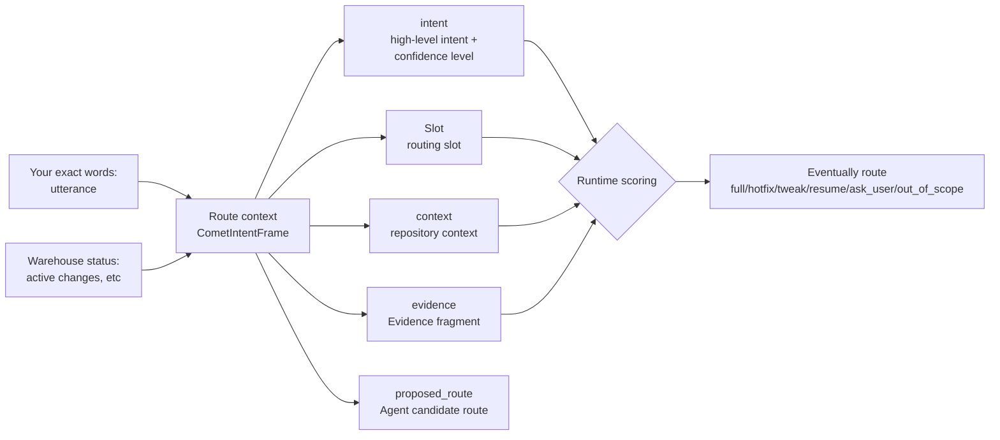
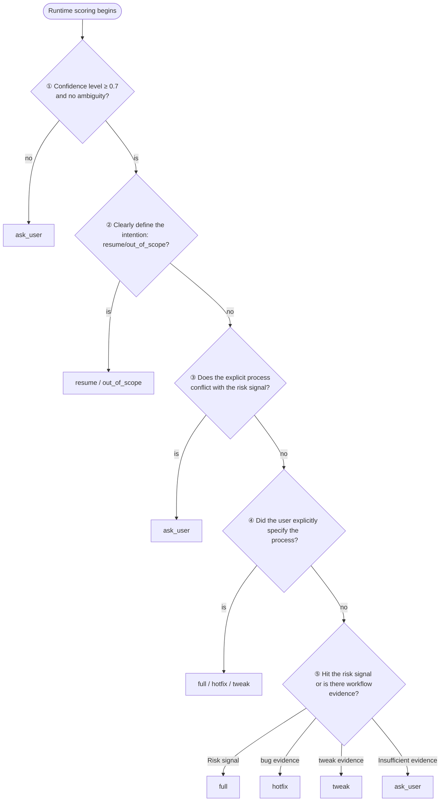

The user only needs to input "`/comet`" followed by one sentence. After the project configuration selects Classic, the internal `/comet-classic` needs to determine which Classic profile to follow this time. This judgment is jointly driven by ** intent recognition **, ** slot extraction ** and the actual file status.

** Intent Recognition ** Answer "What do you want to do?" : Initiate new changes, fix existing bugs, make lightweight adjustments, restore ongoing changes, or just ask a question? ** Slot Extraction ** Break down your original words and repository status into structured routing signals - actions, candidate processes, risk markers - each signal is marked with its source for runtime to score according to a fixed priority.

Starting from 0.4.0, this mechanism (implemented as `CometIntentFrame`) has replaced the natural language experience rules in the Skill body, making the routing results ** interpretable, reveritable, and recoverable **. In our benchmark tests, this has significantly enhanced Comet's recoverability.

<p align="center">
  
</p>

<p align="center">
The routing context organizes the original words, repository status, and risk signals into verifiable evidence, which is then handed over to the runtime to determine the final route
</p>

## Why is a routing context needed

<Note>
  In short, routing context makes <code>/comet-classic</code> routing <strong>explainable, reviewable, and recoverable</strong>.
  The entire decision process is backed by evidence.
</Note>

Before the routing context, the `/comet-classic` entry relies on a natural language rule in the main body of the Skill - "If it's a bug, go for hotfix; if it's a copy change, go for tweak..." . This approach has three problems:

|"Problem"|"Performance|
| ------------ | -------------------------------------------------------------- |
|"Unexplainable.|How is the routing result obtained? Neither the user nor the Agent can explain clearly, so they can only trust the prompt words|
|"Non-repeatable.|Without structured judgment basis, it is impossible to locate which signal has gone wrong when the route is wrong|
|"Irreversible.|After an interruption and re-entry, the Agent can only read the prompt word again and "guess" it once more|

The routing context turns "what the user wants to do" into a structured data with fields, evidence, and confidence. The runtime no longer trusts the routing suggestions put forward by the Agent itself. Instead, it ** re-scores ** and provides the final route, and writes the differences into the diagnostic log.

## Six results of routing

After runtime scoring, your request will be routed to one of the following six outcomes:

|"route|Meaning|The next step is Skill|Confirmation is needed.|
| -------------- | ------------------------------------------------ | ---------------------- | -------- |
| `full`         |Complete the five stages (open→design→build→verify→archive)| `comet-open`           |no|
| `hotfix`       |Quickly fix existing behaviors and skip brainstorming| `comet-hotfix`         |no|
| `tweak`        |Moderate changes to the OpenSpec link, while delta spec is a first-class citizen| `comet-tweak`          |no|
| `resume`       |Restore an ongoing change|It is determined by the current stage of the change|no|
| `ask_user`     |If there is insufficient evidence or a conflict, stop and ask you|no|Yes, it is|
| `out_of_scope` |You're just asking a question and haven't requested the execution of the workflow|no|Yes, it is|

Note two points:

- Only `ask_user` and `out_of_scope` require ** explicit confirmation ** - when the evidence is insufficient, Comet will pause and wait for your choice.
- `full`/`hotfix`/`tweak` each map to a definite entry Skill, while the next step for `resume` depends on which stage the change you want to restore is currently at.

## Intent recognition and slot extraction

The core inputs for routing decisions are `intent` (intent recognition) and `slots` (slot extraction), which, together with the remaining fields, form `CometIntentFrame` - the runtime uses this structure to score and provide the final route:



|"Part|Function|
| ---------------- | ------------------------------------------------------------- |
| `utterance`      |The original words of the user who triggered `/comet-classic` are convenient for subsequent traceability|
| `intent`         |High-level intentions (startup/restoration/bug fixes/minor improvements/questions/unknown) + confidence level|
| `slots`          |The routing slots normalized from the original words: actions, candidate processes, risk signals, etc|
| `context`        |The context read from the ** warehouse state ** is not extracted from your words|
| `evidence`       |Evidence fragments supporting key judgments, each marked with a source (`user`/`repo`/`state`)|
| `proposed_route` |The candidate routes submitted by the Agent - ** are only suggestions and will be reviewed at runtime **|

### Intent Recognition (`intent`)

`intent` contains two subfields:

- **`name`**: (Intent type) `start_new_change`/`fix_bug`/`make_tweak`/`resume_change`/`ask_question`/`unknown`
- **`confidence`**: (Confidence score from 0 to 1). When the confidence level is below 0.7, the runtime directly routes to `ask_user` - it is better to stop and ask than to rely on ambiguous intent to take the risk of choosing a route.

### Slot extraction (`slots`)

The Boolean values of several ** risk signals ** that most affect routing in the slot are. They decide whether "this matter should go through the full process" :

|Slot position|Tendency when hit|
| --------------------------- | ---------------------------------------------------- |
| `existing_behavior: true`   |Fix existing behavior → Lean towards `hotfix`|
| `new_capability: true`      |New ability → Inclined to `full`|
| `public_api_change: true`   |Changed the external interface/contract → inclined towards `full`|
| `schema_change: true`       |Changed the structured data format (such as `.comet.yaml`) → tended to `full`|
| `cross_module_change: true` |Cross-module/cross-workflow boundary → tend to `full`|

As long as the hit any ** ** risk signal (`new_capability`/`public_api_change`/`schema_change`/`cross_module_change`), `full` runtime will tend to go, even if the user said is "tweaking".

<Warning>
This is Comet's security design: <strong> risk signals take precedence over verbally stated processes </strong>. If you explicitly request to go through {' '}
<code>hotfix</code> but at the same time hitting the risk signal, it will stop to ask you when running (<code>ask_user</code>)
And suspend confirmation at the entrance of the high-risk lightweight process.
</Warning>

## How is it scored during runtime

After the Agent organizes the routing context, the runtime (`comet-intent.mjs`) will re-score according to a set of ** fixed priorities ** and give the final `route`.

<Note>
This fixed priority order is the core of interpretable routing. **
Each step has clear judgment conditions, and any discrepancies are recorded in the diagnostic log for easy traceability afterwards.
</Note>



This sequence answers several common questions of "Why is the routing like this?"

1. Confidence level below 0.7 → `ask_user`. When the Agent is unable to determine your intention, it will pause during runtime and ask you to confirm.
2. Multiple ongoing changes + no specific one to restore → `ask_user`. Comet will list the candidate changes and wait for you to name the target.
3. Risk signals take precedence over verbal processes. You said "Go with hotfix", but when `public_api_change` is hit, the operation will pause and please confirm.
4. No risk signals + Fix existing bugs + have evidence → `hotfix`. This is a typical portrait of hotfix.
5. Insufficient evidence → `ask_user`. Rather than guessing a way, Comet would rather ask you.

## Several typical scenarios

The following uses specific examples to illustrate that the same user input will be routed to different results in different contexts.

### Scene One: Fix a known bug

```text
The comet login interface occasionally gets 500. Could you please take a look at it for me
```

- `intent.name`: `fix_bug`, high confidence level
- `existing_behavior: true` (Repair Existing behavior)
- All risk signals are `false`
- There is evidence of `workflow_candidate: hotfix`

Route **`hotfix`**, then proceed to `comet-hotfix`. This is the standard profile of a hotfix: fix existing exceptions without touching new capabilities, apis, or schemas.

### Scene Two: It's said to be a minor change, but in fact, the external interface has been modified

```text
Make a minor modification to /comet by removing the --force parameter from the CLI
```

- `intent.name`: `make_tweak`
- `user_explicit_workflow: tweak` (You explicitly said "minor modification")
- However, `public_api_change: true` (removing the CLI parameter makes it an external interface)

Route **`ask_user`**. Explicit `tweak` conflicts with risk signals. During operation, the process will be paused and you will be asked to confirm whether to continue this lightweight process that affects external contracts.

### Scene Three: Restore an ongoing change

```text
/comet continues from the last note-board
```

- `requested_action: continue`
- `change_id: note-board`, and within `active_change_names`

→ Route **`resume`**. The next step is determined by which stage the change of `note-board` is currently stopped at.

### Scene Four: Just asking a question

```text
What does the verify stage of Comet do approximately?
```

- `intent.name: ask_question`
- `requested_action: question`

Route **`out_of_scope`**. You are asking a question and have not requested the execution of a workflow. Comet will remain within the information query range.

## What does this mechanism mean to users

For ordinary users, you ** do not need to write the routing context by hand **. After calling `/comet`, select Classic for configuration, and then `/comet-classic` will automatically complete the context organization and scoring internally. All you need to know is

1. Make it clear what you want to do. The more specific, the more accurate the routing. Fixing this bug is more likely to hit `hotfix` than "Help me take a look".
2. Comet, please confirm when the evidence is insufficient. When there is insufficient evidence or a conflict, it will pause at the route entry and wait for a clear decision.
3. Routing can be traced back afterwards. If you think the route is wrong, the route context and diagnostic information record the complete basis for judgment.

If you are an advanced user or contributor and want to view the actual routing output of the backend, you can run it manually

```bash
# Hand over a routing context JSON to the runtime score
node "$COMET_INTENT" route '{"schema_version":"comet.intent.v1", ...}'
# Or read from stdin
node "$COMET_INTENT" route --stdin < frame.json
```

It will return the final `route`, `diagnostics` (divergence diagnosis), and the complete `normalizedFrame`. The meanings of the fields can be found in the `reference/intent-frame.md` distributed with the Skill.

## The relationship with `/comet-tweak`

The routing context enables `/comet-classic` to automatically route to `tweak`. Then, is the independent command `/comet-tweak` still useful?

Useful, but with different positioning:

- **`/comet`** : Normal user entry, select Native or Classic according to project configuration.
- `/comet-classic` ** ** : Classic internal permanent entry, is decided by routing context go `full`/`hotfix`/`tweak`/`resume`; It is usually forwarded in by `/comet`.
- **`/comet-tweak`** : ** OpenSpec action path for tweak. You already clearly know that you need to make a medium change to the OpenSpec link. It's faster to just go with it.

In other words, `/comet-classic` is "helping me determine which one to go on within Classic", and `/comet-tweak` is "I already know to go on tweak". The complete five-stage `full` still follows the design/plan/build path of Superpowers.

## Next step

- Comet Workflow Overview ](/en/concepts/workflow) - Five-Stage, Phase Handover and verify Drift Decision
- Decision point ](/en/concepts/decision-points) - How does Comet stop to ask you at critical nodes
- Overview of Core Scripts: How Do Scripts like ZXQ0, QXZ, ZXQ1, and QXZ collaborate
