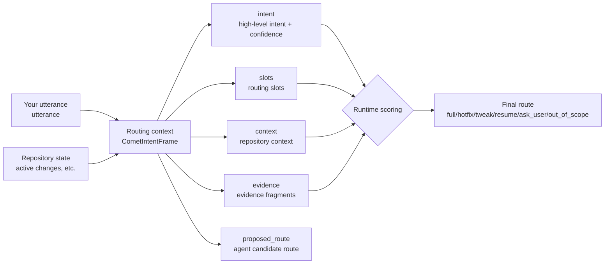
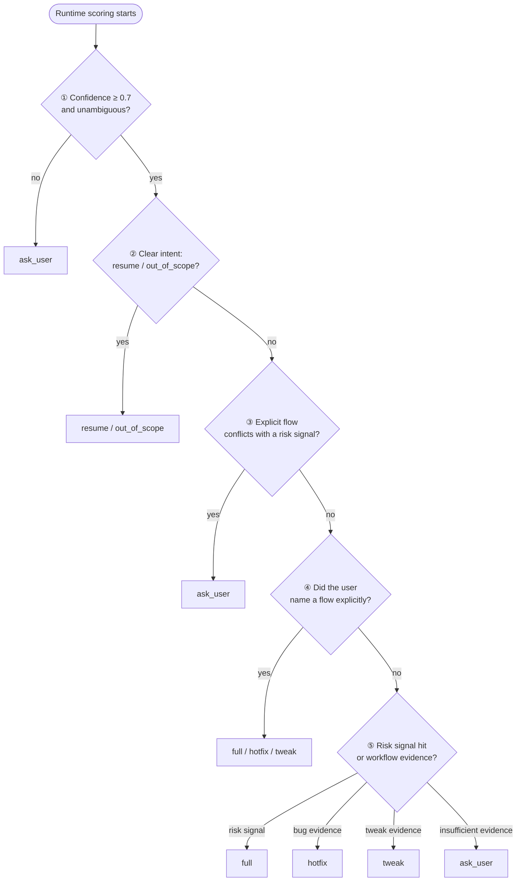

You only type `/comet` followed by one sentence. Once the project configuration selects Classic, the internal `/comet-classic` entry has to decide which Classic profile this call should take. That decision is driven by **intent recognition**, **slot extraction**, and the actual file state.

<p align="center">
  
</p>

<p align="center">
  The routing context records the user request, repository state, and risk signals, and the runtime computes the route from it
</p>

## The six routing outcomes

After you type one sentence, Comet routes the call to one of these six outcomes:

| Route | Meaning | Next Skill | Needs confirmation |
| ----- | ------- | ---------- | ------------------ |
| `full` | Run the complete five stages (open → design → build → verify → archive) | `comet-open` | No |
| `hotfix` | Quickly fix existing behavior, skipping brainstorming | `comet-hotfix` | No |
| `tweak` | A medium OpenSpec-driven change; the delta spec is a first-class artifact | `comet-tweak` | No |
| `resume` | Resume an in-progress change | Decided by the change's current stage | No |
| `ask_user` | Not enough evidence or a conflict; stop and ask you | None | **Yes** |
| `out_of_scope` | You are only asking a question, not requesting workflow execution | None | **Yes** |

Notes:

- Only `ask_user` and `out_of_scope` require **explicit confirmation** — when the evidence is insufficient, Comet pauses and waits for your choice.
- `full`/`hotfix`/`tweak` each map to one fixed entry Skill, while the next step for `resume` depends on which stage the change you want to resume is currently paused at.

<Warning>
  This is Comet's safety design: <strong>risk signals take precedence over the flow you state out loud</strong>. If you explicitly ask for{' '}
  <code>hotfix</code> while a risk signal is hit at the same time, the runtime stops and asks you (<code>ask_user</code>
  ) and pauses for confirmation at the entry of the high-risk lightweight flow.
</Warning>

## A few typical scenarios

The examples below show how the same user input routes differently depending on the context.

### Scenario one: fix a known bug

```text
/comet the login endpoint intermittently returns a 500, please take a look
```

- `intent.name`: `fix_bug`, with high confidence
- `existing_behavior: true` (fixing existing behavior)
- All risk signals are `false`
- Evidence of `workflow_candidate: hotfix`

→ Routes to **`hotfix`**, next step `comet-hotfix`. This is the standard hotfix profile: fixing existing behavior without touching new capabilities, APIs, or schemas.

### Scenario two: you say "small change" but touch a public interface

```text
/comet small change: remove the --force flag from the CLI
```

- `intent.name`: `make_tweak`
- `user_explicit_workflow: tweak` (you explicitly said "small change")
- But `public_api_change: true` (removing a CLI flag changes an external interface)

→ Routes to **`ask_user`**. The explicit `tweak` conflicts with the risk signal, so the runtime pauses and asks whether to continue this lightweight flow that affects an external contract.

### Scenario three: resume an in-progress change

```text
/comet continue with note-board from last time
```

- `requested_action: continue`
- `change_id: note-board`, and it is in `active_change_names`

→ Routes to **`resume`**. What happens next depends on which stage the `note-board` change is currently paused at.

### Scenario four: just asking a question

```text
/comet what does the verify stage roughly do?
```

- `intent.name`: `ask_question`
- `requested_action: question`

→ Routes to **`out_of_scope`**. You are asking a question and did not ask to run a workflow, so Comet stays in the information-query scope.

## What to know when using it

For ordinary users, you **do not need to write the routing context by hand**. After you call `/comet` and the configuration selects Classic, `/comet-classic` assembles the context and scores it automatically. You only need to know:

1. **Say clearly what you want to do.** The more specific you are, the more accurate the route. "Fix this bug" is more likely to hit `hotfix` than "take a look".
2. **Comet asks you when the evidence is thin.** When evidence is insufficient or conflicting, it pauses at the routing entry and waits for an explicit decision.
3. **Routing can be traced afterwards.** If you think the route was wrong, the routing context and diagnostics record the complete basis for the decision.

If you are an advanced user or a contributor and want to see the actual routing output from the backend, you can run it manually:

```bash
# Hand a routing-context JSON to the runtime for scoring
node "$COMET_INTENT" route '{"schema_version":"comet.intent.v1", ...}'
# Or read it from stdin
node "$COMET_INTENT" route --stdin < frame.json
```

It returns the final `route`, the `diagnostics` (divergence diagnostics), and the complete `normalizedFrame`. Field meanings are in the `reference/intent-frame.md` shipped with the Skill.

## Relationship to `/comet-tweak`

The routing context lets `/comet-classic` route to `tweak` automatically — so is the standalone `/comet-tweak` command still useful?

Yes, but the two are positioned differently:

- **`/comet`**: the normal user entry; it selects Native or Classic according to the project configuration.
- **`/comet-classic`**: the permanent internal entry of Classic; the routing context decides between `full`/`hotfix`/`tweak`/`resume`. It is commonly reached by forwarding from `/comet`.
- **`/comet-tweak`**: the **tweak-only** OpenSpec action path, for a medium change whose scope is already confirmed.

The difference: `/comet-classic` is "decide within Classic which flow I should take", while `/comet-tweak` is "I already know I am running tweak". The complete five-stage `full` still runs the Superpowers design/plan/build path.

## How routing is decided (read when reproducing or debugging)

The structures below exist to explain and debug routing results; you do not need them for everyday use.

### What the routing context solves

Before the routing context, the `/comet-classic` entry relied on a block of natural-language rules in the Skill body — "if it is a bug, go hotfix; if it is a copy change, go tweak...". This approach has three problems:

| Problem | Symptom |
| ------- | ------- |
| **Unexplainable** | How was the route derived? Neither the user nor the agent can tell; they can only trust the prompt |
| **Not reviewable** | No structured basis for the decision, so when routing is wrong you cannot locate which signal failed |
| **Not recoverable** | After an interruption and re-entry, the agent can only re-read the prompt and "guess" once more |

The routing context turns "what the user wants" into structured data with fields, evidence, and confidence. The runtime no longer takes the agent's routing suggestion as-is; it **re-scores** to produce the final route and writes any disagreement into the diagnostics log.

Since 0.4.0, this mechanism (implemented as `CometIntentFrame`) has replaced the natural-language experience rules in the Skill body, making routing results **explainable, reviewable, and recoverable**; in our benchmark tests, Comet's recoverability improved substantially as a result.

### Intent recognition and slot extraction

**Intent recognition** answers "what do you want to do": start a new change, fix an existing bug, make a lightweight adjustment, resume an in-progress change, or just ask a question. **Slot extraction** breaks your words and the repository state into structured routing signals — actions, candidate flows, risk markers — each marked with its source, for the runtime to score by fixed priority.

The core inputs to the routing decision are `intent` (intent recognition) and `slots` (slot extraction), which together with the remaining fields form `CometIntentFrame` — the runtime scores this structure and returns the final route:



| Part | Role |
| ---- | ---- |
| `utterance` | The user's original words that triggered `/comet-classic`, kept for later tracing |
| `intent` | High-level intent (start/resume/fix bug/small change/question/unknown) + confidence |
| `slots` | Routing slots normalized from the utterance: actions, candidate flows, risk signals, and so on |
| `context` | Context read from the **repository state**, not extracted from your words |
| `evidence` | Evidence fragments supporting key judgments, each tagged with a source (`user`/`repo`/`state`) |
| `proposed_route` | The candidate route submitted by the agent — **only a suggestion; the runtime re-checks it** |

#### Intent recognition (`intent`)

`intent` has two subfields:

- **`name`**: the intent type, one of `start_change` / `fix_bug` / `make_tweak` / `resume_change` / `ask_question` / `unknown`
- **`confidence`**: a 0–1 confidence score. Below 0.7, the runtime routes straight to `ask_user` — better to stop and ask than to bet on an ambiguous intent.

#### Slot extraction (`slots`)

The slots that matter most for routing are the **risk-signal** booleans. They decide whether "this should go through the full flow":

| Slot | Tendency when hit |
| ---- | ----------------- |
| `existing_behavior: true` | Fixing existing behavior → lean `hotfix` |
| `new_capability: true` | New capability → lean `full` |
| `public_api_change: true` | External interface/contract changed → lean `full` |
| `schema_change: true` | Structured data format changed (for example `.comet.yaml`) → lean `full` |
| `cross_module_change: true` | Crosses module/workflow boundaries → lean `full` |

If **any** risk signal (`new_capability`/`public_api_change`/`schema_change`/`cross_module_change`) is hit, the runtime leans `full` even when you said "small change".

### How the runtime scores

After the agent assembles the routing context, the runtime (`comet-intent.mjs`) re-scores it by a **fixed priority** and returns the final `route`.

<Note>
  <strong>This fixed priority order is the core of explainable routing.</strong>{' '}
  Every step has a clear condition, and disagreements are written to the diagnostics log so they can be traced later.
</Note>



This order answers the common "why did it route this way" questions:

1. **Confidence below 0.7 → `ask_user`.** When the agent cannot determine your intent, the runtime pauses and asks you to confirm.
2. **Multiple in-progress changes and none named → `ask_user`.** Comet lists the candidate changes and waits for you to name the target.
3. **Risk signals beat the flow you said out loud.** You say "go hotfix", but `public_api_change` is hit, so the runtime pauses and asks you to confirm.
4. **No risk signal + fixing an existing bug + evidence → `hotfix`.** That is the typical hotfix profile.
5. **Insufficient evidence → `ask_user`.** Comet asks instead of guessing a route.

## Next steps

- [Classic workflow](/en/concepts/workflow) — the five stages, stage handoffs, and the verify drift decision
- [Five-stage pause points and user selection points](/en/concepts/decision-points) — how Comet stops and asks you at key points
- [Classic command overview](/en/scripts/overview) — how scripts such as `comet-intent.mjs` cooperate
