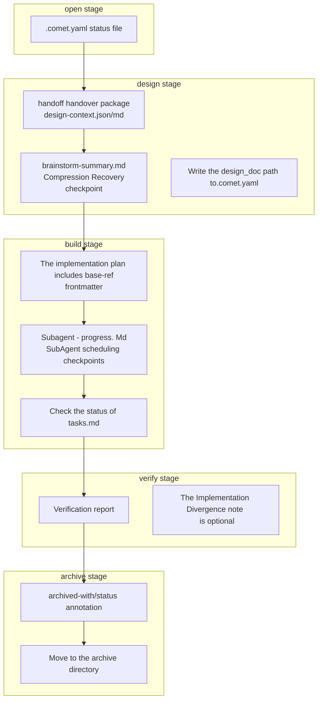

Comet creates a series of intermediate products in the five-stage process of `/comet`. These working files are used for context compression, state recovery, evidence recording and phase handover; proposal, design, tasks and code are the final deliverables.

Understanding these products can help you: quickly recover after context compression, know which file to look at when troubleshooting, and confirm the completeness of the lifecycle when archiving.

## Product Overview



<p align="center">
  
</p>

<p align="center">Each type of intermediate artifact supports context, recovery, handoff, or verification evidence.</p>

The following text uses `<classic-root>` to represent the current Classic OpenSpec root directory: The default for new projects is `docs/openspec/`, and for projects that retain the old layout, it is `openspec/`. The actual location is determined by `classic.artifact_layout`. For details, please refer to [Project File structure ](/en/guides/project-structure)

## .comet.yaml: The status file throughout the entire process

|"Attribute"|Explanation|
| -------- | ------------------------------------------- |
|Location| `<classic-root>/changes/<name>/.comet.yaml` |
|Creation stage| open（`comet-state init`）                  |
|Update stage|The corresponding fields are updated at each stage|
|Management|machine-managed (Script writing, guard verification)|

This is the only cross-phase state file of Comet. The fields should be filled in step by step as the stage progresses. For details, please refer to [Status Management ](/en/concepts/state-management)

<Note>
Comet's classic workflow still with <code>.com et. Yaml</code> as source of the current state.
<code>.comet/ state-events.jsonl</code> is an appended audit log used to explain the history of state transitions;
<code>.com et/run - state. Json</code> and <code>trajectory jsonl</code> belongs to the machine - owned
Operational details. Across sessions recovery mainly by <code>.com et. Yaml</code>, handoff documents and checkpoints
When checking the status changes in markdown, look at the event log.
</Note>

### State-events.jsonl (state Transition Audit)

|"Attribute"|Explanation|
| ---- | ---------------------------------------------------------------------------------- |
|Location| `<classic-root>/changes/<name>/.comet/state-events.jsonl`                          |
|"Create|The first successful state transition|
|Function|Record the status changes caused by the updates of `comet-state transition`, `comet-guard --apply` and archive|
|Management|Comet append writes are readable by users and should not be modified manually|

It is not the source of the current state. The current status is still based on `.comet.yaml`. The event log is suitable for answering: Was this `phase` modified through the guard, manual transition, or archive process? Which fields were actually changed?

## Product of the design stage

The design stage is the one with the richest intermediate products, mainly serving context compression and the transition from OpenSpec to Superpowers.

### handoff handover bag

|"Attribute"|Explanation|
| ---- | --------------------------------------------------------------------------------- |
|Location| `<classic-root>/changes/<name>/.comet/handoff/`                                   |
|"Create| `comet-handoff.mjs <change> design --write`                                       |
|Function|Organize the OpenSpec artifacts in the open phase into a context that Superpowers brainstorming can understand|
|Management|machine-generated (guard checks script tags and hash)|

The handover package comes in two forms based on the `context_compression` configuration:

|"Mode"|Output file|"Content|
| ------------- | ------------------------------------------- | ------------------------------------------------------------------------------------- |
|`off` (Default)| `design-context.json` + `design-context.md` |A complete summary of artifacts, each file with source path, line range, and sha256. More than 80 lines truncated.|
| `beta`        | `spec-context.json` + `spec-context.md`     |delta spec verbatim projection, proposal/design/tasks only store hash references. Save approximately 25 to 30% of tokens.|

The handover package also writes `handoff_context` and `handoff_hash` to `.comet.yaml`. When guard leaves design, it recalculates the hash to detect drift. For details, please refer to [Context Compression Mechanism ](/en/concepts/context-compression)] and [comet-handoff](/en/scripts/comet-handoff)]

### brainstorm-summary.md

|"Attribute"|Explanation|
| ---- | -------------------------------------------------------------------- |
|Location| `<classic-root>/changes/<name>/.comet/handoff/brainstorm-summary.md` |
|"Create|Incremental writing during the brainstorming process in the design stage|
|Function|** Recovery Checkpoint for context compression ** - Restore confirmed design decisions from here after compression occurs|
|Management|Agent maintenance (structure and location specified by Skill)|

It records:

- The confirmed technical solution
- Key trade-offs and risks
- Test strategy
- Spec Patch (if any)
- Unconfirmed items are marked as `pending`/`candidate`

<Tip>
<code>brainstorm-summary.md</code> is the most important recovery anchor point in the design stage. After context compression, the Agent
Restore the confirmed decision from here and avoid re-brainstorming. During the brainstorming process, it incrementally updates <strong> to </strong>
The final version will be determined after the user confirms the plan.
</Tip>

## Product of the build stage

The intermediate products in the build stage mainly serve SubAgent scheduling recovery and task tracking.

### Implementation plan

|"Attribute"|Explanation|
| ---- | ------------------------------------------------- |
|Location| `docs/superpowers/plans/YYYY-MM-DD-<feature>.md`  |
|"Create|build phase (generated by the SubAgent loading `writing-plans`)|
|Function|Implementation plan; frontmatter is the key evidence in the verify stage|
|Management| Agent-written                                     |

The planned frontmatter is the evidence relied upon in the verification phase:

```yaml
---
change: <openspec-change-name>
design-doc: docs/superpowers/specs/YYYY-MM-DD-<topic>-design.md
base-ref: <git HEAD before implementation>
---
```

`base-ref` is the commit SHA before the implementation starts, and verify uses it to recalculate the change scale. Write the `plan` path to `.comet.yaml`.

### subagent-progress.md

|"Attribute"|Explanation|
| ---- | --------------------------------------------------------------------- |
|Location| `<classic-root>/changes/<name>/.comet/subagent-progress.md`           |
|"Create|build stage (only when `build_mode: subagent-driven-development`)|
|Function|**SubAgent Scheduling Checkpoint ** - The counterpart of `brainstorm-summary.md` in the build phase|
|Management|Coordination session (main session) maintenance|

It records the scheduling status of the current task:

- The current plan task text + the corresponding OpenSpec task text
- At this stage (`implementing`/`spec-review`/`quality-review`/`checkoff` `done`/`blocked` `final-review`/`final-fix`)
- The implemented commit hash, modified files, and RED/GREEN evidence
- Selected `review_mode`
- Passed review stages + unresolved reviewer feedback
- Current number of review-fix rounds

<Warning>
<code>subagent-progress.md</code> replace each task once. SubAgent (implementer/reviewer
<strong> cannot </strong>
Edit it - only the main session can write. The implementer can only write code, the reviewer can only write feedback, and the main session is responsible for advancing the checkpoint. This prevents subagents from marking task completion without authorization.
</Warning>

### Check the status of tasks.md

|"Attribute"|Explanation|
| ---- | ---------------------------------------- |
|Location| `<classic-root>/changes/<name>/tasks.md` |
|Function|Task Completion Tracking (`- [ ]` → `- [x]`)|
|Management|Coordinate conversation editing|

Comet does not have a separate task checkbox file - the checkbox status is within `tasks.md`. Use `grep -c '\- \[ \]' tasks.md` to count the unfinished items and `comet-state task-checkoff <file> <text>` to verify that a specific task has been selected.

In the SubAgent mode, the implementer ** cannot ** select tasks - only the coordination session is selected after the double review is passed.

## Product of the verify stage

### Verification report

|"Attribute"|Explanation|
| ---- | ------------------------------------------------------------------- |
|Location| `docs/superpowers/reports/YYYY-MM-DD-<change-name>-verify.md`       |
|"Create|In the verify stage, pass is marked only after the disk is written|
|Function|Verification evidence - 6-item (light) or 7-item (full) inspection results, PASS/FAIL, reasons for acceptance|
|Management| Agent-written                                                       |

Write the `verification_report` path to `.comet.yaml`. guard requires that this file must exist when `verify-pass` is converted.

### Implementation Divergence Note (optional)

|"Attribute"|Explanation|
| ---- | ------------------------------------------------------------------ |
|Location|Add to Design Doc (`docs/superpowers/specs/...-design.md`)|
|Trigger|full verify discovers that there is a contradiction between the delta spec and the Design Doc, and the user chooses to accept the bias|
|Function|Record the differences between the implementation and design documents|

If the user chooses to accept the bias, the Design Doc will be marked as `status: superseded-by-main-spec` when archiving.

## Product of the archive stage

During the archive stage, no new files are created. Instead, existing products are annotated and directories are moved.

### frontmatter annotation

|"File|Annotation|Meaning|
| ---------------------- | ------------------------------------------------ | ------------------------ |
| Design Doc             | `archived-with: <archiveName>` + `status: final` |Archived ownership + final status|
|Design Doc (If There are any deviations)| `status: superseded-by-main-spec`                |The implementation has deviated. The main spec shall prevail|
| Plan                   | `archived-with: <archiveName>`                   |Archiving ownership|

### Archived catalogue

The entire change directory is moved to `<classic-root>/changes/archive/YYYY-MM-DD-<name>/`, including `.comet.yaml`, `.comet/handoff/`, `.comet/subagent-progress.md` and delta spec. After archiving, set `.comet.yaml` to `archived: true`.

## Classify by purpose

|Purpose|Product|
| ---------------- | ------------------------------------------------------------------------- |
|"Context compression.|handoff handover package (design-context/spec-context), brainstorming -summary.md|
|"Status recovery"| .comet.yaml、subagent-progress.md、brainstorm-summary.md                  |
|"Status Audit| state-events.jsonl                                                        |
|"Phase handover"|handoff handover package (OpenSpec→Superpowers), plan base-ref (build→verify)|
|"Evidence.|Verification report, plan frontmatter, tasks.md check, Implementation Divergence note|
|"Life cycle annotation"| archived-with、status、archived: true                                     |

## A quick overview of the functions of the document

|What you want to know|See which product|
| ----------------------------- | ------------------------------------------------------- |
|The current stage and execution method| `.comet.yaml`                                           |
|The OpenSpec context for design handover|`.comet/handoff/design-context.md` or `spec-context.md`|
|What did brainstorming confirm| `.comet/handoff/brainstorm-summary.md`                  |
|Which step of which task does the SubAgent achieve| `.comet/subagent-progress.md`                           |
|Task completion progress|The checkmark status of `tasks.md`|
|Verification result| `docs/superpowers/reports/...-verify.md`                |
|Does handoff drift|The hash of `handoff_hash` + of `.comet.yaml` is recalculated and compared|
|Why has phase changed|The last few lines of `.comet/state-events.jsonl`|

## Next step

- Workflow concept ](/en/concepts/workflow) - The position of these products in the five stages
- Detailed Explanation of the ](/en/concepts/state-management)-`.comet.yaml` field in Status Management
- Detailed Explanation of the Context Compression Mechanism ](/en/concepts/context-compression) - handoff handover Package
- comet-handoff](/en/scripts/comet-handoff) - Script details for generating handover packages
- [Operation and Maintenance and troubleshooting ](/en/guides/resuming-workflow) - Use these products to resume interrupted work
