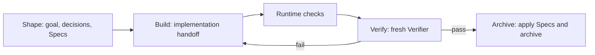

Native targets strong models such as Fable 5, GPT-5.6, and peers. Such models can investigate the codebase, form an implementation plan, and choose proportionate tests, so Native does not mandate fixed design, planning, TDD, or review methods. It does not, however, accept a self-reported completion verdict. Runtime runs necessary checks, dispatches a fresh read-only Verifier, and persists user-readable state that can recover across devices.

## Native Loop

Each round covers the complete A1…An list. A Builder's “done” is handoff context; missing, duplicate, or unknown items and failed checks return to Build. Matching completed checks are reused for the same candidate, and normal Archive does not rerun acceptance.

## Four stages

### Shape: fix the target and user decisions

Shape investigates repository facts, writes `brief.md`, complete target Specs, and a shared-understanding summary the user can confirm. Questions that change visible behavior, defaults, compatibility, scope, risk, or irreversible results go to the user; implementation structure and library choice stay with the model. New projects default to Batch, while Sequential remains available.

### Build: the model implements

Build is bounded by the brief, Specs, and repository rules. The model chooses implementation, testing, and repair methods, then submits a Builder handoff rather than writing a passing verdict. A new product decision returns to Shape; implementation gaps are repaired in the next Build iteration.

### Verify: Runtime checks plus a fresh Verifier

Runtime resolves and runs necessary checks, streaming stdout/stderr to local logs and keeping a summary in state. A fresh read-only Verifier must return one result for every A1…An item; extra checks are requested through `request-checks` in the current attempt. Without an independent Verifier execution, Runtime marks the degraded assurance and waits for user confirmation before Archive.

### Archive: apply only the final result

After Verify passes, Runtime writes `verification.md`, applies canonical Specs, and moves the change. Normal Archive does not rerun checks. The archived user artifacts are the brief, Specs, `comet-state.yaml`, and `verification.md`; the local execution directory under `.comet/runtime/native/` is cleaned up.

## State and recovery

`comet-state.yaml` records phase, Loop, acceptance, handoff, check summaries, Verifier verdict, blockers, bounded history, and the next action. Local `state.json`, logs, locks, and transactions live under `.comet/runtime/native/`. After a device move or missing overlay, Runtime rebuilds from YAML; a code, artifact-root, or branch/worktree mismatch waits for the user.

## Native and Classic

| Dimension       | Native                                       | Classic                                               |
| --------------- | -------------------------------------------- | ----------------------------------------------------- |
| Target models   | Fable 5, GPT-5.6, and peers                  | Models below this tier that need finer phased guidance |
| Workflow        | Shape → Build → Verify → Archive             | open → design → build → verify → archive              |
| State/artifacts | Comet brief, complete Specs, portable YAML   | OpenSpec change, `.comet.yaml`, Superpowers artifacts |
| Method          | Model chooses from repository facts and risk | Explicit design, plans, TDD, debugging, and review    |
| Dependencies    | Comet Native Runtime, no external Skill      | OpenSpec and Superpowers                              |

`/comet` only forwards deterministically from `.comet/config.yaml`; the workflows never convert or share changes, Guards, state, or directories.

Continue with [Native quickstart](/en/native/quickstart), [Native Loop](/en/native/native-loop), [Artifacts and state](/en/native/artifacts-and-state), and [Safety and recovery](/en/native/safety-and-recovery).
