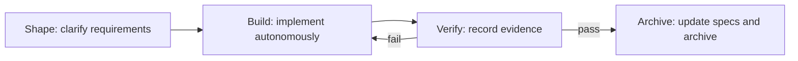

Comet Native is designed for strong coding models that can investigate code, choose an implementation approach, and scale verification to risk. It preserves what matters from Spec workflows—requirements management, a change lifecycle, phase checks, automatic progression, verification evidence, concurrent conflicts, and recoverable archive—without prescribing a fixed design, planning, TDD, debugging, or review method.

Its principle is: **make requirements and acceptance conditions detailed, and keep the execution protocol light.** The model needs the outcome, boundaries, decisions, complete target behavior, and verification expectations. It decides how to implement from repository facts.

## Native and Classic are independent workflows

|                        | Native                                                     | Classic Spec mode                                              |
| ---------------------- | ---------------------------------------------------------- | -------------------------------------------------------------- |
| Intended model         | Strong models that can plan and verify autonomously        | Models that benefit from explicit step-by-step guidance        |
| Requirements artifacts | Comet-owned brief, complete target specs, and change state | OpenSpec change/delta specs plus Superpowers documents         |
| Execution constraints  | Constrains outcomes, evidence, and safety boundaries       | Five-phase Skills plus design, plan, TDD, and review protocols |
| Dependencies           | Only Comet's bundled Native runtime                        | The Classic, OpenSpec, and Superpowers composition             |
| Entry point            | `/comet-native`, `comet native ...`                        | `/comet` and Classic phase Skills                              |

Phase 1 does not automatically select or switch between the modes, and it provides no Native-to-Classic upgrade or conversion. The user or project chooses a path explicitly. The two modes share no changes, state, or archive directories.

## Layout and artifact root

Native uses only Comet-owned directories:

```text
<project>/comet.config.yaml
<artifact-root>/comet/
  specs/
  changes/
  archive/
  runtime/
```

The default artifact root is the project root, producing `<project>/comet/`. Initialize with `docs` to use `<project>/docs/comet/` instead:

```bash
comet native init --root docs --language en
```

`artifact_root` must be a project-relative path. Use `comet native root move` to change it instead of editing configuration. The move records transaction state and can continue or roll back after interruption.

## Four phases



### Shape: make the information sufficient

Shape captures the user goal in `brief.md` under Outcome, Scope, Non-goals, Acceptance examples, Constraints and invariants, Decisions, Open questions, and Verification expectations.

The model first investigates facts available from the repository. It asks the user only about decisions that materially affect scope, user-visible behavior, compatibility, risk, or irreversibility. When one exists, it asks the single most important question and includes a recommendation, rationale, and practical impact of each option. After the answer, it records the decision and advances with `next --confirmed`. With no high-impact unknown, it keeps going and the runtime records implicit approval. A `[blocking]` question must be resolved under either approval form.

When durable behavior changes, each capability also receives a **complete target specification** at `changes/<change>/specs/<capability>/spec.md`: the full behavior that should exist after archive, rather than an incremental patch meaningful only against old text. The runtime derives `create` / `replace` and freezes `base_hash` from canonical specs; deletion uses `comet native spec remove`. The model does not maintain this state metadata directly.

### Build: let the strong model choose the method

In Build, the model chooses the simplest reliable approach that satisfies the brief and target specs. Whether to write an implementation plan, which test granularity to use, and how deeply to debug or review all depend on task risk. Native neither requires process-only documents nor mandates TDD.

When implementation reveals a new high-impact decision, the model marks it `[blocking]` and asks only one question. After the answer, it updates Decisions, removes the blocker, and records the decision with `--confirmed` while leaving Build. Build rechecks the brief and target specifications, so artifact references cannot bypass a newly discovered question.

Progression cites real project artifacts. Documentation-only or no-code work records an explicit no-code reason instead.

### Verify: facts instead of assertions

Verify checks the Acceptance examples, complete target specs, and relevant risks. `verification.md` records actual commands and results, skipped checks, specification consistency, known limitations, and the conclusion. Failure automatically returns to Build for repair and re-verification. An unrun check cannot be reported as passing.

### Archive: converge without overwriting conflicts

Archive is allowed only after Verify passes. While holding a lock, it recalculates canonical-spec SHA-256 values:

- `create` requires the canonical spec not to exist;
- `replace` and `remove` require the current hash to equal the runtime-frozen `base_hash`;
- when a hash changed, archive stops and reports a conflict instead of overwriting another change.

A conflict is recoverable: re-read the latest canonical specification, rewrite the complete target specification, and run `comet native spec rebase`. The runtime refreshes operation/hash, reopens the change in Build, and clears the old verification conclusion before implementation, confirmation, and verification run again.

On success, complete target specs become canonical, the active change moves to `archive/YYYY-MM-DD-<change-name>/`, and the trajectory retains Shape, Build, Verify, and Archive summary evidence without hidden reasoning.

## Phase checks, automatic progression, and recovery

Resume from disk facts: read configuration, run `comet native status` and `show`, then inspect the target change, canonical specs, implementation, and tests. Do not guess the phase from chat history or edit phase, Run state, locks, or transaction journals manually.

`comet native next` advances automatically when phase conditions pass. Otherwise it returns structured findings and stays in the current phase. An ordinary transition records deterministic before-and-after state in `runtime/transition.json` before writing Run state, `change.yaml`, trajectory, and checkpoint. After interruption, the next `next` or `archive` continues automatically; `doctor --repair --strategy continue` performs the same recovery explicitly.

`comet native doctor` is read-only by default. `--repair` is limited to provably safe stale selections, locks, and deterministic transaction recovery; it does not rewrite user-authored briefs, specs, or verification reports. Ordinary transitions do not support rollback. Archive and root-move journals still decide whether rollback remains safe for their own transactions.

See [Native CLI](/en/cli/native) for every command.
