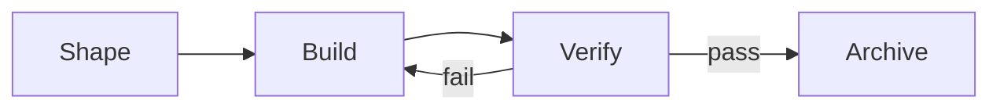

The capability bottleneck of strong models is not "can they write code", but "can they be trusted to finish". Comet Native is built for exactly this: **requirements and acceptance must be concrete, and the execution method stays lightweight.**

It assumes the model can investigate code autonomously, form an implementation approach, and choose tests according to risk, so it no longer mandates a fixed design, planning, TDD, debugging, or review method; at the same time a Comet-owned Runtime manages requirements, the target spec, phases, evidence, conflicts, and archiving, and reclaims the completion verdict from the model back to the Runtime. Only this way can strong models swing freely and the result stay on course.

## Native Loop: reclaiming the completion verdict to the Runtime

An ordinary agent loop is model-led — the model judges for itself whether it is "done", and the framework only provides tools. This leaves room for the model to deceive itself: claim "complete", when nothing was tested, nothing was changed, or even nothing was touched.

Native borrows from the Claude Code team's [Loop Engineering](https://claude.com/blog/getting-started-with-loops): a loop is a controlled feedback system where the Agent repeats a work cycle until a stop condition is met, with the design focused on the trigger, completion criteria, verification method, and iteration bounds. Native turns that idea into a Runtime-led convergence machine — **the model thinks and does, the Runtime judges whether it is done.**

Native bounds the loop to Build and Verify: one implementation, one commit, or a single Agent execution turn is only an iteration; only when every acceptance condition under the current contract is supported by currently valid evidence is the work complete.


Each iteration follows the same feedback path: read the current acceptance conditions, complete a related batch of implementation, run real verification, and then let the Runtime judge whether the gaps shrank. On Verify failure, unsatisfied acceptance items and failed checks return to Build as structured input rather than sitting in the conversation for the model to recall on its own. Only after a final Verify pass does the loop exit into Archive.

Four mechanisms make this loop converge trustworthily rather than spinning forever:

- **Driven by acceptance gaps**: address unsatisfied outcomes first. The Runtime derives gaps from the validated acceptance matrix and forces the next round to close them first.
- **Semantic change defines progress**: fewer gaps, a check turning green, or evidence restored to valid count as progress. Repeatedly rewriting code while the failure set stays unchanged does not reset the stagnation count.
- **Autonomous repair is bounded**: it stops the third time the same semantic gap appears without progress; the same contract accepts at most five Verify failures by default. When the budget is spent, the Runtime returns the decision to the user.
- **Recovery relies on repository state**: acceptance conditions, checkpoints, and verification reports all persist with the change. After an interrupted session, work continues from the same facts, independent of chat memory.

The executor investigates, implements, and repairs; the Runtime owns the completion verdict, evidence validity, and stop boundaries. One Agent turn, one checkpoint, or the Agent's self-reported "done" is never a terminal state — this is Native's hardest rule.

<p align="center">
  
</p>

## Choosing Native or Classic

| Dimension              | Native                                            | Classic Spec mode                                                    |
| ---------------------- | ------------------------------------------------- | -------------------------------------------------------------------- |
| Primary model tier     | Fable 5, GPT-5.6, and similarly capable models    | Models below this capability tier that need finer step guidance      |
| Workflow               | Shape → Build → Verify → Archive                  | open → design → build → verify → archive                             |
| Requirements and state | Comet brief, target spec, `comet-state.yaml`      | OpenSpec change/delta specs, `.comet.yaml`                           |
| Implementation process | Model chooses autonomously from repo facts and risk | Explicit design, planning, TDD, debugging, and review protocols      |
| Dependencies           | Comet Native Skill and Runtime (zero external Skills) | Comet Classic, OpenSpec, and Superpowers                             |
| Constraint profile     | Strong outcome constraints with fewer method constraints | Finer phase guidance and process constraints                         |

If your primary model is in the Fable 5 / GPT-5.6 tier, Native is the default recommendation: the biggest waste of a strong model is being boxed in by methodology, so Native returns method choice to it and only locks down the outcome and evidence.

For less capable models, finer Spec and execution phases reduce omissions and process drift; Comet's existing real-model baseline evaluation has already shown that Classic's strong constraints hold good task coverage and completion on this kind of work. Classic is neither an obsolete Native nor a downgrade path after failure — the two workflows target different capability curves, and neither upgrades to nor replaces the other.

The current aligned Native versus 0.4.0 Classic experiment covers 16 tasks with three runs each; the task-level `pass@3` of both modes is 100%. That experiment supports the conclusion that "both workflows can cover the tasks and Native runs lighter in this experiment", but it alone cannot prove a causal advantage across all models, repositories, and tasks. See [Native versus Classic real-model evaluation](/en/eval/comet-native-vs-040-experiment).

<Info>
  Model names are capability-tier guidance for convenience, not a Runtime detection rule. Comet does
  not read the model name and switch workflows automatically; the final choice is decided by project
  configuration.
</Info>

## One entry, independent lifecycles

`/comet` reads `.comet/config.yaml`, then deterministically forwards to `/comet-native` or `/comet-classic`. A project can enable only one workflow, or both at once:

```yaml
schema: comet.project.v1
default_workflow: native
workflows:
  - native
  - classic
ambient_resume: true
native:
  artifact_root: docs
  language: en
  clarification_mode: sequential
classic:
  artifact_layout: docs
  language: en
  context_compression: off
  review_mode: standard
  auto_transition: true
```

`default_workflow` only decides which side `/comet` enters; it does not migrate, delete, or merge changes. Native and Classic keep their own phase, schema, change, spec, and archive directories, and even when both are enabled in the same project they never convert into each other.

## Four-phase workflow



### Shape: fix the target and user decisions

Shape first investigates repository facts, then writes Outcome, Scope, Non-goals, Acceptance examples, Constraints and invariants, Decisions, Open questions, and Verification expectations into `brief.md`.

The model distinguishes two kinds of choices:

- a choice that changes user-visible results, default behavior, compatibility, scope, risk, or irreversible results is a user decision;
- a choice that only changes the implementation approach without changing observable results is a model decision.

When a user decision remains, Sequential mode asks one upstream question per round; Batch mode asks every currently answerable question in the round. Both modes provide a recommendation and the impact of each option, and require the user to confirm the final shared understanding before entering Build; an unresolved `[blocking]` question or confirmation blocks entry to Build. When the change affects durable behavior, Shape also writes a target spec for each capability rather than recording only an incremental patch.

### Build: let the strong model implement autonomously

Build is bounded by the brief, the target spec, and repository rules. The model decides for itself whether to persist a plan, what test depth to adopt, and how to debug and review; Native does not demand extra documents created for the sake of process, nor does it mandate TDD.

If a new product decision surfaces during implementation, the workflow returns to clarification. Before advancing to Verify, the Runtime freezes the real project artifacts into an implementation scope; when scope completeness cannot be proven it stops, and only after the user explicitly accepts the risk bound to the scope hash may it proceed on a partial scope.

### Verify: bind conclusions to current facts

Verify runs real checks against the Acceptance examples, target spec, and implementation risk. `verification.md` records commands, results, skipped reasons, known limitations, and itemized Acceptance evidence.

The Runtime binds the verification conclusion to the current brief, target spec, implementation scope, and revision. After any input changes, old reports, old receipts, and old passes become stale and cannot be used for archiving. A failure returns to Build, with the unsatisfied acceptance and failed checks fed as the next round's input. See [Verification evidence and autonomous repair](/en/native/verification-and-repair) for details.

### Archive: two-step check before commit

Archive first generates a content-bound `preflightHash`, then rechecks evidence, paths, and canonical spec hash at commit time. When a parallel change has altered the same capability, archiving stops instead of overwriting; the model must read the latest canonical spec, run `spec rebase` to refresh the baseline, and then re-implement and re-verify.

After a successful archive, the target spec becomes the canonical spec and the active change moves into a dated archive directory. The trajectory stores only phase summaries and evidence references, not the hidden reasoning process.

## Boundaries of automatic progression

When phase conditions pass, the Runtime returns a structured continuation so the same `/comet-native` Skill can keep executing. It stops when:

- there is still an unresolved user decision;
- configuration, state, locks, or transactions cannot be safely interpreted;
- verification evidence has gone stale or the implementation scope is incomplete;
- a canonical spec has a concurrent conflict;
- the same failure recurs without progress.

Native's "automatic" is therefore stateful continuous progression — not a background daemon, and not a license to skip user decisions or safety checks.

Continue with [Native quickstart](/en/native/quickstart), [Native configuration](/en/native/configuration), [Artifacts and state](/en/native/artifacts-and-state), and [Safety and recovery](/en/native/safety-and-recovery).
