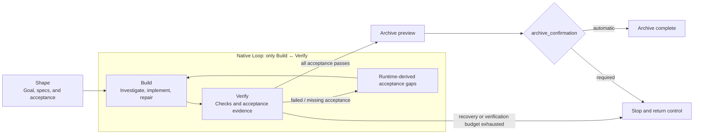

Comet Native is a Skill designed specifically for strong coding models in the Fable 5 and GPT-5.6 capability tier. It assumes the model can investigate code, form an implementation approach, and choose verification according to risk. It therefore does not mandate fixed design, planning, TDD, debugging, or review methods, while a Comet-owned Runtime still manages requirements, complete target specifications, phases, evidence, conflicts, and archiving.

Its core principle is: **make requirements and acceptance precise while keeping execution methods lightweight.** Lightweight means removing unnecessary process orchestration for capable models, not reducing requirement quality or skipping verification.

## Native Loop, informed by Loop Engineering

Native's completion loop draws on the Claude Code team's introduction to [loops](https://claude.com/blog/getting-started-with-loops): an Agent repeats a cycle of work until a stop condition is met. The design must define the trigger, completion criteria, verification, and iteration bounds. A loop here is a controlled feedback system, not permission for unlimited retries.

Comet Native bounds Native Loop to Build and Verify. One implementation, one commit, or one Agent turn is only an iteration; work is complete only when current evidence supports every acceptance condition under the current contract.



Each iteration follows the same feedback path: read current acceptance, implement a related batch, run real verification, and let the Runtime determine whether gaps decreased. On failure, failed or missing acceptance items and failed checks return to Build as explicit input instead of relying on conversation memory. Only a final Verify pass leaves Native Loop for Archive. Recoverable `blocked` findings enter recovery first; control returns to the user only after the override or verification budget is exhausted or an archive decision is required.

For example, an Agent may finish one Build iteration and then discover in Verify that an edge case from the complete target spec was not implemented. Native records that omission as an unsatisfied acceptance item and returns it to Build. The Agent fills the gap in the next iteration and runs the complete verification again. Native Loop continues while repairable spec gaps remain and no stop boundary has been reached; finishing one coding pass is not completion.

Four boundaries keep the loop controlled:

- **Acceptance gaps drive work**: address unsatisfied outcomes instead of treating task narration or code volume as completion.
- **Semantic change defines progress**: fewer gaps, passing checks, or restored evidence count as progress; implementation churn with an unchanged failure set does not reset stagnation.
- **Autonomous repair is bounded**: the Runtime permits continued repair but stops on repeated gaps or an exhausted failure budget.
- **Recovery uses repository state**: acceptance, checkpoints, verification reports, and continuation persist with the change, so a resumed session continues from the same facts rather than chat history.

The implementer investigates, implements, and repairs. The Runtime owns completion decisions, evidence validity, and stop boundaries. This separation keeps autonomous execution moving without giving up verifiability, recovery, or a reliable stop.

<p align="center">
  
</p>

## Choosing Native or Classic

| Dimension              | Native                                                          | Classic Spec mode                                                                    |
| ---------------------- | --------------------------------------------------------------- | ------------------------------------------------------------------------------------ |
| Primary model tier     | Fable 5, GPT-5.6, and similarly capable models                  | Models below the Fable 5 or GPT-5.6 capability tier that benefit from finer guidance |
| Workflow               | Shape → Build → Verify → Archive                                | open → design → build → verify → archive                                             |
| Requirements and state | Comet brief, complete target specifications, `comet-state.yaml` | OpenSpec change/delta specs and `.comet.yaml`                                        |
| Implementation process | Model chooses from repository facts and risk                    | Explicit design, planning, TDD, debugging, and review protocols                      |
| Dependencies           | Comet Native Skill and Runtime                                  | Comet Classic, OpenSpec, and Superpowers                                             |
| Constraint profile     | Strong outcome constraints with fewer method constraints        | Finer phase guidance and stronger process constraints                                |

Classic is neither an obsolete Native version nor a fallback after Native fails. For models below the Fable 5 or GPT-5.6 capability tier, finer Spec and execution phases can reduce omissions and process drift. Comet's existing real-model baseline has shown that Classic's stronger constraints can deliver good task coverage and completion on this type of work. Native targets models that already have stronger autonomous reasoning and removes repeated phases and dependency-Skill overhead.

The current aligned Native versus 0.4.0 Classic experiment used Mimo 2.5 Pro on 16 tasks with three repetitions each. Both workflows reached task-level `pass@3 = 100%`. That supports the narrower conclusions that both workflows covered the tasks and Native ran lighter in this experiment; it does not establish a universal causal advantage across every model, repository, or task. See [Native versus Classic real-model evaluation](/en/eval/comet-native-vs-040-experiment).

<Info>
  Model names are capability-tier guidance, not a Runtime detection rule. Comet
  does not inspect the model name and switch automatically; project
  configuration controls the workflow.
</Info>

## One entry, independent lifecycles

`/comet` reads `.comet/config.yaml`, then deterministically forwards to `/comet-native` or `/comet-classic`. A project can enable one workflow or both:

```yaml
schema: comet.project.v1
default_workflow: native
workflows:
  - native
  - classic
ambient_resume: true
native:
  artifact_root: docs
  language: en
  clarification_mode: sequential
classic:
  artifact_layout: docs
  language: en
  context_compression: off
  review_mode: standard
  auto_transition: true
```

`default_workflow` controls only where `/comet` enters. It does not migrate, delete, or merge changes. Native and Classic retain independent phases, schemas, changes, specifications, and archive directories even when both are enabled.

## Four-phase workflow


### Shape: fix the target and user decisions

Shape investigates repository facts, then records Outcome, Scope, Non-goals, Acceptance examples, Constraints and invariants, Decisions, Open questions, and Verification expectations in `brief.md`.

The model distinguishes two kinds of choices:

- a choice that changes user-visible results, defaults, compatibility, scope, risk, or irreversible outcomes belongs to the user;
- a choice that changes implementation without changing observable results belongs to the model.

When a user decision remains, Sequential mode asks one upstream question per round. Batch mode asks every currently answerable question in the round. Both modes include a recommendation and option impact, then require the user to confirm the final shared-understanding summary before Build. An unresolved `[blocking]` question or confirmation prevents Build. Changes to durable behavior also receive a complete target specification for each capability rather than an incremental patch alone.

### Build: autonomous implementation

Build is bounded by the brief, complete target specifications, and repository rules. The model decides whether to persist a plan, what test depth to use, and how to debug and review. Native does not create process documents for their own sake or mandate TDD.

New product decisions return the workflow to clarification. Before Verify, the Runtime captures real project artifacts as the implementation scope. If it cannot prove the scope complete, progression stops; a partial scope requires explicit user acceptance bound to the exact scope hash.

### Verify: bind conclusions to current facts

Verify runs appropriate checks against Acceptance examples, complete target specifications, and implementation risk. `verification.md` records commands, results, skipped checks, known limitations, and evidence for each Acceptance ID.

The Runtime binds the conclusion to the current brief, target specifications, implementation scope, and revision. Any input change makes old reports, receipts, and pass results stale. A failure returns to Build with unsatisfied acceptance items and failed checks as the next iteration's input. Only fewer gaps, passing checks, or restored evidence count as semantic progress. The third recurrence of the same gap without semantic progress stops the loop. The default limit is five Verify failures per contract and can be changed to a positive integer with `native.max_verify_failures`.

### Archive: commit after a two-step preflight

Archive first produces a content-bound `preflightHash`, then rechecks evidence, paths, and canonical-spec hashes at commit time. If a parallel change has altered the same capability, archiving stops instead of overwriting it. The model must read the latest canonical specification, run `spec rebase`, then implement and verify again.

After success, complete target specifications become canonical specs and the active change moves to a dated archive directory. The trajectory stores phase summaries and evidence references, not hidden reasoning.

## Boundaries of automatic progression

When phase conditions pass, the Runtime returns a structured continuation so the same `/comet-native` Skill can continue. It stops when:

- a user decision is unresolved;
- configuration, state, locks, or transactions cannot be interpreted safely;
- verification evidence is stale or implementation scope is incomplete;
- a canonical specification has a concurrent conflict; or
- the same failure repeats without progress.

Native automation is therefore stateful continuation, not a background daemon and not permission to skip user decisions or safety checks.

Continue with [Native quickstart](/en/native/quickstart), [Native configuration](/en/native/configuration), [Artifacts and state](/en/native/artifacts-and-state), and [Safety and recovery](/en/native/safety-and-recovery).
