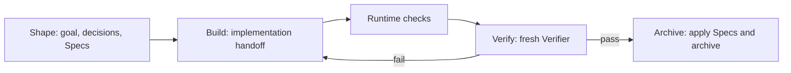

Native is Comet's requirements workflow for strong models. Models in the Fable 5 and GPT-5.6 tier can investigate the codebase, form a plan, and choose tests by risk, so imposing fixed design, planning, and TDD methods adds little. Native therefore owns only two questions: how the requirements are fixed and who decides that the work is complete. The brief and complete target Specs say what to build; Runtime checks and an independent Verifier decide whether it counts as done. The model chooses the plan, implementation, tests, and review method.

This trade-off is supported by measured results. In a matched evaluation against Classic (16 tasks, 48 runs, using 41 paired samples where both sides passed), Native used 76.8% fewer total tokens, 57.4% fewer Agent turns, and 47.4% less time, with an 87.5% three-run full-pass rate. See [the Native vs. 0.4.0 Classic evaluation](/en/eval/comet-native-vs-040-experiment) for the design and raw numbers.

## A change lifecycle

Every acceptance round covers the complete A1…An list. A Builder's "done" is only handoff context: missing, duplicate, unknown, or failed-check items all return the change to Build. Checks already run for the same candidate are reused, and normal Archive does not rerun acceptance.

## Four stages

### Shape: fix the target and user decisions

Shape first investigates facts that can be established from the repository, then writes `brief.md`, complete target Specs, and a shared-understanding summary for the user to confirm. Questions that change visible behavior, defaults, compatibility, scope, risk, or irreversible results go to the user; the model chooses implementation structure and libraries. New projects default to Batch clarification, while Sequential remains available.

### Build: the model implements

Build is bounded by the brief, Specs, and repository rules. The model chooses implementation, testing, and repair methods, then submits a Builder handoff rather than writing a passing verdict. A new product decision returns to Shape; implementation gaps stay in the next Build iteration.

### Verify: Runtime checks plus a fresh Verifier

Runtime resolves and runs necessary checks, sending command output to local logs and keeping only a summary in state. A fresh read-only Verifier returns one result for every A1…An item; extra checks are requested from Runtime within the current attempt. When the host cannot provide an independent Verifier execution, Runtime marks the degraded assurance explicitly and waits for your confirmation before Archive.

### Archive: apply only the final result

After Verify passes, Runtime generates `verification.md`, applies the canonical Specs, and moves the change without rerunning checks. The user artifacts left after archive are the brief, Specs, `comet-state.yaml`, and `verification.md`; the execution directory under `.comet/runtime/native/` is cleaned up.

## State and recovery

`comet-state.yaml` records phase, Loop, acceptance, handoff, check summaries, the Verifier verdict, blockers, bounded history, and the next action. The local `state.json`, logs, locks, and transactions all live under `.comet/runtime/native/`. After a device move or missing local overlay, Runtime rebuilds from YAML; a code, artifact-root, or branch/worktree mismatch stops and waits for you.

## Relationship to Classic

Native and Classic are two independent workflows, not light and heavy tiers, and neither upgrades into the other. See [How to choose between Native and Classic](/en/native/native-vs-classic). `/comet` forwards deterministically from `.comet/config.yaml`; the two sides never convert or share changes, Guards, state, or directories.

Continue with [Native quickstart](/en/native/quickstart), [Native Loop](/en/native/native-loop), [Artifacts and state](/en/native/artifacts-and-state), and [Safety and recovery](/en/native/safety-and-recovery).
