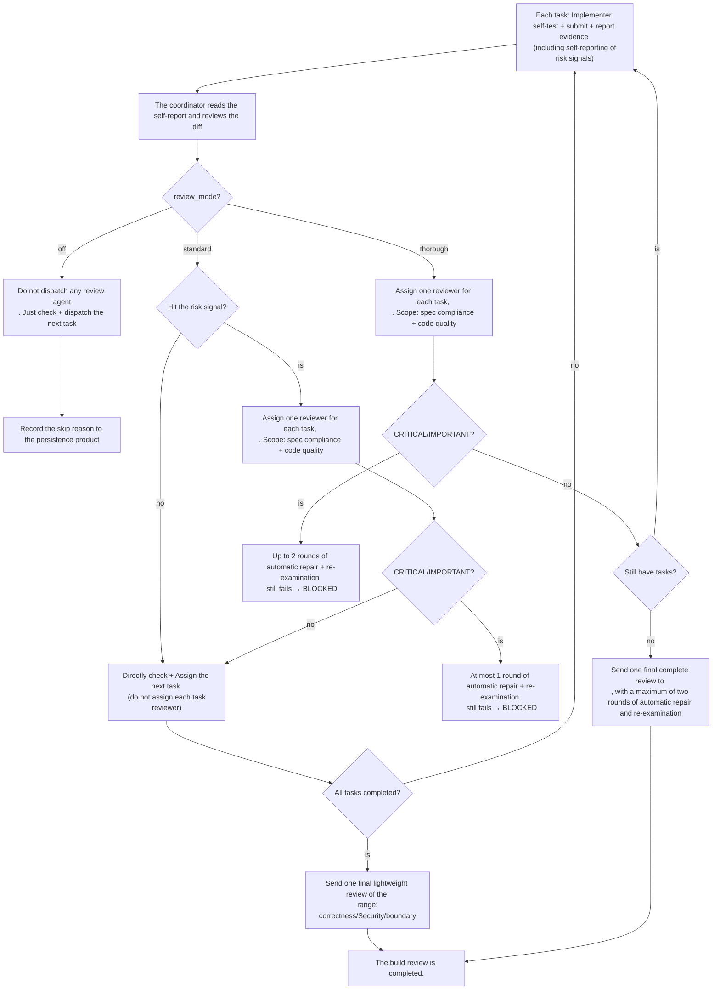

`review_mode` controls the ** automatic code review intensity ** during the build phase. It forms a real gradient - `off` (zero review) → `standard` (risk-triggered review per task) → `thorough` (review per task) - determining when Comet loads the `requesting-code-review` of Superpowers, which tasks assign reviewers, and how many rounds of automatic fixes to perform.

This mechanism enables low-risk tasks to advance rapidly and provides immediate, focused per-task reviews for high-risk changes, allowing problems to be exposed as early as possible.

<Note>
  <code>review_mode</code> only controls <strong>automatic</strong> reviews inside the workflow. You can also invoke{' '}
  <code>/comet-review</code> at any time for a read-only, on-demand review of the current Change. It is independent of{' '}
  <code>review_mode</code> and does not advance the workflow. It only reports correctness, security, boundary, and coverage issues in the implementation diff; it does not modify files, update state, or replace Verify.
</Note>

## Mode selection

|"Mode"|Suitable|Cost|Suggestion|
| ---------- | --------------------------- | ---- | -------------- |
| `off`      |Documents, low-risk hotfixes/tweaks|The lowest|Use only when the risk is low|
| `standard` |Daily full workflow|Medium|Default recommendation|
| `thorough` |Security, architecture, and multi-module changes|The highest|Used in high-risk situations|

<Tip>
When in doubt, choose ZXQ0, QXZ, Standard ZXQ1, QXZ. It only assigns each task reviewer to risk tasks and retains one final lightweight review.
</Tip>

## Core rule: review_mode takes over the default review flow and does not perform double review

<Warning>
<strong> This is the most crucial rule. </strong>Superpowers <code>subagent - driven - development</code>{' '}
The default process requires "assigning a task reviewer after each task". Comet's <code>review_mode</code>{' '}
<strong> takes over this stage </strong> and decides which tasks are assigned to each task reviewer.
  <strong>
Do not dispatch reviewers outside the <code>review_mode</code> regulations.
  </strong>
The task of the reviewer cannot be obtained (<code>off</code>: all; <code>standard</code>)
For non-risk tasks, simply select the task box and assign the next task. The total number of reviews for a change
<strong> is determined solely by the budget table below. </strong>.
</Warning>

## The boundary with Superpowers SDD

Comet's `subagent-driven-development` extension now only relies on the task reviewer contract made public by Superpowers: After the implementer completes the task, the coordinator decides whether to assign a reviewer based on the task materials, real diff, test evidence, and risk signals. Comet does not read, write, or require the internal script names, workspace paths, or private implementation details of Superpowers `subagent-driven-development`.

This means:

- Superpowers still offers continuous task scheduling, pre-check plan review, file-type handoff, reviewer neutral prompts, feedback semantics of "insufficient materials for verification", and progress reconciliation.
- Comet only takes over the reviewer trigger strategy and review-fix budget, that is, `review_mode` decides which tasks should be assigned to the reviewer.
- Documentation, recovery and testing are subject to public behavior, and the shipped Skill copy is not bound to the internal directory structure of Superpowers.

<Info>
From the user's perspective, you only need to select `off`, `standard` or `thorough` during the build stage. Underlying Superpowers SDD
Skills can upgrade one's own implementation. As long as the public task reviewer contract is continued to be met, Comet's review strategy does not need to be changed.
</Info>
## Review the budget sheet during the build stage

This table ** only covers the build stage **, and only these reviewers are assigned without any additional ones:

| `review_mode` |Each task reviewer (build|Final Review (build|
| ------------- | -------------------------------- | ----------------- |
| `off`         | 0                                | 0                 |
| `standard`    |Only risk tasks (see the rules below)|Once (light weight|
| `thorough`    |Each task (spec compliance + code quality|Once (complete)|

<Note>
The review during the <strong>verify stage is not included in this table. The review in the </strong>verify stage is conducted by <code>verify_mode</code>
(light/full) driver, <code>review_mode, </code> only determines whether verify triggers automatic code review (<code>off</code>{' '})
Skip; <code>standard</code>/<code>thorough</code> under light validation run a lightweight code review, in full
verify the dependency (<code>openspec-Verific-change</code>). The verify stage does not have a separate per-
<code>review_mode</code>" Complete "code review - For authoritative behavior, see the verify phase documentation.
</Note>

<p align="center">
  
</p>

<p align="center">review_mode is a true gradient: the further to the right, the stronger the review, but the higher the time and token cost </p>

## Understand the three modes in one picture



## Comparison of the three modes

|"Dimension"| `off`                    | `standard`                                    | `thorough`                                  |
| ---------------- | ------------------------ | --------------------------------------------- | ------------------------------------------- |
|"Each task reviewer"| 0                        |Only risk tasks|"Each task.|
|"Final review| 0                        |Once (light weight|Once (complete)|
|** Review Scope **| —                        |Risk Task: spec + Quality; Ultimately: Correctness/Security/boundaries|Each task + final: spec compliance + Code quality (complete)|
|"Automatic repair upper limit"|"0 rounds"|Risk task/final each ** up to 1 round ** + review|Each task/final each ** up to 2 rounds ** + review|
|"Execution speed"|The fastest|Medium (low-risk tasks skip review)|The slowest (each task needs to be reviewed)|
|"token consumption.|The lowest|Medium|"Highest"|
|** Suitable scenarios **|hotfix/tweak, low-risk minor modifications|Daily full workflow|High-risk, multi-module, architectural/security changes|
|"Default value"|hotfix/tweak default|full workflow default (including runtime fallback)| —                                           |

## off mode (lowest intensity)

Do not dispatch any automatic spec reviewers, code quality reviewers, final reviewers, or review fix agents. Whether a task is completed is determined by the implementer's self-test, build/test evidence, current worktree confirmation, and task selection verification.

<Warning>
<code>off</code> only skips the automatic code review of <strong>. </strong>, <strong> does not skip </strong>
Build, test, conduct security checks and debug the gate protocol. If test failure, build failure or abnormal behavior occurs during execution, you still have to go
debug gate -- <code>off</code> cannot be used to bypass real problems.
</Warning>

The off mode must record the reasons for skipping the automatic code review in the ** persistence product ** (tasks.md, commit body, verification report draft, etc.).

- The default default for hotfix and tweak is `off`.
- full workflow can also explicitly select `off`, but this selection must be confirmed and the reason recorded before leaving the build.

## standard Mode (Moderate intensity)

standard is no longer "reviewed only once at the end". It forms a combination of a "risk-triggered" review per task and a final lightweight review.

### "build stage"

1. By default, no task reviewer is assigned. The implementer self-tests, submits and reports evidence (including self-reporting of risk signals); The coordinator performs targeted selection verification.
2. ** Risk Trigger ** : After reading the implementer's self-report + review diff, ** Only when the self-report hits any risk signal or the diff review of the coordinator discovers any risk signal ** will a per-task reviewer be assigned to this task to simultaneously check spec compliance and code quality.
3. CRITICAL/IMPORTANT discoveries of risk tasks enter **1 round ** review-fix (up to 1 round). If the rereview fails → mark **BLOCKED**, suspend and hand over to the user.
4. For tasks that hit risk signals, directly go through the targeted selection verification.
5. After all tasks are completed, a final lightweight code review will still be dispatched exactly once, with the scope limited to correctness, security, and boundary conditions.
6. The final review found CRITICAL/IMPORTANT → assign ** up to 1 ** fix agent and re-examine once; Still not passed → **BLOCKED**. Non-critical is acceptable and the reasons should be recorded.

### List of Risk Signals

Hitting any one of the following tasks will mark it as a risky mission (determined jointly by self-reporting by the implementer and review by the coordinator diff) :

- Coordinate changes across modules/subsystems
- Security-sensitive aspects: authentication, authorization, encryption, SQL, external input processing, keys/credentials
- Concurrency, locks, and shared mutable states
- Data or schema migration
- Changes to public API contracts or external interfaces
- The implementer returns `DONE_WITH_CONCERNS`
- The single task diff exceeds 200 lines

## thorough mode (maximum intensity)

thorough no longer conducts "batch-by-batch combined review". High-risk changes require that each task receive immediate and focused review - it is too costly to wait until the batch boundary to address issues.

### Key rules in the build stage

1. For each task, assign a per-task reviewer (spec compliance + code quality) : After the implemencer conducts self-testing, submits, and reports evidence, the coordinator assigns a brand-new background reviewer to this task.
2. CRITICAL/IMPORTANT discoveries enter review-fix (** up to 2 rounds **); Still not passed → Mark **BLOCKED** and pause the handover to the user.
3. After all the tasks are completed, send **1 ** final complete reviewer.
4. Final review ** up to 2 rounds ** automatic repair + re-examination; Still not passed → **BLOCKED**.

<Note>
thorough batch review without running - high-risk changes require each task of ZXQ0, QXZ, ZXQ1, QXZ
Conduct immediate and focused reviews. It is too costly to drag the problem to the batch boundary and then deal with it.
</Note>

### Why is thorough slow and token-consuming

The overhead of thorough is ** structural ** : N tasks will assign N per-task reviewers + 1 final reviewer, and each reviewer may trigger up to 2 rounds of fixes. For the changes of 12 tasks, standard may only assign reviewers + 1 final review to a few risky tasks, while thorough will run 12 reviews per task + 1 final review - the number of agents for review and fix is several times that of standard.

<Tip>
<strong> Rule of thumb </strong>: If the changes involve security, authentication, data migration, cross-module apis, or architectural adjustments, use {' '}
; Otherwise, <code>standard</code> is sufficient. <code>thorough</code>{' '}
It is a costly strong review: it will significantly slow down the build and increase token consumption, and thus is not suitable as the default value.
</Tip>

## The core difference between standard and thorough

|"Dimension"| standard                 | thorough                     |
| ------------ | ------------------------ | ---------------------------- |
|Each task reviewer|Only risk tasks|"Each task.|
|Review timing|Risk mission: Immediate + last time|Each task is immediate and last|
|Final review scope|Lightweight (accuracy/security/boundary)|Complete (spec compliance + code quality|
|Automatic repair upper limit|Each review round|Each review consists of 2 rounds|
|"BLOCKED triggered|Any review of the first round of fixes failed|Any review of the second round of fixes failed|
|Execution overhead|Medium|"Highest"|

## Model selection for each task assignment (mandatory)

Each time the implemencer/fixer/reviewer dispatches, the model must be explicitly specified. Omitting the model will silently inherit the most expensive model in the session, slow down execution and increase costs. Follow the Model Selection rules of Superpowers `subagent-driven-development`:

|"Role"|Model selection|
| ----------------------- | -------------------------------------------------------------------------------------------------------------------------------------------------------------- |
|Implementers/fixators|1-2 files + complete spec → the cheapest file; Multi-file integration/pattern matching/debugging → Standard file; Design judgment or extensive code understanding required → The strongest file. When the plan text already contains the complete code to be written (copying + testing), use the cheapest version|
|Reviewer (per task/final)|Scale according to the size, complexity and risk of the diff. The small mechanical diff does not require the strongest model. Subtle concurrent changes are required|
|Final review of the entire branch|Use the strongest available model, not the session default|

Omitting the model = making it run the most expensive model in the session directly violates the goal of this rule.

## Coordination with build_mode

| build_mode                    |"standard Behavior"|thorough behavior|
| ----------------------------- | ------------------------------------------------ | ---------------------------------------------------------- |
| `subagent-driven-development` |Risk task assignment: Each task reviewer + final lightweight review|For each task, assign a task reviewer and conduct a final complete review|
| `executing-plans`             |A lightweight review after all tasks are completed (see review gate below)|Conduct a segmented review for every 3 tasks + the final one (see review gate below)|

### -plans review gate (zoom in by review_mode)

Under `executing-plans`, the main session directly executes tasks (without isolated implementer sub-agents), so there is no per-task reviewer like `subagent-driven-development`. The code review is for the completed diff and zooms in by `review_mode`:

- **`review_mode: off`** : No automatic code review is performed, and `requesting-code-review` is not loaded. The reason for skipping is recorded in the verification report draft or tasks.md.
- **`review_mode: standard`** : After all tasks are completed and before build → verify phase guard, load `requesting-code-review` with the Skill tool for a lightweight code review (correctness, security, boundaries), covering the entire change.
- **`review_mode: thorough`** : Except for the final review, conduct a ** segmented code review ** every three tasks (based on the diff range of that segment). When the total task is ≤ 3, skip the intermediate segments and only conduct the final review. For each review segment, use `requesting-code-review` for the commit interval of that segment. This is the equivalent that `executing-plans` can offer, which is closest to the per-task review of `subagent-driven-development`, as it does not isolate the implementer for task-by-task review.

** Requirements ** (standard and thorough applicable) :

- `requesting-code-review` must be loaded before `comet-guard build --apply`.
- If the skill is unavailable, skip the review access but record `<!-- review skipped: skill unavailable -->` in tasks.md.
- CRITICAL discoveries (security vulnerabilities, data loss risks, build/test failures) must be fixed before verification.
- Non-critical findings are acceptable, but the causes and impacts must be documented in the persistence product.

## How do reviewers work

Under `subagent-driven-development`, the review is performed by the ** brand-new background agent**. The reviewer will obtain complete task, implementation commit/diff and (when TDD is enabled) RED/GREEN evidence, and must directly verify the real code before drawing a conclusion.

The repair agent is also a brand-new background agent that independently modifies the code based on review feedback.

### Progress checkpoint

coordinator maintenance `.comet/subagent-progress.md` Record the implementation commit of each task, the modified files, the RED/GREEN evidence, the selected `review_mode`, the passed review stage, the unresolved review feedback, and the current number of review-fix rounds (`standard` up to 1, `thorough` up to 2, `off` 0) And whether the task has triggered the risk per-task review in the standard mode (the completed per-task review will not be reassigned when resuming).

## How to set up

### Priority

The parsing priority of `review_mode`:

```text
change '.comet.yaml > COMET_REVIEW_MODE environment variable > '.comet/config.yaml 'classic.review_mode > standard
```

When a new change is created, the full workflow snapshots the default values of the project to its own `.comet.yaml`; hotfix/tweak is directly hardcoded as `off`.

<Note>
Starting from 0.4.0-beta.1, the runtime fallback changes from <code>null</code> (closed) to <code>standard</code>
. . In other words, when change the <code>.com et yaml</code>, environment variables, and no explicit Settings {' '} project configuration
When <code>review_mode</code> is used, the default is <code>standard</code>
(Risk-triggered review per task) processing, rather than no review at all. This applies to the init template.
<code>classic-state-command-.ts</code> runtime fallback and frozen 0.3.9 contract fixture.
</Note>

### Project default values

Editor: `.comet/config.yaml`

```yaml
classic:
  review_mode: thorough
```

When a new change is created, it takes a snapshot to its own `.comet.yaml`. Note: Environment variables and project configurations only provide default values at the resolver layer, ** and do not affect `review_mode` that has been written to change **.

### "Single change"

full workflow is selected by the user during build Step 3 (execution mode selection) and written via `comet-state`:

```bash
node "$COMET_STATE" set <change-name> review_mode standard
```

This is the user decision point in the build stage.

### Environmental variable

```bash
export COMET_REVIEW_MODE=standard
```

Only provide default values at the resolver layer and do not affect `review_mode` that has been written to change.

## Hard constraint (full workflow leaves build)

`review_mode` is the ** hard access control ** of full workflow, which is enforced by two layers of independent checks:

|layer|Checkpoint|Failed behavior|
| --------------------------------------- | --------------------------- | ----------------------------------------- |
| `comet-guard build`                     |`review_mode selected` inspection|Prompt the user to select and provide the `comet-state set` command|
| `comet-state transition build-complete` | `requireBuildDecisions`     |Reject transition|

Both layers must be passed before leaving the build. hotfix/tweak waived this check (they default to `off`).

<Note>
<code>review_mode</code> is not in <code>REQUIRED_CLASSIC_KEYS</code>, so {' '} before 0.4.0
<code>.com et. You don't have to migrate parsing yaml</code> file. Mandatory checks occur during the transition from build to verify
guard: When the old file is missing this field, take the compatible path. It should be backfilled during recovery. Illegal value (not <code>off</code>/.
<code>standard</code>/<code>thorough</code>) will be enumerated check to refuse.
</Note>

## State transition interaction

`review_mode` is the access control field in the build stage. It will not change the field effects of the transition event, but will be checked as a hard decision before `build-complete`. Related conversions

- `build-complete` → Call `requireBuildDecisions` (including review_mode check), and after passing, `phase: verify, verify_result: pending`.
- `verify-pass` → require the existence of `verification_report` and `branch_status: pending`, and then write `phase: archive, verify_result: pass`; `handled` is written by Archive after the final delivery confirmation.
- `verify-fail` → `verify_result: fail, phase: build` (Roll back. review_mode must be satisfied again during the next build-complete).

## How to choose

|Scene|Recommendation mode|Reason|
| ------------------ | ------------- | ---------------------------------------------- |
| hotfix / tweak     |`off` (Default)|Low-risk minor modifications do not require strict review|
|Daily function development| `standard`    |Low-risk tasks skip review, while risky tasks are reviewed immediately, with controllable costs|
|Security/Authentication/Data migration| `thorough`    |Each task is subject to immediate review, covering high-risk areas|
|Cross-module/architecture changes| `thorough`    |Each task review can identify cross-module issues|

## Next step

- Configure the ](/en/classic/configuration)-review_mode field and set the priority in Classic
- During the build phase, the usage position of ](/en/phases/build) - review_mode in the build is coordinated with build_mode
- [verify phase ](/en/phases/verify) - Review check of the light path in verify (driven by verify_mode)
- Context compression mechanism ](/en/concepts/context-compression) - Another project configuration item that affects execution overhead
