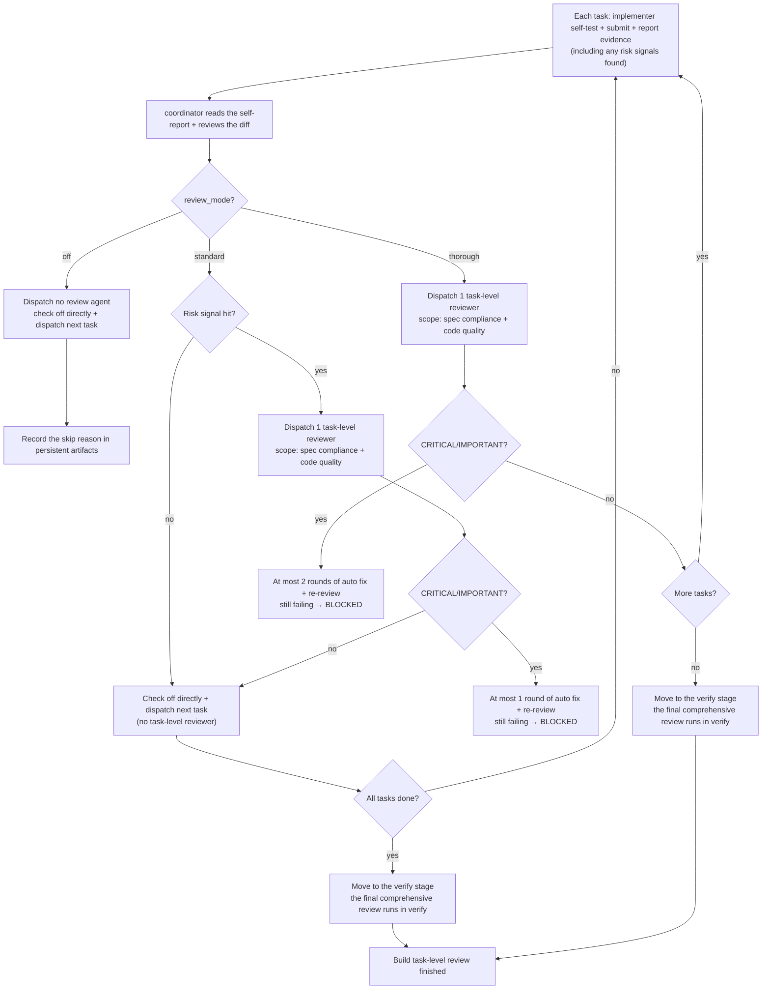

`review_mode` controls when Classic dispatches task-level code reviews during the build stage, how many fix rounds are allowed, and the intensity of the final comprehensive review in the verify stage. Inside build: `off` dispatches no reviewer, `standard` reviews only risky tasks, and `thorough` reviews every task. The change's **final comprehensive code review happens only in the verify stage**; after build finishes all tasks, it appends no reviewer.

<Note>
  <code>review_mode</code> only controls <strong>automatic</strong> reviews inside the flow. You can also invoke{' '}
  <code>/comet-review</code> at any time for a read-only, on-demand review of the current change. It is independent of{' '}
  <code>review_mode</code> and does not advance the workflow. It only reports correctness, security, boundary, and coverage issues in the implementation diff; it does not modify files, update state, or replace Verify.
</Note>

## How to choose review_mode

Pick a mode by the change's risk surface first, then by the time and tokens you can afford. hotfix/tweak default to `off`, and a newly created full-workflow change defaults to `standard`; how each is set and where it applies is in "How to set it" below.

| Scenario | Recommended mode | Cost / speed | Why |
| -------- | ---------------- | ------------ | --- |
| hotfix / tweak, low-risk small changes such as docs | `off` (default) | Lowest / fastest | No strong review needed; use it only when risk is low |
| Everyday full workflow | `standard` (default) | Medium | Low-risk tasks skip review, risky tasks are reviewed immediately, cost stays controlled |
| Security, auth, data migration | `thorough` | Highest / slowest | Every task is reviewed immediately, covering the high-risk surface |
| Cross-module / architecture change | `thorough` | Highest / slowest | Task-by-task review catches cross-module issues |

Full comparison of the three modes:

| Dimension | `off` | `standard` | `thorough` |
| --------- | ----- | ---------- | ---------- |
| **Task-level reviewers** | 0 | Risky tasks only | **Every task** |
| **Review timing** | — | Immediately when a task hits a risk signal | Immediately for every task |
| **Review scope** | — | Risky tasks: spec compliance + code quality | Every task: spec compliance + code quality |
| **Auto-fix limit** | 0 rounds | Up to **1 round** per review of a risky task + re-review | Up to **2 rounds** per review + re-review |
| **BLOCKED trigger** | — | A risky task still failing after 1 fix round → BLOCKED | Still failing after 2 fix rounds → BLOCKED |
| **Final comprehensive review** | Skipped by verify | Executed in the verify stage | Executed in the verify stage |
| **Speed** | Fastest | Medium (low-risk tasks skip review) | **Slowest** (every task is reviewed) |
| **Token cost** | Lowest | Medium | **Highest** |
| **Best for** | hotfix/tweak, low-risk small changes | Everyday full workflow | High-risk, multi-module, architecture/security changes |
| **Default** | hotfix/tweak | full workflow (including runtime fallback) | — |

### Where the cost difference comes from

The cost difference between the three modes is structural. `off` dispatches no task-level reviewer for N tasks, so it is the fastest and cheapest. `standard` assigns a reviewer only to tasks that hit a risk signal, and each such task gets at most 1 round of automatic fixing. `thorough`'s overhead is **structural**: N tasks mean N task-level reviewers, and each reviewer can trigger up to 2 fix rounds. For a change of 12 tasks, `standard` may review only a handful of risky tasks, while `thorough` runs 12 task-by-task reviews — several times more review-and-fix agents than `standard`.

<p align="center">
  
</p>

<p align="center">off, standard, and thorough map to different review counts and token costs</p>

<Tip>
  When in doubt, choose <code>standard</code>. It assigns a task-level reviewer only to risky tasks, so the cost stays controlled.
</Tip>

## What a single task goes through

`review_mode` decides whether, and when, each task in the build stage gets a task-level reviewer, and how many fix rounds a review can trigger. All three modes share the same task baseline: the implementer self-tests, submits, and reports evidence (including any risk signals they found); once the coordinator verifies it, the task is checked off and the next one is dispatched. The description below follows `subagent-driven-development`; under `executing-plans`, the main session executes tasks directly and review takes a different shape — see "Final comprehensive review (verify stage)" and "Coordinating with build_mode".

### standard: review only when a risk signal is hit

Under `standard`, a task gets **no task-level reviewer by default**. After the coordinator reads the implementer's self-report and reviews the diff, **only when the self-report hits a risk signal, or the diff review reveals one**, does this task get a single task-level reviewer, checking spec compliance + code quality (the risk-signal list is below). When the review finds no CRITICAL/IMPORTANT issues, the task passes verification and is checked off, then the next one starts. CRITICAL/IMPORTANT findings enter review-fix with **at most 1 round**, and each fix round is followed by a re-review. If the re-review still fails → mark **BLOCKED**, pause, and hand it to you.

### thorough: every task is reviewed

Under `thorough`, every task gets a brand-new background task-level reviewer, again checking spec compliance + code quality. There is no batched combined review — high-risk changes need each task reviewed immediately and in focus; waiting until a batch boundary to catch problems is too costly. CRITICAL/IMPORTANT findings enter review-fix with **at most 2 rounds**; if the re-review still fails → mark **BLOCKED**, pause, and hand it to you.

### off: no automatic review, rely on implementation evidence

`off` dispatches **no** automatic spec reviewer, code-quality reviewer, or review-fix agent in the build stage. Whether a task is done is decided by the implementer's self-test, build/test evidence, the current-worktree confirmation, and the verification before check-off. `off` must record why the automatic code review was skipped in the **persistent artifacts** (tasks.md, commit body, verification report draft, and so on).

- hotfix and tweak presets default to `off`.
- A full workflow can also choose `off` explicitly, but the choice must be confirmed and the reason recorded before leaving build.

<Warning>
  <code>off</code> only skips <strong>automatic code review</strong>; it does <strong>not</strong> skip
  building, testing, security checks, or the debug-gate protocol. If a test failure, build failure, or abnormal behavior happens during execution, you still have to go
  through the debug gate — <code>off</code> cannot be used to bypass real problems.
</Warning>

## Final comprehensive review (verify stage)

The change's **final comprehensive code review runs only in the verify stage**. After build finishes all tasks, it **does not append a final reviewer** and moves straight into verify. `review_mode` decides whether verify performs this final comprehensive review: `off` skips it and records the reason; `standard` and `thorough` both run it.

The `executing-plans` boundary: the main session executes tasks directly and has no task-level reviewers like `subagent-driven-development`; code review targets the finished diff, with intensity following `review_mode`. Under `standard`, no whole-change review is requested inside build, and once all tasks pass acceptance the change moves straight into verify; under `thorough`, a segmented review runs after every 3 completed tasks (with 3 or fewer tasks there is no in-build review), and each segmented review only covers that segment's diff — the final comprehensive review of the whole change still runs in the verify stage.

<Note>
  <strong>The review in the verify stage is driven by <code>verify_mode</code> (light/full) and does not consume the build review budget.</strong>{' '}
  <code>review_mode</code> only decides whether verify triggers an automatic code review (<code>off</code>{' '}
  skips it; <code>standard</code>/<code>thorough</code> run a lightweight code review under light
  verification and rely on <code>openspec-verify-change</code> under full verification). The verify stage has no separate per-
  <code>review_mode</code> "full" code review — the authoritative behavior is documented in the verify-stage pages.
</Note>

## The three modes in one diagram

The flowchart below summarizes the task-level review and fix flow of the three modes in the build stage. Build only dispatches reviewers along the branches below and **adds nothing extra**; the fix rounds shown on each branch are that mode's automatic-fix limit.



## Risk-signal list

Hitting **any** of the following marks a task as risky (decided jointly by the implementer's self-report and the coordinator's diff review). This is what triggers a task-level reviewer under `standard`:

- Cross-module / cross-subsystem coordination
- Security-sensitive surfaces: authentication, authorization, encryption, SQL, external input handling, keys/credentials
- Concurrency, locks, shared mutable state
- Data or schema migration
- Public API contract or external interface changes
- The implementer returns `DONE_WITH_CONCERNS`
- A single task diff over 200 lines

## Boundary with Superpowers SDD

<Warning>
  Superpowers' <code>subagent-driven-development</code>{' '}
  default flow requires "a task reviewer after every task". Comet's <code>review_mode</code>{' '}
  <strong>takes over this stage</strong> and decides which tasks get a task-level reviewer.
  <strong>
    Do not dispatch reviewers beyond what <code>review_mode</code> specifies.
  </strong>
  Tasks that get no reviewer (<code>off</code>: all of them; <code>standard</code>
  : non-risky tasks) go straight to check-off and dispatch of the next task. The total number of reviews for a change
  <strong>is decided only by each mode's task-level reviewers and fix rounds</strong> — nothing is added on top.
</Warning>

Comet's `subagent-driven-development` extension now relies only on the public task-reviewer contract of Superpowers: after the implementer finishes a task, the coordinator decides whether to dispatch a reviewer based on the task materials, the real diff, test evidence, and risk signals. Comet does not read, write, or require the internal script names, workspace paths, or private implementation details of Superpowers `subagent-driven-development`.

This means:

- Superpowers still provides continuous task scheduling, the pre-check plan review, file-based handoff, reviewer-neutral prompts, the "insufficient material to verify" feedback semantics, and progress reconciliation.
- Comet only takes over the reviewer-trigger policy and the review-fix budget — in other words, `review_mode` decides which tasks get a task reviewer.
- Documentation, recovery, and tests all follow public behavior, and shipped Skill text is not tied to Superpowers' internal directory layout.

<Info>
  During the build stage, choose <code>off</code>, <code>standard</code>, or <code>thorough</code>. Superpowers SDD may keep upgrading its own implementation, but it must continue to satisfy the public task-reviewer contract.
</Info>

## Model selection for each dispatch (mandatory)

Every implementer/fixer/reviewer dispatch **must name the model explicitly**. Omitting it silently inherits the most expensive model in the session, slowing execution and raising cost. Follow the Model Selection rules of Superpowers `subagent-driven-development`:

| Role | Model selection |
| ---- | --------------- |
| Implementer / fixer | 1–2 files + a complete spec → cheapest tier; multi-file integration / pattern matching / debugging → standard tier; design judgment or broad code understanding needed → strongest tier. When the plan text already contains the full code to write (transcription + tests), use the cheapest tier |
| Task reviewer | Pick the tier by the diff's size, complexity, and risk. A small mechanical diff does not need the strongest model; a subtle concurrency change does |
| Final comprehensive review (verify stage) | Use the strongest available model, not the session default |

Omitting the model = letting it run the session's most expensive model, which defeats the purpose of this rule.

## Coordinating with build_mode

| build_mode | standard behavior | thorough behavior |
| ---------- | ----------------- | ----------------- |
| `subagent-driven-development` | Dispatch a task-level reviewer to risky tasks | Dispatch a task-level reviewer to **every task** |
| `executing-plans` | No whole-change review inside build; tasks enter verify after acceptance | A segmented review every 3 tasks (no in-build review with ≤ 3 tasks) |

### executing-plans review gate (intensity follows review_mode)

Under `executing-plans`, the main session executes tasks directly (there is no isolated implementer sub-agent), so there is no task-level reviewer like in `subagent-driven-development`. Code review targets the finished diff, with intensity following `review_mode`:

- **`review_mode: off`**: no automatic code review, and `requesting-code-review` is not loaded. Record the skip reason in the verification report draft or tasks.md, then enter verify after the tasks pass acceptance.
- **`review_mode: standard`**: no whole-change review is requested inside build; once all tasks pass acceptance, the change moves straight into verify.
- **`review_mode: thorough`**: run a **segmented code review** after every 3 completed tasks (against only that segment's diff), using `requesting-code-review` on that segment's commit range. With a total of 3 or fewer tasks, no in-build review runs and the change goes straight to verify. This is the closest `executing-plans` gets to task-by-task review: the main session has no isolated implementer sub-agents, so it cannot dispatch a reviewer per task.

**Requirements** (for thorough):

- The `requesting-code-review` for a segmented review must finish loading before entering verify.
- If a required review Skill cannot load, **stop and report the failure**; do not skip it silently.
- **CRITICAL/IMPORTANT** findings (security vulnerabilities, data-loss risk, build/test failures) must be fixed before entering verify.
- Non-CRITICAL findings may be accepted, but the reason and impact must be recorded in the persistent artifacts.

## How reviewers work

Under `subagent-driven-development`, reviews are run by **brand-new background agents**. A reviewer gets the full task, the implementation commit/diff, and (when TDD is on) the RED/GREEN evidence, and must check the real code directly before concluding.

The fixer is also a brand-new background agent that changes the code independently based on the review feedback.

### Progress checkpoint

The coordinator maintains `.comet/subagent-progress.md`, recording each task's implementation commit, changed files, RED/GREEN evidence, the selected `review_mode`, the review stages already passed, unresolved review feedback, and the current review-fix round (`standard` up to 1, `thorough` up to 2, `off` 0), plus whether the task already triggered a risky-task review under `standard` (a completed task review is not re-dispatched on resume).

## How to set it

### Priority

The resolution priority of `review_mode`:

```text
change .comet.yaml > COMET_REVIEW_MODE environment variable > classic.review_mode in .comet/config.yaml > standard
```

When a change is created, the full workflow snapshots the project default into its own `.comet.yaml`; hotfix/tweak hardcode `off`.

<Note>
  Since 0.4.0-beta.1, the default for a newly created change changed from <code>null</code> (disabled) to <code>standard</code>
  : when <code>comet init</code> or the new-change snapshot finds that neither the environment variable nor the project configuration sets{' '}
  <code>review_mode</code>, it writes <code>standard</code> (risk-triggered task review) by default instead of no review.
  Existing changes are not affected: a pre-existing full change missing this field is blocked when leaving build,
  with a prompt to first run <code>comet state set &lt;change&gt; review_mode &lt;off|standard|thorough&gt;</code> and then continue.
</Note>

### Project default

Edit `.comet/config.yaml`:

```yaml
classic:
  review_mode: thorough
```

New changes snapshot it into their own `.comet.yaml` when created. Note: the environment variable and the project configuration only provide defaults at the resolver layer; they do **not** affect a `review_mode` already written into a change.

### A single change

In a full workflow, you choose it at build Step 3 (execution-mode selection), and it is written through `comet-state`:

```bash
node "$COMET_STATE" set <change-name> review_mode standard
```

This is the user decision point in the build stage.

### Environment variable

```bash
export COMET_REVIEW_MODE=standard
```

This only supplies a default at the resolver layer; it does not affect a `review_mode` already written into a change.

## Hard constraint (full workflow leaves build)

`review_mode` is a **hard gate** of the full workflow, enforced by two independent checks:

| Layer | Checkpoint | Failure behavior |
| ----- | ---------- | ---------------- |
| `comet-guard build` | `review_mode selected` check | Prompt you to choose and give the `comet-state set` command |
| `comet-state transition build-complete` | `requireBuildDecisions` | Reject the transition |

Both layers must pass before you leave build. hotfix/tweak are exempt (they default to `off`).

<Note>
  <code>review_mode</code> is not a required field, so <code>.comet.yaml</code> files from before 0.4.0
  parse without migration. The mandatory check lives on the build → verify stage guard: files missing the field take the
  compatibility path, and the field should be backfilled on recovery. Illegal values (anything other than{' '}
  <code>off</code>/<code>standard</code>/<code>thorough</code>) are rejected by the enum validation.
</Note>

## State-transition interactions

`review_mode` is a gate field of the build stage. It does not change the field effects of the transition events, but it is checked as a hard decision before `build-complete`. The relevant transitions:

- `build-complete` → calls `requireBuildDecisions` (including the review_mode check), then writes `phase: verify, verify_result: pending`.
- `verify-pass` → requires `verification_report` to exist with `branch_status: pending`, then writes `phase: archive, verify_result: pass`; `handled` is written by Archive after the final delivery confirmation.
- `verify-fail` → writes `verify_result: fail, phase: build` (a rollback; the next `build-complete` must satisfy review_mode again).

## Next steps

- [Classic configuration](/en/classic/configuration) — the review_mode field and configuration precedence
- [build stage](/en/phases/build) — where review_mode is used in build and how it combines with build_mode
- [verify stage](/en/phases/verify) — the light-path review check in verify (driven by verify_mode)
- [Context compression mechanism](/en/concepts/context-compression) — another project-level option that affects execution cost
