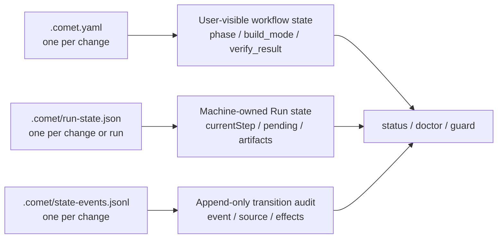

Classic uses files to preserve workflow state. Comet writes each change's stage, execution mode, and verification result into repository files. Every call to `/comet` re-reads those files instead of relying on the previous conversation. If you know which files to check and which commands to run, you can quickly judge progress and resume safely after an interruption. Project-level configuration (`.comet/config.yaml`) is covered in [Classic configuration](/en/classic/configuration).

The rest of this page uses `<classic-root>` for the current Classic OpenSpec root directory: `docs/openspec/` by default for new projects, and `openspec/` for projects that keep the legacy layout. The actual location is decided by `classic.artifact_layout`; see [Project file structure](/en/guides/project-structure).

<Warning>
  <strong>Do not hand-edit state files:</strong> state guards fail closed. In other words, when state is not trustworthy, Comet refuses to continue. Hand-editing fields usually does not "unlock" the flow. It often stalls the task or sends it down the wrong directory:

  - <code>.comet.yaml</code>'s <code>phase</code> advances only through a guard or a valid transition; a direct{' '}
    <code>comet state set &lt;name&gt; phase &lt;value&gt;</code> is hard-rejected.
  - Do not hand-edit machine-owned fields such as <code>.comet/run-state.json</code>, and do not mark an already-archived change complete by hand (archiving goes through{' '}
    <code>/comet-archive</code>).
  - If state is abnormal, first follow [State damage and recovery](/en/guides/state-recovery); do not fabricate state by hand.
</Warning>

This page has three parts. The complete field reference is in the appendix:

- **How to check current progress**: where state files live and which fields to check first.
- **Which settings require your confirmation**: what you select at workflow checkpoints and what Comet maintains automatically.
- **How to troubleshoot abnormal states**: transition history, run-state boundaries, and diagnostic command entries.

## How to check current progress

To answer "where are we and what is left", the normal path is to call `/comet` again (see [Resuming interrupted work](/en/guides/resuming-workflow)); to check by hand, run `comet status`. Both re-read the state files on disk; neither guesses from conversation history.

### State lives in three files

| File | Location | Managed by | Purpose |
| ---- | -------- | ---------- | ------- |
| `.comet.yaml` | `<classic-root>/changes/<name>/.comet.yaml` | User-visible; flows through `/comet` and the guards | Workflow state: stage, execution mode, verification result |
| `.comet/run-state.json` | `<changeDir>/.comet/` or `.comet/runs/<runId>/` | Automatically maintained by Comet | Engine Run details: `currentStep`, `pending`, `trajectory` |
| `.comet/state-events.jsonl` | `<classic-root>/changes/<name>/.comet/` | Appended by Comet; readable by users | Audit log of successful state transitions |



<p align="center">
  
</p>

<p align="center">
  <code>.comet.yaml</code> tells you where the change is, Run state lets the runtime recover, and state events explain why the state changed
</p>

### Which fields quickly tell you progress

`comet status` and `/comet` resume routing mainly use the fields below. Full types and allowed values are in the appendix.

| Field | Tells you |
| ----- | --------- |
| `phase` | Which stage the change is paused at; `/comet-classic` routes to the matching stage Skill |
| `workflow` | Whether this is a full run or a hotfix/tweak preset; it decides which defaults apply from then on |
| `verify_result` | Whether verification passed. `pass` is required before archive; `fail` sends the change back to build to fix |
| `build_pause` | Whether build is paused waiting on you. `plan-ready` = the plan is ready and you confirm it or finish choosing the execution settings |
| `branch_status` | How far the remote-delivery confirmation got. It stays `pending` through verify; you confirm an immediate push or a push with PR before archive, and archive completion writes `handled` |
| `archived` | Whether the change has been archived; an archived change is no longer resumed as an active change |

`branch_status: handled` only means you confirmed an immediate push or push-with-PR before archive and it was written back when archiving completed; it does not mean the push or PR succeeded.

### With several changes in parallel, pick the target first

`.comet/current-change.json` stores the workflow and change you explicitly selected, removing write ambiguity when multiple active changes run in parallel. It does not replace `.comet.yaml`.

```bash
comet state select <change-name>
comet state current
comet state clear-selection
```

- With a single active change, attribution can be automatic.
- With several active changes, you must explicitly `select` after entering the target change.
- When the target is archived, the selection file is damaged, or the workflow does not match, the guard fails closed (it refuses to run rather than continue on bad state).
- When `isolation` is `current`, `branch`, or `worktree`, the change is also pinned through `bound_branch` to the branch where the isolation was set up. On drift, switch back to the original branch; run `comet state rebind <change-name>` only after you explicitly confirm that the current branch should take over the change.
- Do not hand-edit `current-change.json`.

For the full commands on selecting and judging, see [comet state](/en/scripts/comet-state).

## Which settings require your confirmation

Fields in `.comet.yaml` can be grouped into two types: settings you confirm at workflow checkpoints, and runtime records maintained automatically by Comet. Do not hand-edit auto-maintained fields (see the next section).

### Choices you make at workflow checkpoints

| Field | Who chooses it and when | How to change it later |
| ----- | ----------------------- | ---------------------- |
| `language` | You pick the Skill language at project initialization, which sets the project-level `classic.language`; every new change snapshots the project default into its own `.comet.yaml` | Changing the project default or an environment variable only affects later changes, not existing ones ([Classic configuration](/en/classic/configuration)) |
| `isolation` | The workspace decision in the open stage (pause point 3): you pick `current`/`branch`/`worktree`, and all three modes require an explicit choice; the branch name is confirmed in the same decision | The choice is written into `isolation`, and the current Git branch is recorded as `bound_branch`; the build stage only checks that the directory and branch match and never silently switches directories |
| `build_mode` | The joint decision in the build stage (pause point 6): you pick `subagent-driven-development`/`executing-plans`/`direct`; hotfix/tweak presets are fixed at `direct` | `subagent-driven-development` requires `subagent_dispatch: confirmed`; `direct` in a full workflow requires `direct_override: true` |
| `tdd_mode` | The same joint decision: you pick `tdd`/`direct`; hotfix/tweak default to `direct` | `tdd` forces a failing test before every task; `direct` skips Red-Green-Refactor but still requires relevant tests and bug-regression evidence |
| `review_mode` | The same joint decision: you pick `off`/`standard`/`thorough`; full snapshots the project default `standard`, and hotfix/tweak are fixed at `off` | When an existing change is missing this field, the guard blocks and asks you to set it; how to set it and where it applies is in [Code review mechanism](/en/concepts/review-mode) |
| `context_compression` | Once the project-level `classic.context_compression` is set, new changes snapshot it as the default (`off`) | Changing the project configuration only affects new changes; adjusting a single change is covered in [Context compression mechanism](/en/concepts/context-compression) |
| `auto_transition` | Once the project-level `classic.auto_transition` is set, new changes snapshot it as the default (`true`) | Only when the change-level field is empty can the `COMET_AUTO_TRANSITION` environment variable override it temporarily; behavior and priority are in [Auto-transition](/en/concepts/auto-transition) |

Most of these fields are copied from project defaults when a change is created. If you skip a choice, the guard blocks before stage exit and routes you back to the correct decision point. You do not need to edit files manually. Recovery for missing `isolation`, `build_mode`, or `tdd_mode` in build is covered in [Resuming interrupted work](/en/guides/resuming-workflow).

### What is checked before moving to the next stage

These constraints exist in both guard layers, `comet guard` and `comet state transition`:

| Constraint | Requirement |
| ---------- | ----------- |
| Before `build → verify` | `isolation` must be `current`, `branch`, or `worktree`; all three modes validate the bound branch |
| Before `build → verify` | `build_mode` must be selected |
| `build_mode: subagent-driven-development` | Requires `subagent_dispatch: confirmed` |
| Full workflow leaves build | `tdd_mode` must be `tdd` or `direct` |
| Full workflow leaves build | `review_mode` must be `off`/`standard`/`thorough` |
| `build_mode: direct` | Allowed by default for hotfix/tweak; a full workflow requires `direct_override: true` |
| Before `verify → archive` | `verify_result` must be `pass` |
| `verify-pass` transition | Requires `verification_report` to point to an existing file; `branch_status` stays `pending` (branch handling happens inside archive) |
| The real archive command | Requires `archive_confirmation: confirmed`; reopening archive clears the old confirmation |
| Archive completion | After you confirm immediate remote delivery, archiving writes `branch_status: handled` and passes `comet guard archive`, then includes the final state in the single archive commit |
| `build_pause` | Is not an execution mode and cannot be written into `build_mode` |

<Note>
  A direct <code>comet state set &lt;name&gt; phase &lt;value&gt;</code> is hard-blocked unless{' '}
  <code>COMET_FORCE_PHASE=1</code> is set (repair only). Phases advance only through{' '}
  <code>comet guard --apply</code> or a valid transition.
</Note>

`COMET_FORCE_PHASE` is a troubleshooting-only switch; normal flows never need it. For the other environment variables, see [Classic configuration](/en/classic/configuration).

### Preset escalation goes through a valid transition only

When a hotfix/tweak hits an escalation signal (cross-module, new API, schema change, and so on), the `preset-escalate` transition upgrades it to full:

- It sets `workflow`/`classic_profile` to `full` in one go, rolls `phase` back to `design`, and clears `design_doc`.
- This is the **only legal channel** from preset to full — a direct `set phase design` is hard-blocked, and `classic_profile` is machine-owned, so `set classic_profile` is hard-blocked too.

## Fields maintained by the system

These fields are written by Comet to record runtime facts. You do not need to set them manually, and you should not force them with `comet state set`.

Common examples:

- `bound_branch`: records which branch this change is bound to, so execution does not continue on the wrong branch.
- `verify_failures`: the consecutive verification-failure count. `verify-fail` increments it, and `verify-pass` or `archive-reopen` resets it to `0`. After it reaches 3, the next failure pauses and asks you to choose a retry-limit strategy.
- `archive_confirmation`: Comet writes `pending` after verify passes; it becomes `confirmed` only after your confirmation before archive.
- `currentStep`, `pending`, `artifacts`, and `trajectory` in `.comet/run-state.json`: written automatically by the Engine runtime.

If these fields are edited manually, state can diverge from actual code and verification history. The guard will either refuse to continue or route you into recovery handling. Archiving should always go through `/comet-archive`.

## How to troubleshoot abnormal states

First distinguish two situations: interruption (session closed, context compressed, device switched) and state anomaly. For interruption, call `/comet` to resume. Use `comet status` and `comet doctor` only when `.comet.yaml` is missing or malformed, routing is wrong, or declared evidence is missing. The complete flow is in [State damage and recovery](/en/guides/state-recovery).

### Check state transition history

Classic state transitions share one set of semantics. Every successful `comet state transition`, `comet guard --apply`, and archive update appends one JSON line to:

```text
<classic-root>/changes/<name>/.comet/state-events.jsonl
```

Each record contains:

| Field | Meaning |
| ----- | ------- |
| `schemaVersion` | Log format version |
| `timestamp` | When it was written |
| `change` | The change name |
| `event` | The transition event, such as `open-complete`, `build-complete`, or `verify-pass` |
| `source` | `comet state`, `comet guard`, or `comet archive` |
| `from` / `to` | The Classic state before and after the transition |
| `effects` | The fields actually changed, e.g. `phase: build -> verify` |

Look here when you want to know why `phase` changed or what the last transition did. For the available transition events and commands, see [comet state](/en/scripts/comet-state) and [Auto-transition](/en/concepts/auto-transition).

### Distinguish workflow state and runtime details

`.comet.yaml` holds the user-understandable workflow state. Engine execution details live in `.comet/run-state.json`. The two are linked by `run_id`.

| What you want to know | Where to look |
| --------------------- | ------------- |
| Current stage and next step | `phase` in `.comet.yaml` |
| Execution mode and verification result | `build_mode` and `verify_result` in `.comet.yaml` |
| The Engine's current step and pending action | `currentStep` and `pending` in `.comet/run-state.json` |
| Why the phase changed | `.comet/state-events.jsonl` |
| Engine trajectory audit | `.comet/trajectory.jsonl` |

See [Skill and Engine (Advanced)](/en/skill-creator/engine) for details.

### Common diagnostic commands

Engine-level details (`currentStep`, `pending`, `trajectory`) are usually only needed during troubleshooting. Start with these two commands:

- `comet status` — shows an active change's `phase`, verification result, whether the declared evidence actually exists on disk (`runtime_eval`), and a hint about the next step.
- `comet doctor` — checks the installation, environment, Skill integrity, and whether each change's `.comet.yaml` is valid.

The detailed usage of both commands and common symptoms are in [State damage and recovery](/en/guides/state-recovery).

## Appendix: `.comet.yaml` field reference

Every active change includes the fields below in `.comet.yaml`. The body explains which fields you confirm and which are system-maintained. The tables here are for quick lookup of value ranges and meanings.

### Workflow and stage

| Field | Type / allowed values | Meaning |
| ----- | --------------------- | ------- |
| `workflow` | `full` \| `hotfix` \| `tweak` | The workflow preset |
| `language` | `en` \| `zh-CN` | Primary language of the artifacts. Snapshotted from `.comet/config.yaml` when the change is created; constrains OpenSpec / Superpowers / verification reports / archive notes |
| `phase` | `open` \| `design` \| `build` \| `verify` \| `archive` | The current stage. `init` sets `open`; the guards advance it |
| `auto_transition` | `true` \| `false` | Whether the next Skill is invoked automatically |

### Execution mode

| Field | Type / allowed values | Meaning |
| ----- | --------------------- | ------- |
| `build_mode` | `subagent-driven-development` \| `executing-plans` \| `direct` | The execution mode |
| `build_pause` | `null` \| `plan-ready` | Pause point inside build. `plan-ready` = the plan exists and it pauses for your choice |
| `subagent_dispatch` | `null` \| `confirmed` | Only `confirmed` allows `build_mode: subagent-driven-development` |
| `tdd_mode` | `tdd` \| `direct` | `tdd` forces a failing test before every task; `direct` skips Red-Green-Refactor but still requires relevant tests and bug-regression evidence. hotfix/tweak default to `direct` |
| `review_mode` | `off` \| `standard` \| `thorough` | Code-review intensity. See [Code review mechanism](/en/concepts/review-mode) |
| `isolation` | `current` \| `branch` \| `worktree` | Workspace isolation. All three modes need an explicit choice and bind the current Git branch where the setting command actually runs |
| `bound_branch` | Git branch name or `null` (machine-owned) | The branch bound to the current isolation mode. Entry checks and source-write guards block accidental branch drift; do not change it with `set` |
| `context_compression` | `off` \| `beta` | Snapshotted from the project configuration. See [Context compression mechanism](/en/concepts/context-compression) |

### Verification and branch

| Field | Type / allowed values | Meaning |
| ----- | --------------------- | ------- |
| `verify_mode` | `light` \| `full` | Verification depth |
| `verify_result` | `pending` \| `pass` \| `fail` | Verification result |
| `verify_failures` | Integer (machine-owned) | Consecutive verification-failure count. `verify-fail` increments it; `verify-pass` or `archive-reopen` resets it to `0`. After it reaches 3, the next failure pauses the workflow and you choose the retry-limit strategy |
| `verification_report` | Relative path | Verification report path; before verify passes it must point to an existing file |
| `branch_status` | `pending` \| `handled` | Remote-delivery confirmation state. Stays `pending` through verify; after you confirm an immediate push or a push with PR before archive, archiving writes `handled` and includes it in the single archive commit. It does not mean the push or PR succeeded |
| `verified_at` | `YYYY-MM-DD` or `null` | When verification passed |

### Path references

| Field | Type / allowed values | Meaning |
| ----- | --------------------- | ------- |
| `design_doc` | Relative path or `null` | Superpowers Design Doc path |
| `plan` | Relative path or `null` | Superpowers implementation plan path |
| `base_ref` | Git SHA string | The commit SHA when the change was created, used to assess change size |
| `direct_override` | `true` \| `false` | Must be `true` when a full workflow uses `build_mode: direct` |

### Time and archive

| Field | Type / allowed values | Meaning |
| ----- | --------------------- | ------- |
| `created_at` | `YYYY-MM-DD` | Date the change was created; `init` writes it automatically |
| `archived` | `true` \| `false` | Whether the change is archived |
| `archive_confirmation` | `null` \| `pending` \| `confirmed` | Machine-owned final confirmation; it is `pending` after verify passes and becomes `confirmed` only after you confirm |

## Continue reading

- [Classic configuration](/en/classic/configuration) — `.comet/config.yaml` fields, configuration precedence, and environment variables
- [State damage and recovery](/en/guides/state-recovery) — diagnosis and recovery with `comet status` / `comet doctor`
- [Context compression mechanism](/en/concepts/context-compression) — the `off`/`beta` modes of `context_compression`
- [Code review mechanism](/en/concepts/review-mode) — the `off`/`standard`/`thorough` modes of `review_mode`
- [Skill and Engine (Advanced)](/en/skill-creator/engine) — Run state and Engine runtime semantics
- [Classic workflow](/en/concepts/workflow) — how the five stages use these state fields
