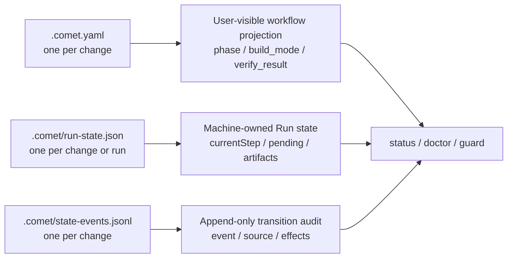

Comet's recovery model comes from file-based state. Understanding user-readable state, machine-managed runtime state, and append-only audit logs tells you what Classic reads at each phase and why a phase advances. For project-level configuration (`.comet/config.yaml`), see [Classic configuration](/en/classic/configuration).

This page uses `<classic-root>` for the configured Classic OpenSpec root: `docs/openspec/` for new projects and `openspec/` for projects that retain the legacy layout. The location is selected by `classic.artifact_layout`; see [Project file structure](/en/guides/project-structure).

## Current change selection

`.comet/current-change.json` stores the explicitly selected workflow and change. It removes write ambiguity when multiple active changes exist; it does not replace Classic `.comet.yaml`.

```bash
comet state select <change-name>
comet state current
comet state clear-selection
```

- With one active change, attribution can be automatic.
- With multiple active changes, explicitly `select` after entering the target change.
- An archived target, damaged selection file, or workflow mismatch fails closed.
- When `isolation` is `current`, `branch`, or `worktree`, the change is pinned to the branch that established the isolation through `bound_branch`. On drift, switch back to the original branch; run `comet state rebind <change-name>` only after explicitly confirming that the current branch should take over.
- Do not hand-edit `current-change.json`.

## Three state layers



<p align="center">
  
</p>

<p align="center">
  <code>.comet.yaml</code> tells you where the change is, Run state lets the runtime recover, and state events explain why the state changed
</p>

| File                        | Location                                            | Owner                                           | Purpose                                                         |
| --------------------------- | --------------------------------------------------- | ----------------------------------------------- | --------------------------------------------------------------- |
| `.comet.yaml`               | `<classic-root>/changes/<name>/.comet.yaml`         | User-visible; updated through `/comet` and Guard | Workflow projection: phase, execution mode, and verification result |
| `.comet/run-state.json`     | `<changeDir>/.comet/` or `.comet/runs/<runId>/`     | Machine-owned; written by the runtime           | Engine Run details: `currentStep`, `pending`, and trajectory     |
| `.comet/state-events.jsonl` | `<classic-root>/changes/<name>/.comet/`             | Appended by Comet; readable by users            | Audit log for successful state transitions                       |

<Warning>
  Do not hand-edit machine-owned fields in <code>.comet/run-state.json</code>, and do not mark an
  archived change complete by hand. Archive through <code>/comet-archive</code>.
</Warning>

## Change state: `.comet.yaml`

Each active OpenSpec change has one:

```text
<classic-root>/changes/<name>/.comet.yaml
```

### Workflow and phase

| Field              | Type / allowed values                              | Meaning                                                                                                          |
| ------------------ | -------------------------------------------------- | ---------------------------------------------------------------------------------------------------------------- |
| `workflow`         | `full` \| `hotfix` \| `tweak`                      | Workflow preset                                                                                                  |
| `language`         | `en` \| `zh-CN`                                    | Primary artifact language, snapshotted from `.comet/config.yaml` when the change is created                    |
| `phase`            | `open` \| `design` \| `build` \| `verify` \| `archive` | Current phase; `init` sets `open` and Guard advances it                                                        |
| `auto_transition`  | `true` \| `false`                                  | Whether the next Skill is invoked automatically                                                                   |

### Execution mode

| Field                  | Type / allowed values                                                  | Meaning                                                                                                      |
| ---------------------- | ---------------------------------------------------------------------- | ------------------------------------------------------------------------------------------------------------ |
| `build_mode`           | `subagent-driven-development` \| `executing-plans` \| `direct`       | Execution mode                                                                                               |
| `build_pause`          | `null` \| `plan-ready`                                                | Build pause point; `plan-ready` means a plan exists and the workflow waits for your choice                  |
| `subagent_dispatch`    | `null` \| `confirmed`                                                  | Only `confirmed` permits `build_mode: subagent-driven-development`                                           |
| `tdd_mode`             | `tdd` \| `direct`                                                      | `tdd` requires a failing test before each task; `direct` skips Red-Green-Refactor but still requires relevant tests and regression evidence. Hotfix and tweak default to `direct` |
| `review_mode`           | `off` \| `standard` \| `thorough`                                     | Code review strength; see [Review mode](/en/concepts/review-mode)                                            |
| `isolation`             | `current` \| `branch` \| `worktree`                                   | Workspace isolation. All three modes require an explicit choice and bind the branch where the setting command runs |
| `bound_branch`          | Git branch name or `null` (machine-owned)                              | Branch bound to the isolation mode. Entry checks and source-write guards block accidental drift; do not change it with `set` |
| `context_compression`   | `off` \| `beta`                                                        | Snapshotted from project configuration; see [Context compression](/en/concepts/context-compression)            |

### Verification and branch

| Field                  | Type / allowed values       | Meaning                                                                                                                                                              |
| ---------------------- | -------------------------- | -------------------------------------------------------------------------------------------------------------------------------------------------------------------- |
| `verify_mode`          | `light` \| `full`           | Verification depth                                                                                                                                                   |
| `verify_result`        | `pending` \| `pass` \| `fail` | Verification result                                                                                                                                                  |
| `verify_failures`      | Integer (machine-owned)    | Consecutive verification failure count. `verify-fail` increments it; `verify-pass` or `archive-reopen` resets it to `0`. After the count reaches 3, the next failure pauses the workflow and you choose the retry-limit strategy |
| `verification_report`  | Relative path              | Verification report path; before Verify passes, it must point to an existing file                                                                                   |
| `branch_status`        | `pending` \| `handled`      | Remote-delivery confirmation. It stays `pending` through Verify. After you confirm an immediate push or push plus PR before Archive, Archive writes `handled` in the single archive commit. It does not mean the push or PR succeeded |
| `verified_at`          | `YYYY-MM-DD` or `null`      | Date of the successful verification                                                                                                                                  |

### Path references

| Field             | Type               | Meaning                                      |
| ----------------- | ------------------ | -------------------------------------------- |
| `design_doc`      | Relative path or `null` | Superpowers Design Doc path                  |
| `plan`            | Relative path or `null` | Superpowers implementation plan path         |
| `base_ref`        | Git SHA string     | Commit SHA when the change was created, used to assess change size |
| `direct_override` | `true` \| `false`   | Required when a full workflow uses `build_mode: direct` |

### Time and Archive

| Field                   | Type / allowed values                      | Meaning                                                                                         |
| ----------------------- | ------------------------------------------ | ----------------------------------------------------------------------------------------------- |
| `created_at`            | `YYYY-MM-DD`                               | Date the change was created; written by `init`                                                   |
| `archived`              | `true` \| `false`                          | Whether the change is archived                                                                    |
| `archive_confirmation`  | `null` \| `pending` \| `confirmed`         | Machine-owned final confirmation; Verify pass sets `pending`, and your confirmation sets `confirmed` |

### Machine-managed fields

Comet writes these fields automatically. They are not part of the user-facing field reference. In source code they are called machine wire keys, but they fall into two groups based on whether `comet state set` may modify them:

| Field                | Meaning                           | Can `set` modify it?                                      |
| -------------------- | --------------------------------- | --------------------------------------------------------- |
| `handoff_context`    | Design handoff context file path  | Yes; machine-written but can be overridden by `set`       |
| `handoff_hash`       | Handoff context hash               | Yes; machine-written but can be overridden by `set`       |
| `classic_profile`    | Set only by the state machine; equals `workflow` | **No**; machine-owned                              |
| `classic_migration`  | Classic migration version, currently `1` | **No**; machine-owned                                  |
| `run_id`             | Link to Engine Run state           | **No**; machine-owned                                     |

`classic_profile`, `classic_migration`, and `run_id` are machine-owned. `set` rejects them with `is a machine-owned Run field and cannot be set directly`. State transitions and Archive write them, for example `preset-escalate` atomically changes `classic_profile` to `full`.

<Warning>
  <code>build_command</code> and <code>verify_command</code> have been removed. The build Guard
  detects npm, Maven, or Cargo commands. When it cannot infer an entrypoint, run the real command
  and record it with{' '}
  <code>
    comet state record-check &lt;change&gt; &lt;build|verify&gt; --command "..." --exit-code 0
  </code>
  . Recorded evidence cannot replace actual execution.
</Warning>

## State-machine constraints

These constraints exist in both `comet guard` and `comet state transition`:

| Constraint                              | Requirement                                                                                                               |
| --------------------------------------- | -------------------------------------------------------------------------------------------------------------------------- |
| Before `build -> verify`                | `isolation` must be `current`, `branch`, or `worktree`; all three modes validate the bound branch                       |
| Before `build -> verify`                | `build_mode` must be selected                                                                                              |
| `build_mode: subagent-driven-development` | Requires `subagent_dispatch: confirmed`                                                                                   |
| Full workflow leaving Build             | `tdd_mode` must be `tdd` or `direct`                                                                                       |
| Full workflow leaving Build             | `review_mode` must be `off`, `standard`, or `thorough`                                                                     |
| `build_mode: direct`                    | Allowed by default for hotfix and tweak; full requires `direct_override: true`                                           |
| Before `verify -> archive`              | `verify_result` must be `pass`                                                                                             |
| `verify-pass` transition                | Requires `verification_report` to point to an existing file; `branch_status` remains `pending`                            |
| Actual Archive command                  | Requires `archive_confirmation: confirmed`; reopening Archive clears the old confirmation                                |
| Archive completion                      | After you confirm immediate remote delivery, Archive writes `branch_status: handled`, runs `comet guard archive`, and includes the final state in the single archive commit |
| `build_pause`                            | Is not an execution mode and cannot be written into `build_mode`                                                          |

<Note>
  Direct <code>comet state set &lt;name&gt; phase &lt;value&gt;</code> is blocked unless{' '}
  <code>COMET_FORCE_PHASE=1</code> is set for repair. Advance phases only through{' '}
  <code>comet guard --apply</code> or a valid transition.
</Note>

### Preset escalation

When a hotfix or tweak hits an escalation signal such as a cross-module change, new API, or schema change, `preset-escalate` upgrades it to full:

- It atomically sets `workflow` and `classic_profile` to `full`, resets `phase` to `design`, and clears `design_doc`.
- This is the only legal preset-to-full route. Directly setting `phase` to `design` is blocked, and `classic_profile` is machine-owned.

## State-transition audit log

Classic transitions share one audit format. Successful `comet state transition`, `comet guard --apply`, and Archive updates append one JSON line to:

```text
<classic-root>/changes/<name>/.comet/state-events.jsonl
```

Each record contains:

| Field          | Meaning                                                        |
| -------------- | -------------------------------------------------------------- |
| `schemaVersion` | Log format version                                             |
| `timestamp`    | Write time                                                     |
| `change`       | Change name                                                    |
| `event`        | Transition event such as `open-complete`, `build-complete`, or `verify-pass` |
| `source`       | `comet state`, `comet guard`, or `comet archive`               |
| `from` / `to`  | Classic state projection before and after the transition       |
| `effects`      | Fields actually changed, such as `phase: build -> verify`     |

## Boundary between workflow state and Run state

`.comet.yaml` stores the user-understandable workflow projection. Engine execution details live in `.comet/run-state.json`; the two are linked by `run_id`.

| What you want to know                 | Where to look                                               |
| ------------------------------------- | ------------------------------------------------------------ |
| Current phase and next step           | `phase` in `.comet.yaml`                                     |
| Execution mode and verification result | `build_mode` and `verify_result` in `.comet.yaml`          |
| Current Engine step and pending action | `currentStep` and `pending` in `.comet/run-state.json`      |
| Why the phase changed                 | `.comet/state-events.jsonl`                                  |
| Engine trajectory audit               | `.comet/trajectory.jsonl`                                    |

See [Skill and Engine](/en/skill-creator/engine) for the Runtime semantics.

## Next steps

- [Classic configuration](/en/classic/configuration) — `.comet/config.yaml` fields, configuration precedence, and environment variables
- [Context compression](/en/concepts/context-compression) — the `off` and `beta` `context_compression` modes
- [Review mode](/en/concepts/review-mode) — the `off`, `standard`, and `thorough` `review_mode` modes
- [Skill and Engine](/en/skill-creator/engine) — Run state and Engine runtime semantics
- [Workflow concepts](/en/concepts/workflow) — how the five phases use these state fields
