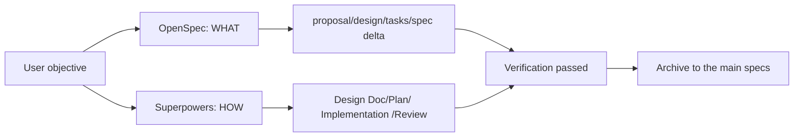
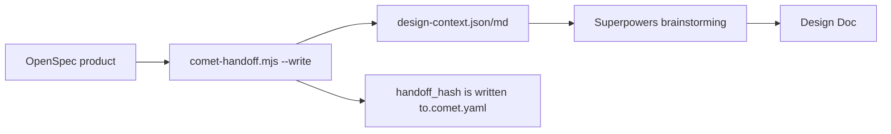
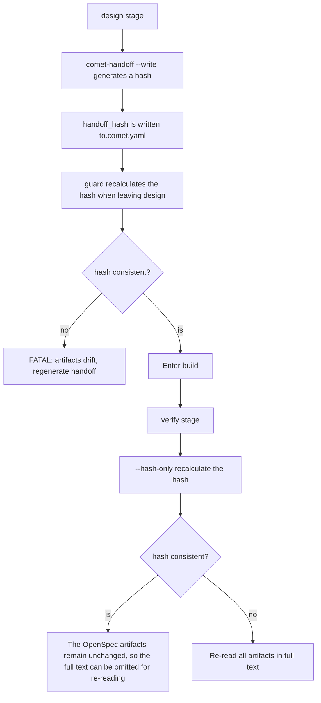
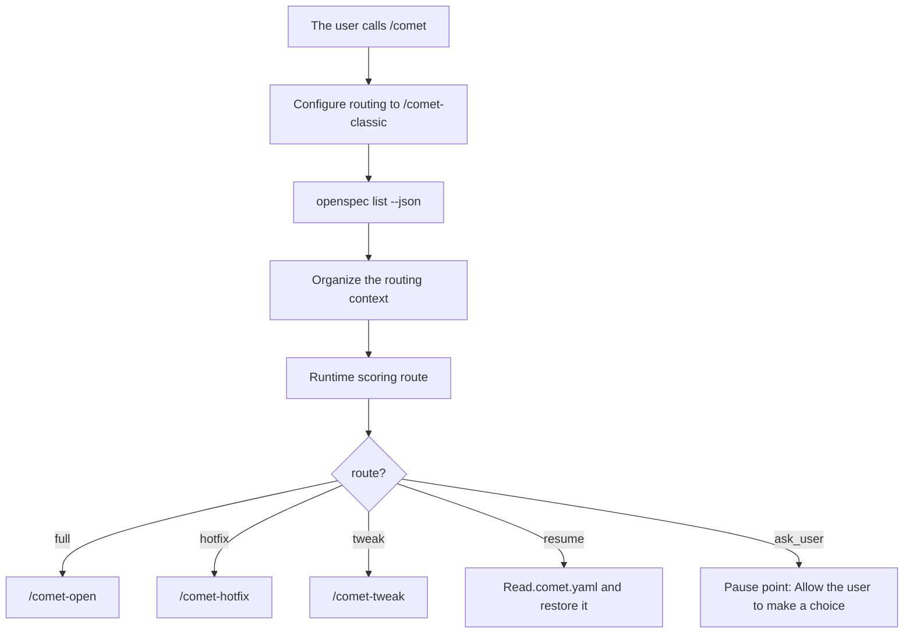

Users normally only need to call `/comet`. It reads `.comet/config.yaml` and deterministically enters Native or Classic according to the project configuration. When the configuration is selected as Classic, it is internally forwarded to the permanent entry `/comet-classic`, and then Classic splits one change into five stages: open, design, build, verify, and archive. The changes, states and products of the two sets of workflows are independent of each other.

Classic connects OpenSpec and Superpowers into a recoverable workflow. `/comet-classic` comes with intent recognition. It reads the active change, `.comet.yaml`, and the actual file status to determine whether to create a new file, restore it, enter the lightweight preset, or call the current stage Skill. Users do not need to first determine whether they are in open, design, build, verify or archive.

The following text uses `<classic-root>` to represent the current Classic OpenSpec root directory: The default for new projects is `docs/openspec/`, and for projects that retain the old layout, it is `openspec/`. The actual location is determined by `classic.artifact_layout`. For details, please refer to [Project File structure ](/en/guides/project-structure)

Classic is mainly compatible with the model capability profiles of Fable 5 and GPT-5.6 and below. For this type of model, clear Spec, design, planning, TDD, debugging and review phases can reduce omissions and process drift. The existing real baseline evaluations of Comet have verified that this constraint can maintain good task coverage and completion results on lower capability level models. Fable 5, GPT-5.6 and similar strong models are usually more suitable for using the [Native workflow ](/en/concepts/native-workflow)] with lighter execution methods

## Which ones are worth noting

|What is it that needs to be cared about|Conclusion|
| ---------------- | ------------------------------------------------------ |
|User entry|Use `/comet`; The project configuration determines whether to enter Classic or Native|
|Internal entrance of Classic|`/comet-classic` is responsible for intent recognition, file status reading and stage routing|
|Applicable model|Fable 5, models below GPT-5.6 that require more detailed steps and process constraints|
|Process| `open` → `design` → `build` → `verify` → `archive`     |
|When will you participate|Requirements, design, execution mode, verification failure, pre-archiving confirmation|
|What does recovery rely on?|OpenSpec products, `.comet.yaml` and runtime evidence|
|Which are the advanced details|handoff hash, archive directory, route judgment, read again during troubleshooting|

**Write permissions**: by default, writes inside the project but outside artifact roots remain subject to the Classic phase guard. If an implementation directory must stay writable in every phase, configure shared `hook.allow_paths` in `.comet/config.yaml`. See [Classic configuration · Allowing Hook writes](/en/classic/configuration#allowing-hook-writes).

## Why connect OpenSpec with Superpowers

OpenSpec and Superpowers each have their own strengths, but when used separately, they both have their shortcomings:

|Tools|"Good at|Weak point|
| ----------- | ----------------------------------------------------- | ----------------------------------------------------------------------- |
| OpenSpec    |WHAT - Requirements, Proposals, spec Lifecycle, delta spec, Archiving|The proposals and tasks lack detailed in-depth design|
| Superpowers |HOW - brainstorming, technical design, planning, execution, closure, verification|Due to the lack of stateful design, after the spec is completed, it can only be checked. When the Agent resumes, it is easy to repeatedly review the documentation and code|



<p align="center">
  
</p>

<p align="center">OpenSpec records WHAT, Superpowers organizes HOW, Comet clips both onto the same recoverable link </p>

Comet is responsible for organizing OpenSpec and Superpowers into a recoverable delivery chain:

- Align the products of both onto the same chain - the WHAT recorded by OpenSpec and the HOW organized by Superpowers point to the same change.
- ** Ensure reliable handover with state machines and guards ** - Do not let the Agent guess the progress based on the conversation history, but restore it from the file status and verifiable evidence.
- ** Automate document synchronization ** - Incorporate handoff, status updates, verification, and archiving into the script process to reduce repetitive reminders such as "Remember to update the design document", "remember to synchronize the spec", and" remember to archive ".

## Five stages

|"Stage|Responsible party|Objective|Main products|
| ------- | ----------- | ----------------------------------------------- | ------------------------------------------------------------------------------------------ |
| open    | OpenSpec    |Turn the idea into OpenSpec change| `proposal.md`、`design.md`、`tasks.md`、delta spec                                         |
| design  | Superpowers |Conduct in-depth technical design|`docs/superpowers/specs/...-design.md`, handoff bag|
| build   | Superpowers |Write a plan and execute it|`docs/superpowers/plans/...md`, code changes, test evidence|
| verify  |Both sides|Verify that the implementation complies with the design and spec|Verification report; `branch_status` keep `pending`|
| archive | OpenSpec    |Merge the delta spec and archive it, and label the Superpowers document|`<classic-root>/changes/archive/YYYY-MM-DD-name/`, `archived-with` annotations in design doc/plan|

### Open-openspec records WHAT

`/comet-open` creates an OpenSpec change and outputs:

<Tree>
  <Tree.Folder name="<classic-root>/changes/<name>/" defaultOpen>
    <Tree.File name=".openspec.yaml" />
    <Tree.File name=".comet.yaml" />
    <Tree.File name="proposal.md" />
    <Tree.File name="design.md" />
    <Tree.File name="tasks.md" />
    <Tree.Folder name="specs/<capability>/">
      <Tree.File name="spec.md" />
    </Tree.Folder>
  </Tree.Folder>
</Tree>

Comet will generate proposals, designs, and tasks one by one using the OpenSpec `openspec instructions` process, and adhere to the project's `template`, `instruction`, `dependencies`, and `resolvedOutputPath`. The complete workflow prohibits batch one-shot proposal generation and also prohibits skipping brainstorming.

<Warning>
change must be created using `/comet-open`. Prohibit the use of `/opsx:new`: It only creates OpenSpec
artifacts will not create `.comet.yaml`, and changes will fall outside the Comet state machine.
</Warning>

### design - Superpowers In-depth design, OpenSpec maintains authority

This is the stage of physical connection between the two sets of tools. Comet uses `comet-handoff.mjs` to generate a handover package, which includes the OpenSpec artifacts of the open phase (the requirement motivation of `proposal.md`, the high-level solution of `design.md`, and the task boundary of `tasks.md`). And organize the delta spec in `specs/<capability>/spec.md` into a context that Superpowers can understand, and then hand it over to Superpowers `brainstorming` for in-depth design.



The frontmatter of Design Doc explicitly states that OpenSpec is the authoritative source:

```yaml
---
comet_change: <name>
role: technical-design
canonical_spec: openspec # OpenSpec is authoritative, not Design Doc
---
```

Key constraint: ** The Agent cannot write a second requirements spec**. If the delta spec lacks acceptance scenarios, only the Spec Patch (write-back) can be written on `specs/*/spec.md`, and the scope cannot be expanded.

The Spec Patch is the only legal channel for writing the requirement gap back to OpenSpec in the design stage. It has three hard boundaries:

- ** Only addition or correction can be done ** - Supplement acceptance scenarios, correct ambiguous descriptions, supplement boundary conditions; The structure or scope of the delta spec cannot be rewritten.
- ** Only write back OpenSpec** -- Write the Spec Patch back to `specs/*/spec.md` without entering the Design Doc. Design Doc only records HOW, while OpenSpec is always the sole authority on WHAT.
- ** After writing, handoff must be regenerated ** -- If the content of the delta spec changes, the hash will inevitably drift. When leaving the design stage, the guard will be FATAL.

If the changes exceed the boundaries of the Spec Patch (interface changes, new components, data flow changes, new capabilities), it is a major change at the design level: either return the current change to brainstorming for re-alignment or start a new change. The practical scenarios and specific operations of this type of "mid-process spec modification" can be found in [Mid-process spec Modification or Rollback workflow ](/en/guides/mid-workflow-changes)

### build - Superpowers execution, taking the OpenSpec task boundary as input

It is planned to be generated by a sub-agent loading Superpowers `writing-plans`, and its frontmatter is an explicit link between the two worlds:

```yaml
---
change: <openspec-change-name>
design-doc: docs/superpowers/specs/YYYY-MM-DD-<topic>-design.md
base-ref: < git HEAD before implementation >
---
```

The planned input is Design Doc (Superpowers) + `tasks.md` (OpenSpec task boundary). The Design Doc has digested the proposal, the original design, and the delta spec in the design stage, so there is no need to read back these original artifacts in the build stage. `tasks.md` is used as a live document to continuously check the task boundaries. The execution mode is selected by the user: `subagent-driven-development` or `executing-plans`, in conjunction with `isolation` (branch/worktree), `tdd_mode`, and `review_mode`.

### verify - Check both parties and use hash to detect drift

verify will load Superpowers `verification-before-completion`, and then press the `verify_mode` branch:

- **light** (6 checks) : Task completion, diff comparison, build, Test, Security, lightweight code review. Skip spec coverage, Design Doc consistency and drift checks.
- **full** : Load `openspec-verify-change` additionally, and simultaneously check OpenSpec `design.md` and Superpowers design doc, including "delta spec and design doc are not contradictory ".

## The Skill used in the classic mode

The five-stage process is driven by these built-in skills (`comet init` installed in the platform directory) :

| Skill                            |Function|
| -------------------------------- | ---------------------------------------- |
| `/comet-classic`                 |The Classic main entry detects the status and routes to the current stage|
| `/comet-open`                    |open phase: Create OpenSpec change|
| `/comet-design`                  |design stage: In-depth technical design|
| `/comet-build`                   |build phase: Plan and execute|
| `/comet-verify`                  |verify stage: Verify the implementation|
| `/comet-archive`                 |archive stage: Filing|
| `/comet-hotfix` / `/comet-tweak` |Lightweight preset|

These skills are distributed along with the Comet package, and the Classic initialization will be installed in the platform directory. Normally, only `/comet` needs to be called; After the configuration is selected as Classic, the internal `/comet-classic` will detect the status and invoke the corresponding stage Skill.

## How to hand over the product: handoff hash

Comet uses a "handoff hash" to bind OpenSpec artifacts and subsequent stages together, which is the core mechanism of its reliability.

### How is hash calculated?

`comet-handoff.mjs` calculates the content hash for these files:

```text
<classic-root>/changes/<name>/proposal.md
<classic-root>/changes/<name>/design.md
<classic-root>/changes/<name>/tasks.md
<classic-root>/changes/<name>/specs/<capability>/spec. The md # each delta spec
```

For each file, calculate the per-file sha256 first, then combine "relative path + per-file sha256" to calculate the final sha256, and obtain `handoff_hash`. The path should uniformly use a forward slash to ensure that the hash input bytes of macOS/Linux/Windows are consistent.

### The role of hash at each stage



|"Stage|The Role of hash|
| -------------------- | -------------------------------------------------------------------------------------------------- |
| design               |Generate a hash and write the `handoff_hash` and `handoff_context` of `.comet.yaml`|
|guard (Leaving design|Recalculate the hash. If it does not match the recorded one, it will be FATAL and prompt to regenerate handoff|
| verify               |Quickly recalculate with `--hash-only`. If the hash is consistent, it indicates that the OpenSpec artifacts have not changed, and the full text can be omitted for re-reading. If there is any inconsistency, re-read the entire text|

<p align="center">
  
</p>

<p align="center">handoff hash acts like a reliable clip, binding the evidence of the previous and subsequent stages together. </p>

### handoff packet format

The output of `comet-handoff.mjs ... --write` under `<classic-root>/changes/<name>/.comet/handoff/`:

|"Mode"|Output file|"Content|
| -------------- | ------------------------------------------- | ----------------------------------------------------------------------- |
|`off` (Default)| `design-context.json` + `design-context.md` |Complete artifacts content, each file with SHA256|
|`beta` (Compressed)| `spec-context.json` + `spec-context.md`     |The verbatim projection of the spec file and the supporting file only store hash, saving approximately 25-30% of tokens|

JSON contains arrays of `change`, `phase`, `mode`, `canonical_spec: openspec`, `context_hash` and `files`. guard will additionally verify that the markdown package contains the `Generated-by:` tag and the `Source:`/`SHA256:` reference for each file to ensure that the context of Superpowers consumption is traceable.

<Tip>
The beta compression mode is the embodiment of Comet's context compression beta function in the handoff phase - the principles and tokens of the two modes
For the calculation of savings and when to open beta, see [Context Compression mechanism ](/en/concepts/context-compression)
</Tip>

## How to handle the spec range

Comet does not perform spec deduplication or overlap detection. The way it handles the spec range issue is by the delta spec lifecycle + delegating OpenSpec merging when archiving.

<Tip>
Large-scale PRD splitting is an independent feature developed by Comet to closely meet real-world demands - breaking down a large requirement into multiple ones that can be independently designed, delivered, and archived
"change. For details, please refer to [Large PRD Split ](/en/guides/prd-splitting)
</Tip>

### delta spec semantics

Delta spec `ADDED`/`MODIFIED` `REMOVED`/`RENAMED` is ** ** OpenSpec native concept, not invented by a Comet. Comet consumes but does not rewrite these semantics:

- In the open phase, a delta spec is created to describe which capabilities are added, deleted or modified in this change.
- During the build phase, treat the delta spec as a "living document" - make minor revisions directly, re-brainstorm for medium revisions, and create new changes through `/comet-open` for major revisions.
- Archive stage by `ADDED` by OpenSpec CLI/`MODIFIED`/`REMOVED`/`RENAMED` semantic merge delta to the main spec.

### verify's spec drift decision

During the build phase, minor modifications to the delta spec (such as supplementary acceptance scenarios, boundary conditions, etc.) are allowed, and these changes do not necessarily have to be synchronized back to the Design Doc. During the verify stage, the delta spec and the Design Doc will be checked together - if it is found that there is content in the delta spec but not reflected in the Design Doc (i.e., spec drift), ** this is a blocking point that requires you to make a decision ** Comet does not automatically select. It will pause and wait for you to choose one of the three options:

|Options|Applicable scenarios|What to do|After|
| ---- | -------------------------------------- | ------------------------------------------------------------------------------ | ------------------------------------------------------------------- |
| A    |The deviation is reasonable but the Design Doc was omitted. I'd like to leave an explanation|Add the "Implementation Divergence" section in the Design Doc to record the reasons for the divergence|Continue the verification and no longer trigger the change attribution|
| B    |The deviation is quite large and the design has not kept up|`verify-fail` go back to build, load `brainstorming` and realign the Design Doc and delta spec|After the repair, go back to build→verify|
| C    |The deviation is acceptable and there is no need to supplement the Design Doc|Confirm acceptance and continue verification|When archiving, the Design Doc automatically marks `superseded-by-main-spec` to give way to the master spec|

Judgment criteria: Deviation is A ** illustrative issue ** (omitted in the Design Doc, but the implementation is fine). Choose A; It is a ** Design issue ** (Design Doc cannot keep up with reality). Choose B; The deviation is insignificant and not worth going back to make up for. Choose C.

## How to file

The archive phase closes the entire spec lifecycle. `comet-archive.mjs` is the deterministic entry point for archiving, but it delegates the merging of delta→ master spec to the OpenSpec CLI and performs the pre - and post-verification itself.

### Archiving process

```mermaid
flowchart TD
  A["Finally confirm the decision point"] --> Confirm filing B"comet-archive.mjs"]
  A -->|Needs to be adjusted| C["archive-reopen back to verify"]
  B --> D["Check the entry status: phase=archive, verify_result=pass"]
  D --> E["Check that the archiving goals do not conflict"]
  E --> F["Write the pending action checkpoint"]
  F --> G["openspec archive --yes merge delta into the main spec"]
  G --> H["Verify that the master spec has no residual delta headers"]
  H --> I["Mark the archived-with of the design doc and plan"]
  I --> J["Set archived: true to move the directory"]
```

Step by step: `comet-archive.mjs`

1. ** Verify the change name ** (kebab-case).
2. Locate the "change" directory. If it has been removed from a previous archive, scan the "Archive" directory to restore it.
3. ** Verify the entry status ** : `phase` must be `archive`, and `verify_result` must be `pass`.
4. ** Check Archive target availability ** : `<classic-root>/changes/archive/YYYY-MM-DD-<name>` cannot exist.
5. ** Write pending action checkpoint** to support recovery after archive interruption.
6. ** Call OpenSpec archive** : `openspec archive <change> --yes`. This step actually executes delta→ Master spec merge and move the change directory.
7. ** Parse Archive Directory ** : Reposition the actual location where OpenSpec is placed (the date prefix may change).
8. ** Verify that the master spec is clean ** : Scan `<classic-root>/specs/*/spec.md`. If there are residual delta-only titles like `## ADDED/MODIFIED/REMOVED/RENAMED Requirements`, it is a FATAL.
9. ** Marking Superpowers Document frontmatter** : Write `archived-with: <archiveName>` in the frontmatter of design doc and plan to anchor the Superpowers product to the specific archive directory; The addition of "`status: final`" in "design doc" indicates the end of the design document lifecycle. Idempotent design: For existing annotations, the old values of `archived-with:` will be removed first and then rewritten. In this way, when the Agent retrieves the Design Doc/Plan after archiving, it can directly know from frontmatter which archive it belongs to and whether it has been closed, without having to reverse check `.comet.yaml`.
10. ** Update archive status ** : Set `archived: true`, change the Run status to `completed`, and clear the pending action.

### Archived directory structure

```text
<classic-root>/changes/archive/YYYY-MM-DD-<change-name>/
```

The date is set to UTC (`new Date().toISOString().slice(0,10)`) to ensure consistency across time zones.

<Warning>
After successful archiving, do not run `comet-guard <name> archive` anymore - the active directory no longer exists and the guard will report an error. The integrity of the archive is determined by the exit code and the status of the archive directory.
</Warning>

### Preview

`comet-archive.mjs ... --dry-run` can preview the archiving process without actually executing OpenSpec. Use the `[DRY-RUN]` tag to mark and report how many steps will succeed.

## How does Classic determine the current entry point

Each time the user calls `/comet` and enters Classic from the project configuration, `/comet-classic` will re-read the active change and `.comet.yaml`. It will organize the user's original words, the active change list and the risk signals into a structured routing context (with the implementation type named `CometIntentFrame`), and then hand it over to the runtime score to obtain the final route. Routing is therefore based on the current file status and structured evidence.

From the user's perspective, you only need to know these results:

| route          |When will it appear?|Next step|
| -------------- | -------------------------------------------------------------------- | ----------------------------------------- |
| `full`         |New capabilities, public apis, schemas, cross-module or architecture changes|Enter `/comet-open`|
| `hotfix`       |Fix existing anomalies, regressions, or erroneous behaviors without adding new capabilities/apis/schemas/cross-module risks|Enter `/comet-hotfix`|
| `tweak`        |Light to moderate modifications to copywriting, configuration, documentation, prompts, or a single OpenSpec change|Enter `/comet-tweak`|
| `resume`       |The user explicitly continues a certain active change|Read the `.comet.yaml` of this change and resume the phase|
| `ask_user`     |Insufficient confidence, multiple active changes, lack of evidence, or conflicts between the user's explicit path and risk signals|Pause to make your choice|
| `out_of_scope` |You are merely asking a question and have not requested to start or resume the workflow|Do not initialize change|



The routing context makes the routing explainable. When the evidence is insufficient to confirm path safety, Comet will pause and ask you to confirm `hotfix`, `tweak` or `full`.

## Where will users participate

Comet will automatically advance to an unambiguous stage and hand over product or risk decisions to you. Common blocking points include:

- In the open phase, Proposals, Designs, and tasks are confirmed. (For large-scale requirements, PRD splitting may also be encountered. See [Large-scale PRD splitting ](/en/guides/prd-splitting)).
- In the design stage, confirm the plan and whether to write a Spec Patch.
- In the build stage, select the isolation mode and the execution mode.
- After the verify fails, choose to fix or accept the bias (A/B/C).
- Make the final confirmation before archiving.
- When hotfix/tweak hits the upgrade signal, choose to continue the lightweight path or upgrade to full.

## Lightweight preset

Both `/comet-hotfix` and `/comet-tweak` skip the full brainstorming process, but still retain the OpenSpec status, verification, and archiving. Their positioning is different:

- **`/comet-hotfix`** is suitable for quick bug fixes without the need for Design Doc.
- **`/comet-tweak`** is suitable for lightweight updates in the OpenSpec chain - configuration adjustments, document or prompt optimization, as well as moderate changes to spec drivers (including delta spec). In the tweak, delta spec is a first-class product. Simply stating that "delta spec is needed" does not constitute a reason for upgrading.

Common premise: Changes can be accommodated in a single OpenSpec change without the need for in-depth Superpowers design. Once there are qualitative change signals such as cross-module/cross-layer coordination, new public apis, schema changes, or deep architecture issues, it should be upgraded to full (for the upgrade path, see [Mid-process modification of spec or Rollback of workflow ](/en/guides/mid-workflow-changes)]).

## Next step

- Large-scale PRD splitting ](/en/guides/prd-splitting) - Breaking down large demands into multiple independently deliverable changes
- Status Management ](/en/concepts/state-management) - Understand the `.comet.yaml` fields and status guards
- [comet skill](/en/cli/skill) - Install, View and Debug Project skills
- comet-handoff](/en/scripts/comet-handoff) - Script details for handing over packages and Hashes
- comet-archive](/en/scripts/comet-archive) - Complete Description of the archiving script
