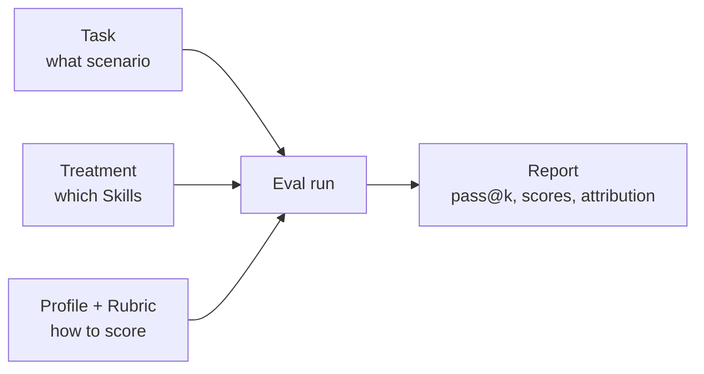

`comet eval` can evaluate built-in tasks and any local Skill out of the box. When you want to measure a Skill against your own scenario, define a custom task.

<Info>
  If you have not run evals yet, start with [Eval quickstart](/en/eval/quickstart). This page assumes `comet eval --collect` already works.
</Info>

## Eval configuration at a glance

A full eval run combines three inputs:

<p align="center">
  
</p>

<p align="center">Task decides what to test, Treatment decides what to inject, and Profile/Rubric decides how to score it.</p>



| Config | Question answered | Location |
| --- | --- | --- |
| **Task** | What scenario is being tested? What artifacts must exist? How is success validated? | `local/tasks/<name>/` |
| **Treatment** | Which Skills are injected for this run? | `local/treatments/` |
| **Profile + Rubric** | Which scoring dimensions apply? | `[evaluation]` in `task.toml` |

## Define a Task

A task lives under `local/tasks/` and has four files:

```text
local/tasks/my-task/
├── task.toml
├── instruction.md
├── environment/
│   └── Dockerfile
└── validation/
    └── test_my_task.py
```

### task.toml

```toml
[metadata]
name = "my-task"
description = "Create a markdown result file"
difficulty = "medium"
category = "generic"
default_treatments = ["CONTROL"]

[environment]
description = "Validation environment"
dockerfile = "environment/Dockerfile"
timeout_sec = 600

[validation]
test_scripts = ["test_my_task.py"]
target_artifacts = ["result.md"]
timeout = 120

[evaluation]
profile = "generic"
expected_artifacts = ["result.md"]
required_skills = ["my-skill"]
require_skill_invocation = true
rubric_criteria = [
  "Output includes error handling",
  "Code follows project naming conventions",
]

[interaction]
mode = "none"
max_turns = 12
```

| Block | Purpose |
| --- | --- |
| `[metadata]` | Identity, category, difficulty, default treatments. |
| `[environment]` | Docker validation environment. |
| `[validation]` | Scripts and target artifacts used to decide pass/fail. |
| `[evaluation]` | Profile, required Skill calls, expected artifacts, custom criteria. |
| `[interaction]` | Single-turn or simulated multi-turn mode. |

<Warning>
  `require_skill_invocation = true` is useful but strict. It requires a real Skill invocation from the event trace. If the Skill name is wrong or not injected, every run fails.
</Warning>

### instruction.md

This is the prompt given to the subject agent. It can use template variables such as `{run_id}`.

### Validation script

Validation runs inside Docker and writes `_test_results.json`. A run passes when the failed list is empty.

### Dockerfile

The Dockerfile provides the validation runtime and dependencies. Keep it minimal and deterministic.

## Configure Treatment

Treatment answers “which Skills are injected?”

```yaml
CONTROL:
  description: "No-Skill baseline"
  skills: []
```

Compare `CONTROL` against your Skill treatment to measure the value added by the Skill.

## Choose a Profile

| Profile | Best for | Dimensions | Interaction |
| --- | --- | --- | --- |
| `generic` | Any generic Skill smoke test | 7 | `none` |
| `comet-workflow` | Classic `/comet` workflow | 9 | `auto_user` |
| `authoring-skill` | `/comet-any` generated packages | 11 | `auto_user` |

Profile resolution order is command line -> manifest -> task config -> `generic`.

## auto_user mode

Workflow Skills need decisions. `auto_user` runs two agents: the subject agent and a user simulator. The simulator replies at decision points until the run completes or hits `max_turns`.

## Run a custom eval

```bash
comet eval --task my-task --collect
comet eval --task my-task --treatment MY_SKILL --html
```

Then inspect the generated summary report, `pass@1`, `pass^k`, dimension scores, and failure attribution.

## Evaluate a generated Skill

`/comet-any` packages include `comet/eval.yaml`:

```bash
comet eval ./generated-skill/comet/eval.yaml --collect
comet eval ./generated-skill/comet/eval.yaml --html
```

The manifest selects the `authoring-skill` profile and recommended tasks.

## Next steps

- [Scoring metrics and dual-agent evaluation](/en/eval/scoring)
- [Eval overview](/en/eval/overview)
- [comet eval command](/en/cli/eval)
