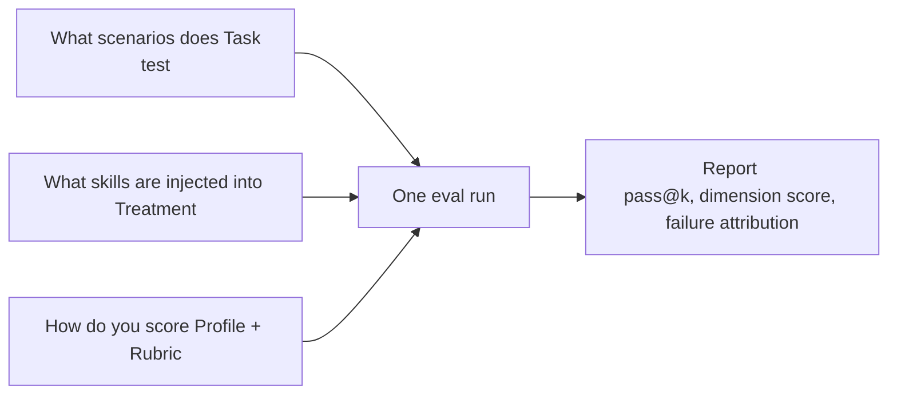
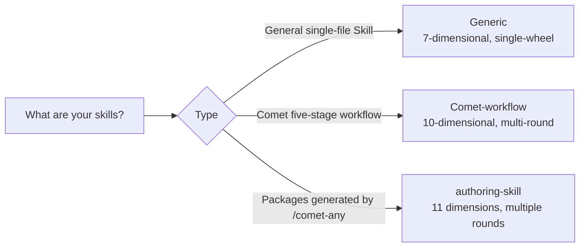
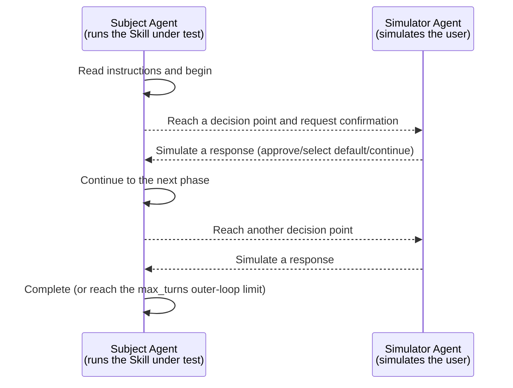

`comet eval` evaluates built-in tasks and local Skills. Define a custom task when your scenario needs fixed instructions, an environment, or validation scripts. This page explains how to configure the task, treatment, profile, and interaction mode.

<Info>
This article is advanced custom content. If you just want to evaluate an existing Skill, there's no need to read this article - just use {" "}
<code>comet eval./your-skill --html</code> is fine. This article assumes that you have already been able to run {" "} successfully
  <code>comet eval ./your-skill --collect</code>。
</Info>

<Warning>
The `eval/local/tasks/`, pytest, Dockerfile and registration process on this page are advanced content for source code/maintainers and are required
A complete reproduction is required by pulling the Comet source code. Ordinary users only need to write "inline" in their own `comet/eval.yaml`
task, or directly run `comet eval` in [Quick Start ](/en/eval/quickstart)]
</Warning>

## How do you read this page

Custom eval can be understood in three layers. In most scenarios, the Task is completed first, and then the Profile or Treatment is adjusted as needed.

|Hierarchy|What are you going to decide|Compulsory reading level|
| ------------- | ---------------------------------------------------- | -------- |
| **Task**      |What to test, what instructions to give to the Agent, and what script to use to determine pass|Must-read|
| **Profile**   |Score by generic, comet-workflow or authoring skill|Commonly used|
| **Treatment** |Whether to conduct an A/B comparison and whether to add a no-skill baseline|Advanced|

If you only want to add stable acceptance conditions to the local Skill, it is preferred to declare inline tasks in `comet/eval.yaml` of the Skill package, or use `source` to reference the tasks within the Skill package. Run `--collect` first, then `--html`. Only when it is necessary to expand the built-in harness of the Comet repository, is it necessary to create a task directory and register it to `index.yaml`. Profile, Treatment and `auto_user` can all be adjusted after the first version of the task runs smoothly.

## Eval configuration structure

A complete eval is composed of three parts. Understanding their division of labor is the foundation of customization:

<p align="center">
  
</p>

<p align="center">
Task decides what to test, Treatment decides what to inject, and Profile and Rubric decide how to score
</p>



|"Configuration"|The questions answered|Location|
| -------------------- | ----------------------------------------- | --------------------------- |
| **Task**             |What scenario is being tested? What is to be produced? How can I verify if it's correct?| `local/tasks/<name>/`       |
| **Treatment**        |Which skills (including skill-free baselines) were injected in this run?| `local/treatments/`         |
| **Profile + Rubric** |On what dimension should it be scored?|task.toml's `[evaluation]`|

Let's explain each one clearly below.

## Define a Task

Each task is a directory under `local/tasks/`, containing four files:

<Tree>
  <Tree.Folder name="local/tasks/my-task/" defaultOpen>
    <Tree.File name="task.toml" />
    <Tree.File name="instruction.md" />
    <Tree.Folder name="environment/" defaultOpen>
      <Tree.File name="Dockerfile" />
    </Tree.Folder>
    <Tree.Folder name="validation/" defaultOpen>
      <Tree.File name="test_my_task.py" />
    </Tree.Folder>
  </Tree.Folder>
</Tree>

<Note>
The Task directory convention comes from eval harness (<code>eval/</code>), not your business repository. Expansion
Comet built-in harness in warehouse, custom task on <code>eval/local/tasks/</code>{" "}
And register to <code>eval/local/tasks/index yaml</code>; Ordinary Skill
There is no need to copy this directory structure. inline task or package-local task can be used.
</Note>

### 1. Write `task.toml`

`task.toml` is the core configuration of task, which is divided into four parts:

```toml
[metadata]
name = "my-task"
description = "Create a markdown result file"
difficulty = "medium"           # easy / medium / hard
category = "generic"            # generic or comet
default_treatments = ["CONTROL"]

[environment]
description = "Verification environment"
dockerfile = "environment/Dockerfile"
timeout_sec = 600               # Docker execution timeout (seconds)

[validation]
test_scripts = ["test_my_task.py"]   # The validation script running within Docker
target_artifacts = ["result.md"]     # Expected product (Presence check)
timeout = 120                        # The verification script has timed out (in seconds

[evaluation]
profile = "generic"                       # Evaluate profile
expected_artifacts = ["result.md"]        # The products inspected by rubric
required_skills = ["my-skill"]            # The Skill that must be invoked
require_skill_invocation = true           # A hard failure occurs when not called

# Custom rubric standard (pass to LLM judge, optional)
rubric_criteria = [
    "The output includes error handling",
    "The code follows the project naming convention",
]

[interaction]
mode = "none"                   # none (single round) or auto_user (multi-round simulation)
max_turns = 12                  # The upper limit of the outer round trip of subject/simulator under auto_user
```

The functions of each block:

|block|Function|
| --------------- | ------------------------------------------------------------------------------------------------- |
| `[metadata]`    |Identity information of the task. Names starting with `category = "comet"` or `comet-` will be automatically inferred as `comet-workflow` profile|
| `[environment]` |In what Docker environment is the verification running and how long does it time out|
| `[validation]`  |Which scripts to use for verification and which products to expect|
| `[evaluation]`  |Which profile to use for scoring, which skills must be called, and custom evaluation criteria|
| `[interaction]` |Single-round or multi-round simulation interaction|

#### The key fields of `[evaluation]`

These fields directly determine the scoring results and are worth explaining separately:

|Field|Function|
| -------------------------- | ----------------------------------------------------------------------------------------------------------------------------------------- |
| `profile`                  |Select rubric: `generic` (7-dimensional)/`comet-workflow` (10-dimensional)/`authoring-skill` (11-dimensional). For detailed dimensions, please refer to [Scoring Metrics and Dual-Agent Evaluation ](/en/eval/scoring)|
| `expected_artifacts`       |rubric's `artifact_presence` dimension will check whether these products exist (supporting glob).|
| `required_skills`          |List the skills that must be invoked; Score based on the `skill_invocation` dimension|
| `require_skill_invocation` |When set to `true`, if the required Skill is not called, a ** hard failure ** will occur (directly judging this run as not passing).|
| `rubric_criteria`          |Customize the judgment criteria and pass them to the LLM judge as additional dimensions (`custom_0`, `custom_1`...)|

<Warning>
<code>require_skill_invocation: true</code> is very useful but should be used with caution: it requires agent{" "}
<strong> actually invoked the specified Skill of </strong> (from Claude Code
Read from the event, not infer from the product. If your Skill
If the name is written incorrectly or not injected, it will fail hard every time it runs.
</Warning>

### 2. Write `instruction.md`

This is a task instruction for the agent, supporting template variables such as `{run_id}`:

```markdown
Create a file named `result.md` in the current workspace.

Requirement

- Includes the title `# My Task Result`
Describe your implementation idea
- Include at least three key points
```

### 3. Write verification scripts

The verification script runs within Docker, and the result is written to `_test_results.json`. This is the source of the determination for "whether this operation was correct or not" :

```python
from pathlib import Path
from scaffold.python.validation.core import write_test_results

def main():
    passed = []
    failed = []

    # Check whether the product exists
    result = Path("result.md")
    if not result.exists():
        write_test_results({"passed": [], "failed": ["result.md missing"]})
        return

    text = result.read_text(encoding="utf-8")

    # Inspection contents
    if "# My Task Result" in text:
        passed.append("heading present")
    else:
        failed.append("heading missing")

    write_test_results({"passed": passed, "failed": failed})

if __name__ == "__main__":
    main()
```

The definition of "pass" in one run is very clear: the `failed` list reported by the verification script is empty. Both `pass@k` and `pass^k` are based on this determination.

### 4. Write a Dockerfile

Dockerfile provides the runtime and dependencies required for validation. A minimal example:

```dockerfile
FROM python:3.11-slim

WORKDIR /workspace
# Dependencies required for installing the verification script (if any)
# COPY requirements.txt .
# RUN pip install -r requirements.txt
```

The code produced by the agent and your verification script will run in the built image.

### 5. Register the task

Finally, register in `local/tasks/index.yaml`:

```yaml
tasks:
  - name: my-task
    category: generic
    default_treatments:
      - CONTROL
description: My custom task
```

After registration, you can run it with `--task my-task`.

## Configure Treatment

Treatment replied, "What skills were injected into this run?" Located at `local/treatments/`:

```yaml
# local/treatments/common/control.yaml
CONTROL:
  description: "No Skill baseline"
  skills: []

# local/treatments/comet/comet_full_040_beta.yaml
COMET_FULL_040_BETA:
  description: "Complete Comet workflow"
  skills:
    - name: comet
      skill: 040-beta/comet
      variant: all
      base: benchmarks
```

| Treatment             |Meaning|
| --------------------- | ---------------------------------------------------------------- |
| `CONTROL`             |** No-Skill baseline ** - No Skill is injected. It measures the lower limit of the agent's ability to run naked|
| `COMET_FULL_040_BETA` |Inject the complete Comet workflow Skill package|
|"Custom"|Inject your own Skill to compare "with Skill vs. without Skill"|

<Tip>
The standard practice for comparative experiments is <code>CONTROL</code> (no Skill) vs. your Skill
treatment. The difference between the two is the gain brought by your Skill.
</Tip>

## Select "Profile"

Profile decides which rubric scoring system to use. If you choose the wrong profile, the dimension score will have no reference value



| Profile           |Suitable|Dimension number|Interactive mode|
| ----------------- | -------------------- | ------ | ------------------- |
| `generic`         |Any universal Skill is smoking| 7      |`none` (Single Wheel)|
| `comet-workflow`  |The classic `/comet` five-stage| 9      |`auto_user` (Multi-wheel)|
| `authoring-skill` |Products of `/comet-any`| 11     |`auto_user` (Multi-wheel)|

<Note>
Profile resolution priority: <code>-- PROFILE </code> coverage > manifest's {" "}
<code>skill.profile</code> >  The task of <code>evaluation. Profile</code> & gt; {" "}
<code>generic</code>. Comet-like tasks (<code>category = "comet"</code>
It will be automatically inferred as <code>comet-workflow</code>.
</Note>

The dimensions, weights and inspection logics of the three sets of rubric can be found in [Scoring Metrics and Dual-Agent Evaluation ](/en/eval/scoring)

## Configure LLM-as-judge

LLM-as-judge is an optional quality overlay. It will not replace the regular `[RUBRIC]` score, nor will it directly change `weighted_score`. It will have an independent referee model read the product of this run, append the `[RUBRIC-JUDGE]` score, and help you determine whether the "product has substantive content" that is not covered by the rule score.

Suitable for enabling in these scenarios:

- You need to evaluate documents, plans, code explanations, design drafts and other products that are difficult to be fully judged by scripts.
- You already have a basic verification script, but you want to know if the product is just an empty shell or template-based content.
- You need to check the difference between the rule score and the judge score in the comparison report.

<Info>
The configuration of judge and that of the Agent under test are isolated. The Agent under test can continue to use {" "}
<code>ANTHROPIC_MODEL</code>, <code>ANTHROPIC_BASE_URL</code> and their own
token;" judge must explicitly configure <code>BENCH_JUDGE_MODEL</code>
Avoid having the same configuration act as both a "player" and a "referee" at the same time.
</Info>

### Enable judge in `eval/.env`

Write the judge variable into the Comet repository's `eval/.env`:

```bash
# eval/.env
BENCH_LLM_JUDGE=1
BENCH_JUDGE_MODEL=your-judge-model
```

`BENCH_LLM_JUDGE=1` is a switch. `BENCH_JUDGE_MODEL` are required fields. When the switch is turned on but the model is not set, the report will be written to the skipped state:

```text
[RUBRIC-JUDGE] status: skipped - BENCH_JUDGE_MODEL is required when BENCH_LLM_JUDGE=1
```

### 2. Select the authentication method of judge

If your local `claude` CLI can already be authenticated on the host machine, you can only set `BENCH_JUDGE_MODEL`. The harness will call the `claude` CLI on the host machine to run judge.

If you want judge to use an independent Anthropic compatible proxy, configure dedicated endpoints and tokens:

```bash
# eval/.env
BENCH_LLM_JUDGE=1
BENCH_JUDGE_MODEL=your-judge-model
BENCH_JUDGE_BASE_URL=https://your-anthropic-compatible-endpoint
BENCH_JUDGE_AUTH_TOKEN=your-judge-token
```

It is also possible to use API key:

```bash
# eval/.env
BENCH_LLM_JUDGE=1
BENCH_JUDGE_MODEL=your-judge-model
BENCH_JUDGE_BASE_URL=https://your-anthropic-compatible-endpoint
BENCH_JUDGE_API_KEY=your-judge-api-key
```

The priority is:

|"Configuration"|"Behavior"|
| ------------------------------------------------- | ------------------------------------------------------------- |
| `BENCH_JUDGE_BASE_URL` + `BENCH_JUDGE_AUTH_TOKEN` |Go to Anthropic Messages HTTP first; HTTP header uses bearer token|
| `BENCH_JUDGE_BASE_URL` + `BENCH_JUDGE_API_KEY`    |Go to Anthropic Messages HTTP first; HTTP headers use API keys|
|Only set `BENCH_JUDGE_MODEL`|Roll back to the host machine `claude` CLI|

<Note>
If `BENCH_JUDGE_AUTH_TOKEN` and `BENCH_JUDGE_API_KEY` are set simultaneously, the auth token
Priority. The judge child process will clear the inherited main `ANTHROPIC_*` provider variable and then map it
So don't expect it to automatically reuse the provider configuration of the Agent under test.
</Note>

### 3. Add a custom judge standard to generic task

The general Skill (`generic`/`authoring-skill`) will by default make judge output three dimensions:

|"Dimension"|Judge what|
| ----------------------- | ------------------------------------------------------ |
| `task_completion`       |Whether the task requirements are met, whether the product exists and is correct, and whether the basic verification has passed|
| `output_quality`        |Whether the product is complete, structured and has substantive content|
| `instruction_adherence` |Whether to comply with instructions, constraints and tool usage boundaries|

If your task also has specific quality standards, write them into `task.toml`'s `[evaluation]`:

```toml
[evaluation]
profile = "generic"
expected_artifacts = ["result.md"]
required_skills = ["my-skill"]
require_skill_invocation = true
rubric_criteria = [
  "The output simultaneously explains the key trade-offs and actual steps",
  "Error handling covers two situations: the input is empty and the external command fails",
]
```

These standards will be output as additional judge dimensions, named `custom_0` and `custom_1`. They only affect the `[RUBRIC-JUDGE]` overlay and do not replace your verification script.

The `comet-workflow` profile uses another set of judge dimensions: `artifact_quality`, `spec_drift`, and `main_flow`. They are used to review the depth of workflow products, whether the spec has drifted, and whether the five-stage main process is complete.

### 4. Run and confirm that judge is effective

First, use `--collect` to confirm that the task, manifest and path can all be found:

```bash
comet eval ./generated-skill/comet/eval.yaml --collect
```

Run a real assessment again

```bash
comet eval ./generated-skill/comet/eval.yaml --html
```

Open the report pointed to by `Report path` and look for the `[RUBRIC-JUDGE]` line in each run of checks. When you succeed, you will see something like

```text
[RUBRIC-JUDGE] output_quality: 0.75 - cites concrete artifact content
[RUBRIC-JUDGE] instruction_adherence: 1.00 - follows stated constraints
[RUBRIC-JUDGE] status: enabled_and_successful
```

If you only see skipped or failed, troubleshoot as follows:

|Phenomenon|Common causes|"Processing"|
| ------------------------------- | ----------------------------------------------------------- | --------------------------------------------------------- |
| `BENCH_JUDGE_MODEL is required` |`BENCH_LLM_JUDGE=1` is enabled, but `BENCH_JUDGE_MODEL` is not set|Add `BENCH_JUDGE_MODEL`|
| `(judge error: HTTP ...)`       |The judge endpoint, token or model name does not match|Check `BENCH_JUDGE_BASE_URL`, token, and model name|
|There are no `[RUBRIC-JUDGE]` lines|Not enabled `BENCH_LLM_JUDGE=1`, or not running to profile rubric this time|Confirm that `eval/.env` has been loaded and first resolve the previous harness/task failure|

## Multi-round interaction: `auto_user` mode

Single-round task (`mode: none`) runs only once and is suitable for simple scenarios where "a command is given and the result is seen". However, workflow-related skills need to be paused at the decision point, ask the user, and resume after receiving a response - single-round testing is not possible.

The `auto_user` mode solves this problem: it uses ** two agents to interact automatically ** - one runs the Skill (subject) under test, and the other simulates the user's response at the decision point (simulator).



The behavior of the simulator is controlled by the prompt word file. By default, it reads `eval/simulator-instruction.md`. You can use `BENCH_SIMULATOR_PROMPT_FILE` to point to your own version, simulating a "more picky user" or a "user who will ask for clarification" :

```bash
export BENCH_SIMULATOR_PROMPT_FILE=my-simulator-prompt.md
```

`max_turns` controls the upper limit of the loop (`comet-workflow` usually has 12 outer round trips, and `authoring-skill` usually has 8 outer round trips). It is not the number of internal messages or tool calls of the Agent under test; An outer round trip refers to the situation where the Agent under test reaches the decision point, the user simulator responds, and the Agent under test continues with `--resume`. Hitting the "Finish" signal (such as `archive complete`) will end prematurely.

## A complete custom assessment

String together the above steps and evaluate your Skill from scratch:

```bash
# 1. Define the task (by following the above four files + register index.yaml)

# 2. First, collect to troubleshoot without consuming tokens
comet eval --task my-task --collect

# 3. Run the evaluation (inject your Skill treatment)
comet eval --task my-task --treatment MY_SKILL --html

# 4. Read the report
# .comet/eval/runs/<experiment-id>/summary.html
```

The report focuses on three key points:

1. **`pass@1` and `pass^k`**: upper capability versus the reliability floor. See [Scoring metrics](/en/eval/scoring#scoring-metrics).
2. **rubric Dimension Scores ** : Which dimension is holding back?
3. Failure attribution of ** ** (`harness`/`workflow`/`task`/`model`) : failure is the issue of Skill, or a task/environment problems?

## Review the package generated by `/comet-any`

The Skill package generated by `/comet-any` comes with the `comet/eval.yaml` manifest, so you don't need to write task.toml by hand. Run directly with manifest:

```bash
# Discovery pre-inspection
comet eval ./generated-skill/comet/eval.yaml --collect

# Run the evaluation
comet eval ./generated-skill/comet/eval.yaml --html
```

The manifest automatically selects the `authoring-skill` profile, injects recommended tasks, and applies quality gates. See the complete format in [Evaluation system overview](/en/eval/overview#comet-eval-yaml-manifest).

## Next step

- [Scoring metrics and Dual-Agent evaluation ](/en/eval/scoring) - Dimensions, weights and pass@k/pass^k of three sets of rubric
- [Evaluation system overview](/en/eval/overview) - manifest format, profiles, and tasks
- [comet eval command ](/en/cli/eval) - Complete reference for command-line parameters
