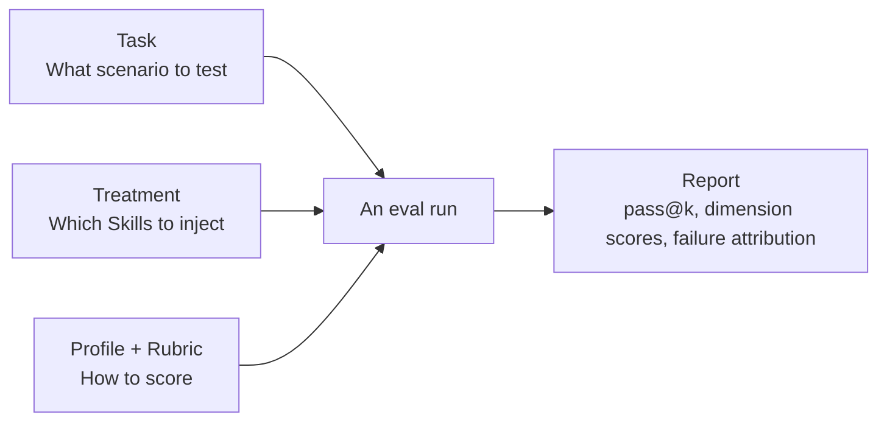
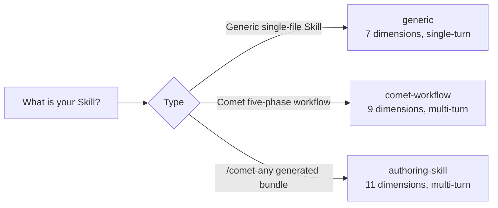
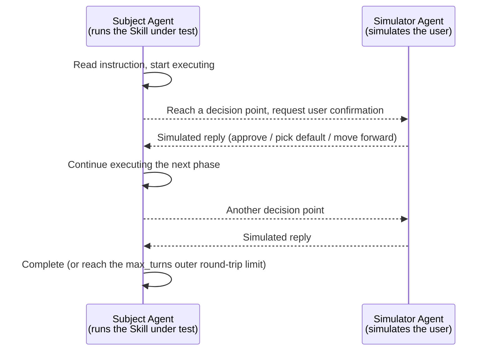

`comet eval` works out of the box to evaluate built-in tasks and any local Skill. But when you want to evaluate **how your own Skill performs in your own scenario**, you need a custom task. This article walks you through the entire process step by step: from defining a task, to configuring an evaluation profile, to running a report.

<Info>
  If you haven't run an eval yet, first read [Evaluating Any Skill · Quickstart](/en/eval/quickstart) to set up the environment. This article assumes you can already run <code>comet eval --collect</code> successfully.
</Info>

## The Big Picture of Eval Configuration

A complete eval is assembled from three parts, and understanding their division of labor is the foundation of customization:

<p align="center">
  
</p>

<p align="center">Task decides what to test, Treatment decides what to inject, Profile and Rubric decide how to score</p>



| Configuration | Question it answers | Location |
| --- | --- | --- |
| **Task** | What scenario to test? What to produce? How to verify correctness? | `local/tasks/<name>/` |
| **Treatment** | Which Skills to inject in this run (including the no-Skill baseline)? | `local/treatments/` |
| **Profile + Rubric** | Which dimensions to score by? | `[evaluation]` in task.toml |

Let's explain each one below.

## Define a Task

Each task is a directory under `local/tasks/` containing four files:

<Tree>
  <Tree.Folder name="local/tasks/my-task/" defaultOpen>
    <Tree.File name="task.toml" />
    <Tree.File name="instruction.md" />
    <Tree.Folder name="environment/" defaultOpen>
      <Tree.File name="Dockerfile" />
    </Tree.Folder>
    <Tree.Folder name="validation/" defaultOpen>
      <Tree.File name="test_my_task.py" />
    </Tree.Folder>
  </Tree.Folder>
</Tree>

<Note>
  The task directory convention comes from the eval harness (<code>eval/</code>), not your business repo. Custom tasks live under <code>eval/local/tasks/</code> in the Comet repo and are registered in <code>eval/local/tasks/index.yaml</code>.
</Note>

### 1. Write `task.toml`

`task.toml` is the core configuration of a task, divided into four sections:

```toml
[metadata]
name = "my-task"
description = "Create a markdown result file"
difficulty = "medium"           # easy / medium / hard
category = "generic"            # generic or comet
default_treatments = ["CONTROL"]

[environment]
description = "Validation environment"
dockerfile = "environment/Dockerfile"
timeout_sec = 600               # Docker execution timeout (seconds)

[validation]
test_scripts = ["test_my_task.py"]   # Validation scripts run inside Docker
target_artifacts = ["result.md"]     # Expected artifacts (existence check)
timeout = 120                        # Validation script timeout (seconds)

[evaluation]
profile = "generic"                       # Evaluation profile
expected_artifacts = ["result.md"]        # Artifacts checked by the rubric
required_skills = ["my-skill"]            # Skills that must be invoked
require_skill_invocation = true           # Produces a hard failure when not invoked

# Custom rubric criteria (passed to the LLM judge, optional)
rubric_criteria = [
    "Output includes error handling",
    "Code follows project naming conventions",
]

[interaction]
mode = "none"                   # none (single-turn) or auto_user (multi-turn simulation)
max_turns = 12                  # Outer round-trip limit between subject/simulator under auto_user
```

The role of each section:

| Section | Role |
| --- | --- |
| `[metadata]` | Task identity. `category = "comet"` or a name starting with `comet-` will be automatically inferred as the `comet-workflow` profile |
| `[environment]` | What Docker environment the validation runs in, and the timeout |
| `[validation]` | Which scripts to validate with, which artifacts are expected |
| `[evaluation]` | Which profile to score with, which Skills must be invoked, custom judging criteria |
| `[interaction]` | Single-turn or multi-turn simulated interaction |

#### Key fields in `[evaluation]`

These fields directly determine the scoring result and deserve separate explanation:

| Field | Role |
| --- | --- |
| `profile` | Select the rubric: `generic` (7 dimensions) / `comet-workflow` (9 dimensions) / `authoring-skill` (11 dimensions). See [Scoring Metrics and Dual-Agent Evaluation](/en/eval/scoring) for dimension details |
| `expected_artifacts` | The `artifact_presence` dimension of the rubric checks whether these artifacts exist (supports glob) |
| `required_skills` | Lists Skills that must be invoked; the `skill_invocation` dimension scores based on this |
| `require_skill_invocation` | When set to `true`, a required Skill not being invoked produces a **hard failure** (the run is directly judged as not passed) |
| `rubric_criteria` | Custom judging criteria, passed to the LLM judge as additional dimensions (`custom_0`, `custom_1`...) |

<Warning>
  <code>require_skill_invocation: true</code> is useful but use it with caution: it requires the agent to have <strong>actually invoked</strong> the specified Skill (read from Claude Code events, not inferred from artifacts). If your Skill name is misspelled or not injected, every run will hard-fail.
</Warning>

### 2. Write `instruction.md`

This is the task instruction for the agent, supporting template variables like `{run_id}`:

```markdown
Create a file `result.md` in the current workspace.

Requirements:
- Include the heading `# My Task Result`
- Describe your implementation approach
- Include at least three key points
```

### 3. Write the validation script

The validation script runs inside Docker and writes results to `_test_results.json`. This is the source of truth for "did this run get it right":

```python
from pathlib import Path
from scaffold.python.validation.core import write_test_results

def main():
    passed = []
    failed = []

    # Check whether the artifact exists
    result = Path("result.md")
    if not result.exists():
        write_test_results({"passed": [], "failed": ["result.md missing"]})
        return

    text = result.read_text(encoding="utf-8")

    # Check the content
    if "# My Task Result" in text:
        passed.append("heading present")
    else:
        failed.append("heading missing")

    write_test_results({"passed": passed, "failed": failed})

if __name__ == "__main__":
    main()
```

The definition of a "pass" for a run is clear: the `failed` list reported by the validation script is empty. Both `pass@k` and `pass^k` are based on this judgment.

### 4. Write the Dockerfile

The Dockerfile provides the runtime and dependencies needed for validation. A minimal example:

```dockerfile
FROM python:3.11-slim

WORKDIR /workspace
# Install dependencies needed by the validation script (if any)
# COPY requirements.txt .
# RUN pip install -r requirements.txt
```

The code produced by the agent and your validation script run inside the built image.

### 5. Register the task

Finally, register it in `local/tasks/index.yaml`:

```yaml
tasks:
  - name: my-task
    category: generic
    default_treatments:
      - CONTROL
    description: My custom task
```

Once registered, you can run it with `--task my-task`.

## Configure Treatment

Treatment answers "which Skills to inject in this run". Located at `local/treatments/`:

```yaml
# local/treatments/common/control.yaml
CONTROL:
  description: "No-Skill baseline"
  skills: []

# local/treatments/comet/comet_full_040_beta.yaml
COMET_FULL_040_BETA:
  description: "Full Comet workflow"
  skills:
    - name: comet
      skill: 040-beta/comet
      variant: all
      base: benchmarks
```

| Treatment | Meaning |
| --- | --- |
| `CONTROL` | **No-Skill baseline** — no Skill injected, tests the agent's bare capability floor |
| `COMET_FULL_040_BETA` | Injects the full Comet workflow Skill bundle |
| Custom | Inject your own Skill to compare "with Skill vs without Skill" |

<Tip>
  The standard approach for a comparative experiment is <code>CONTROL</code> (no Skill) vs your Skill treatment. The difference between the two is the gain your Skill brings.
</Tip>

## Choose a Profile

The profile determines which rubric to score with. Choosing the wrong profile makes the dimension scores meaningless:



| Profile | Suitable for | Dimensions | Interaction mode |
| --- | --- | --- | --- |
| `generic` | Smoke-testing any generic Skill | 7 | `none` (single-turn) |
| `comet-workflow` | Classic `/comet` five-phase | 9 | `auto_user` (multi-turn) |
| `authoring-skill` | `/comet-any` artifacts | 11 | `auto_user` (multi-turn) |

<Note>
  Profile resolution priority: <code>--profile</code> override &gt; manifest's <code>skill.profile</code> &gt; task's <code>evaluation.profile</code> &gt; <code>generic</code>. Comet-type tasks (<code>category = "comet"</code>) are automatically inferred as <code>comet-workflow</code>.
</Note>

For the dimensions, weights and checking logic of the three rubrics, see [Scoring Metrics and Dual-Agent Evaluation](/en/eval/scoring).

## Configure LLM-as-judge

LLM-as-judge is an optional quality coverage layer. It does not replace rule-based `[RUBRIC]` scores and does not directly change `weighted_score`. It lets an independent judge model read the run artifacts and append `[RUBRIC-JUDGE]` scores, helping you catch cases where rule checks miss whether the artifact has real substance.

Use it when:

- You evaluate documents, plans, code explanations, designs, or other artifacts that are hard to judge completely with scripts.
- You already have validation scripts, but want to know whether the artifact is empty, shallow, or template-like.
- You want comparison reports to show the gap between rule scores and judge scores.

<Info>
  Judge configuration is isolated from the subject Agent configuration. The subject Agent can keep using <code>ANTHROPIC_MODEL</code>, <code>ANTHROPIC_BASE_URL</code>, and its own token. The judge must explicitly set <code>BENCH_JUDGE_MODEL</code> so the same configuration does not silently act as both contestant and judge.
</Info>

### 1. Enable judge in `eval/.env`

Add judge variables to the Comet repository's `eval/.env`:

```bash
# eval/.env
BENCH_LLM_JUDGE=1
BENCH_JUDGE_MODEL=your-judge-model
```

`BENCH_LLM_JUDGE=1` is the switch. `BENCH_JUDGE_MODEL` is required. If you enable the switch without setting a model, the report records a skipped status:

```text
[RUBRIC-JUDGE] status: skipped - BENCH_JUDGE_MODEL is required when BENCH_LLM_JUDGE=1
```

### 2. Choose judge authentication

If the local host `claude` CLI is already authenticated, you can set only `BENCH_JUDGE_MODEL`. The harness calls the host `claude` CLI for judge runs.

If you want the judge to use an independent Anthropic-compatible proxy, configure a dedicated endpoint and token:

```bash
# eval/.env
BENCH_LLM_JUDGE=1
BENCH_JUDGE_MODEL=your-judge-model
BENCH_JUDGE_BASE_URL=https://your-anthropic-compatible-endpoint
BENCH_JUDGE_AUTH_TOKEN=your-judge-token
```

You can also use an API key:

```bash
# eval/.env
BENCH_LLM_JUDGE=1
BENCH_JUDGE_MODEL=your-judge-model
BENCH_JUDGE_BASE_URL=https://your-anthropic-compatible-endpoint
BENCH_JUDGE_API_KEY=your-judge-api-key
```

Priority:

| Configuration | Behavior |
| --- | --- |
| `BENCH_JUDGE_BASE_URL` + `BENCH_JUDGE_AUTH_TOKEN` | Prefer Anthropic Messages HTTP; the HTTP header uses the bearer token |
| `BENCH_JUDGE_BASE_URL` + `BENCH_JUDGE_API_KEY` | Prefer Anthropic Messages HTTP; the HTTP header uses the API key |
| Only `BENCH_JUDGE_MODEL` | Fall back to the host `claude` CLI |

<Note>
  If both <code>BENCH_JUDGE_AUTH_TOKEN</code> and <code>BENCH_JUDGE_API_KEY</code> are set, the auth token wins. The judge subprocess clears inherited main <code>ANTHROPIC_*</code> provider variables before mapping <code>BENCH_JUDGE_*</code>, so do not expect it to reuse the subject Agent provider configuration automatically.
</Note>

### 3. Add custom judge criteria for generic tasks

Generic Skills (`generic` / `authoring-skill`) make the judge output three default dimensions:

| Dimension | What it judges |
| --- | --- |
| `task_completion` | Whether the task requirements are satisfied, artifacts exist and are correct, and basic validation passed |
| `output_quality` | Whether the artifact is complete, structured, and substantive |
| `instruction_adherence` | Whether the run followed instructions, constraints, and tool boundaries |

If your task has task-specific quality criteria, put them in `[evaluation]` in `task.toml`:

```toml
[evaluation]
profile = "generic"
expected_artifacts = ["result.md"]
required_skills = ["my-skill"]
require_skill_invocation = true
rubric_criteria = [
  "The output explains key tradeoffs instead of only listing steps",
  "Error handling covers empty input and external command failure",
]
```

These criteria are emitted as additional judge dimensions named `custom_0`, `custom_1`. They only affect the `[RUBRIC-JUDGE]` coverage layer and do not replace your validation scripts.

The `comet-workflow` profile uses a different judge dimension set: `artifact_quality`, `spec_drift`, and `main_flow`. These dimensions review workflow artifact depth, whether the spec drifted, and whether the five-phase main flow completed.

### 4. Run and confirm judge output

First use `--collect` to confirm tasks, manifests, and paths can be discovered:

```bash
comet eval ./generated-skill/comet/eval.yaml --collect
```

Then run the real evaluation:

```bash
comet eval ./generated-skill/comet/eval.yaml --html
```

Open the report printed in `Report path` and look for `[RUBRIC-JUDGE]` lines in each run's checks. A successful run looks like this:

```text
[RUBRIC-JUDGE] output_quality: 0.75 - cites concrete artifact content
[RUBRIC-JUDGE] instruction_adherence: 1.00 - follows stated constraints
[RUBRIC-JUDGE] status: enabled_and_successful
```

If you only see skipped or failed, use this table:

| Symptom | Common cause | Fix |
| --- | --- | --- |
| `BENCH_JUDGE_MODEL is required` | `BENCH_LLM_JUDGE=1` is set, but `BENCH_JUDGE_MODEL` is missing | Add `BENCH_JUDGE_MODEL` |
| `(judge error: HTTP ...)` | Judge endpoint, token, or model name does not match | Check `BENCH_JUDGE_BASE_URL`, token, and model name |
| No `[RUBRIC-JUDGE]` lines | `BENCH_LLM_JUDGE=1` is not enabled, or this run did not reach profile rubric scoring | Confirm `eval/.env` is loaded and fix earlier harness/task failures first |

## Multi-turn interaction: `auto_user` mode

A single-turn task (`mode: none`) runs only once, suitable for simple scenarios of "give an instruction and see the result". But workflow-type Skills need to **pause at decision points, ask the user, and continue after receiving a reply** — single-turn can't test this.

`auto_user` mode solves this: it uses **two Agents interacting automatically** — one runs the Skill under test (subject), the other simulates the user replying at decision points (simulator).



The simulator's behavior is controlled by a prompt file. It reads `eval/simulator-instruction.md` by default, and you can point `BENCH_SIMULATOR_PROMPT_FILE` to your own version to simulate "a more demanding user" or "a user who asks for clarification":

```bash
export BENCH_SIMULATOR_PROMPT_FILE=my-simulator-prompt.md
```

`max_turns` controls the loop limit (`comet-workflow` typically 12 outer round-trips, `authoring-skill` typically 8 outer round-trips). It is not the number of internal messages or tool calls of the Agent under test; one outer round-trip means the Agent under test reaches a decision point, the user simulator replies, and the Agent under test continues with `--resume`. Hitting a "complete" signal (such as `archive complete`) ends the loop early.

## A complete custom evaluation from scratch

Putting the above steps together, to evaluate your own Skill from scratch:

```bash
# 1. Define the task (the four files above + register in index.yaml)

# 2. First collect to troubleshoot, without consuming tokens
comet eval --task my-task --collect

# 3. Run for real (inject your Skill treatment)
comet eval --task my-task --treatment MY_SKILL --html

# 4. View the report
# eval/local/logs/experiments/<experiment-id>/summary.html
```

In the report, focus on three things:

1. **`pass@1` and `pass^k`**: capability ceiling vs reliability floor. See [Scoring Metrics](/en/eval/scoring#core-metrics-passk--passk).
2. **Rubric dimension scores**: which dimension dragged you down?
3. **Failure attribution** (`harness`/`workflow`/`task`/`model`): is the failure a Skill problem, or a task/environment problem?

## Evaluating `/comet-any` generated bundles

A Skill bundle generated by `/comet-any` comes with its own `comet/eval.yaml` manifest, so you don't need to hand-write a task.toml. Just run with the manifest:

```bash
# Discovery pre-check
comet eval ./generated-skill/comet/eval.yaml --collect

# Real evaluation
comet eval ./generated-skill/comet/eval.yaml --html
```

The manifest automatically selects the `authoring-skill` profile, injects recommended tasks and quality gates. For the complete manifest format, see [Evaluation System Overview](/en/eval/overview#eval-manifest).

## Next steps

- [Scoring Metrics and Dual-Agent Evaluation](/en/eval/scoring) — dimensions, weights and pass@k/pass^k of the three rubrics
- [Evaluation System Overview](/en/eval/overview) — manifest format, profile system and task system
- [comet eval command](/en/cli/eval) — complete command-line argument reference
