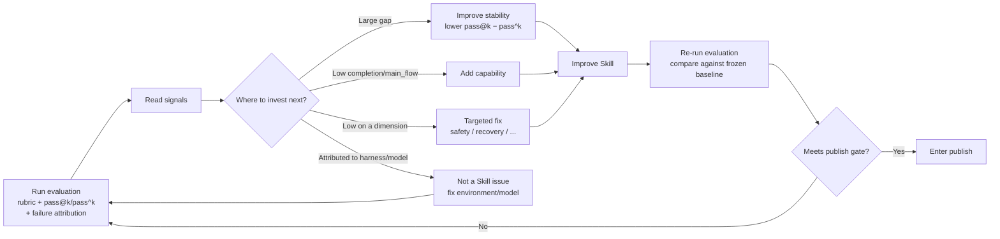

<Info>
  This page is for teams who want to put evaluation to use and push it into enterprise production. If you only need to run an evaluation once, see [Quickstart](/en/eval/quickstart); to understand why evaluation matters, see [Evaluation: The Compass for Skill Evolution](/en/eval/why-eval). This page explains how Comet uses evaluation to drive Skill evolution, and the difference between "evaluating models" and "evaluating Skills."
</Info>

## How Comet Integrates Evaluation into the Evolution Loop

Evaluation can only drive evolution when it is integrated into the "build → evaluate → publish" loop. Comet's approach is to set eval results as a publish gate: a Skill cannot be published without eval evidence for the current draft, if the eval fails, or if the eval evidence corresponds to an old hash.

This way, every Skill change must pass through a data-driven, direction-bearing, verifiable cycle:

Each branching point in the cycle is determined by evaluation signals. Among them, failure attribution classifies each failure into four categories, indicating whether the Skill should be changed:

| Attribution | Meaning | What to change |
| --- | --- | --- |
| `harness` | Evaluation environment, Docker, or path issues | Fix the environment, not the Skill |
| `workflow` | Skill execution flow did not meet expectations | Fix the Skill |
| `task` | Task definition or validation condition issues | Fix the task, not the Skill |
| `model` | Unstable model behavior or tool usage | Switch the model or adjust the prompt |

Without an attribution mechanism, teams easily misattribute model or environment problems as Skill problems and repeatedly modify the wrong thing. Attribution directs feedback precisely at the correct improvement target.

## Why Evaluating Spec Coding Skills Is a New Problem

What Comet evaluates is not "can the model write code," but "how does a multi-stage workflow Skill that pauses at decision points to ask the user perform across repeated runs." This type of Skill has several characteristics that distinguish it from traditional pure model benchmarks.

### Multi-turn Interaction: The Skill Pauses at Decision Points Waiting for the User

The five-stage workflow Skill (`/comet`) is not a single-turn task. It pauses at stage boundaries and at decision points requiring confirmation, waiting for user input—whether the plan is viable, which default to choose, whether to take the hotfix path. This introduces two evaluation constraints:

- A single-turn evaluation cannot run to completion. If the Skill is executed with just the task prompt, it will stop at the first decision point and the evaluation cannot proceed to subsequent stages.
- Decision points require responses. Decision points depend on user input, but manual intervention makes evaluation impossible to automate and impossible to repeat.

This is the key difference between evaluating Spec Coding Skills and traditional code evaluation: the evaluation needs to be able to automatically run through the entire multi-turn interaction process.

### "Success" in Evaluation Includes State Machine Progression, Not Just Artifact Correctness

In pure model evaluation, "success" typically means the code passes tests. For a workflow Skill, success also includes: whether it traversed the stages in the `open → design → build → verify → archive` order, whether it paused at decision points and waited for the user, and whether it maintained recoverable state. These are process signals that cannot be determined solely from artifact files.

### Reliability Matters More Than One-time Capability

A workflow Skill is a tool that users use repeatedly. For such tools, "gets it right every time" (high reliability) matters more than "gets it right occasionally" (high capability ceiling). Comet uses both `pass@k` (capability ceiling) and `pass^k` (reliability floor), with each metric answering a different question.

## Differences from SWE-bench / SWE-bench-Pro

The SWE-bench family is the de facto standard for code intelligence evaluation: given a real GitHub issue, see whether the model can generate a patch that passes tests. What it evaluates is different from what the Comet eval evaluates.

| Dimension | SWE-bench / SWE-bench-Pro | Comet eval (evaluating Skills) |
| --- | --- | --- |
| Evaluation target | Code capability of the model/harness | The incremental value of a Skill (whether adding the Skill improves things) |
| Interaction model | Single Agent + sandbox environment, runs to a submitted answer | Multi-turn interaction, the Skill pauses at decision points, requiring user (or simulated user) responses |
| Definition of "success" | Patch passes tests | Artifact correct + process evidence (stage order, decision points, recoverable state) |
| Whether Skill invocation matters | Not involved | Core concern: the Skill must be actually invoked and leave evidence |
| Capability vs reliability | Primarily looks at pass rate | Explicitly distinguishes `pass@k` (capability) and `pass^k` (reliability) |
| Comparison method | Absolute pass rate | Incremental comparison with/without the Skill (treatment system) |

The core difference is: SWE-bench combines the effects of the model, harness, and augmentation into a single pass rate; while evaluating a Skill answers a controlled question—on the same task and same model, does adding this Skill improve or degrade performance, and by how much. This question cannot be answered by pure model evaluation.

Comet uses the treatment system for with/without Skill comparison: `CONTROL` (no Skill baseline) vs `COMET_FULL` (injecting the full Skill stack), same task, same isolated environment, with the Skill as the only variable. Only this way can the marginal effect of the Skill be measured, rather than attributing the model's capability to the Skill.

## There Is No Gold Standard Yet for Evaluating Bound Skills

Evaluations that benchmark models (SWE-bench, HumanEval) are relatively mature. But evaluating "whether a Skill bound to an Agent is effective" still has no accepted gold standard in the industry.

The academic paper SkillsBench[1] addresses this gap by treating Skills as first-class evaluation objects, using paired evaluation to measure the incremental value of "with Skill vs without Skill," and points out that traditional agent benchmarks "measure raw capability in isolation... do not answer the deployment question: will adding this Skill help my agent on this task, and by how much?"

SkillsBench itself lists several unsolved problems: it only covers terminal-style, containerized tasks; Skill injection increases context length, so gains may partly come from more context rather than procedural knowledge; containerization provides state isolation but is not fully deterministic; and it does not simulate user interaction, does not use pass@k, and does not use LLM-as-judge scoring (it adheres to deterministic testing).

This field is still in its early stages. Below are the specific problems Comet faces when designing and implementing eval, along with current approaches.

## Open Problems the Comet eval Faces

### Problem 1: How to Have the Agent Automatically Simulate User Choices

A workflow Skill pauses at decision points waiting for the user. To run the entire workflow unattended, a mechanism is needed to simulate user responses.

Comet's approach is dual-Agent automatic interaction, where two independent Agent roles collaborate:

| Role | Responsibility | Session form |
| --- | --- | --- |
| Subject Agent (subject) | Runs the Skill under test (e.g., `/comet` five stages) | A single continuous session, resumed each turn with `--resume` |
| User-simulating Agent (simulator) | Simulates user responses at decision points | One-off stateless call at each decision point |

The interaction flow is: the subject Agent runs to a decision point → the harness detects a decision signal (`?`, `confirm`, `choose`, `approve`, etc. appearing in output) → the user-simulating Agent reads the subject Agent's last message and generates a response (approving reasonable plans, selecting reasonable defaults, requesting clarification only when there is genuine ambiguity) → the subject Agent resumes with `--resume` → continues until the workflow completes (`archive complete`) or a round-trip limit is reached.

The user-simulating Agent's instructions have explicit constraints: do not refuse, push the workflow forward, do not write code or files. This enables the evaluation to automatically run through the multi-stage process while keeping user input at decision points reasonable and consistent.

Source locations: driver script `eval/scaffold/shell/run-claude-loop.sh`, simulator prompts `eval/simulator-instruction.md` and `COMET_SIMULATOR_PROMPT` / `GENERIC_SIMULATOR_PROMPT` in `scaffold/python/profiles.py`. The simulator can be customized (`BENCH_SIMULATOR_PROMPT_FILE`), for example to switch to a stricter user profile for stress testing.

### Problem 2: How to Use an Agent for Evaluation (LLM-as-judge)

Rule-based rubrics can detect structural signals (whether files exist, whether commands were executed, whether the Skill was invoked), but cannot judge the substantive depth of artifacts—whether the agent did meaningful design work or merely generated placeholder content.

Comet's approach is an optional LLM-as-judge: a judge model reads the workspace artifacts and scores them. The key is to constrain subjective judgment within an auditable scope:

- **Fixed dimensions**. The comet-workflow judge only scores three dimensions where rules are weak (`artifact_quality`, `spec_drift`, `main_flow`); generic/authoring scores `task_completion` / `output_quality` / `instruction_adherence`.
- **Anchored scoring criteria**. The prompt provides explicit 1.0 / 0.5 / 0.0 anchor definitions for each dimension, rather than letting the model score by impression.
- **Evidence citation required**. The output format is `[RUBRIC-JUDGE] <dimension>: <score> - <reason>`, where the reason is no more than 25 words and must cite specific artifact content.
- **Supplement, not replace**. The judge score is marked with `[RUBRIC-JUDGE]`, distinguished from the rule score's `[RUBRIC]`, only supplementing rather than replacing the rule score, and does not constitute a hard failure.

For the sake of determinism, SkillsBench does not use LLM-as-judge scoring. Comet's trade-off is: deterministic tests handle the hard judgment of "is it correct," while the LLM judge supplements the qualitative judgment of "is it in-depth," with the two dividing labor and complementing each other.

Source locations: `eval/scaffold/python/llm_judge.py` (comet-workflow), `generic_llm_judge.py` (generic). The judge reuses the same `claude` CLI as the subject Agent, introducing no additional dependencies.

### Problem 3: How to Design Metrics

"Is the Skill qualified" is an ambiguous question. The goal of metric design is to decompose ambiguity into measurable, comparable, attributable signals. Comet's metrics are layered in three tiers:

| Metric layer | Question answered | Type |
| --- | --- | --- |
| Task validator (artifacts exist + validation script zero failures) | Was it correct this time | Hard judgment (determines pass/fail) |
| rubric multi-dimensional score (7/9/11 dimensions, weighted summary) | Where is it strong, where is it weak, how large is the gap | Informative (diagnostic) |
| pass@k / pass^k | Can it do it / Can it do it every time | Informative (distribution) |

The rationale for layering is to separate "is it correct" from "how good is it." A Skill that produced all the correct files but contains `rm -rf` would pass the task validator, but the `safety_boundary` dimension would flag it low—the former indicates deliverability, the latter indicates safe deliverability. The rubric uses binary check items rather than 0–100 scoring (consistent with SWE-bench, τ-bench, etc.), making scores reproducible and explainable.

Source locations: pass@k/pass^k in `eval/scaffold/python/pass_at_k.py`, rubric weighting in `validation/rubric.py`, failure attribution in `attribution.py`.

### Problem 4: How to Ensure a Clean Experiment Environment

Agents are path-dependent: they explore directories, read files, and the initial environment affects their behavior. If the environment is not clean for each experiment and state leaks, evaluation results are not reproducible.

Comet's approach is to provide an isolated Docker container for each task:

- **Independent container per task**. Each task has its own `Dockerfile`, the container is destroyed with `--rm`, and the host's temporary directory is mounted to the container's `/workspace`.
- **Read-only mount of key scripts**. The loop driver script is mounted read-only (`/opt/scaffold-shell:ro`), so the Agent cannot modify the evaluation logic.
- **Non-root user**. The container creates a dedicated `agent` user to run, with restricted permissions.
- **Key whitelist**. Only keys explicitly granted by eval are forwarded; other host environment variables do not enter the container.
- **Image cached by hash**. Images are cached by the hash of `Dockerfile` + dependency files, so the same environment is built only once.

Source locations: isolation and mounting logic in `eval/scaffold/shell/docker.sh`; host-container data is exchanged via two reserved JSON files, `_test_context.json` (in) and `_test_results.json` (out).

### Problem 5: How to Increase the Probability of the Skill Being Triggered

If the model does not invoke the Skill, the evaluation is actually testing the bare model rather than the Skill. LangChain's practice article[2] points out this problem: even with prompt instructions requiring the model to invoke the Skill, the invocation rate is only about 70%.

Comet ensures the model actually uses the Skill through multiple layers of mechanisms:

1. **Write a `CLAUDE.md` contract**. When evaluating comet-workflow, a mandatory `CLAUDE.md` is written to the container workspace, requiring "call the `/comet` Skill first," "use the Skill tool to invoke nested stage Skills," and "do not simulate the workflow in prose." `CLAUDE.md` is always-loaded context.
2. **Contract injected into the task prompt simultaneously**. The trigger instruction appears in both the system context (CLAUDE.md) and the first user message.
3. **PreToolUse hook guard**. The Skill's own `comet-hook-guard.mjs` is registered as a `Write|Edit|MultiEdit` pre-hook, running a stage guard before each file write, keeping the model executing according to the Skill's stage logic.
4. **Skill invocation evidence as a hard gate**. The evaluation parses real `Skill` tool_use events from the `stream-json` output to verify invocation (not inferred from artifact file names). If the comet entry, at least one nested stage Skill, and the OpenSpec and Superpowers dependency Skills do not all appear as real tool invocations, the run is judged a failure.

Together these mechanisms ensure the Skill is actually invoked and leaves a parseable invocation trail; otherwise the evaluation does not count as a valid result.

Source locations: CLAUDE.md contract at `eval/local/skills/benchmarks/dependency/claude-md/comet-workflow/CLAUDE.md`, invocation evidence parsing in `extract_events` of `scaffold/python/logging.py`, hard gate in `_score_skill_invocation` of `validation/rubric.py`.

## Bringing Evaluation into Enterprise Production

Comet eval's evaluation philosophy draws from LangChain's Evaluating Skills[2]: treat the skill as a prompt to test, use with/without controls, isolated environments, deterministic metrics, and full observability for evaluation. But to land in the enterprise, local evaluation alone is not enough.

LangChain's article emphasizes that skill evaluation needs to be paired with an observability and experimentation platform like LangSmith: it can score each run while also capturing every action of the Agent (files read, scripts created, Skills invoked) for diagnosis. This is why Comet eval designed LangSmith integration.

Comet's LangSmith integration reuses the same local task suite, running evaluation into a real LangSmith environment:

- **Reuse local tasks**. The LangSmith suite directly reuses the task corpus from local `local/tasks/`, only enabling tracing (`LANGSMITH_TRACING=true`, `TRACE_TO_LANGSMITH=true`). The same runner code and judgment logic run on an enterprise-grade observability platform.
- **Credential gating**. Only enabled when `LANGSMITH_API_KEY` is set; local unit tests are unaffected.
- **Distributed tracing context propagation**. Through W3C-style tracing headers (`CC_LS_TRACE_ID`, `BENCH_EVAL_BAGGAGE`, etc.), LLM calls inside the Claude Code container and test-script LLM calls are nested under the experiment's LangSmith run, forming a drill-downable trace chain.
- **Bidirectional verification**. In addition to uploading data, it also verifies whether the Agent-generated code correctly uses LangSmith's `@traceable` / `wrap_openai`, and confirms via `client.read_run(trace_id)` and the `/runs/rules` API that the trace and evaluator actually exist.

This gives evaluation two capabilities needed for production: horizontal comparison (comparing multiple runs and multiple versions in the LangSmith experiment portal) and vertical drill-down (viewing the complete trail of each tool call and Skill trigger to locate the step where a failure occurred).

Source locations: LangSmith suite in `eval/langsmith/`, tracing context in `scaffold/python/validation/runner.py`, client in `get_langsmith_client` of `scaffold/python/utils.py`.

## Summary

Evaluating models already has a relatively mature gold standard; evaluating "whether a Skill bound to an Agent is effective" is still an open problem. Comet eval's approach is:

- Treat Skill evaluation as a multi-turn interaction problem, using dual-Agent automatic interaction to run through the entire workflow rather than single-turn execution;
- Divide labor between deterministic testing and qualitative judgment, with the task validator handling hard judgments and the LLM judge supplementing depth evaluation;
- Use pass@k/pass^k to distinguish capability from reliability, giving evolution a clear direction;
- Use Docker isolation, read-only mounts, and a key whitelist to ensure reproducible environments;
- Use a CLAUDE.md contract and invocation evidence hard gate to ensure the Skill is actually invoked;
- Use LangSmith integration to connect evaluation to an enterprise-grade observability platform.

None of these problems are fully solved yet—as SkillsBench states, this field is still in its early stages. Comet's goal is to make every aspect of evaluation have an explainable, auditable, reproducible engineering implementation, so that evaluation becomes infrastructure that can run continuously and drive Skill evolution.

## References

1. Li, X., et al. *SkillsBench: Benchmarking How Well Agent Skills Work Across Diverse Tasks*. arXiv preprint arXiv:2602.12670, 2026. \[[Paper link](https://arxiv.org/abs/2602.12670)\]

2. Xu, R. *Evaluating Skills*. LangChain Blog, 2026-03-05. \[[Original link](https://www.langchain.com/blog/evaluating-skills)\]

## Next Steps

- [Evaluation: The Compass for Skill Evolution](/en/eval/why-eval) — Why evaluation is the capability to build first, and the basis for rubric, pass@k, pass^k
- [Scoring Metrics and Dual-Agent Evaluation](/en/eval/scoring) — Detailed rubric dimensions and the complete mechanism of the dual-Agent interaction loop
- [Eval harness](/en/eval/harness) — collect/run internals, environment variables, LangSmith integration
- [Quickstart](/en/eval/quickstart) — Run an evaluation once and see how these metrics are produced
