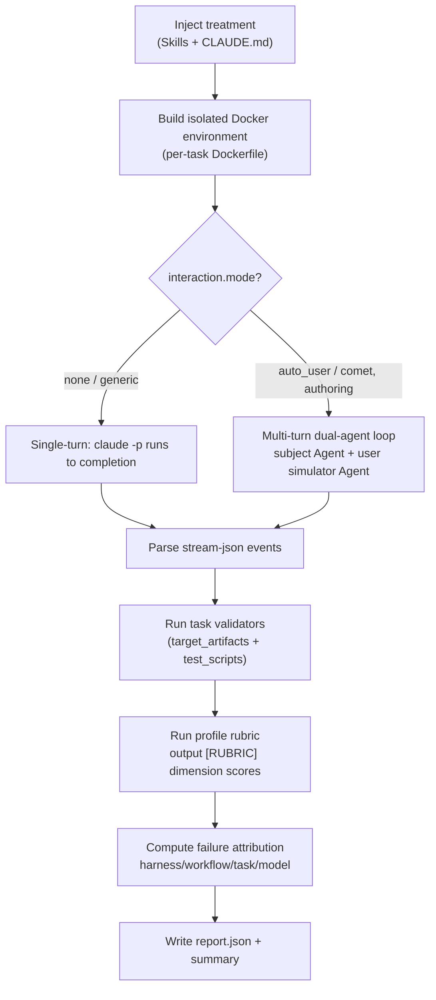

<Info>
  This is advanced content. For day-to-day evaluation you only need the single
  command in [Quickstart](/en/eval/quickstart). What's covered here is the
  internal mechanism of the harness, useful for troubleshooting or understanding
  profile/task selection.
</Info>

The eval harness ships inside the npm package at a matching version. A normal `comet eval` uses that package's `eval/` directory. Comet repository development or a custom harness can pass `--project <repository-root>` explicitly. You do not need to clone the Comet repository merely to obtain the harness.

## Harness lookup and error boundaries

The CLI checks the harness before it checks `uv`:

| Error                                | Meaning                                                                         | Action                                            |
| ------------------------------------ | ------------------------------------------------------------------------------- | ------------------------------------------------- |
| `Eval harness is missing at ...`     | The npm package is incomplete, or `--project` does not contain a valid `eval/`. | Reinstall `@rpamis/comet` or correct `--project`. |
| `uv is not installed or not in PATH` | The harness exists, but the local Python launcher is unavailable.               | Install `uv` and verify PATH.                     |

## Harness Directory Structure

```text
eval/
├── pyproject.toml          # Python dependencies (pytest, pyyaml, pydantic, etc.)
├── uv.lock
├── .env / .env.example
├── scaffold/               # Shared harness code
│   ├── python/
│   │   ├── attribution.py      # Failure attribution
│   │   ├── logging.py          # ExperimentLogger, summary.md generation
│   │   ├── manifests.py        # comet/eval.yaml parsing
│   │   ├── profiles.py         # Profile registry
│   │   ├── report_outputs.py   # Report config + HTML rendering
│   │   ├── tasks.py            # task.toml loading
│   │   ├── treatments.py       # treatments YAML loading
│   │   └── validation/         # Rubric and Docker validators
│   └── shell/
│       ├── docker.sh           # Wrapper for running Claude in Docker
│       └── run-claude-loop.sh  # Multi-turn auto_user driver
├── local/                  # Local suite (no LangSmith credentials needed)
│   ├── tasks/              # Task definitions
│   ├── treatments/         # Control / experiment groups
│   ├── tests/
│   │   └── tasks/test_tasks.py   # Parameterized tests actually invoked by the CLI
│   └── logs/experiments/   # Built-in task harness logs
├── langsmith/             # LangSmith suite (reuses local tasks)
└── langfuse/              # Langfuse suite (reuses local tasks)
```

## What It Wraps

`comet eval` does these things internally:

- Launches the harness from the `<project>/eval` root directory (using `uv run`)
- Converts `--manifest` or `--skill-path` into pytest parameters
- Selects the default profile (`generic`) and task set (`recommended`, `generic-skill-smoke`, or generated tasks)
- When no manifest task is available, generates and caches 2–4 bounded tasks from the Skill content
- Generates a temporary report config on demand (when using `--html`)
- Prints a set of execution info to help locate the report

Based on `--suite`, it ultimately calls:

```bash
uv run pytest <suite>/tests/tasks/test_tasks.py [args]
```

You don't need to remember this command — `comet eval` assembles it for you.

## collect and run

`comet eval` is a single entry-point command, distinguishing two phases via `--collect`:

| Command                         | Executes model tasks? | Underlying difference           | Purpose                                                               |
| ------------------------------- | --------------------- | ------------------------------- | --------------------------------------------------------------------- |
| `comet eval <target> --collect` | No                    | Adds `--collect-only` to pytest | Validates manifest, task, profile and paths; low-cost troubleshooting |
| `comet eval <target> --html`    | Yes                   | Adds `-v` to pytest             | Executes the real evaluation and generates a report                   |

Both share the same parameter-building logic (`buildEvalArgs`); the only difference is that collect adds `--collect-only` while normal execution adds `-v`. `--suite local|langsmith|langfuse` selects the backend; `--report-config`, `--html`, and `--quick` are for the real evaluation path.

## skill-path mode (default entry)

When you pass a local Skill directory or `SKILL.md`, `comet eval` uses skill-path — no `comet/eval.yaml` needed:

```bash
comet eval ./my-skill --html
```

This is the default entry point for evaluating any local Skill. Comet discovers `comet/eval.yaml` under the target directory when it exists. Without a manifest, a normal run generates and caches 2–4 bounded tasks from the Skill content; `--quick` explicitly selects `generic-skill-smoke` (verifying that "the Skill can be injected, invoked, and produce files"). The `--skill-name` is inferred from the directory name. You can also explicitly specify a task with `--task`, or override the profile with `--profile`.

| Mode                               | Default profile                            | Default task                                                   | Suitable scenario                                         |
| ---------------------------------- | ------------------------------------------ | -------------------------------------------------------------- | --------------------------------------------------------- |
| `--skill-path` (normal run)        | `generic`                                  | Automatically generated 2–4 tasks when no manifest tasks exist | Evaluate your own Skill with bounded coverage             |
| `--skill-path --quick`             | `generic`                                  | `generic-skill-smoke`                                          | Run a fixed low-cost smoke evaluation                     |
| `--skill-path` (explicit `--task`) | `generic`                                  | Your specified task                                            | When manually specifying a task                           |
| `--manifest`                       | Manifest's own (usually `authoring-skill`) | `recommended`                                                  | Evaluate a `/comet-any` full package, as publish evidence |

## manifest mode (evaluating a /comet-any full package)

`--manifest` is suitable for `/comet-any` artifacts, or any Skill bundle with a `comet/eval.yaml`:

```bash
comet eval ./generated-skill/comet/eval.yaml --collect
comet eval ./generated-skill/comet/eval.yaml --html
```

The manifest is usually auto-generated by `/comet-any` (not hand-written) and contains the target Skill, profile, recommended tasks, expected artifacts, and interaction config. Engine-enabled artifacts default to the `authoring-skill` profile and the `authoring-skill-smoke` quick eval. Only this path's results are valid evidence for publish readiness; the `generic-skill-smoke` skill-path smoke is just early validation and does not count as release evidence.

### Generated manifest draft hash

When `metadata.draftHash` is `<current-bundle-hash>`, the CLI locates the enclosing `bundle.yaml`, calculates the current Bundle draft hash, resolves the Skill source, and writes a temporary runtime manifest. The temporary directory is removed after evaluation; the source manifest and Bundle are unchanged. The placeholder is valid only while the generated manifest remains inside its Bundle draft.

## Execution Info

Before running, `comet eval` prints a set of execution info so you can locate the report and troubleshoot:

- `Eval root`: which `eval/` root directory is actually launched from
- `Mode`: `collect` or `run`
- `Target`: whether the current evaluation target is a manifest or a local Skill directory
- `Experiment`: the experiment id for this run
- `Profile`: the profile used in this evaluation
- `Task`: the evaluation task
- `Report path`: report location
- `Report config`: the temporary report config used when `--html` is enabled

In `run` mode, it additionally reminds you: failure attribution will be recorded into the generated eval summary, categorized into four buckets: harness, workflow, task, and model.

## Where the Report Is and What It Looks Like

### Experiment ID

The actual on-disk experiment id format is `<experiment_name>_<YYYYMMDD_HHMMSS>`, for example `comet_fix_median_20260620_143000`. The experiment name comes from the task name of the first parameterized test (`-` converted to `_`).

Report directory:

```text
.comet/eval/runs/<experiment-id>/
  ├── summary.md            # Main report (always generated)
  ├── summary.html          # HTML version (with --html)
  ├── metadata.json         # Experiment metadata
  ├── events/               # stream-json events per run
  ├── raw/                  # Raw stdout/stderr
  ├── reports/              # report.json per run
  └── artifacts/            # Files produced by the selected Agent
```

### summary.md contains

1. Header: Experiment ID, start/completion time.
2. **Results table**: one row per treatment, with columns including Checks, Turns, Duration, Tools, Tokens, Cost, RubricAvg.
3. **Summary**: total runs, checks passed X/Y (percentage).
4. **Treatment Details**: detailed metrics for each run of each treatment, skills invoked, scripts used, passed and failed check lists.

### report.json per run

Fields include: `passed`, `checks_passed[]`, `checks_failed[]`, `events_summary` (duration, turns, tool_calls, tokens, cost, files_created, skills_invoked, failure_attribution).

## Inside a Single Evaluation: Docker Isolation + Dual Agent + Rubric

Understanding this section helps you judge whether an evaluation result is trustworthy. `comet eval ... --html` runs internally along `treatment × task × reps`, and each run does:



<p align="center">
  
</p>

<p align="center">
  A real evaluation runs Agent interactions in an isolated environment, then
  records evidence via validators and rubric
</p>

Key points:

- The model runs inside a **Docker container**, isolated from your working directory.
- **Dual-agent loop** (`auto_user` mode): the subject Agent runs the Skill under test, and at each decision point a **user simulator Agent** replies (approves reasonable proposals, picks defaults, drives progress — never refuses, never writes code). The subject Agent continues the same session with `--resume`, up to `max_turns` outer round-trips (comet-workflow typically 12, authoring-skill typically 8), ending early when a "complete" signal is hit. The `max_turns` here is not the number of internal messages or tool calls of the Agent under test. This lets multi-stage workflows **automatically run the entire chain**. For the complete loop and decision-point detection, see [Scoring Metrics and Dual-Agent Evaluation](/en/eval/scoring).
- **Rubric scoring** runs after the validators and appends results as `[RUBRIC]` informational checks (comet-workflow rubric never produces a hard failure; generic/authoring produce hard failures for specific missing items).
- The real **pass/fail** is determined by the task validators (expected artifacts exist + test_scripts pass); rubric scores and pass@k are diagnostic information.

## Report Output Configuration

Report output is controlled by `ReportOutputConfig`, with priority:

1. `--report-config <path>` (JSON or YAML)
2. `COMET_EVAL_REPORT_CONFIG` environment variable
3. Default (markdown only)

Config format (top-level or nested both accepted):

```json
{ "report_outputs": { "markdown": true, "html": false } }
```

`--html` is equivalent to `{"markdown": true, "html": true}` and writes a temporary file passed to pytest.

## Failure Attribution

The report helps distinguish sources of failure. The attribution logic (`attribution.py`) judges each failed check in this order:

| Attribution | Judgment condition                                                                                       | Next step                                                 |
| ----------- | -------------------------------------------------------------------------------------------------------- | --------------------------------------------------------- |
| `harness`   | Required skill not invoked at all; or generic profile with no skill run                                  | Check dependencies, Docker, network, or local environment |
| `task`      | Check involves artifact path / validator / task directory                                                | Check eval task definition and fixtures                   |
| `workflow`  | Check involves `.comet.yaml` / guard / state / transition / archive; or skill invocation contract failed | Go back to `/comet-any` to improve the Skill              |
| `model`     | Other default fallback (task failed after an observable workflow execution)                              | Rerun or reduce reliance on non-deterministic behavior    |

This attribution is used to decide whether to fix the Skill, fix the eval config, or rerun the environment. See [Reading Evaluation Reports](/en/eval/reports).

## Environment Variable Reference

| Variable                                                                                                | Purpose                                                                                                                                                                                 |
| ------------------------------------------------------------------------------------------------------- | --------------------------------------------------------------------------------------------------------------------------------------------------------------------------------------- |
| `ANTHROPIC_API_KEY` / `ANTHROPIC_AUTH_TOKEN`                                                            | **Required**; when neither is present the suite is skipped                                                                                                                              |
| `BENCH_CC_MODEL`                                                                                        | Override the Claude model                                                                                                                                                               |
| `BENCH_CC_VERSION`                                                                                      | Claude Code version in the Docker image (default `latest`)                                                                                                                              |
| `BENCH_SIMULATOR_PROMPT_FILE`                                                                           | Custom user simulator prompt file (default `eval/simulator-instruction.md`; relative paths resolved from `eval/`). The `--simulator-prompt` command-line argument takes higher priority |
| `BENCH_LLM_JUDGE=1`                                                                                     | Enable the optional LLM-as-judge override scoring                                                                                                                                       |
| `COMET_EVAL_REPORT_CONFIG`                                                                              | Report output config path                                                                                                                                                               |
| `BENCH_SUITE_ROOT` / `BENCH_TASKS_DIR` / `BENCH_TREATMENTS_DIR` / `BENCH_SKILLS_DIR` / `BENCH_LOGS_DIR` | Path overrides                                                                                                                                                                          |
| `BENCH_TEST_CONTEXT` / `BENCH_TEST_RESULTS`                                                             | Override host↔Docker transfer file names                                                                                                                                                |

The LangSmith suite additionally requires `LANGSMITH_API_KEY`, `LANGSMITH_TRACING=true`, and `TRACE_TO_LANGSMITH=true`. The user-facing entry is `comet eval <target> --suite langsmith`; you do not need to enter `eval/langsmith/` and invoke pytest manually.

The Langfuse suite requires `LANGFUSE_PUBLIC_KEY` and `LANGFUSE_SECRET_KEY`. The user-facing entry is `comet eval <target> --suite langfuse`; it still writes the local report while synchronizing traces, scores, and experiment summaries to Langfuse. `--collect --suite langfuse` does not initialize the SDK or make network requests.

### Authenticating with an Anthropic-compatible proxy

When `ANTHROPIC_API_KEY` is not set, the `claude` inside Docker switches to authenticating via an **Anthropic-compatible proxy** (BigModel / mimo / OpenRouter, etc.). Required variables:

| Variable                                                                                            | Purpose                                   |
| --------------------------------------------------------------------------------------------------- | ----------------------------------------- |
| `ANTHROPIC_AUTH_TOKEN`                                                                              | Proxy-type auth token                     |
| `ANTHROPIC_BASE_URL`                                                                                | The proxy's Anthropic-compatible endpoint |
| `ANTHROPIC_MODEL`                                                                                   | Default model                             |
| `ANTHROPIC_DEFAULT_HAIKU_MODEL` / `ANTHROPIC_DEFAULT_SONNET_MODEL` / `ANTHROPIC_DEFAULT_OPUS_MODEL` | Per-tier model mappings                   |
| `ANTHROPIC_DEFAULT_SONNET_MODEL_NAME` / `ANTHROPIC_DEFAULT_OPUS_MODEL_NAME`                         | Per-tier model display names              |
| `CLAUDE_CODE_SUBAGENT_MODEL`                                                                        | Subagent model                            |

All of these variables have placeholder entries in `eval/.env.example`. Write them into `eval/.env` and the harness will inject them when starting Docker.

### Custom User Simulator Prompt

In `auto_user` mode evaluation, the user simulator Agent's instructions are driven by a prompt file. It reads `eval/simulator-instruction.md` by default:

```text
You are simulating a developer user in an automated eval. ...
- Approves the proposed approach / name / plan when asked to confirm
- Picks the most reasonable default option when asked to choose
- Asks for clarification only if the question is truly ambiguous ...
Never refuse; always let the workflow move forward. Do not write code or files.
```

If you want to swap in a different user behavior (e.g. more demanding, asks for more clarification), write your version to a file and point `BENCH_SIMULATOR_PROMPT_FILE` to it:

```bash
# eval/.env
BENCH_SIMULATOR_PROMPT_FILE=my-simulator-prompt.md
```

Relative paths are resolved from `eval/`; the file is read only if it exists. The command-line `--simulator-prompt "..."` has the highest priority and overrides file contents. See [Scoring Metrics and Dual-Agent Evaluation · User Simulator Agent Instructions](/en/eval/scoring#user-simulator-agent-instructions).

## Don't Confuse the Harness with Runtime Check

`comet eval` and `comet skill check` have similar names but different purposes:

- `comet eval`: evaluates a Skill bundle or `comet/eval.yaml`, answering "can this Skill, as a product capability, pass the evaluation".
- `comet skill check`: checks whether a specific Skill run is missing artifacts or state, answering "is this run complete".

See [Runtime check](/en/eval/runtime).

## Next steps

- [Scoring Metrics and Dual-Agent Evaluation](/en/eval/scoring) — rubric dimension details, pass@k/pass^k, dual-agent interaction loop
- [Reading Evaluation Reports](/en/eval/reports) — learn to read report signals and failure attribution
- [comet eval command](/en/cli/eval) — complete options and subcommand reference
- [Evaluation System Overview](/en/eval/overview) — where eval fits in the workflow and the eval.yaml format
