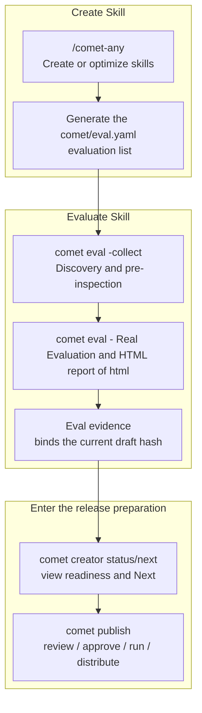

<Tip>
This is advanced content. If you just want to run through an assessment quickly, first take a look at [Quick Start: Assess One
  Skill](/en/eval/quickstart)。
</Tip>

<Warning>
This page is suitable for source code maintainers who need to view the internal mechanism of Eval. Ordinary users do not need to clone Comet or enter `eval/`
Table of Contents Please use the installed `comet eval` and user-level `.env`. Only by modifying the harness and using `--project`
Or when reproducing the experiment, it is only necessary to pull the source code.
</Warning>

`comet eval` is the universal Skill assessment entry for Comet. It first answers a question: ** Can the Skill in your hand, as a product capability, be evaluated through real tasks? **

This overview is divided into two parts:

1. First, look at how your skills are evaluated: entry points, tasks, scores, reports, and failure attributions.
2. Let's take a look at how `/comet-any` integrates the eval result into the release readiness.

## Start from here

|What do you want to accomplish|Let's take a look first|
| ---------------------------------------- | ------------------------------------------------------------------ |
|The first assessment run|Quick Start: Evaluate a Skill](/en/eval/quickstart)|
|Not sure whether to pass a manifest or directory|[How to choose an entry point](#how-to-choose-an-entry-point)|
|I can't understand the reasons for the failure in the report|[Read the assessment report ](/en/eval/reports)|
|Want to understand pass@k, pass^k, rubric|[Scoring Criteria and Dual-Agent evaluation ](/en/eval/scoring)|
|I want to write my own assessment task|[Configuration Evaluation and Custom Task](/en/eval/configuration)|
|Want to publish `/comet-any` output using eval evidence|[How `/comet-any` connects to eval](#how-comet-any-connects-to-eval)|

## What problem does it solve

For daily use, just focus on the evaluation tasks and results. `comet eval` has encapsulated the startup details of pytest, task registry, profile, treatment, Docker and local eval harness. You can directly run the evaluation in the project root directory.

## Two sets of evaluation systems, do not confuse them

Comet has two evaluation systems, which have similar names but are completely different:

|System|Command|Evaluation object|Is it the release of evidence|
| -------------- | ------------------- | ---------------------------- | ------------ |
|"Evaluation during the creation period.| `comet eval`        |Skill package or `comet/eval.yaml`|Yes, it is|
|"Runtime inspection"| `comet skill check` |A certain Skill run|no|

`comet eval` answers the question "Can this Skill pass the assessment as a product capability?" and executes real model tasks through the shared eval harness. When `comet skill check` answers "Is there a missing file or status during this Skill run?", it only checks the runtime check items and does not run the model. For details, see [Runtime check](/en/eval/runtime).

<p align="center">
  
</p>

<p align="center">
`comet eval` produces pre-release evidence, while `comet skill check` only checks a certain Skill
Whether the operation is complete or not, do not mix the two
</p>

## The first part: How is one's own Skill evaluated

From the user's perspective, `comet eval` does four things:

1. Find your Skill.
2. Find out which assessment tasks should be run.
3. Let the model perform tasks in an isolated environment and check the results with a validator.
4. Generate a report to tell you the reasons for passing, failing and the next steps.

```mermaid
%%{init: {'flowchart': {'defaultRenderer': 'elk'}}}%%
flowchart TB
  subgraph Input["Your Skill"]
    A["Any local Skill directory <br/> defaults to quick smoke"]
    B["There is a complete package evaluation of comet/eval.yaml<br/> (release evidence)"]
  end

  subgraph Discover["Discovery and preparation"]
    C["Parse the entry <br/>manifest or skill-path"]
    D["Select profile and task<br/> to determine the evaluation dimension"]
    E["collect<br/> only conducts discovery pre-checks"]
  end

  subgraph Run[""True assessment"]
    F["run --html<br/> executes the model task"]
    G["Verify artifacts/scripts<br/> to determine a hard pass"]
    H["rubric/pass@k<br/> provides diagnostic signals"]
  end

  subgraph Output["Result"]
    I["The report can be viewed at summary.html<br/>"]
    J["failure attribution<br/>harness / workflow / task / model"]
  end

  A --> C
  B --> C
  C --> D --> E --> F --> G --> I
  F --> H --> I
  G --> J
```

## How to choose the entrance

`comet eval [target]` automatically determines the entry point based on the target: when passing to a directory or `SKILL.md`, it uses the skw-path; when passing to `comet/eval.yaml`, it uses the manifest. Both can also be explicitly specified using `--skill-path`/`--manifest`, with explicit entry mutual exclusion.

|Scene|Command|Suitable|
| --------------------------- | ----------------------------------------------------- | ------------------------------------------ |
|Any local Skill directory (default)| `comet eval ./my-skill --html`                        |Evaluate your own skills and run a Docker assessment with one command|
|The complete package generated by `/comet-any`| `comet eval ./generated-skill/comet/eval.yaml --html` |Run the entire profile task set as release evidence|

When transferring directories, the manifest will be automatically discovered. When there is no manifest, normal operation will generate and cache 2 to 4 restricted tasks from the Skill snapshot. `--quick` is the fixed `generic-skill-smoke` that smokes. `--skill-name` will automatically infer from the directory name. No `comet/eval.yaml` is needed, nor is it necessary to clone the Comet repository - the npm package comes with an eval harness.

<Warning>
Directly evaluating local skills does not equal publishing evaluations. `--quick` only verifies "Skill"
It can be injected, invoked and produce files. Normal operation will generate restricted tasks related to the content of the Skill. "Publish
readiness requires evaluating the complete package generated by <code>/comet-any</code> (with {" "})
  <code>comet/eval.yaml</code>）。
</Warning>

## Why collect first

`collect` is the cheapest troubleshooting entry point for users. It only performs discovery and pre-checking, and does not execute model or Docker tasks. It is suitable for quickly identifying path, manifest, task cache and configuration issues.

```bash
comet eval ./generated-skill/comet/eval.yaml --collect
```

It mainly answers:

- Is the `comet/eval.yaml` path correct
- Whether eval harness can read this manifest
- Can the recommended tasks in the manifest be discovered
- Is the eval dependency path of the current repository available

It should not run a complete model evaluation first, nor should it consume long-term tasks first. When a failure occurs, it is usually necessary to fix the manifest, path or task first to identify the problem.

## comet/eval.yaml manifest format

`comet/eval.yaml` is a complete list of evaluations before release. It tells the eval harness: where the Skill is, which profile to use, which tasks are recommended to run, and which evidence and artifacts are expected. Its format (parsed by harness's `manifests.py`) :

```yaml
apiVersion: comet.eval/v1alpha1 # Required. It must be exactly equal to this value
kind: SkillEvalManifest # Required. It must be exactly equal to this value
metadata:
  name: my-skill
  description: A PR review assistant
skill:
  name: my-skill
  source: ".." # Relative to the Skill directory of eval.yaml, by default".."
  profile: authoring-skill # Optional, overwrite profile
evaluation:
  recommendedTasks: # Recommended Task List
    - authoring-skill-smoke
    - workflow-route-conformance
  baselineTreatments: [CONTROL]
  qualityGates:
    minWeightedScore: 0.8
    minPassAt1: 0.6
    maxInstabilityGap: 0.4
  requiredOutputSchemas: []
  expectedEvidence: []
  requiredSkills: [writing-plans, requesting-code-review]
  expectedArtifacts:
    - reference/resolved-skills.json
    - reference/workflow-protocol.json
interaction:
  mode: none # none or auto_user, default none
  maxTurns: 8 # The upper limit of the outer round trip of subject/simulator under auto_user is 12 by default
  simulatorPrompt: "" # Optional
```

<Warning>
<code>apiVersion</code> and <code>kind</code> are strongly checked: they do not equal {" "}
  <code>comet.eval/v1alpha1</code> / <code>comet.eval/SkillEvalManifest</code>{" "}
It will directly report an error. For daily use, it is usually not necessary to write this file by hand. <code>/comet-any</code> will generate it.
</Warning>

The eval.yaml generated by `/comet-any` defaults to using the `authoring-skill` profile. For regular workflow-kernel, `generic-skill-smoke`, `authoring-skill-smoke` and `workflow-route-conformance` are recommended. The overlay based on `/comet` will additionally recommend `workflow-overlay-contract` and the classic Comet workflow task to check the Output Schema, expected evidence and overlay routing.

## Profile system

eval harness has three built-in profiles, each determining the rubric dimension, default interaction mode, and scoreer:

| Profile           |Dimension number|Default interaction|Suitable|
| ----------------- | ------ | ------------------------------- | ------------------------- |
| `generic`         | 7      | `mode=none`, `maxTurns=12`      |General Skill is smoking.|
| `comet-workflow`  | 9      | `mode=auto_user`, `maxTurns=12` |The classic `/comet` five-stage assessment|
| `authoring-skill` | 11     | `mode=auto_user`, `maxTurns=8`  |The Skill generated by `/comet-any`|

Profile parsing priority: `--profile` overwrite > manifest's `skill.profile` > task's `evaluation.profile` > `generic`.

<Info>
<code>maxTurns</code> is not the number of internal messages of the Agent or the number of tool calls. It only takes effect in the <code>auto_user</code> mode, restricting the maximum number of outer round trips such as "the Agent under test runs to the decision point -> the user simulator replies -> the Agent under test continues with <code>--resume</code>".
</Info>

<Info>
Tasks starting with <code>comet-*</code> or <code>metadata.category=comet</code>{" "}
The task will be automatically inferred as <code>comet-workflow</code> profile, and the interaction mode will be automatically switched to {" "}
<code>auto_user</code> (<strong> two agents interact automatically </strong>: one runs under test.
Skill, another simulated user replies at the decision point.
</Info>

## Scoring criteria: rubric + pass@k/pass^k

eval is an ** metric driven ** evaluation, not just for pass/fail:

- **rubric Multidimensional Scoring ** : The Skill quality is split into multiple dimensions (such as the five-stage main_flow/gate_guard, safety_boundary for general Skill), with each dimension ranging from 0.0 to 1.0, and weighted and aggregated into `weighted_score`. "Informational", used for diagnosis.
- **pass@k/pass^k** : distinguish between ** upper capability ** (at least one success out of k attempts) and ** lower reliability ** (all success out of k attempts). Calculated based on multiple repeated runs (`--count N`). "Informational".
- ** Task Validator passes/fails ** : Is this implementation correct or not (`target_artifacts` + `test_scripts`)? This is the hard-judged pass/fail.

For the complete dimension details, weights, formulas, and dual-agent interaction cycles, please refer to [Scoring Indicators and Dual-Agent Evaluation ](/en/eval/scoring)

## Task System

eval harness has a built-in set of tasks, each of which is a directory (including `instruction.md`, `task.toml`, `environment/`, `validation/`). Common tasks

| Task                         |Category|Explanation|
| ---------------------------- | ------- | ------------------------------------------ |
| `generic-skill-smoke`        | generic |The general Skill emits smoke, generates and verifies `result.md`|
| `authoring-skill-smoke`      | generic |Generate smoke from the Skill package and verify the integrity of the Engine package|
| `workflow-route-conformance` | -       |Verify whether the generated Skill runs in the expected stage sequence|
|`comet-full-workflow`, etc| comet   |The different dimensions of the classic five-stage assessment|

**`recommended`** is the default parsing path of CLI: when `--manifest` is used, the manifest's `recommendedTasks` is read. Run the `default_treatments` of each task when there is no manifest. It does not represent a specific task name.

## What does the default entry of skill-path run

When passing a local Skill directory, the normal runtime will generate and cache restricted tasks based on the Skill snapshot. When a fixed quick smoke is required, explicitly use `--quick`:

```bash
comet eval ./my-skill --html
```

It verifies:

- Whether the Skill directory is readable
- Can the eval harness be injected as a dynamic Skill
- Can the general smoke task run and produce `result.md`

This is the default entry point for evaluating one's own Skill, lightweight yet genuine. It does not equal complete pre-release evidence - release readiness requires an assessment of the complete package generated by `/comet-any` (with `comet/eval.yaml`).

## Part 2: How to connect /comet-any to eval

`/comet-any` is responsible for creating or optimizing the Skill, and `comet eval` is responsible for verifying whether this Skill can be discovered, run and generate reports by the eval harness. The connection point between the two is `comet/eval.yaml` in the product and Eval evidence after evaluation.



Complete link

```text
/comet-any generate Skill
-> Produce comet/eval.yaml
-> comet eval --collect for discovery pre-checking
-> comet eval --html performs real evaluation
comet creator reads the evaluation results and enters readiness/review/publish/distribute
```

`comet eval` is not responsible for the release. Publication is still handled by the creator/publish command: the creation and restoration of status are exposed through [comet creator](/en/cli/creator)], and publication and distribution are exposed through [comet publish](/en/cli/publish)]. The responsibility of eval is to provide pre-publication evidence.

## Recommended path: Evaluate the Skill generated by comet-any

When `/comet-any` generates a Skill, the first file to look for is:

```text
generated-skill/
  comet/
    eval.yaml
```

Then press two steps to run:

```bash
comet eval ./generated-skill/comet/eval.yaml --collect
comet eval ./generated-skill/comet/eval.yaml --html
```

The first step, `collect`, only confirms "whether the task can be discovered", which is suitable for conducting a low-cost pre-check right after generating the Skill. The second step is for `run --html` to conduct a real assessment and generate a browsable report.

## How do Eval results enter publish readiness

`/comet-any` or the creator/publish backend will incorporate the Eval result into publish readiness after logging it. There are only two points that the user needs to know

1. The results produced by `comet eval` will serve as the source of evidence for `Publish readiness:`.
2. When the current hash lacks Eval evidence, `User next steps:` must first point to the completion evaluation and suspend the release.

The usual sequence is:

```bash
comet eval ./generated-skill/comet/eval.yaml --collect
comet eval ./generated-skill/comet/eval.yaml --html
comet creator next <name> --json
```

`comet creator next` only outputs the currently recommended one-step user command; `comet publish review` will display `Publish readiness:`, `User next steps:`, `Readiness:`, `Blockers:`, `Warnings:` and `Evidence:` to users.

## How does /comet-any use eval results

From the user's perspective, after eval is completed, simply return the result to `/comet-any` to continue advancing. `/comet-any` will incorporate eval evidence into readiness:

|"Situation|Can it be published|
| -------------------------------------------------- | ------------------------------ |
|There is no eval evidence.|"Can't|
|eval failed|"Can't|
|The eval evidence corresponds to the old hash|"Can't|
|`.comet/skill-preferences.yaml` changes and is in strict mode|No, it must be reconfirmed or regenerated|
|eval passes and hash matches|You can go to review/publish to make a judgment|

Users do not need to manually edit the internal state, nor should they manually write the report path into JSON. `/comet-any` will record structured evidence through the backend.

## What is the minimum requirement for users to remember

1. The core issue of `comet eval` is: Can this Skill, as a product capability, be evaluated through real tasks?
2. Any local Skill directory can be used to run Docker evaluations with `comet eval ./your-skill`. When it is time to release, evaluate the complete package generated by `/comet-any` (with `comet/eval.yaml`).
3. First `collect`, then `run --html`.
4. The `/comet-any` product will access the eval result to the release readiness, but eval itself is not a release action.
5. `comet eval` (creation period) and `comet skill check` (runtime period) are two separate systems and should not be used interchangeably.

## Next step

- [Scoring criteria and dual-agent evaluation ](/en/eval/scoring) - rubric dimension details, pass@k/pass^k, dual-agent interaction loop
- [Eval harness](/en/eval/harness) - Understand the internal mechanisms, environment variables, and report generation of collect and run
- Read the evaluation report ](/en/eval/reports) - Learn to understand the report signals and failure attributions
- [Runtime check](/en/eval/runtime) - Distinguish between `comet eval` and `comet skill check`
- [comet eval command ](/en/cli/eval) - Complete options and subcommand reference
