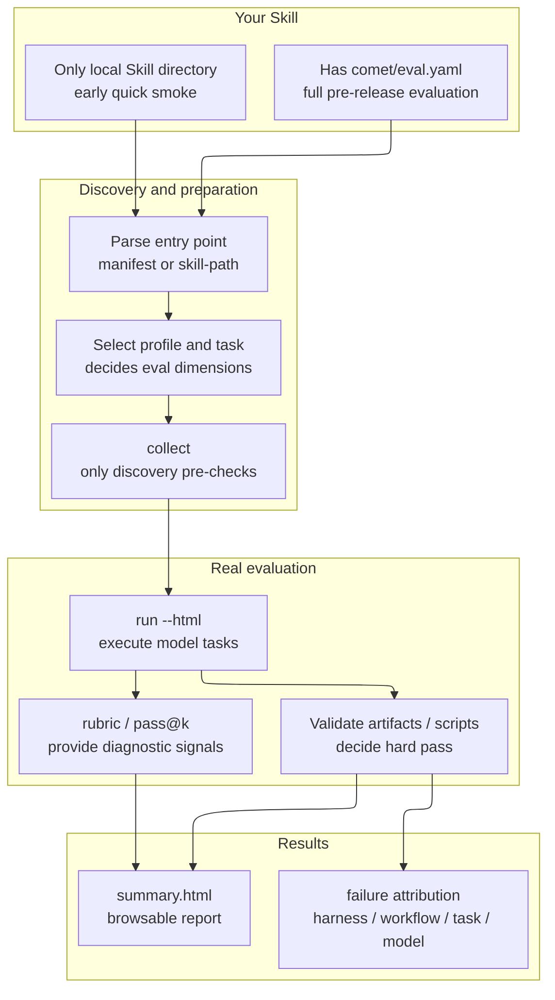
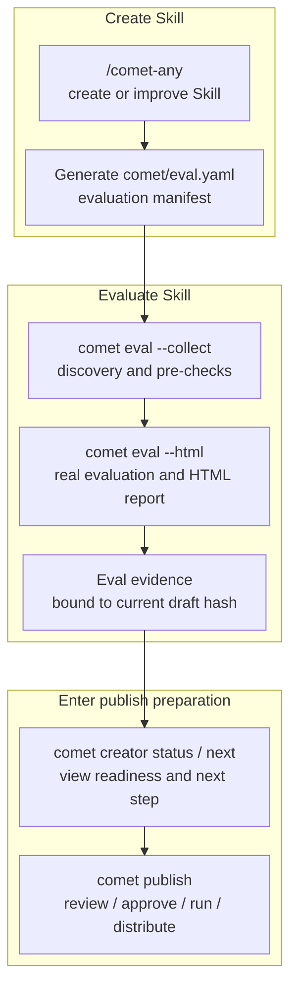

<Info>
  This is advanced content. If you just want to quickly run an evaluation, start with [Quickstart: Evaluating a Skill](/en/eval/quickstart).
</Info>

`comet eval` is Comet's general-purpose Skill evaluation entry point. It first answers one question: **the Skill you have in hand — as a product capability — can it pass a real task evaluation?**

This overview is split into two parts:

1. First, how your own Skill gets evaluated: entry points, tasks, scoring, reports, and failure attribution.
2. Then, how `/comet-any` connects eval results into publish readiness.

## What Problem It Solves

Ordinary users don't need to understand pytest, the task registry, profiles, treatments, or Docker details. `comet eval` wraps the local eval harness's launch path, task discovery, profile selection, and report generation, letting you run evaluations from the project root directory instead of manually switching to the `eval/` directory to assemble command-line parameters.

## Two Evaluation Systems, Don't Confuse Them

Comet has two evaluation systems with similar names but completely different purposes:

| System | Command | What it evaluates | Is it publish evidence? |
| --- | --- | --- | --- |
| **Authoring-time evaluation** | `comet eval` | Skill bundle or `comet/eval.yaml` | **Yes** |
| **Runtime check** | `comet skill check` | A specific Skill run | No |

`comet eval` answers "can this Skill, as a product capability, pass the evaluation", executing real model tasks through a shared eval harness. `comet skill check` answers "is this Skill run missing files or state", checking only runtime check items without running the model. See [Runtime check](/en/eval/runtime).

<p align="center">
  
</p>

<p align="center">`comet eval` produces pre-release evidence; `comet skill check` only checks whether a specific Skill run is complete — do not mix them</p>

## Part One: How Your Own Skill Gets Evaluated

From the user's perspective, `comet eval` does four things:

1. Find your Skill.
2. Find which evaluation tasks should run.
3. Have the model execute tasks in an isolated environment, and check the results with validators.
4. Generate a report that tells you whether it passed, why it failed, and what to do next.



## How to Choose an Entry Point

| Scenario | Command | Suitable stage |
| --- | --- | --- |
| Skill with `comet/eval.yaml` | `comet eval ./skill/comet/eval.yaml --html` | Full pre-release evaluation |
| Early local smoke test | `comet eval ./my-skill --skill-name my-skill --quick` | Early validation |

`comet eval [target]` judges from the target whether it's a manifest or a local Skill. You can also explicitly specify the entry point with `--manifest` or `--skill-path`; explicit entry points are mutually exclusive.

The priority is simple:

| Scenario | Recommended entry point |
| --- | --- |
| Has `comet/eval.yaml` | Pass the eval.yaml path directly |
| Only a local directory, still in early debugging | Pass the directory directly and add `--quick` |
| Want to enter publish readiness | Pass `comet/eval.yaml` directly |

<Warning>
  Don't treat a directory quick smoke as the final publish evaluation. It only covers the early smoke testing scenario.
</Warning>

## Why collect First

`collect` is the user's cheapest troubleshooting entry point. It only does discovery and pre-checks, executing no model or Docker tasks, suitable for quickly surfacing path, manifest, and task registration problems.

```bash
comet eval ./generated-skill/comet/eval.yaml --collect
```

It mainly answers:

- Whether the `comet/eval.yaml` path is correct
- Whether the eval harness can read this manifest
- Whether the recommended tasks in the manifest can be discovered
- Whether the current repo's eval dependency paths are available

It should not run the full model evaluation first, nor consume long-running tasks. On failure, you usually fix manifest, path, or task discovery issues first.

## comet/eval.yaml Manifest Format

`comet/eval.yaml` is the manifest for the full pre-release evaluation. It tells the eval harness: where the Skill is, which profile to use, which tasks to recommend running, and which evidence and artifacts are expected. Its format (parsed by the harness's `manifests.py`):

```yaml
apiVersion: comet.eval/v1alpha1        # Required, must exactly equal this value
kind: SkillEvalManifest               # Required, must exactly equal this value
metadata:
  name: my-skill
  description: A PR review assistant
skill:
  name: my-skill
  source: ".."                         # Skill directory relative to eval.yaml, default ".."
  profile: authoring-skill             # Optional, overrides profile
evaluation:
  recommendedTasks:                     # Recommended task list
    - authoring-skill-smoke
    - workflow-route-conformance
  baselineTreatments: [CONTROL]
  qualityGates:
    minWeightedScore: 0.8
    minPassAt1: 0.6
    maxInstabilityGap: 0.4
  requiredOutputSchemas: []
  expectedEvidence: []
  requiredSkills: [writing-plans, requesting-code-review]
  expectedArtifacts:
    - reference/resolved-skills.json
    - reference/workflow-protocol.json
interaction:
  mode: none                           # none or auto_user, default none
  maxTurns: 8                          # Outer round-trip limit between subject/simulator under auto_user, default 12
  simulatorPrompt: ""                  # Optional
```

<Warning>
  <code>apiVersion</code> and <code>kind</code> are strictly validated: not equaling <code>comet.eval/v1alpha1</code> / <code>comet.eval/SkillEvalManifest</code> will error directly. Ordinary users usually don't need to hand-write this file — <code>/comet-any</code> generates it.
</Warning>

The eval.yaml generated by `/comet-any` defaults to the `authoring-skill` profile. An ordinary workflow-kernel will recommend `generic-skill-smoke`, `authoring-skill-smoke`, and `workflow-route-conformance`; a `/comet`-based overlay additionally recommends `workflow-overlay-contract` and classic Comet workflow tasks to check the Output Schema, expected evidence, and overlay routing.

## Profile System

The eval harness has three built-in profiles, each determining rubric dimensions, default interaction mode, and scorer:

| Profile | Dimensions | Default interaction | Suitable for |
| --- | --- | --- | --- |
| `generic` | 7 | `mode=none`, `maxTurns=12` | Generic Skill smoke testing |
| `comet-workflow` | 9 | `mode=auto_user`, `maxTurns=12` | Classic `/comet` five-phase evaluation |
| `authoring-skill` | 11 | `mode=auto_user`, `maxTurns=8` | `/comet-any` generated Skills |

Profile resolution priority: `--profile` override > manifest's `skill.profile` > task's `evaluation.profile` > `generic`.

<Info>
  <code>maxTurns</code> is not the number of internal Agent messages or tool calls. It only takes effect in <code>auto_user</code> mode, limiting how many outer round-trips of "subject Agent reaches a decision point -> user simulator replies -> subject Agent continues with <code>--resume</code>" may occur.
</Info>

<Info>
  Tasks starting with <code>comet-*</code> or with <code>metadata.category=comet</code> are automatically inferred as the <code>comet-workflow</code> profile, and the interaction mode is automatically switched to <code>auto_user</code> (<strong>two Agents interacting automatically</strong>: one runs the Skill under test, the other simulates the user replying at decision points).
</Info>

## Scoring Metrics: rubric + pass@k/pass^k

eval is a **metric-driven** evaluation that doesn't just give pass/fail:

- **rubric multi-dimension scoring**: breaks Skill quality down into multiple dimensions (e.g. the five-phase main_flow/gate_guard, generic Skill's safety_boundary), each dimension 0.0–1.0, weighted and aggregated into `weighted_score`. **Informational**, for diagnosis.
- **pass@k / pass^k**: distinguishes the **capability ceiling** (at least one success out of k runs) from the **reliability floor** (all k runs succeed). Computed from multiple repeated runs (`--count N`). **Informational**.
- **Task validator pass/fail**: whether this implementation is actually correct (`target_artifacts` + `test_scripts`). **This is the hard pass/fail**.

For the complete dimension details, weights, formulas, and dual-agent interaction loop, see [Scoring Metrics and Dual-Agent Evaluation](/en/eval/scoring).

## Task System

The eval harness has a built-in set of tasks, each task being a directory (containing `instruction.md`, `task.toml`, `environment/`, `validation/`). Common tasks:

| Task | Category | Description |
| --- | --- | --- |
| `generic-skill-smoke` | generic | Generic Skill smoke test, produces and validates `result.md` |
| `authoring-skill-smoke` | generic | Generated Skill bundle smoke test, validates Engine bundle completeness |
| `workflow-route-conformance` | - | Validates whether the generated Skill runs in the expected stage order |
| `comet-full-workflow` etc. | comet | Different dimension evaluations of the classic five-phase |

**`recommended`** is not a task name but the CLI's default resolution path: when using `--manifest` it reads the manifest's `recommendedTasks`; without a manifest it runs each task's `default_treatments`.

## How to Evaluate with Only a Local Skill Directory

If you don't yet have a `comet/eval.yaml` and only have a local Skill directory, you can do a quick smoke first:

```bash
comet eval ./my-skill --skill-name my-skill --quick
```

This path is suitable for early validation:

- Whether the Skill directory is readable
- Whether the eval harness can inject it as a dynamic Skill
- Whether the generic smoke task can run

The current quick smoke defaults to `generic-skill-smoke`. This is only early smoke testing and **is not equivalent** to complete pre-release evidence.

## Part Two: How /comet-any Connects to eval

`/comet-any` is responsible for creating or improving a Skill, and `comet eval` is responsible for verifying that the Skill can be discovered, run, and produce a report by the eval harness. The connection point between the two is the `comet/eval.yaml` in the artifact and the Eval evidence after evaluation.



Complete chain:

```text
/comet-any generates Skill
  -> produces comet/eval.yaml
  -> comet eval --collect does discovery pre-checks
  -> comet eval --html executes real evaluation
  -> comet creator reads evaluation results and enters readiness / review / publish / distribute
```

`comet eval` is not responsible for publishing. Publishing is still handled by the creator / publish commands: creation and state recovery are exposed to ordinary users as [comet creator](/en/cli/creator), and publishing and distribution as [comet publish](/en/cli/publish). eval's responsibility is to provide pre-release evidence.

## Recommended Path: Evaluating a /comet-any Generated Skill

After `/comet-any` generates a Skill, first look for this file:

```text
generated-skill/
  comet/
    eval.yaml
```

Then run in two steps:

```bash
comet eval ./generated-skill/comet/eval.yaml --collect
comet eval ./generated-skill/comet/eval.yaml --html
```

The first step, `collect`, only confirms "can the tasks be discovered", suitable as a low-cost pre-check right after generating a Skill. The second step, `run --html`, executes the real evaluation and generates a browsable report.

## How Eval Results Enter Publish Readiness

After recording the Eval result, `/comet-any` or the creator / publish backend incorporates it into publish readiness. Users only need to know two things:

1. The results produced by `comet eval` become the evidence source for `Publish readiness:`.
2. When the current hash is missing Eval evidence, `User next steps:` must first point to completing the evaluation, not continuing to publish.

The usual sequence is:

```bash
comet eval ./generated-skill/comet/eval.yaml --collect
comet eval ./generated-skill/comet/eval.yaml --html
comet creator next <name> --json
```

`comet creator next` only outputs the single recommended next user command; `comet publish review` shows `Publish readiness:`, `User next steps:`, `Readiness:`, `Blockers:`, `Warnings:`, and `Evidence:` to the user.

## How /comet-any Uses eval Results

From the user's perspective, after eval finishes, hand the results back to `/comet-any` to continue. `/comet-any` will incorporate the eval evidence into readiness:

| Situation | Can publish? |
| --- | --- |
| No eval evidence | No |
| eval failed | No |
| eval evidence matches an old hash | No |
| `.comet/skill-preferences.yaml` changed and strict mode | No — must reconfirm or regenerate |
| eval passed and hash matches | Can proceed to review / publish judgment |

Users don't need to manually edit internal state, nor should they manually write report paths into JSON. `/comet-any` records structured evidence through the backend.

## The Minimum You Need to Remember

1. The core question of `comet eval` is: can this Skill, as a product capability, pass a real task evaluation.
2. If you have `comet/eval.yaml`, use it for the full evaluation; with only a local directory, you can only do a quick smoke first.
3. First `collect`, then `run --html`.
4. `/comet-any` artifacts connect eval results into publish readiness, but eval itself is not a publish action.
5. `comet eval` (authoring-time) and `comet skill check` (runtime) are two different systems — don't mix them.

## Next steps

- [Scoring Metrics and Dual-Agent Evaluation](/en/eval/scoring) — rubric dimension details, pass@k/pass^k, dual-agent interaction loop
- [Eval harness](/en/eval/harness) — understand the internal mechanism of collect and run, environment variables, and report generation
- [Reading Evaluation Reports](/en/eval/reports) — learn to read report signals and failure attribution
- [Runtime check](/en/eval/runtime) — distinguish `comet eval` and `comet skill check`
- [comet eval command](/en/cli/eval) — complete options and subcommand reference
