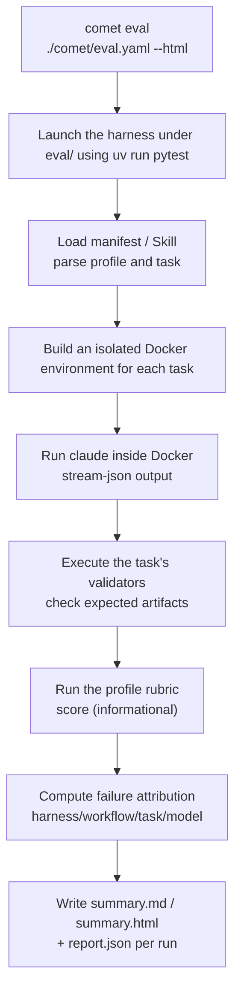

This page is the shortest onboarding path for evaluating a Skill: prepare the environment first, then run a full evaluation in two commands. For the complete mechanism, failure attribution, and report interpretation, see the [advanced content](#advanced-content).

## What Problem Evaluation Solves

Before publishing a Skill, you need to answer one question: **can this Skill, as a product capability, pass a real task evaluation?** `comet eval` is the tool that answers this. It wraps the underlying details (pytest, Docker, task registration, profiles, reports) so you can run evaluations from the project root directory.

The evaluation result is **mandatory evidence** for `/comet-any` before publishing — a Skill that hasn't passed evaluation cannot be published.

## What You Need

- A Skill already generated via [`/comet-any`](/en/skill-creator/getting-started) (the artifact contains `comet/eval.yaml`)
- Or a local Skill directory (for early smoke testing).

If you don't have a Skill yet, first read [Composing Any Skill Quickstart](/en/skill-creator/getting-started).

## What You Need to Prepare Before Running

These dependencies are not part of the core Comet runtime. The eval harness only needs them when you run `comet eval` to start real model tasks. Confirm the environment first. When Docker, the `claude` CLI, or model credentials are missing, the suite usually **skips** instead of erroring.

### Required

| Dependency | Description | How to check |
| --- | --- | --- |
| **uv** | Python package manager; `comet eval` uses it internally to drive pytest | `uv --version` |
| **Python 3.11+** | Runtime for the eval harness | `python --version` |
| **Docker** | Used to build task images, isolate the running Claude and validators | `docker info` |
| **`claude` CLI** | On PATH; the harness invokes it inside Docker | `claude --version` |
| **`ANTHROPIC_API_KEY`** or **`ANTHROPIC_AUTH_TOKEN`** | Model call credentials. When neither is present the entire suite is skipped | `echo $ANTHROPIC_API_KEY` |

<Tip>
  When neither API key is present, the harness won't fail — it will <strong>skip all cases</strong>. If you see an evaluation "pass instantly" with no real run, it's most likely the environment isn't ready. Confirm all four items above are in place first.
</Tip>

### Install uv and Python

If you don't have `uv` yet:

```bash
# macOS / Linux
curl -LsSf https://astral.sh/uv/install.sh | sh

# Windows (PowerShell)
powershell -ExecutionPolicy ByPass -c "irm https://astral.sh/uv/install.ps1 | iex"
```

`uv` will automatically manage Python versions. On first run it creates a `.venv` under `eval/` and installs dependencies (`pytest`, `pyyaml`, `pydantic`, etc.).

### Configure the API key

```bash
# Recommended: set directly in the environment
export ANTHROPIC_API_KEY=sk-ant-...

# Or use proxy-type credentials (BigModel / OpenRouter, etc.)
export ANTHROPIC_AUTH_TOKEN=...
```

You can also configure it in `eval/.env` (the harness will load it):

```bash
# eval/.env
ANTHROPIC_API_KEY=sk-ant-...
```

<Warning>
  If you provide the key via a <strong>system environment variable</strong>, don't copy the <strong>empty assignment</strong> like <code>ANTHROPIC_API_KEY=</code> from <code>.env.example</code> verbatim into <code>.env</code>. Empty assignments can override an existing system environment variable in some loading paths, causing the key to "disappear". For recordings or demos, you can skip creating <code>.env</code> (or create a completely empty file) and leave the key in the system environment variable.
</Warning>

### Optional

| Environment variable | Purpose |
| --- | --- |
| `BENCH_CC_MODEL` | Override the Claude model |
| `BENCH_CC_VERSION` | Claude Code version in the Docker image (default `latest`) |
| `BENCH_LLM_JUDGE=1` | Enable the optional LLM-as-judge override scoring |
| `BENCH_SIMULATOR_PROMPT_FILE` | Custom user simulator prompt file (default `eval/simulator-instruction.md`), overrides the user behavior profile simulated in auto_user evaluation |
| `COMET_EVAL_REPORT_CONFIG` | Report output config path (replaces `--report-config`) |

<Note>
  <strong>Using an Anthropic-compatible proxy?</strong> When <code>ANTHROPIC_API_KEY</code> is not set, write <code>ANTHROPIC_AUTH_TOKEN</code> + <code>ANTHROPIC_BASE_URL</code> (BigModel / mimo / OpenRouter, etc.) into <code>eval/.env</code>, and the harness will have the <code>claude</code> inside Docker authenticate with them. For the complete variable table, see <a href="/en/eval/harness#environment-variable-reference">Eval harness · Environment Variable Reference</a>.
</Note>

---

## Shortest Path: Two-Step Evaluation

Once the environment is ready, evaluation takes just two steps.

### Step 1: Discovery pre-check (collect)

First confirm that eval can discover your Skill and tasks. This step **consumes no model calls** and has the lowest cost:

```bash
comet eval ./generated-skill/comet/eval.yaml --collect
```

If the output has no errors, the manifest, paths, and tasks can all be correctly discovered.

<Tip>
  Only have a local Skill directory, no <code>comet/eval.yaml</code> yet? Use the early smoke path:
  ```bash
  comet eval ./my-skill --skill-name my-skill --quick
  ```
  This uses the <code>generic-skill-smoke</code> task for a smoke test, which <strong>is not equivalent to pre-release evidence</strong>.
</Tip>

### Step 2: Execute the real evaluation (run)

After confirming discovery is fine, run the real evaluation and generate a browsable HTML report:

```bash
comet eval ./generated-skill/comet/eval.yaml --html
```

After running, the CLI prints `Report path` pointing to the generated report. Open it to see whether the result passed.

<Info>
  Without <code>--collect</code>, the model is actually invoked, consuming tokens and time. The duration of one evaluation depends on the number of tasks and how many outer round-trips of "subject Agent reaches a decision point, user simulator replies, subject Agent continues" are allowed under <code>auto_user</code> mode. <code>maxTurns</code> limits this round-trip ceiling, not the Agent's internal tool call count. Using <code>--collect</code> to troubleshoot first avoids waste.
</Info>

<p align="center">
  
</p>

<p align="center">First use `--collect` to catch path, manifest, and task discovery issues, then use `--html` to execute the real evaluation and generate a browsable report</p>

## Only Three Things to Focus On in the Report

1. **Whether the evaluation passed** — the report header or CLI output will tell you clearly.
2. **Failure attribution** — if it didn't pass, see whether the failure is attributed to `harness`, `workflow`, `task`, or `model`. This determines what you should fix.
3. **Report location** — usually `eval/local/logs/experiments/<experiment-id>/summary.html`.

For the complete report structure, see [Reading Evaluation Reports](/en/eval/reports).

## What to Do After the Evaluation Passes

The passing evaluation result becomes `/comet-any`'s pre-release evidence. Hand the result back to `/comet-any` to continue, or use the creator command to check readiness:

```bash
comet creator status my-skill --project . --json
comet creator next my-skill --project . --json
```

See [Publishing and Distributing a Skill](/en/skill-creator/publishing).

---

## What Happens Inside a Single Evaluation

Understanding this section helps you judge whether an evaluation result is trustworthy. `comet eval ... --html` does the following internally:



Key points:

- The model runs inside a **Docker container**, isolated from your working directory to avoid contamination.
- **Expected artifacts** are a hard check — the files the task requires must exist.
- **rubric** scoring is **informational** (the `[RUBRIC]` lines) and does not directly determine pass/fail; the real pass/fail is determined by the validators and whether the "required skill" was invoked.

## FAQ

<AccordionGroup>
  <Accordion title="collect errors saying it can't find the manifest">
    Check whether the path is correct and confirm the `comet/eval.yaml` file exists. If you're not in the Comet repo root directory, add `--project <dir>` to point to the correct root.
  </Accordion>

  <Accordion title="run errors saying it can't find the report">
    Look at the `Experiment` and `Report path` in the CLI output. If the path contains `<experiment-id>`, look it up in the `eval/local/logs/experiments/` directory using the actual experiment id.
  </Accordion>

  <Accordion title="The eval &quot;passes&quot; instantly but it doesn't feel like it really ran">
    Almost certainly the environment is not ready: Docker isn't running, no `ANTHROPIC_API_KEY`, or the `claude` CLI isn't on PATH. In these cases the harness will **skip** rather than fail. First confirm [What you need to prepare before running](#what-you-need-to-prepare-before-running).
  </Accordion>

  <Accordion title="Should I use comet eval or comet skill check">
    To evaluate whether a Skill's product capability can pass, use `comet eval`. To check whether a specific Skill run is missing artifacts or state, use `comet skill check`. Pre-release evidence only needs `comet eval`. See [Runtime check](/en/eval/runtime).
  </Accordion>

  <Accordion title="Why run in Docker">
    For isolation. Each task has its own Dockerfile and environment; Claude produces files inside the container and the validator also checks inside the container, so it won't contaminate your working directory. The image is built only once per session.
  </Accordion>
</AccordionGroup>

## Advanced Content

The basic path ends here. If you need a deeper understanding of the evaluation system, read these pages:

| Advanced topic | Suitable scenario |
| --- | --- |
| [Evaluation System Overview](/en/eval/overview) | Understand where eval fits in Skill creation, validation, and publish readiness |
| [Scoring Metrics and Dual-Agent Evaluation](/en/eval/scoring) | rubric dimension details, pass@k/pass^k, dual-agent automatic interaction |
| [Eval harness](/en/eval/harness) | Understand the collect/run internal mechanism, profiles, task selection, environment variables |
| [Reading Evaluation Reports](/en/eval/reports) | Complete failure attribution, report signals, experiment id, and next-step judgment |
| [Runtime check](/en/eval/runtime) | Distinguish `comet eval` and `comet skill check` |
| [comet eval command](/en/cli/eval) | Complete options, arguments, and troubleshooting reference |
