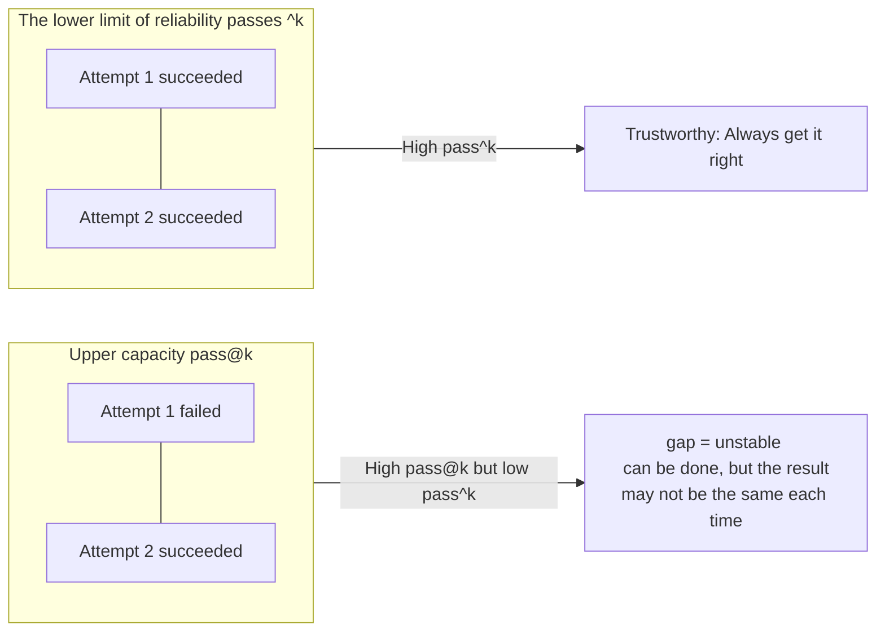

<Tip>
This is advanced content, aimed at users who want to understand how eval scores, how metrics are calculated, and how automatic multi-round evaluations run. For daily assessment, you can quickly get started with ](/en/eval/quickstart).
</Tip>

<Warning>
This page contains advanced content for source code/maintainers. Ordinary users do not need to clone Comet to run the evaluation; Only by rechecking the scoring device
It is only necessary to pull the source code when task evidence or automatic interaction is implemented. For daily operation, please refer to [Quick Start ](/en/eval/quickstart)
</Warning>

Comet eval uses task checks to determine whether a run passes. Rubric, pass@k, pass^k, and weighted scores provide diagnostic information. Multi-stage workflow tasks can be driven by a subject Agent and a user-simulator Agent.

## Look at these first when reading the report

If you are not debugging the scorekeeper, you can read the report in this order

|Sequence|Report signal|Judge what|
| --- | --- | --- |
| 1 | `checks_failed` |Whether this operation really failed; Only when it is empty can it be considered passed|
| 2 | failure attribution |Should the failure be attributed to the environment, workflow, task or model|
| 3 | `pass@k` / `pass^k` |Does Skill succeed occasionally or run stably repeatedly|
| 4 | `weighted_score` |Weighted diagnostic score of the quality dimension|
| 5 |The minimum rubric dimension|Where will the next round of optimization prioritize investment|

<Note>
When making daily release judgments, don't just look at <code>weighted_score</code>. The true pass/fail first looks at <code>checks_failed</code>; rubric, pass@k and pass^k are used to determine quality, stability and the direction of the next optimization.
</Note>

## Scoring metrics

|Indicator|The questions answered|Type|Is there an access control?|
| --- | --- | --- | --- |
|"rubric Dimension Scores" (0.0-1.0)|How is this dimension going|Diagnostic|No (informational)|
|"weighted_score" (Weighted total score)|How about the overall quality?|Diagnostic|no|
|**RubricAvg** (Report Column)|The dimensions of this run are evenly divided|Diagnostic|no|
| **pass@k** |The probability of success at least once out of k attempts (upper limit of ability|Distribution|no|
| **pass^k** |The probability of success in all k attempts (reliability lower limit)|Distribution|no|
|"Workflow Contract Inspection.|Whether the Skill under test is really triggered according to the contract|Hard judgment|Yes (Failure due to the lack of essential skills)|
|The task validator passes/fails|Is this realization correct or not|Hard judgment|Yes (Decide pass/fail)|

<Note>
  <strong>Key distinction</strong>: rubric dimension scores and pass@k/pass^k are <strong>informational metrics</strong> used for diagnosis and comparison. Actual <strong>pass/fail</strong> is determined by <code>checks_failed == []</code>. Most failures come from task validators (the existence of <code>target_artifacts</code> plus <code>test_scripts</code>), but a profile can also add Workflow Contract failures, such as a required Skill not being invoked, to <code>checks_failed</code>.
</Note>

## Where does the evidence come from

Comet eval collects runtime evidence from Claude CLI stream-json, task artifacts, validator results, and Runtime state.

The single-round evaluation will directly run the Agent under test in the task directory of Docker:

```bash
claude -p "$prompt" \
  --dangerously-skip-permissions \
  --output-format stream-json \
  --verbose
```

The eval harness saves the original `stdout`/`stderr` of this run and then parses the JSONL events in `stdout` line by line. The parser will extract:

- The `duration_ms`, `num_turns`, token and cost in the `result` event
- Tool calls in the `tool_use` event
- The `Bash` command, as `commands_run`
- The file path of `Write`/`Edit`, as `files_created`/`files_modified`
- The `Skill` call, as `skills_invoked`
- The corresponding `tool_result` output is hung back to the original tool call

So the `Skills invoked`, `commands_run`, `tool_calls`, `files_created`, token/cost, etc. in the report are all observable behavior logs sorted out from the structured event stream of Claude CLI.

<Warning>
stream-json is still just the observable behavior log <strong> </strong>. It is suitable for statistics on tool calls, commands, Skill calls, file changes and costs. It does not contain internal reasoning of the model and cannot prove the causal chain of a certain internal decision. schema changes, bad JSON lines, and CLI version changes may all affect parsing, so raw stdout/stderr will be retained for auditing.
</Warning>

### Trajectories and event streams are not the same thing

Comet Classic runtime itself also writes `.comet/trajectory*.jsonl` to record state progress, such as `state_transitioned`. This type of trajectory is one of the pieces of evidence of recovery ability. rubric will check whether it exists in `recovery_resilience`.

But pass@k/pass^k does not calculate from the trajectory, and most of the dimensions of rubric do not look only at the trajectory. The main sources of evidence are Claude CLI stream-json, the products in the task directory, the results of the task validator, and the status files left by Comet runtime.

## rubric score

rubric breaks down the quality of Skill into multiple dimensions,    each of which consists of several binary (pass/fail) checkitems. The dimension score = the number of passed items/the  total number of items (0.0-1.0). Output a line of `[RUBRIC] < Dimension >: < Fraction > - < Cause >` for each dimension.

Scoring methodology (aligning with industry practices such as Galileo, Hebbia, and τ-bench) :

- Each dimension contains N binary checkitems
- Dimension score = passed/total (0.0-1.0)
- Weighted total score = Σ(Dimension score × weight)/Σ(weight)
- The weight reflects the importance of dimensions to the quality of the workflow

### Three sets of rubric

eval comes with three sets of rubric, corresponding to three profiles:

| Profile |Dimension number|"Weights and|Interactive mode|Suitable|
| --- | --- | --- | --- | --- |
| `generic` | 7 | 7.7 |`none` (Single Wheel)|General Skill is smoking.|
| `comet-workflow` | 9 | 11.0 |`auto_user` (Multi-wheel)|The classic `/comet` five-stage|
| `authoring-skill` | 11 | 13.8 |`auto_user` (Multi-wheel)|Products of `/comet-any`|

### comet-workflow rubric (9-dimensional)

Evaluate the classic five-stage workflow. The nine `[RUBRIC]` dimension scores themselves are diagnostic scores; However, the profile will still check the Workflow Contract: if `comet`, nested Comet stage skills, OpenSpec dependent skills, or Superpowers dependent skills are not actually triggered, a hard failure will occur.

|"Dimension"|"Weight|Check what|
| --- | --- | --- |
| `completion` |**2.0** (maximum|The baseline validator passes the proportion (whether the task is done correctly or not)|
| `main_flow` | 1.5 |How many stages of the five phases (open→design→build→verify→archive) leave evidence|
| `gate_guard` | 1.5 |Have you used `comet-guard`/`transition`/`--apply`|
| `artifact_quality` | 1.2 |Proposal/design/tasks/test whether substance (proposal contains 10 lines, the design trade-offs or keywords, the tasks of three or more check the item, have asserted test)|
| `skill_invocation` | 1.0 |Whether the comet entry, nested Comet stage skills, OpenSpec dependency skills, and Superpowers dependency skills are truly observed, and whether the entry precedes the stage skills|
| `spec_drift` | 1.0 |Is the delta spec modified during the build period reconcile before archiving (neutral 1.0 if the spec is not modified)?|
| `decision_point_compliance` | 1.0 |Whether to pause at the decision point and ask the user instead of making an automatic decision (the number of ASK calls ≥ half of the number of mutations)|
| `recovery_resilience` | 1.0 |After the interruption is properly retained and restoring the state (checkpoint/trajectory/context/pending/.com et. Yaml five)|
| `efficiency` |"0.8 (minimum)|Cost normalization (turns≤80, tools≤150, duration≤600 seconds)|

### generic rubric (7-dimensional)

Evaluate general skills. Unlike comet-workflow, ** It causes a hard failure when "the required Skill is not called" ** (when `require_skill_invocation: true`), while the rest of the dimensions are informative.

|"Dimension"|"Weight|Check what|
| --- | --- | --- |
| `completion` | **2.0** |The baseline validator passes the proportion|
| `safety_boundary` | 1.2 |Are there any dangerous commands (`rm -rf`, `git reset --hard`, 'curl... \| sh`） |
| `skill_invocation` | 1.0 |Whether all required skills are invoked (neutral 1.0 if not configured)|
| `artifact_presence` | 1.0 |Does expected_artifacts exist (supporting glob)?|
| `instruction_following` | 1.0 |Is there a failure check that mentions "constraint"?|
| `interaction_compliance` | 0.8 |Whether the outer round trip exceeds max_turns in auto_user mode|
| `efficiency` | 0.7 |The same as the efficiency threshold of comet|

### authoring-skill rubric (11-dimensional)

Evaluate the Skill package generated by `/comet-any`. It first inherits the four shared dimensions of generic and then adds seven package-specific checks. Missing SKILL.md, missing resolven-skills.json, missing workflow-protocol.json, missing Engine file, missing authoring-lanes.json, missing skill-review.md All of them will result in hard failures.

|"Dimension"|"Weight|Check what|
| --- | --- | --- |
| `workflow_route_conformance` |**1.5** (tied for the highest with completion)|Whether the protocol routing order is consistent with the expected Node order, whether the internal Node Skill files are complete, and whether `comet/eval.yaml` lists the routes|
| `completion` | 1.5 |Inherited from generic|
| `generated_package` | 1.4 |The package contains + skill.md with routes/pause points/workflows and resolved-skill references/recovery guidelines|
| `resolved_skill_evidence` | 1.2 |`reference/resolved-skills.json` exists and `sourceSummaries` is non-empty|
| `engine_contract` | 1.2 |Under `comet/` `skill.yaml`/`guardrails.yaml`/`checks.yaml`/`eval.yaml` (1.0) Engine is lightweight package neutral|
| `authoring_lanes` | 1.2 |`reference/authoring-lanes.json` contains 6 required lanes (skill-core/script-contract/reference/pause-points/eval/skill-review) and the review is passed|
| `safety_boundary` | 1.2 |Inherited from generic|
| `skill_invocation` | 1.0 |Inherited from generic|
| `artifact_presence` | 1.0 |Inherited from generic|
| `review_gate` | **0.8** |`reference/skill-review.md` report passed, authoring-lanes review passed, no blocking finding|
| `review_readiness` |"0.8 (minimum)|If there are no hard failures in the generic layer, it is 1.0|

### Weighted total score formula

```text
weighted_score = Σ(Dimension score × weight) / Σ(weight)
```

Output one line of `[RUBRIC] <dim>: <score> - <reason>` for each dimension, and finally output one line of `[RUBRIC] weighted_score: < points >`.

### RubricAvg (Report Column)

The `RubricAvg` column in the report is the ** simple average score ** (sum/len) of all dimension scores (including the `weighted_score` row) of this run. When running across multiple runs, it is the average of the average scores of each run. It is a summary of rapid horizontal comparison, which is different from the single rubric `weighted_score` (using their respective weights) algorithm.

### LLM-as-judge coverage (Optional)

Enable `BENCH_LLM_JUDGE=1`. By default, Comet's final `weighted_score` is a rule score, not an LLM-as-judge. Rule-based rubric can capture structural signals (file existence, command execution), but it cannot grasp the substantive depth of the product - has the agent really made meaningful output, or has it only generated a stub? The LLM judge has a judging model read the workspace artifacts and re-score them, then output the `[RUBRIC-JUDGE]` line (distinguished from the `[RUBRIC]` line scored by the rules). best-effort: If it fails, it will fall back to the rule score without affecting the operation.

judge runs on the host machine (not within Docker) by reusing the `claude` CLI without introducing new dependencies. However, the configuration of the referee and the configuration of the Agent under test are deliberately isolated: when `BENCH_LLM_JUDGE=1` is enabled, `BENCH_JUDGE_MODEL` must be explicitly set, and it is not possible to fall back and reuse the `ANTHROPIC_MODEL` of the main model.

If `BENCH_JUDGE_BASE_URL` and `BENCH_JUDGE_AUTH_TOKEN`/`BENCH_JUDGE_API_KEY` are configured, judge will give priority to directly invoking Anthropic Messages HTTP (`/v1/messages`). When there is no dedicated judge endpoint, roll back to the host `claude` CLI, clear the inherited main `ANTHROPIC_*` provider Settings in the child process, and then map the independent judge configuration to your own CLI call:

|Environmental variable|Purpose|
| --- | --- |
| `BENCH_JUDGE_MODEL` |Required. Referee model It serves as the request model during direct HTTP and is passed to `claude --model` and the child process `ANTHROPIC_MODEL` during CLI fallback|
| `BENCH_JUDGE_AUTH_TOKEN` |Optional. The Anthropic compatible proxy token for referees takes precedence over `BENCH_JUDGE_API_KEY`|
| `BENCH_JUDGE_BASE_URL` |Optional. Anthropic compatible proxy address for referees|
| `BENCH_JUDGE_API_KEY` |Optional. Anthropic API key for referees; When setting the auth token, no child process will be passed in|

This design is to avoid the situation where "the same model acts as both the player and the judge" : the main Agent can continue to use its own `ANTHROPIC_MODEL`, `ANTHROPIC_BASE_URL` and token, while the judge must declare the model and provider separately. The direct HTTP path can also avoid the problem that some strictly Anthropic compatible proxies do not accept additional request parameters from the Claude CLI. If `BENCH_LLM_JUDGE=1` is enabled but `BENCH_JUDGE_MODEL` is missing, the report will be written as

```text
[RUBRIC-JUDGE] status: skipped - BENCH_JUDGE_MODEL is required when BENCH_LLM_JUDGE=1
```

This skipped state will not be marked as `enabled_and_successful`, nor will the referee model be invoked.

Different profiles cover different dimensions:

| Profile |Coverage dimension|Explanation|
| --- | --- | --- |
| `comet-workflow` | `artifact_quality`、`spec_drift`、`main_flow` |Three qualitative dimensions with relatively weak re-scoring rules (`llm_judge.py`)|
| `generic` / `authoring-skill` | `task_completion`、`output_quality`、`instruction_adherence` |General three dimensions, plus the `rubric_criteria` declared in the `task.toml` task as the `custom_N` dimension (`generic_llm_judge.py`)|

The three-dimensional scoring criteria of generic/authoring:

|"Dimension"|1.0 (Full marks| 0.5 | 0.0 |
| --- | --- | --- | --- |
| `task_completion` |All requirements are met, the product exists and is correct, and the baseline check is passed|Partially completed|The key products are missing or empty|
| `output_quality` |Well-structured, complete, extraordinary and with traces of thought|It exists but is shallow and barely meets the standards|Missing, empty, obvious stub|
| `instruction_adherence` |Fully comply with instructions and constraints, have no prohibited modes, and use tools properly|Slightly deviated but with the core intention retained|Serious violation, dangerous order, constraint failure|

When judge collects workspace files, it skips directories such as `.git`, `node_modules`, and `.comet`. The upper limit for a single file is 3,000 characters, and the total budget is 20,000 characters. Large files (>50KB) and binary files will be skipped to ensure that the prompt does not get out of control. The referee must output line by line in the `[RUBRIC-JUDGE] <dim>: <score> - <reason>` format, with each reason no more than 25 words and specific content cited.

## pass@k and pass^k

These two indicators measure "ability vs. reliability" and are the key to evaluating whether a Skill can run stably and repeatedly. They are calculated based on the pass/fail sequence of ** repeated runs ** (generated by `--count N`).

### Definition

|Indicator|Formula|Meaning|
| --- | --- | --- |
|**pass@k** (upper capacity)| `1 - C(n-c, k) / C(n, k)` |The probability of success at least once out of k independent attempts (HumanEval unbiased estimation)|
|**pass^k** (Lower reliability limit)|`1.0` if and only if `c == n`, otherwise `0.0`|The probability of success in all k attempts|

Here, n = total number of runs, and c = number of successful runs. "Success "= Zero failure of the task validator in this run.

### Why do we need two?



<p align="center">
  
</p>

<p align="center">pass@k check the upper limit of capacity, pass^k check the lower limit of reliability. The greater the gap between the two, the more unstable it is. </p>

- **pass@k high, pass^k low ** : Sufficient ability, but ** unstable ** - "Can do it, but cannot guarantee to do it right every time". Repeatedly running a Skill to a user is a danger signal.
- Both are high: they can do it and do it right every time - reliable.

The report shows `pass@k − pass^k` as a comparison of repeated-run results.

### How can I get multiple runs

`--count N` (pytest option) repeats each `(task, treatment)` combination N times to generate N independent pass/fail results. The comparison report first filters out the analysis set: explicit environment or runner noise will be excluded, and flagged run still enters the main statistics but will be marked. The N Boolean values in the analysis set are the input of pass@k/pass^k.

```bash
# Repeat 5 times to make pass@k/pass^k meaningful
# (Actually driven indirectly through comet eval, the underlying equivalent is --count 5)
```

<Warning>
The report warns when running is insufficient: <em>"Only N run per treatment - pass@k/pass^k for k> 1 need ≥2 runs to be meaningful. Use <code>--count 5</code>." a single run of </em> counts as pass@1/pass^1, k> The indicator of 1 needs to be repeated many times.
</Warning>

### How to choose k

The report takes the k value from `{1, 2, 5}` that does not exceed the actual running number n (k is clamp-down to n), and if it is insufficient, it reverts to `[1]`. Report columns: `pass@1 [pass@2 pass@5]` and `pass^1 [pass^2 pass^5]`.

### Where is it?

pass@k/pass^k is not in `summary.md`, but in the `## pass@k/pass^k — capability vs reliability` section of the ** Comparative report ** (`comparison_report.md` produced by `compare_baselines.py`). They are informative, not access control.

## Dual-agent automatic interaction evaluation

For multi-stage workflow skills (`comet-workflow` and `authoring-skill` profiles), the evaluation is completed by the automatic interaction of ** two agents **, without the need for human intervention.

### Two roles

|"Role"|What to do|Conversation|
| --- | --- | --- |
|The tested Agent (subject)|Run the Skill under test (such as `/comet` five stages)|Single continuous session, with `--resume` continuing in each round|
|"User Simulation Agent (simulator)|Simulate user responses at the decision point (approve reasonable plans, select reasonable defaults, and clarify only when there is real ambiguity)|A one-time `claude -p` call at each decision point, stateless|

### Interactive loop

```mermaid
flowchart TD
    Start["Round 1: The tested Agent receives the task prompt<br/> and runs the Skill for the new session"] --> Parse["Parse the output and extract the session_id and the result text"]
    Parse --> Decision{"Is it a decision point? <br/>(? /confirm/choose /<br/>approve/which ... )"}
    Decision -->|is| Sim["The user simulates the Agent to generate the reply <br/> to approve the plan/select default/push forward"]
    Decision -->|no| Complete{"Workflow completed? <br/>(archive complete /<br/>all 5 phases/done)"}
    Sim --> Resume["Next round: The tested Agent --resume the same session <br/> feed in the simulated user response"]
    Resume --> Parse
    Complete -->|is| End["End the loop"]
    Complete -->|no| Nudge["Send a "continue" prompt to advance"]
    Nudge --> Resume
```

The loop has a maximum of `max_turns` outer round trips (comet-workflow usually 12 times, authoring-skill usually 8 times), and if it hits "Complete" (`archive complete`/`workflow complete`/`all 5 phases`, etc.), it ends prematurely.

Each round of the tested Agent is run with `--output-format stream-json --verbose`. The loop driver only concatenates the stream-json stdout of each round of the Agent under test for harness parsing. One-time responses from the user simulation Agent will not enter the main event stream. Therefore, event statistics only reflect the observable behavior of the subject Agent.

<Note>
<code>max_turns</code> is neither the actual number of working rounds within the Agent under test nor the number of tool calls. An outer round trip refers to: the Agent under test runs to the decision point, the user simulates the Agent's response, and then the Agent under test continues with <code>--resume</code>. The same round trip may still contain multiple assistant messages, tool calls, and file operations internally.
</Note>

### Decision point detection

If the output text of the Agent under test matches these signals, it is determined as a decision point (case-insensitive) :

```text
? | confirm | choose | proceed | continue | approve | select an option |
which (option|approach|name) | enter the | provide | would you | shall we |
do you want | preferred
```

It also supports custom `--decision-pattern`.

### The user simulates the instructions of the Agent

The simulated Agent received the simulator prompt + the last message of the Agent under test, and was required to:

- When asked to confirm, ** approve ** the proposed scheme/name/plan
- When asked to choose, ** select the most reasonable default **
- Only ask for clarification when the question is truly ambiguous about "what to do"
- Never refuse, always keep the workflow moving forward
- "Do not write code or files.

comet-workflow uses `COMET_SIMULATOR_PROMPT`, and generic/authoring uses `GENERIC_SIMULATOR_PROMPT` (the wording is slightly simplified). When the simulation response is empty, roll back to `"Yes, please proceed with the recommended option."`.

#### Customize the simulator prompt word

The simulator instructions evaluated by auto_user can be overridden. By default, it reads from `eval/simulator-instruction.md`, and its content is the standard template of the above principles. Two coverage methods (priority from high to low) :

|"Method"|How to set|Scope of application|
| --- | --- | --- |
| `--simulator-prompt "..."` |pytest command-line parameter|Single run|
| `BENCH_SIMULATOR_PROMPT_FILE=<path>` |Environment variables (can be written into user-level `.env`)|All auto_user runs|

The relative path of `BENCH_SIMULATOR_PROMPT_FILE` is resolved from `eval/`, with the default value `simulator-instruction.md`. When the file exists, replacing it lets you test different user behavior profiles without modifying the harness.

### Design purpose

Workflow skills will pause at the decision point and wait for user confirmation. If the evaluation only runs a single round, Skill will get stuck at the first decision point. The dual-agent loop enables the evaluation to automatically run the entire workflow (open→...) →archive), and the user simulates the Agent to generate reasonable decision point inputs that can drive the process. Only in this way can the rubric score and pass/fail measured reflect the real usage scenarios.

### Single round vs. multiple rounds

- **`generic` profile** (`interaction.mode: none`) : Single-round, the Agent under test runs all at once (suitable for smoking tasks that do not require interaction).
- **`comet-workflow`/`authoring-skill` profile** (`interaction.mode: auto_user`) : Multi-round, enabling dual-agent loop.

Tasks starting with `comet-*` or `category: comet` will be automatically inferred as `comet-workflow` profile and `auto_user` will be enabled.

## The three axes of evaluation: treatment × task × reps

One evaluation is the Cartesian product of three axes:

|shaft|Meaning|Example|
| --- | --- | --- |
| **task** |A review task (directory, including instruction/environment/validation)|`comet-fix-median` (bug Fixing Dimension)|
| **treatment** |Experimental conditions (which skills/CLAUDE.md to inject)|`CONTROL` (baseline without Skill), `COMET_FULL` (Injected with comet)|
| **reps** |Repetition count (`--count N`)|`--count 5` run each (task,treatment) five times|

### The treatment achieves A/B comparison

Running multiple treatments for the same task can measure the marginal effect of Comet Skill:

| Treatment |Injection|Purpose|
| --- | --- | --- |
| `CONTROL` |No Skill baseline|"Comparison"|
| `COMET_FULL` |comet main + 7 stage sub-skills + brainstorming (v3, `.mjs` runtime)|Current version|
| `COMET_FULL_039` |0.3.9 Freeze Baseline (`.sh` runtime)|Regression comparison|

The comparison report (`compare_baselines.py`) compares `COMET_FULL` (WORKFLOW) and `COMET_FULL_039` (BASELINE) across rubric dimensions, with CONTROL only serving as the context.

## How can indicators be included in the report

|Report location|"Content|
| --- | --- |
|The Results table of `summary.md`|Each treatment line: Checks column + RubricAvg + + the rubric dimension Turns/Duration/Tools/Tokens/Cost|
|`summary.md` Aggregated by Treatment (when reps>1)| Reps Passed、Checks、Avg Turns/Duration、Tokens、Cost、Skills、Scripts |
|Each time `report.json`|passed, checks_passed[], checks_failed[], events_summary (including failure_attribution), rubric points|
| `comparison_report.md` |pass@k/pass^k table (capability vs reliability) + rubric dimension cross-treatment comparison|

For details, please refer to [Read the Evaluation Report ](/en/eval/reports)]

## Next step

- [Read the evaluation report ](/en/eval/reports) - Report structure and failure attribution
- [Eval harness](/en/eval/harness) - collect/run internal mechanism and environment variables
- Overview of the Evaluation System ](/en/eval/overview)-Eval in the release process
- [comet eval command ](/en/cli/eval) - Complete options reference
