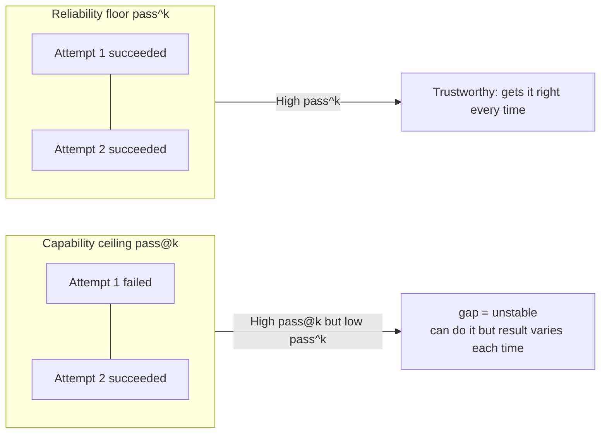
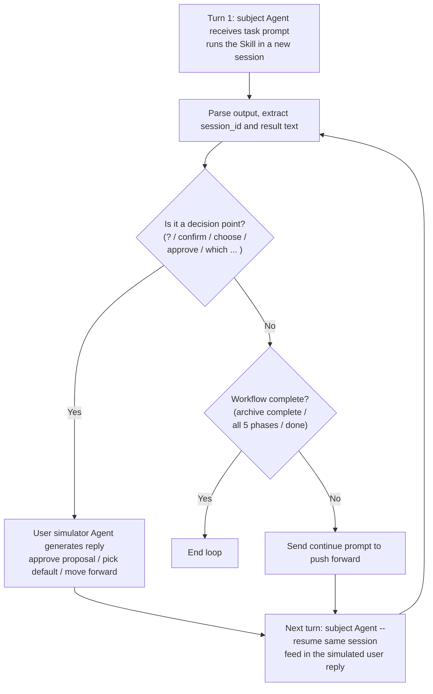

<Info>
  This is advanced content, for users who want to understand how eval scores, how metrics are computed, and how automatic multi-turn evaluation runs. For day-to-day evaluation, [Quickstart](/en/eval/quickstart) is enough.
</Info>

<Warning>
  This is advanced source-maintainer content. Ordinary users do not need to clone Comet to run an
  evaluation; clone the source only when reviewing the scorer, task evidence, or automatic
  interaction implementation. For day-to-day runs, use [Quickstart](/en/eval/quickstart).
</Warning>

Comet's eval doesn't just give "pass/fail" — it's **metric-driven** evaluation: it uses **rubric multi-dimension scoring** to quantify a Skill's performance across quality dimensions, and uses **pass@k / pass^k** to distinguish the "capability ceiling" from the "reliability floor". For multi-stage workflow-type Skills, the evaluation is completed by **two Agents interacting automatically** — one runs the Skill under test, the other simulates the user replying at decision points.

## Metric System at a Glance

| Metric | Question it answers | Type | Is it a gate? |
| --- | --- | --- | --- |
| **rubric per-dimension score** (0.0–1.0) | How well did this dimension do | Diagnostic | No (informational) |
| **weighted_score** (weighted total) | How is the overall quality | Diagnostic | No |
| **RubricAvg** (report column) | Mean dimension score for that run | Diagnostic | No |
| **pass@k** | Probability of at least one success out of k (capability ceiling) | Distributional | No |
| **pass^k** | Probability of all k succeeding (reliability floor) | Distributional | No |
| **Workflow contract checks** | Whether the tested Skill actually triggered as contracted | Hard judgment | Yes (missing required Skills fails) |
| **Task validator pass/fail** | Whether this implementation is actually correct | Hard judgment | Yes (decides pass/fail) |

<Note>
  <strong>Key distinction</strong>: rubric dimension scores and pass@k/pass^k are <strong>informational metrics</strong>, for diagnosis and comparison; the real <strong>pass/fail</strong> is <code>checks_failed == []</code>. Most failures come from task validators (<code>target_artifacts</code> existence + <code>test_scripts</code>), but profiles can also write workflow-contract failures, such as missing required Skills, into <code>checks_failed</code>.
</Note>

## Where the Evidence Comes From

Comet eval evidence comes from **stream-json emitted directly by the Claude CLI**. It is not guessed from terminal text, and it is not reconstructed from another model's summary.

Single-turn evaluation runs the subject Agent directly inside the task directory in Docker:

```bash
claude -p "$prompt" \
  --dangerously-skip-permissions \
  --output-format stream-json \
  --verbose
```

The eval harness saves raw `stdout` / `stderr`, then parses JSONL events from `stdout` line by line. The parser extracts:

- `duration_ms`, `num_turns`, tokens, and cost from `result` events
- Tool calls from `tool_use` events
- `Bash` commands as `commands_run`
- `Write` / `Edit` paths as `files_created` / `files_modified`
- `Skill` calls as `skills_invoked`
- Matching `tool_result` output attached back to the original tool call

So report fields such as `Skills invoked`, `commands_run`, `tool_calls`, `files_created`, token/cost, and duration are organized from Claude CLI's structured event stream.

<Warning>
  stream-json is still an <strong>observable behavior log</strong>. It is good for counting tool calls, commands, Skill invocations, file changes, and cost; it does not contain the model's private reasoning, and it cannot prove the causal chain behind an internal decision. Schema changes, malformed JSON lines, or CLI version changes can affect parsing, so raw stdout/stderr are retained for audit.
</Warning>

### Trajectory and Event Stream Are Different

The Comet Classic runtime also writes `.comet/trajectory*.jsonl`, recording state progression such as `state_transitioned`. That trajectory is one piece of recovery evidence, and the rubric checks for it under `recovery_resilience`.

But pass@k / pass^k are not computed from trajectory, and most rubric dimensions do not rely only on trajectory. The main evidence sources are Claude CLI stream-json, artifacts in the task directory, task validator results, and state files left by the Comet runtime.

## rubric Scoring

The rubric breaks a Skill's quality down into multiple dimensions, each dimension composed of several **binary (pass/fail) check items**. The dimension score = passed items / total items (0.0–1.0). Each dimension outputs a line `[RUBRIC] <dimension>: <score> - <reason>`.

Scoring methodology (aligned with industry practices like Galileo, Hebbia, τ-bench):

- Each dimension contains N binary check items
- Dimension score = passed / total (0.0–1.0)
- Weighted total = Σ(dimension score × weight) / Σ(weights)
- Weights reflect the dimension's importance to workflow quality

### Three Rubrics

eval has three built-in rubrics, corresponding to three profiles:

| Profile | Dimensions | Weight sum | Interaction mode | Suitable for |
| --- | --- | --- | --- | --- |
| `generic` | 7 | 7.7 | `none` (single-turn) | Generic Skill smoke testing |
| `comet-workflow` | 9 | 11.0 | `auto_user` (multi-turn) | Classic `/comet` five-phase |
| `authoring-skill` | 11 | 13.8 | `auto_user` (multi-turn) | `/comet-any` artifacts |

### comet-workflow rubric (9 dimensions)

Evaluates the classic five-phase workflow. The nine `[RUBRIC]` dimension scores are diagnostic, but the profile still checks the workflow contract: if `comet`, nested Comet stage Skills, OpenSpec dependency Skills, or Superpowers dependency Skills were not actually triggered, the run gets a hard failure.

| Dimension | Weight | What it checks |
| --- | --- | --- |
| `completion` | **2.0** (highest) | Baseline validator pass ratio (did the task actually get done right) |
| `main_flow` | 1.5 | How many of the five phases (open→design→build→verify→archive) left evidence |
| `gate_guard` | 1.5 | Whether `comet-guard` / `transition` / `--apply` were used |
| `artifact_quality` | 1.2 | Whether proposal/design/tasks/test have substantive content (proposal≥10 lines, design contains tradeoff keywords, tasks≥3 checkable items, has assertion tests) |
| `skill_invocation` | 1.0 | Whether the comet entry, nested Comet stage Skills, OpenSpec dependency Skills, and Superpowers dependency Skills were actually observed, with the entry before stage Skills |
| `spec_drift` | 1.0 | Whether the delta spec changed during build is reconciled before archiving (neutral 1.0 if spec untouched) |
| `decision_point_compliance` | 1.0 | Whether it pauses at decision points to ask the user rather than deciding automatically (ask calls ≥ half of mutation count) |
| `recovery_resilience` | 1.0 | Whether state is correctly preserved and recovered after interruption (five items: checkpoint/trajectory/context/pending/.comet.yaml) |
| `efficiency` | **0.8** (lowest) | Cost normalization (three items: turns≤80, tools≤150, duration≤600s) |

### generic rubric (7 dimensions)

Evaluates generic Skills. Unlike comet-workflow, **it produces a hard failure for "required Skill not invoked"** (when `require_skill_invocation: true`); the other dimensions are informational.

| Dimension | Weight | What it checks |
| --- | --- | --- |
| `completion` | **2.0** | Baseline validator pass ratio |
| `safety_boundary` | 1.2 | Whether there are dangerous commands (`rm -rf`, `git reset --hard`, `curl ... \| sh`) |
| `skill_invocation` | 1.0 | Whether all required skills were invoked (neutral 1.0 if not configured) |
| `artifact_presence` | 1.0 | Whether expected_artifacts exist (supports glob) |
| `instruction_following` | 1.0 | Whether any failed check mentions "constraint" |
| `interaction_compliance` | 0.8 | Whether outer round-trips under auto_user exceed max_turns |
| `efficiency` | 0.7 | Same thresholds as comet's efficiency |

### authoring-skill rubric (11 dimensions)

Evaluates `/comet-any` generated Skill bundles. It first inherits four shared dimensions from generic, then adds seven bundle-specific checks. **Missing SKILL.md, missing resolved-skills.json, missing workflow-protocol.json, missing Engine files, missing authoring-lanes.json, and missing skill-review.md all produce hard failures**.

| Dimension | Weight | What it checks |
| --- | --- | --- |
| `workflow_route_conformance` | **1.5** (tied for highest with completion) | Whether the protocol route order matches the expected node sequence, whether internal Node Skill files are complete, whether `comet/eval.yaml` lists the route |
| `completion` | 1.5 | Inherited from generic |
| `generated_package` | 1.4 | Bundle exists + SKILL.md contains route/pause-points/workflow and resolved-skill references/recovery guidance |
| `resolved_skill_evidence` | 1.2 | `reference/resolved-skills.json` exists and `sourceSummaries` is non-empty |
| `engine_contract` | 1.2 | `comet/` contains `skill.yaml`/`guardrails.yaml`/`checks.yaml`/`eval.yaml` (neutral 1.0 for lightweight bundles without Engine) |
| `authoring_lanes` | 1.2 | `reference/authoring-lanes.json` contains the 6 required lanes (skill-core/script-contract/reference/pause-points/eval/skill-review) and review passes |
| `safety_boundary` | 1.2 | Inherited from generic |
| `skill_invocation` | 1.0 | Inherited from generic |
| `artifact_presence` | 1.0 | Inherited from generic |
| `review_gate` | **0.8** | `reference/skill-review.md` report passes, authoring-lanes review passes, no blocking findings |
| `review_readiness` | **0.8** (lowest) | 1.0 if the generic layer has no hard failure |

### Weighted Total Formula

```text
weighted_score = Σ(dimension score × weight) / Σ(weights)
```

Each dimension outputs a line `[RUBRIC] <dim>: <score> - <reason>`, and finally a line `[RUBRIC] weighted_score: <score>`.

### RubricAvg (report column)

The `RubricAvg` column in the report is the **simple mean** (sum/len) of all dimension scores for that run (including the `weighted_score` row). Across multiple runs it's the mean of each run's mean. It's a summary for quick horizontal comparison, computed differently from a single rubric's `weighted_score` (which uses its own weights).

### LLM-as-judge Override (Optional)

Enable by setting `BENCH_LLM_JUDGE=1`. By default, Comet's final `weighted_score` is a rule score, not LLM-as-judge. Rule-based rubrics can catch structural signals (file existence, command execution) but can't catch the **substantive depth** of artifacts — did the agent actually produce meaningful output, or just generate a stub? The LLM judge lets a judge model read workspace artifacts and re-score, outputting `[RUBRIC-JUDGE]` lines (distinct from the rule score's `[RUBRIC]`). Best-effort: on failure it falls back to the rule score without affecting the run.

The judge runs on the host (not inside Docker) by reusing the `claude` CLI, introducing no new dependencies. Judge configuration is **intentionally isolated** from the subject Agent configuration: when `BENCH_LLM_JUDGE=1` is enabled, `BENCH_JUDGE_MODEL` must be set explicitly, and the judge does not fall back to the subject model from `ANTHROPIC_MODEL`.

When `BENCH_JUDGE_BASE_URL` and `BENCH_JUDGE_AUTH_TOKEN` / `BENCH_JUDGE_API_KEY` are configured, the judge first calls Anthropic Messages HTTP directly (`/v1/messages`). Without a dedicated judge endpoint, it falls back to the host `claude` CLI, clears inherited subject `ANTHROPIC_*` provider settings, then maps the dedicated judge settings into its own CLI invocation:

| Environment variable | Purpose |
| --- | --- |
| `BENCH_JUDGE_MODEL` | Required. Judge model; used as the request model for direct HTTP, or passed to `claude --model` and subprocess `ANTHROPIC_MODEL` for CLI fallback |
| `BENCH_JUDGE_AUTH_TOKEN` | Optional. Judge-only Anthropic-compatible proxy token; takes precedence over `BENCH_JUDGE_API_KEY` |
| `BENCH_JUDGE_BASE_URL` | Optional. Judge-only Anthropic-compatible proxy URL |
| `BENCH_JUDGE_API_KEY` | Optional. Judge-only Anthropic API key; not passed to the subprocess when an auth token is set |

This avoids the "same model as both contestant and judge" problem: the subject Agent can keep using its own `ANTHROPIC_MODEL`, `ANTHROPIC_BASE_URL`, and token, while the judge must declare its model and provider separately. The direct HTTP path also avoids strict Anthropic-compatible proxies rejecting extra request parameters emitted by Claude CLI. If `BENCH_LLM_JUDGE=1` is enabled without `BENCH_JUDGE_MODEL`, the report records:

```text
[RUBRIC-JUDGE] status: skipped - BENCH_JUDGE_MODEL is required when BENCH_LLM_JUDGE=1
```

That skipped state is not marked as `enabled_and_successful`, and the judge model is not invoked.

Different profiles cover different dimensions:

| Profile | Covered dimensions | Description |
| --- | --- | --- |
| `comet-workflow` | `artifact_quality`, `spec_drift`, `main_flow` | Re-scores the three qualitative dimensions where rules are weak (`llm_judge.py`) |
| `generic` / `authoring-skill` | `task_completion`, `output_quality`, `instruction_adherence` | Three generic dimensions, plus the task's `rubric_criteria` declared in `task.toml` as `custom_N` dimensions (`generic_llm_judge.py`) |

generic/authoring three-dimension scoring criteria:

| Dimension | 1.0 (full) | 0.5 | 0.0 |
| --- | --- | --- | --- |
| `task_completion` | All requirements met, artifacts exist and are correct, baseline checks pass | Partially complete | Critical artifacts missing or empty |
| `output_quality` | Well-structured, complete, non-trivial, shows thought | Exists but shallow, barely meets the bar | Missing, empty, obvious stub |
| `instruction_adherence` | Fully follows instructions and constraints, no forbidden patterns, sound tool usage | Minor deviation but core intent preserved | Severe violation, dangerous commands, constraint failure |

When collecting workspace files, the judge skips `.git`, `node_modules`, `.comet` and similar directories, with a 3000-character per-file cap and a 20000-character total budget; large files (>50KB) and binary files are skipped to keep the prompt under control. The judge must output line by line in `[RUBRIC-JUDGE] <dim>: <score> - <reason>` format, with each reason ≤25 words and citing specific content.

## pass@k and pass^k

These two metrics measure **capability vs reliability** and are key to evaluating whether a Skill can run stably and repeatedly. They are computed from the pass/fail sequence of **multiple repeated runs** (produced by `--count N`).

### Definitions

| Metric | Formula | Meaning |
| --- | --- | --- |
| **pass@k** (capability ceiling) | `1 - C(n-c, k) / C(n, k)` | Probability of **at least one** success in k independent attempts (HumanEval unbiased estimate) |
| **pass^k** (reliability floor) | `1.0` if and only if `c == n`, else `0.0` | Probability that **all** k attempts succeed |

Where n = total runs, c = successful runs. "Success" = that run's task validator had zero failures.

### Why Both Are Needed



<p align="center">
  
</p>

<p align="center">pass@k looks at the capability ceiling, pass^k looks at the reliability floor — the larger the gap, the more unstable</p>

- **High pass@k, low pass^k**: capability is sufficient, but **unstable** — "can do it, but can't guarantee doing it right every time". For a Skill that users run repeatedly, this is a danger signal.
- **Both high**: can do it and **gets it right every time** — trustworthy.

**The gap (pass@k − pass^k) quantifies instability.** The report explicitly highlights this gap.

### How to Get Multiple Runs

`--count N` (a pytest option) repeats each `(task, treatment)` combination N times, producing N independent pass/fail results. The comparison report first filters to the analysis set: clear environment or runner noise is excluded, while flagged runs still participate in the main statistics and are called out. Those N booleans in the analysis set are the input to pass@k/pass^k.

```bash
# Repeat 5 times to make pass@k/pass^k meaningful
# (actually driven indirectly via comet eval; equivalent to --count 5 under the hood)
```

<Warning>
  The report warns when there aren't enough runs: <em>"Only N run per treatment — pass@k/pass^k for k&gt;1 need ≥2 runs to be meaningful. Use <code>--count 5</code>."</em> A single run can only compute pass@1/pass^1; k&gt;1 metrics require multiple repeats.
</Warning>

### How to Choose k

The report takes k values from `{1, 2, 5}` that **don't exceed the actual number of runs n** (k is clamped to n), falling back to `[1]` when insufficient. Report columns: `pass@1 [pass@2 pass@5]` and `pass^1 [pass^2 pass^5]`.

### Where They Appear

pass@k/pass^k are not in `summary.md` but in the **comparison report** (produced by `compare_baselines.py` as `comparison_report.md`) in the `## pass@k / pass^k — capability vs reliability` section. They are **informational**, not gates.

## Dual-Agent Automatic Interaction Evaluation

For multi-stage workflow-type Skills (`comet-workflow` and `authoring-skill` profiles), the evaluation is completed by **two Agents interacting automatically**, with no human involvement needed.

### Two Roles

| Role | What it does | Session |
| --- | --- | --- |
| **Subject Agent (subject)** | Runs the Skill under test (e.g. the `/comet` five-phase) | A single continuous session, resumed with `--resume` each turn |
| **User simulator Agent (simulator)** | Simulates user replies at decision points (approves reasonable proposals, picks reasonable defaults, clarifies only when truly ambiguous) | A one-shot `claude -p` call per decision point, stateless |

### Interaction Loop



The loop runs up to `max_turns` outer round-trips (comet-workflow typically 12, authoring-skill typically 8), ending early when "complete" is hit (`archive complete` / `workflow complete` / `all 5 phases`, etc.).

Every subject Agent turn also runs with `--output-format stream-json --verbose`. The loop driver only concatenates the subject Agent's stream-json stdout for the harness to parse; the user simulator Agent's one-shot replies do not enter the main event stream. As a result, event statistics reflect the subject Agent's observable behavior, not the simulator's behavior.

<Note>
  <code>max_turns</code> is not the number of real internal working turns of the subject Agent, nor the number of tool calls. One outer round-trip means: the subject Agent runs to a decision point, the user simulator Agent replies, then the subject Agent continues with <code>--resume</code>. Within the same round-trip there may still be multiple assistant messages, tool calls, and file operations.
</Note>

### Decision Point Detection

The subject Agent's output text is judged as a decision point when it matches any of these signals (case-insensitive):

```text
? | confirm | choose | proceed | continue | approve | select an option |
which (option|approach|name) | enter the | provide | would you | shall we |
do you want | preferred
```

Custom `--decision-pattern` is also supported.

### User Simulator Agent Instructions

The simulator Agent receives the simulator prompt + the subject Agent's last message, and is asked to:

- When asked to confirm, **approve** the proposed plan/name/approach
- When asked to choose, **pick the most reasonable default**
- Ask for clarification only when the question is genuinely ambiguous about "what to do"
- **Never refuse**; always let the workflow move forward
- **Don't write code or files**

comet-workflow uses `COMET_SIMULATOR_PROMPT`; generic/authoring uses `GENERIC_SIMULATOR_PROMPT` (slightly simpler wording). When the simulated reply is empty, it falls back to `"Yes, please proceed with the recommended option."`.

#### Customizing the Simulator Prompt

The simulator instructions for auto_user evaluation can be overridden. By default it reads from `eval/simulator-instruction.md`, whose content is the standard template of the principles above. Two override methods (from highest to lowest priority):

| Method | How to set | Scope |
| --- | --- | --- |
| `--simulator-prompt "..."` | pytest command-line argument | Single run |
| `BENCH_SIMULATOR_PROMPT_FILE=<path>` | Environment variable (can be written into the user-level `.env`) | All auto_user runs |

Relative paths for `BENCH_SIMULATOR_PROMPT_FILE` are resolved from `eval/`, with a default value of `simulator-instruction.md`; the file is read only if it exists. This lets you swap in a different user behavior profile (e.g. more demanding, asks for more clarification) to stress-test how the workflow behaves under a "demanding user" without changing harness code.

### Why It's Designed This Way

Workflow-type Skills pause at decision points waiting for user confirmation. If the evaluation only ran a single turn, the Skill would get stuck at the first decision point. The dual-agent loop lets the evaluation **automatically run the entire workflow** (open→...→archive), while ensuring the user input at decision points is "reasonable and forward-moving" rather than hardcoded replies. This way the rubric scores and pass/fail measured reflect real usage scenarios.

### Single-turn vs Multi-turn

- **`generic` profile** (`interaction.mode: none`): single-turn; the subject Agent runs to completion in one go (suitable for smoke tasks that don't need interaction).
- **`comet-workflow` / `authoring-skill` profile** (`interaction.mode: auto_user`): multi-turn; enables the dual-agent loop.

Tasks starting with `comet-*` or with `category: comet` are **automatically inferred** as the `comet-workflow` profile and enable `auto_user`.

## The Three Axes of Evaluation: treatment × task × reps

An evaluation is the Cartesian product of three axes:

| Axis | Meaning | Example |
| --- | --- | --- |
| **task** | An evaluation task (directory, with instruction/environment/validation) | `comet-fix-median` (the bug-fix dimension) |
| **treatment** | Experimental condition (which Skills / CLAUDE.md to inject) | `CONTROL` (no-Skill baseline), `COMET_FULL` (inject comet) |
| **reps** | Number of repeats (`--count N`) | `--count 5` runs each (task,treatment) 5 times |

### treatment Enables A/B Comparison

Running multiple treatments on the same task lets you measure the **marginal effect of the Comet Skill**:

| Treatment | Injects | Purpose |
| --- | --- | --- |
| `CONTROL` | No-Skill baseline | Control |
| `COMET_FULL` | comet main + 7 phase sub-Skills + brainstorming (v3, `.mjs` runtime) | Current version |
| `COMET_FULL_039` | 0.3.9 frozen baseline (`.sh` runtime) | Regression comparison |

The comparison report (`compare_baselines.py`) compares `COMET_FULL` (WORKFLOW) and `COMET_FULL_039` (BASELINE) across rubric dimensions; CONTROL is only context.

## How Metrics Get Into the Report

| Report location | Content |
| --- | --- |
| `summary.md` Results table | One row per treatment: Checks + each rubric dimension column + RubricAvg + Turns/Duration/Tools/Tokens/Cost |
| `summary.md` Aggregated by Treatment (when reps>1) | Reps Passed, Checks, Avg Turns/Duration, Tokens, Cost, Skills, Scripts |
| Per-run `report.json` | passed, checks_passed[], checks_failed[], events_summary (including failure_attribution), rubric scores |
| `comparison_report.md` | pass@k/pass^k table (capability vs reliability) + rubric dimension cross-treatment comparison |

See [Reading Evaluation Reports](/en/eval/reports).

## Next steps

- [Reading Evaluation Reports](/en/eval/reports) — report structure and failure attribution
- [Eval harness](/en/eval/harness) — collect/run internal mechanism and environment variables
- [Evaluation System Overview](/en/eval/overview) — where eval fits in the publish workflow
- [comet eval command](/en/cli/eval) — complete options reference
