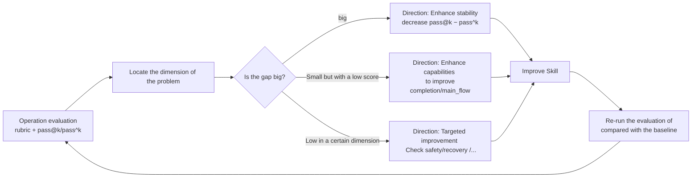

<Info>
This page explains what evaluation metrics are used for. To run an evaluation, see [Quick Start](/en/eval/quickstart).
</Info>

## The limitations of assessment by touch

After a Skill is written, the question that needs to be answered is whether its quality meets the standards. Subjective judgment alone can lead to several common types of problems:

- A single success does not guarantee stability: Large language models are random, and a successful run in one attempt does not mean it will succeed every time.
- The fact that a product "looks correct" does not mean it has passed the verification: Situations such as missing files, unwritten assertions, and the inclusion of dangerous commands are difficult to detect merely through manual inspection.
- ** Lack of baseline comparison ** : Without a baseline, it is impossible to determine whether a change will improve, stabilize or regress.
- ** Subjective feedback cannot be attributed ** : When the feedback is "not user-friendly", it is impossible to distinguish whether it is due to Skill design issues, insufficient model capabilities, or environmental problems.

The common root cause of these problems lies in the fact that without quantifiable, reproducible and comparable evaluations, "quality" has no operational definition. However, for skills with missing quality definitions, improvement can only be judged based on experience, the effect of changes cannot be measured, and regression cannot be located.

Therefore, evaluation is the prerequisite for the continuous evolution of Skill and needs to run as a core process.

## Why should assessment be given top priority in establishment

A common sequential assumption is: first create skills, and then establish evaluations after accumulating a certain number. This sequence will result in all the previous design decisions lacking feedback signals.

The assessment should be established prior to or at least in tandem with the first batch of Skills for three reasons:

Without assessment, it is impossible to determine whether the design decision is valid. Every decision made on the Skill platform - routing policies, phase guardianship, and product enforcement - requires feedback signals for verification. If the assessment is supplemented at the last minute, the early decision-making is equivalent to advancing without verification, and the cost of rework in the later stage is high. Comet's own practice also confirms this point: `/comet-any` can generate skills, but without `comet eval` as the release access control, the generated skills lack an objective quality bottom line, and the release judgment cannot be separated from subjective experience.

2. Evaluation indicators shape the direction of evolution. The evaluation indicators define the "good" standards, and these standards will in turn influence the design orientation of Skill. Just by looking at "whether it can run through", Skill will evolve into "barely passing". Only by simultaneously examining reliability and security can Skill evolve towards being "stable and risk-free". The evaluation indicators constitute the selection pressure of Skill - what kind of evaluation is established determines what kind of Skill will be obtained subsequently.

3. Evaluation is a closed loop that continuously provides feedback. The Skill platform will continuously generate new skills and workflows. As the quantity grows, the only thing that can span all versions and continuously reflect "whether the overall situation is improving or deteriorating" is a stable assessment baseline. It is similar to the role of testing in traditional software: a single test does not change the functionality, but a code base lacking tests will gradually deteriorate.

<Note>
The core closed loop of the Skill platform is "creation → evaluation → release". Evaluation is the link that transforms subjective judgment into objective evidence.
</Note>

## Why is rubric needed for evaluation

### The information about "pass/fail" is insufficient

The minimum assessment is to run once and see if the task passes. However, "pass/fail" only carries one bit of information - it indicates whether the result is correct, but not the quality or the size of the gap.

Suppose both skills pass through the same task:

| Skill |"Through| turns |Tool invocation|Product quality|Safety boundary|
| --- | --- | --- | --- | --- | --- |
| Skill A | ✅ | 35 | 60 |There are assertions and design documents|"No Danger Command"|
| Skill B | ✅ | 90 | 180 |Barely generated, without testing|Contains `rm -rf`|

Press "Pass/Fail", there is no difference between the two. However, from the perspectives of product quality, cost and safety, the gap between the two is quite large. The role of rubric is to measure the difference between "pass" and "pass".

### rubric breaks down quality into measurable dimensions

rubric breaks down the Skill quality into several dimensions, each of which consists of several binary (pass/fail) check items. The dimension score = the number of passed items ÷ the total number of items (0.0-1.0), and then they are weighted and summarized by weight.

The basis for this splitting method lies in:

- "Decomposable." "Quality" is a vague concept, but "whether the necessary Skill was called", "whether the product contains test assertions", and "whether dangerous commands were executed" can be precisely determined. rubric breaks down the ambiguous quality into a set of deterministic checks.
- Comparable. Two skills no longer compare just one Boolean value but are compared horizontally along multiple dimensions, allowing for the identification of their respective strengths and weaknesses.
- ** Attributable **. When a certain dimension score is low, it points to the corresponding improvement direction - low `safety_boundary` corresponds to checking dangerous commands, and low `recovery_resilience` corresponds to checking interrupted recovery.

Comet comes with three built-in rubric sets, corresponding to different types of skills:

| Profile |Dimension number|Evaluation object|Several key dimensions|
| --- | --- | --- | --- |
| `generic` | 7 |Arbitrary Skill| completion、safety_boundary、skill_invocation、efficiency |
| `comet-workflow` | 9 |Classic five-stage workflow| main_flow、gate_guard、spec_drift、recovery_resilience |
| `authoring-skill` | 11 |`/comet-any` generation package| workflow_route_conformance、resolved_skill_evidence、review_gate |

Each dimension has a weight, reflecting its significance to the quality of the workflow - for instance, `completion` (whether the task is completed correctly) has the highest weight, while `efficiency` (cost) has a lower weight. The comprehensive quality is calculated based on these weights, reflecting the actual impact of each dimension. The complete dimensions and weights can be found again [scoring index ](/en/eval/scoring)].

<Note>
  Rubric scores are <strong>informational</strong> and support diagnosis and comparison. Task validators make the hard pass/fail decision by checking that expected artifacts exist and validation scripts report zero failures. Rubrics answer "Where is it strong or weak?" Validators answer "Was this run correct?" The two complement each other.
</Note>

### Why use binary checks instead of scoring from 0 to 100

One approach is to have the model directly give scores ranging from 0 to 100. The problem with this approach is that it is non-reproducible and unexplainable: the scores of the same product may vary greatly under different prompts or models, and the source of the gap cannot be explained.

rubric uses binary checkitems and weighted summary to make the scores interpretable and reproducible: each dimension score can be traced back to a specific checkitem (pass/fail), and each determination has an objective basis (whether the file exists, whether the command is executed, whether the assertion is valid). This is consistent with the practices of evaluations such as SWE-bench, τ-bench, and HumanEval - trying to replace subjective judgments with objective and verifiable signals as much as possible.

When subjective judgment is indeed required (such as "whether the product has real substance"), Comet offers an optional LLM-as-judge: allowing the judge model to read the product and score it. judge is constrained to a fixed dimension (`task_completion`/`output_quality`/`instruction_adherence`), and each scoring reason is required to quote specific content, thereby limiting subjective judgment within an auditable range.

## Why do we need pass@k and pass^k

### The limitation of the single-pass rate

Suppose a Skill runs 5 times, passes 4 times and fails 1 time, with a pass rate of 80%. This number itself cannot distinguish between the two situations:

- ** Sufficient ability, occasional failure ** : The improvement direction is to enhance stability, which usually has a relatively low cost.
- ** Some tasks are not capable of being completed ** : The improvement direction is to supplement capabilities, and the investment scale varies.

Just by one pass rate, it is impossible to distinguish between these two types of failures of different natures. The purpose of pass@k and pass^k is to separate them.

### The two indicators respectively answer different questions

|Indicator|Formula|The questions answered|Interpretation|
| --- | --- | --- | --- |
|**pass@k** (upper capacity)| `1 − C(n−c, k) / C(n, k)` |The probability of success at least once out of k attempts|Measure the upper limit of one's ability. Approaching 1.0 indicates that one usually succeeds in multiple attempts|
|**pass^k** (Lower reliability limit)|All success is 1.0; otherwise, it's 0.0|The probability of success in all k attempts|Measure reliability. Only when you succeed every time can it be considered 1.0|

Here, n = total number of runs, and c = number of successes. pass@k uses HumanEval 's unbiased estimator.

### The difference between the two: instability gap

```
gap = pass@k − pass^k
```

This gap quantifies the instability of Skill:

|"Situation| pass@k | pass^k |Meaning|Improvement direction|
| --- | --- | --- | --- | --- |
|High capability and high reliability|high|high|It can be completed and is correct every time|Quality meets standards|
|High capability, low reliability|high|low|It can be completed, but it's not stable|Improve stability (reduce gap|
|Low ability|low|low|No matter how many attempts there are, it is still difficult to succeed|Supplementary capacity|

This distinction is particularly important for workflow skills. Workflow skills are tools that users repeatedly use - every day and every PR. For such tools, reliability is more crucial than the upper limit of capability. Users need to get the right results every time. A Skill of `pass@5 = 1.0` but `pass^5 = 0` means that there are always successful cases in multiple attempts, but the result of a single use is unpredictable and difficult to deliver in practice.

pass@k and pass^k describe Skill from the dimensions of capability and reliability, and clearly point out the direction that should be invested in the next step.

### How can I get multiple runs

pass@k/pass^k need data from multiple repeated runs. Repeated runs are currently driven by the eval harness's internal pytest option `--count N`, which repeats each task N times to generate N independent pass/fail results (`comet eval` only produces pass@1/pass^1 from a single run). When the number of runs is insufficient (fewer than 2), the report prompts you to increase the number of repetitions. A single run can only calculate pass@1/pass^1, and the metric k>1 needs to be repeated multiple times.

## How to evaluate how to drive the evolution of Skill

Combining the above parts, the process for evaluating the driving evolution is as follows:



This process turns the improvement of Skill into a data-driven, directional, and verifiable cycle:

1. ** Evaluation and positioning ** : rubric identification weak dimension, pass@k/pass^k distinguishing ability problem from stability problem.
2. ** Targeted improvement ** : If the gap is large, enhance stability; if the ability score is low, supplement core capabilities; if a specific dimension is low, make improvements in that dimension.
3. ** Verifiable improvement ** : Re-run the assessment and compare it with the baseline. An increase in the score indicates that the improvement is effective; if it remains stable or decreases, a re-evaluation of the changes is required.
4. ** Guaranteed regression ** : Use a qualified version as the baseline (such as Comet's `COMET_FULL_039` frozen baseline), and compare each subsequent change with the baseline. Any regression will be detected in a timely manner.

Comet's failure attribution divides each failure into four categories, indicating whether the Skill or the environment should be changed:

|Attribution|Meaning|What should be changed?|
| --- | --- | --- |
| `harness` |Evaluate environmental, Docker, and path issues|Changing the environment is not a Skill|
| `workflow` |The execution process of Skill did not meet expectations|Modify Skill|
| `task` |Task definition and verification condition issues|Changing tasks is not a Skill|
| `model` |The model behavior and tool usage are unstable|Change the model or adjust the prompt|

Without an attribution mechanism, improvements are prone to misjudging environmental or model issues as Skill problems. Attribution enables assessment feedback to precisely point to the correct object of improvement, which is a prerequisite for assessment to drive evolution rather than generate noise.

## Industry practice comparison

Comet's evaluation methodology is not designed out of thin air. When the Comet evaluation system was first designed, the following article had not yet been published; Near completion, we found that these practices were highly consistent with the Agent evaluation direction of top domestic teams. The following two articles can serve as references for understanding the implementation of this methodology in the industrial sector.

### Tencent: A systematic Project for large-scale Agent evaluation

Tencent's evaluation practice emphasizes that Agent evaluation should be treated as a systems engineering project. Its core viewpoints correspond to the design choices of Comet: <sup>[1]</sup>

- The evaluation needs to be systematic and large-scale: The success of a single case does not guarantee the reliability of the Skill. Sufficient tasks and repeated runs are required to reach a credible conclusion - corresponding to the requirement of multiple runs for pass@k/pass^k.
- Task design is the foundation of evaluation: The definition of the task (instruction, environment, verification conditions) directly determines the effectiveness of the evaluation. Comet defines each task with `task.toml` + `validation/`.
- ** Multi-dimensional scoring is superior to a single pass rate ** : Merely looking at "right/wrong" cannot guide improvement. Quality needs to be broken down into multiple dimensions to identify problems - corresponding to the design of rubric.
- ** Reproducible and comparable baselines are needed ** : The value of assessment lies in comparison. A stable baseline is required to determine whether the change is an improvement or a regression - corresponding to treatment (such as `CONTROL` vs `COMET_FULL`) and frozen baselines (`COMET_FULL_039`).

### Alibaba: Building an evaluation Harness with Strong Agents

The core of Alibaba's solution is to build an evaluation Harness with a strong Agent (such as Claude Code) to systematically evaluate a group of business agents, which is consistent with the design concept of Comet <sup>[2]</sup>.

Key points

- "Harness engineering" : The evaluation itself needs to be engineered - environmental isolation, task scheduling, result collection, and report generation. Comet's eval harness is isolated by Docker, driven by pytest, and automatically generates HTML reports.
- ** Evaluating Agents with Agents ** : Alibaba uses strong agents to drive the evaluation process, including simulating user interaction, collecting products, and determining results. Comet's dual-agent automatic interaction evaluation (the Agent under test runs Skill, and the user simulates the Agent to reply at the decision point) adopts the same concept - using agents to replace human labor, enabling the evaluation to run the entire workflow unattended.
- Evaluation should precedes business preparation: Only when the evaluation Harness is set up first can there be a feedback loop for the iteration of business agents; otherwise, business agents will get out of control after growth. This is consistent with the "assessment first establishment" emphasized in this article.

### A comparison between Comet and industry practices

|Industry consensus|The corresponding implementation of Comet|
| --- | --- |
|The evaluation should be systematic and large-scale|eval harness repeated runs + multi-task /profile|
|Multi-dimensional scoring is superior to a single pass rate|Three sets of rubric (7/9/11 dimensions), weighted summary|
|Distinguish between capability and reliability|pass@k (upper capacity) vs pass^k (lower reliability)|
|Evaluate agents with Agents|Dual-agent automatic interaction (test subject + user simulation)|
|A stable baseline is needed for regression|Comparison of treatment system + frozen baseline|
|The evaluation should be ready before the business|eval is the release access control of `/comet-any`|

## Summary

In the Skill platform, evaluation plays three roles simultaneously: using rubric to transform the ambiguous "quality" into measurable and comparable dimensions; Use pass@k/pass^k and failure attribution to indicate the direction for improvement; It is used as a release access control to prevent substandard skills from flowing in. None of these three items can be accomplished merely by subjective judgment. Therefore, in Comet's capability system, evaluation is designed as the top priority to be established - not because it is the most complex, but because without it, other capabilities lack a definition of quality and thus a basis for continuous improvement.

> If you want to run an assessment yourself and see how these indicators are generated, start with [Quick Start ](/en/eval/quickstart)

## References

1. Tencent Technology Engineering. *AI Agent & Skill Evaluation Plan and Implementation Practice * Wechat Public Platform, 2026. [[Original link: ](https://mp.weixin.qq.com/s/PUbGqheJhFMmb6hGj1ZtOw)]

2. Alibaba Technology. * Evaluation Scheme of Harness Engineering Construction Business Agent Based on Top-level Agent (Claude Code) *. Wechat Public Platform, 2026. [[Original link: ](https://mp.weixin.qq.com/s/n9zkbKTi3Q1j-L2vgmO1Vw)]
