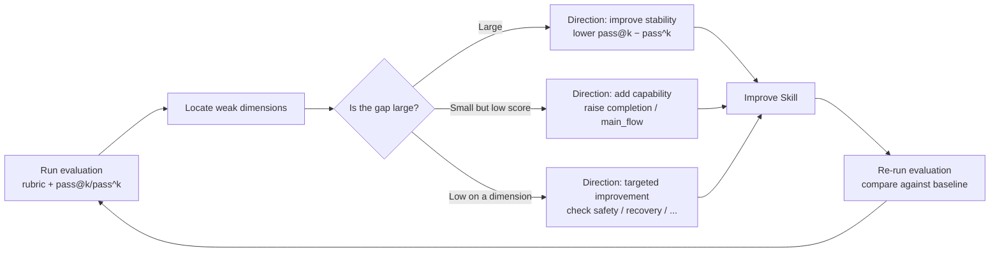

<Info>
  This page is not about how to type commands. If you want to run an evaluation directly, see [Quickstart](/en/eval/quickstart). This page answers a more fundamental question: why, among all capabilities, evaluation should be built first.
</Info>

## The Limits of Manual Evaluation

After a Skill is written, the question to answer is whether its quality meets the bar. Relying solely on subjective judgment leads to several common problems:

- **Single success does not mean stability**: Large language models are stochastic; running successfully once does not mean it runs successfully every time.
- **Artifacts "looking right" does not mean validation passes**: Missing files, unwritten assertions, dangerous commands mixed in—these are hard to catch through manual inspection alone.
- **No baseline for comparison**: Without a baseline, you cannot tell whether a change is an improvement, a plateau, or a regression.
- **Subjective feedback cannot be attributed**: When feedback is "it's not usable," you cannot distinguish whether it's a Skill design issue, insufficient model capability, or an environment problem.

The common root of these problems is: without quantifiable, reproducible, comparable evaluation, "quality" has no operational definition. And a Skill without a quality definition can only be improved by relying on experiential judgment—the effect of changes cannot be measured, and regressions cannot be located.

Therefore, evaluation is not an add-on but a prerequisite for a Skill to continuously evolve.

## Why Evaluation Should Be Built First

A common sequencing assumption is: build Skills first, accumulate a certain number, then establish evaluation. This sequence means all earlier design decisions lack feedback signals.

Evaluation should be established before, or at least in parallel with, the first batch of Skills, for three reasons:

**1. Without evaluation, you cannot tell whether design decisions hold.** Every decision in a Skill platform—routing strategy, stage guarding, artifact enforcement—needs feedback signals to validate. If evaluation is added last, early decisions are effectively pushed forward without validation, and rework costs later are high. Comet's own practice confirms this: `/comet-any` can generate Skills, but without `comet eval` as a publish gate, generated Skills lack an objective quality floor, and publish decisions cannot escape subjective experience.

**2. Evaluation metrics shape the direction of evolution.** Evaluation metrics define the standard for "good," and that standard in turn influences the design orientation of Skills. If you only look at "can it run," Skills will evolve toward "barely passing"; if you also examine reliability and safety, Skills will evolve toward "stable and risk-free." Evaluation metrics constitute the selection pressure on Skills—what kind of evaluation you establish determines what kind of Skills you subsequently get.

**3. Evaluation is a feedback loop that continuously provides signal.** A Skill platform will continuously produce new Skills and workflows. As the number grows, the only thing that spans all versions and continuously reflects "is the whole improving or degrading" is a stable evaluation baseline. Its role is similar to that of tests in traditional software: a single test does not change functionality, but a codebase without tests will gradually rot.

<Note>
  The core loop of a Skill platform is "build → evaluate → publish." Evaluation is the part that transforms subjective judgment into objective evidence.
</Note>

## Why Evaluation Needs a rubric

### "Pass/Fail" Carries Insufficient Information

The minimum evaluation is to run once and see whether the task passes. But "pass/fail" carries only one bit of information—it tells you whether the result is correct, not how good it is or how large the gap is.

Suppose two Skills both pass the same task:

| Skill | Pass | turns | tool calls | artifact quality | safety boundary |
| --- | --- | --- | --- | --- | --- |
| Skill A | ✅ | 35 | 60 | Has assertions, has design doc | No dangerous commands |
| Skill B | ✅ | 90 | 180 | Barely generated, no tests | Contains `rm -rf` |

By "pass/fail," there is no difference between the two; but from the perspective of artifact quality, cost, and safety, the gap is large. The role of the rubric is to measure the difference between "pass" and "pass."

### rubric Breaks Quality Down into Measurable Dimensions

The rubric breaks Skill quality down into several dimensions, each composed of several binary (pass/fail) check items. The dimension score = passed items ÷ total items (0.0–1.0), then weighted and summarized.

The rationale for this decomposition is:

- **Decomposable**. "Quality" is an ambiguous concept, but "did it call the required Skill," "does the artifact contain test assertions," and "did it execute dangerous commands" can be precisely determined. The rubric decomposes ambiguous quality into a set of deterministic checks.
- **Comparable**. Two Skills are no longer compared on just one boolean, but across multiple dimensions, making it possible to locate each one's strengths and weaknesses.
- **Attributable**. A low score on a dimension points to the corresponding improvement direction—a low `safety_boundary` corresponds to checking dangerous commands, a low `recovery_resilience` corresponds to checking interrupt recovery.

Comet ships three rubric sets, corresponding to different types of Skills:

| Profile | # of dimensions | Evaluation target | A few key dimensions |
| --- | --- | --- | --- |
| `generic` | 7 | Any Skill | completion, safety_boundary, skill_invocation, efficiency |
| `comet-workflow` | 9 | Classic five-stage workflow | main_flow, gate_guard, spec_drift, recovery_resilience |
| `authoring-skill` | 11 | `/comet-any` generation packages | workflow_route_conformance, resolved_skill_evidence, review_gate |

Each dimension has a weight reflecting its importance to workflow quality—for example, `completion` (whether the task was completed correctly) has the highest weight, and `efficiency` (cost) has a lower weight. So the overall quality is not a simple average of dimensions but weighted by impact. See [Scoring Metrics](/en/eval/scoring) for full dimensions and weights.

<Note>
  rubric scoring is <strong>informative</strong>, used for diagnosis and comparison; the hard judgment that determines whether a run passes/fails is the task validator (expected artifacts exist + validation script zero failures). The rubric answers "where is it strong, where is it weak," while the validator answers "was it correct this time"—the two complement each other.
</Note>

### Why Binary Check Items Instead of 0–100 Scoring

One approach is to have the model directly give a 0–100 score. The problem with this approach is that it is not reproducible or explainable: the same artifact may score very differently under different prompts or models, and the source of the gap cannot be explained.

The rubric uses binary check items + weighted summary, making scores explainable and reproducible: each dimension score can be traced back to specific check items (passed/failed), and each judgment has an objective basis (whether a file exists, whether a command was executed, whether an assertion holds). This is consistent with the approach of SWE-bench, τ-bench, HumanEval, and other evaluations—replacing subjective judgment with objective, verifiable signals as much as possible.

When subjective judgment is genuinely needed (such as "the substantive depth of the artifact"), Comet provides an optional LLM-as-judge: a judge model reads the artifacts and scores them. The judge is constrained to fixed dimensions (`task_completion` / `output_quality` / `instruction_adherence`) and requires each scoring reason to cite specific content, thereby constraining subjective judgment within an auditable scope.

## Why pass@k and pass^k Are Needed

### The Limits of Single-Run Pass Rate

Suppose a Skill runs 5 times, passing 4 and failing 1, for an 80% pass rate. This number alone cannot distinguish between two situations:

- **Sufficient capability, occasional failure**: The improvement direction is to increase stability, usually at lower cost.
- **Lacks the capability to complete some tasks**: The improvement direction is to add capability, which is a different order of investment.

From a single pass rate alone, you cannot distinguish these two qualitatively different kinds of failure. The purpose of pass@k and pass^k is to separate them.

### The Two Metrics Answer Different Questions

| Metric | Formula | Question answered | Interpretation |
| --- | --- | --- | --- |
| **pass@k** (capability ceiling) | `1 − C(n−c, k) / C(n, k)` | Probability of at least one success in k attempts | Measures the capability ceiling. Close to 1.0 means that among multiple attempts, there is usually at least one success |
| **pass^k** (reliability floor) | 1.0 only if all pass, otherwise 0.0 | Probability of all k attempts succeeding | Measures reliability. Only 1.0 when it succeeds every time |

Where n = total runs, c = number of successes. pass@k uses the unbiased estimator from HumanEval.

### The Difference Between Them: The Instability Gap

```
gap = pass@k − pass^k
```

This gap quantifies the Skill's instability:

| Situation | pass@k | pass^k | Meaning | Improvement direction |
| --- | --- | --- | --- | --- |
| High capability, high reliability | High | High | Can do it, and gets it right every time | Quality meets the bar |
| High capability, low reliability | High | Low | Can do it, but unstable | Improve stability (lower the gap) |
| Low capability | Low | Low | Hard to succeed even with multiple attempts | Add capability |

This distinction is especially important for workflow Skills. A workflow Skill is a tool that users use repeatedly—every day, on every PR. For this kind of tool, reliability is more critical than the capability ceiling: users need correct results every time, not occasionally. A Skill with `pass@5 = 1.0` but `pass^5 = 0` means there are always successful cases among multiple attempts, but the result of a single use is unpredictable, making it hard to deliver in practice.

pass@k and pass^k characterize the Skill along the two dimensions of capability and reliability, and clearly indicate where the next investment should go.

### How to Get Multiple Runs

pass@k/pass^k requires data from multiple repeated runs. Comet uses `--count N` to repeat each task N times, producing N independent pass/fail results. The report prompts you to use `--count 5` when the number of runs is insufficient (fewer than 2). A single run can only compute pass@1/pass^1; metrics with k>1 require multiple repeats.

## How Evaluation Drives Skill Evolution

Putting the above parts together, the evaluation-driven evolution process is as follows:



This process turns Skill improvement into a data-driven, direction-bearing, verifiable loop:

1. **Evaluation provides localization**: The rubric identifies weak dimensions, and pass@k/pass^k distinguish capability problems from stability problems.
2. **Improvement has direction**: A large gap means improve stability; a low capability score means add core capability; a low score on a specific dimension means improve that dimension.
3. **Improvement is verifiable**: Re-run the evaluation and compare against the baseline—a rising score means the improvement is effective; a plateau or decline means the change needs to be reassessed.
4. **Regression is protected**: Use the qualified version as a baseline (such as Comet's `COMET_FULL_039` frozen baseline); each subsequent change is compared against the baseline, and regressions are caught promptly.

Comet's failure attribution classifies each failure into four categories, indicating whether to change the Skill or the environment:

| Attribution | Meaning | What to change |
| --- | --- | --- |
| `harness` | Evaluation environment, Docker, or path issues | Fix the environment, not the Skill |
| `workflow` | Skill execution flow did not meet expectations | Fix the Skill |
| `task` | Task definition or validation condition issues | Fix the task, not the Skill |
| `model` | Unstable model behavior or tool usage | Switch the model or adjust the prompt |

Without an attribution mechanism, improvement easily misattributes environment or model problems as Skill problems. Attribution makes evaluation feedback point precisely at the correct improvement target—this is the prerequisite for evaluation to drive evolution rather than produce noise.

## Industry Practice Comparison

Comet's evaluation methodology was not designed from thin air. When Comet's evaluation system began being designed, the following articles had not yet been published; near completion, we found that these practices are highly aligned with the Agent evaluation direction of leading domestic teams. The following two articles can serve as references for understanding how this methodology lands in industry.

### Tencent: Systematic Engineering for Large-Scale Agent Evaluation

Tencent's evaluation practice emphasizes that Agent evaluation should be treated as a systems engineering effort, with core viewpoints corresponding to Comet's design choices<sup>[1]</sup>:

- **Evaluation needs to be systematic and scaled**: Success on a single case does not mean the Skill is reliable; sufficient tasks and repeated runs are needed to draw trustworthy conclusions—corresponding to pass@k/pass^k's requirement for multiple runs.
- **Task design is the foundation of evaluation**: The definition of a task (instruction, environment, validation conditions) directly determines evaluation effectiveness. Comet uses `task.toml` + `validation/` to define each task.
- **Multi-dimensional scoring beats a single pass rate**: Looking only at "right/wrong" cannot guide improvement; quality must be broken into multiple dimensions to locate problems—corresponding to the rubric's design.
- **Reproducible, comparable baselines are needed**: The value of evaluation lies in comparison; a stable baseline is needed to judge whether a change is an improvement or a regression—corresponding to treatment (e.g., `CONTROL` vs `COMET_FULL`) and the frozen baseline (`COMET_FULL_039`).

### Alibaba: Building an Evaluation Harness with a Strong Agent

Alibaba's approach centers on using a strong Agent (such as Claude Code) to build an evaluation Harness that systematically evaluates a group of business Agents, consistent with Comet's design thinking<sup>[2]</sup>.

Key points:

- **Harness engineering**: Evaluation itself needs to be engineered—environment isolation, task scheduling, result collection, report generation. Comet's eval harness uses Docker isolation, pytest-driven execution, and auto-generated HTML reports.
- **Using Agents to evaluate Agents**: Alibaba uses a strong Agent to drive the evaluation process, including simulating user interaction, collecting artifacts, and judging results. Comet's dual-Agent automatic interaction evaluation (the subject Agent runs the Skill, the user-simulating Agent responds at decision points) adopts the same philosophy—using Agents to replace manual work, so evaluation can run through the entire workflow unattended.
- **Evaluation should be ready before the business**: The evaluation Harness is built first, so that business Agent iteration has a feedback loop; otherwise business Agents will spin out of control as they grow. This is consistent with this article's emphasis on "build evaluation first."

### Comet and Industry Practice Comparison

| Industry consensus | Comet's corresponding implementation |
| --- | --- |
| Evaluation must be systematic and scaled | eval harness + `--count N` repeated runs + multiple task/profile |
| Multi-dimensional scoring beats a single pass rate | Three rubric sets (7/9/11 dimensions), weighted summary |
| Distinguish capability from reliability | pass@k (capability ceiling) vs pass^k (reliability floor) |
| Use Agents to evaluate Agents | Dual-Agent automatic interaction (subject + user simulator) |
| Stable baselines needed for regression | treatment system + frozen baseline comparison |
| Evaluation must be ready before the business | eval is the publish gate for `/comet-any` |

## Summary

In a Skill platform, evaluation simultaneously serves three roles: using the rubric to turn ambiguous "quality" into measurable, comparable dimensions; using pass@k/pass^k and failure attribution to indicate improvement direction; and serving as a publish gate to prevent unqualified Skills from entering use. None of these can be accomplished by subjective judgment alone. Therefore, in Comet's capability system, evaluation is designed as the capability built first—not because it is the most complex, but because without it, all other capabilities lack a definition of quality and thus lack the basis for continuous improvement.

> Want to run an evaluation yourself and see how these metrics are produced? Start with [Quickstart](/en/eval/quickstart).

## References

1. Tencent Technology Engineering. *AI Agent & Skill Evaluation Solutions and Implementation Practices*. WeChat Official Account Platform, 2026. \[[Original link](https://mp.weixin.qq.com/s/PUbGqheJhFMmb6hGj1ZtOw)\]

2. Alibaba Technology. *Evaluation Solution for Business Agents Based on Harness Engineering Built with a Top-Tier Agent (Claude Code)*. WeChat Official Account Platform, 2026. \[[Original link](https://mp.weixin.qq.com/s/n9zkbKTi3Q1j-L2vgmO1Vw)\]
