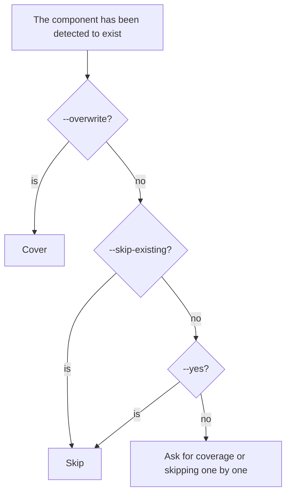
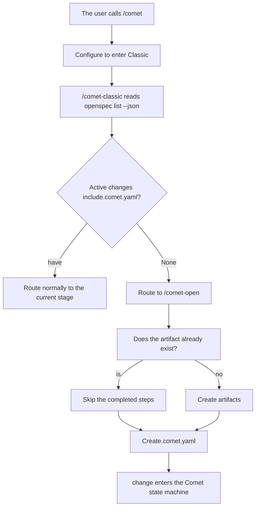

Your project might have been around for some time - with code, a Git history, or even already using OpenSpec or Superpowers. This page explains the real process and the boundaries that need attention when such existing projects are integrated into Comet Classic.

## The shortest path

```bash
npm install -g @rpamis/comet
cd your-existing-project
comet init --workflow classic
```

Then enter "`/comet`" in the AI coding platform and describe the changes you want to make. The project configuration will enable a unified entry point to access Classic.

## What does Classic initialization do in existing projects

`comet init --workflow classic` won't ask you "Are you already using OpenSpec/Superpowers?" It detects each component one by one and then lets you decide whether to override or skip it.

### Component detection

The Classic initialization checks whether the following three types of components already exist:

|Component|Detection method|
| ----------- | ----------------------------------------------------------------------------------------------------------------------------------------------- |
| OpenSpec    |Is there a Skill starting with `openspec-*` in the skills directory of the target platform|
| Superpowers |Are there any skills such as `brainstorming`, `writing-plans`, and `test-driven-development`? It will also check the plugin cache (Superpowers installed by the Claude/Codex/OpenCode plugin)|
| Comet       |Are there any skills starting with `comet*`|

CLI dependencies are checked separately (whether `openspec` and `codegraph` are on the PATH). Those that have already been installed are not checked by default and will not be reinstalled.

### Processing of existing components

When an existing component is detected:



If multiple existing components are detected on the same platform, they should first be selected in batches (overwrite all/skip all/select one by one), and then processed one by one.

### The directories and files created by init

When installing project-level Classic, `comet init --workflow classic` will:

- Run `openspec init` to create the current Classic OpenSpec root directory; By default, new projects use `docs/openspec/`. For projects that already have the root directory `openspec/`, the `legacy` layout is retained
- Install Comet Skill, rules and hooks to the target platform directory
- Create working directories `docs/superpowers/specs`, `docs/superpowers/plans`, and `.comet/`
- Write to the default `.comet/config.yaml` (if it does not exist

```yaml
# .comet/config.yaml (Classically only, select Chinese Skill)
schema: comet.project.v1
default_workflow: classic
workflows:
  - classic
ambient_resume: true
classic:
  language: zh-CN
  context_compression: off
  review_mode: standard
  auto_transition: true
```

<Note>
`.comet/config.yaml` is a project-level configuration. Each change's `.comet.yaml` is created by `/comet-open`, not init
Created. `classic.language` will be snapshots to `.comet.yaml` when creating a change, which is used to constrain OpenSpec and
The main language of Superpowers products.
</Note>

## Four scenarios for existing projects

<p align="center">
  
</p>

When integrating the existing <p align="center"> project, first detect the existing components, and then decide whether to overwrite, skip, install or update </p>

### Scene One: Pure code base, without using OpenSpec/Superpowers

The most common scenario. The Classic initialization does not detect any existing components. All are installed:

```bash
comet init --workflow classic
```

Then start the first change with `/comet`.

### Scene Two: OpenSpec is already in use

You already have the root directory `openspec/` and an active change. `comet init --workflow classic` will recognize it as the existing Classic `legacy` layout and will not automatically move to `docs/openspec/` during upgrades. When it is detected that OpenSpec Skill and CLI already exist, you will be asked to choose to overwrite or skip. It is recommended to skip the existing components and only supplement the Comet part.

The `openspec init` in the Classic initialization run is idempotent - OpenSpec will handle the currently configured root directory and will not break the existing changes. If you want to migrate from the old layout `openspec/` to the new layout `docs/openspec/`, please refer to [Migrate Classic Layout ](/en/guides/classic-layout-migration)

### Scene Three: Superpowers are already in use

You already have skills such as `brainstorming` and `writing-plans` (which may be installed through plugins). After the Classic initialization detects it, it also allows you to make a choice. It is recommended to skip to avoid overwriting your custom version.

<Tip>
If you were previously using the old version of Superpowers (below 6.0.0), upgrading to 6.0.0+ is approximately twice as fast and has fewer tokens
50%. When upgrading, you can choose to overwrite the Superpowers component.
</Tip>

### Scene Four: Use both OpenSpec and Superpowers simultaneously

Both sets of components already exist. The Classic initialization will prompt in batches. Just select "Skip All". It only installs Comet Skill, rules, hooks and working directories.

## Historical change: There is an OpenSpec change but no.comet.yaml

This is the most common pitfall when integrating existing projects.

### "Problem"

If you previously created OpenSpec changes using the original `/opsx:new`, these changes ** do not have `.comet.yaml`**. At this moment

- `comet status` will ** silently skip ** them (no error is reported, but they are not displayed either).
- `comet doctor` also does not detect this type of change.
- Only after calling `/comet` in the Agent platform and entering Classic will the internal routes discover them through `openspec list --json`.

### Take over the existing OpenSpec Change

Comet does not have takeover commands like `comet adopt` or `comet import`. The takeover of the existing OpenSpec change relies on the idempotence of `/comet-open`:

1. Call `/comet` on the Agent platform.
2. The project configuration entered Classic, and the internal `/comet-classic` ran `openspec list --json`. It was found that there was an active change but `.comet.yaml` was missing.
3. Route to `/comet-open`.
4. `/comet-open` discovers that OpenSpec artifacts already exist. Skip the completed steps and create `.comet.yaml` instead.



<Warning>
This takeover path only works cleanly when the change is still in the open stage (or has just been created but not yet advanced). If a change has already been achieved
build or verify but without `.comet.yaml`, there is no reliable way to trace back the mount Comet status - a change needs to be opened again.
</Warning>

### Suggestion

- If the existing OpenSpec change has not been advanced yet, simply use `/comet` to let Classic take over.
- If you have already advanced to build/verify, it is recommended to complete the current work first and then start a new change with `/comet`. A forced takeover would disrupt the current state.
- After connection, confirm that `comet status` can see your change (indicating that `.comet.yaml` has been added).

## Upgrade the existing Comet installation

If the project is already using Comet and just wants to upgrade:

```bash
comet update --self-update
comet doctor
```

`comet update` will refresh Comet skills, rules and scripts to the installed platform. In init, `--yes` will parse existing components as "skip", so to force a refresh, `--overwrite` should be used.

## The checklist after connection

|Inspection items|Command|Expected|
| ---------------- | ------------------------- | ------------------------------------ |
|Installation integrity| `comet doctor`            |All passed|
|"Active change visible| `comet status`            |List your change and the current stage|
|The platform Skill is in place| `comet doctor`            |The detected platform directory contains Comet Skill|
|The project configuration exists.|View `.comet/config.yaml`|There are shared entry fields and `classic:` configuration blocks|

## Q&A

<Accordion title="Will the Classic initialization overwrite my existing hooks">
No. Comet non-destructive merge hook configuration, keep what you already have
hooks only replace the commands it manages itself. For details, please refer to the supported platforms: ](/en/platforms).
</Accordion>

<Accordion title="Can I install Comet without OpenSpec/Superpowers">
No, Comet relies on OpenSpec and Superpowers. If installed, it can be controlled through the interactive prompt's override/skip selection, or the installed dependencies can be automatically skipped by detection.
</Accordion>

<Accordion title="After connecting, I can't see my change on comet status">
This change might have been created by the original `/opsx:new`, lacking `.comet.yaml`. Enter with `/comet`
In Classic, let the internal route take over and add the status file. For details, please refer to "Historical change" above.
</Accordion>

## Next step

- Install and update the basic usage of ](/en/guides/install-and-update)-init /status/doctor
- [Restoring Interrupted Work ](/en/guides/resuming-workflow) - How to restore existing changes after connection
- [Project file structure ](/en/guides/project-structure) - Comet to create which directories
