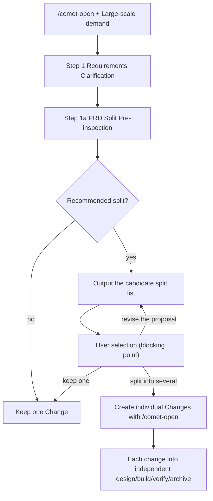
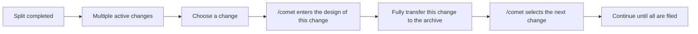

The development of real-world demands often begins with a large-scale PRD, product roadmap or complete solution. Directly stuffing a change will lead to task expansion, delta spec confusion, and a partial failure blocking the whole. Comet's PRD splitting (open phase) helps you break down large requirements into multiple independently flowing changes before creating artifacts.

## What problem does it solve

|"Problem"|"Not split|After splitting|
| --- | --- | --- |
|Number of tasks|One change is crammed with dozens of tasks, resulting in high recovery costs|Each change task is focused and the recovery is fast|
| delta spec |Multiple capabilities are mixed in one delta, making the scope ambiguous|Each change has a clear delta|
|Delivery rhythm|It must be completed as a whole before it can be filed|Each change independently designs, verifies and archives|
|Failure isolation|Some delays block all|Each part advances independently|
|Teamwork|Everyone was crowded in one change|Different people/groups undergo different changes in parallel|

## When will the split be triggered

PRD split pre-check is triggered in Step 1a of `/comet-open`, provided that the input falls into any of the following situations:

- Large-scale PRDS, roadmaps, and complete product solutions
- The clarification summary contains multiple ** independent ** capabilities, modules, user paths or milestones

Comet will recommend splitting when any of the following signals is met:

|Signal|Meaning|
| --- | --- |
|Multiple capabilities that can be independently designed, built, verified and archived|Each part can move forward independently|
|Multiple modules or user paths, and some of them can be delivered independently|For instance, the back-end API and the front-end page can be implemented separately|
|There are obvious phased milestones|For example, MVP → Enhancement → Optimization|
|It is expected to generate multiple delta spec or more than three major tasks|The scope of the description has exceeded a single change|
|The failure or delay of any part should not block the others|The team needs to deliver in batches according to priority|

## Split process



<p align="center">
  
</p>

<p align="center">Split a large PRD into independent Changes, define each scope, dependency, and acceptance boundary, then advance them one by one.</p>

### Candidate split list

When recommending splitting, Comet will list for each candidate:

- Suggest changing the name
- Objectives and scope boundaries
- Clarify non-targets
- Dependency relationship or recommended execution sequence
- The corresponding core acceptance scenario

### The user's choice of one of three (blocking point)

Before creating any proposal/design/tasks **, Comet must pause to allow you to select:

1. ** Create multiple OpenSpec changes** - Create independent changes one by one according to the candidate split.
2. ** Keep as a change** - Continue with the single change process and record the reasons for not splitting in proposal/design/tasks.
3. ** Adjust the split plan ** - After stating the adjustment direction, re-output the candidate split list and confirm it again.

<Warning>
Propose.md, design.md or tasks.md will not be created before the split confirmation. When "Keep one" is selected, Comet will record the reason for not splitting, making it convenient for subsequent traceability.
</Warning>

## How is each change created

After choosing to split, each accepted split item is created through an independent `/comet-open`. The use of `/opsx:new` is prohibited here for the following reasons:

- `/comet-open` simultaneously creates OpenSpec artifacts ** and ** `.comet.yaml` to ensure that each change enters the Comet state machine.
- `/opsx:new` only creates OpenSpec artifacts. Changes will fall outside the state machine and cannot be restored or guarded with `/comet`.

In batch splitting mode:

- When entering each split item, mark "Confirmed Split Item", and carry the objective, scope, non-objective and acceptance scenario of this split item.
- It has been confirmed that the split item skips the PRD split pre-check by default (unless the split item itself still clearly contains multiple independent capabilities).
- A single split item will not automatically flow to `/comet-design` after completing the open phase. After the split is completed, pause and let you choose which change to start.

## How to advance after the split

Splitting generates multiple active changes. Promotion method:



- Each change independently goes through design → build → verify → archive.
- After a change is archived, use `/comet` to select the next active change to continue.
- There can be a dependency order among the changes (marked in the candidate split list), but Comet does not enforce serialization - you can advance independent parts in parallel.

## How to restore it if it's interrupted

Batch splitting does not add dedicated status files. Rely on the existing active changes for minimum breakpoint recovery:

- After the split process is interrupted, check the created active changes first when restoring.
- Split items that already exist and contain `.comet.yaml` will not be created repeatedly.
- The uncreated split items will continue to be created through `/comet-open` according to the split list you have confirmed.
- If the confirmed split list in the conversation cannot be restored, Comet will reconfirm the split list with you before continuing.

## Real-life scene examples

### Scene One: User System Reconfiguration

Enter a PRD that includes four modules: "User Registration and Login, Personal Information, Permission Management, and Operation Audit".

```
You: /comet helped me implement a complete user system, including registration and login, personal information, permission management, and operation auditing
```

After Comet completes the requirement clarification, Step 1a determines that these are four independent capabilities and recommends splitting them:

|Candidate change|Objective|Non-target|Dependency|
| --- | --- | --- | --- |
| `user-auth` |Registration, login, token refresh|Permission model, auditing|no|
| `user-profile` |Personal information CRUD and avatar upload|Authentication logic| `user-auth` |
| `user-rbac` |Role and permission allocation|"Data editing"| `user-auth` |
| `user-audit` |Operate the audit log recording and query|Business logic implementation| `user-auth` |

You select "Create Multiple changes". Comet creates `user-auth`, `user-profile`, `user-rbac`, `user-audit` one by one, and each one is an independent active change.

When advancing, start with `user-auth` (dependency free) first:

```
/comet
```

Comet lists four active changes. You select `user-auth` and go through design → build → verify → archive. Then continue with `user-profile`.

### Scene Two: Platform Migration

Enter a migration plan that includes "replacing the database, rewriting the data access layer, migrating the API, and updating the front-end adaptation".

```
You: We need to migrate the project from MySQL to PostgreSQL, including ORM replacement, API layer modification and front-end field adaptation
```

Comet determines that there are clear phased milestones (with the back-end taking the lead and the front-end following up), and recommends splitting it:

|Candidate change|Objective|Recommended order|
| --- | --- | --- |
| `db-migrate-postgres` |Database schema migration, data relocation script| 1 |
| `rewrite-data-access` |ORM/ Data access layer rewrite|2 (Dependent on 1|
| `api-layer-adapt` |API layer field and type adaptation|3 (Dependent on 2|
| `frontend-field-adapt` |Front-end field and type adaptation|4 (Dependent on 3|

Here, the dependencies are strongly serial, and the candidate split list indicates the recommended execution order. You advance in sequence as 1→2→3→4.

### Scene Three: No need for splitting

Enter a focused requirement: "Add a rich text editor and image pasting function to the existing note-taking module."

After clarification, Comet determined that this was a capability (note editing enhancement), which did not meet the requirements for splitting signals (no multiple independent capabilities, no phased milestones), and ** splitting is not recommended **, directly entering the single change process.

If Comet recommends splitting but you decide that this time they should be done together (for example, front-end and back-end changes must be launched simultaneously), you select "Keep as one change", and Comet will record the reason for not splitting in the proposal.

## The relationship between splitting and lightweight presets

PRD splitting occurs in the open phase of the full workflow. hotfix and tweak presets do not involve splitting - they are just individual minor changes themselves. If during a hotfix process, it is found that the scope has expanded (across modules, new apis, schema changes), it should be upgraded to full, and then the open phase of full should determine whether splitting is necessary.

For details, please refer to [Lightweight Preset ](/en/presets/hotfix)

## Next step

- Workflow concept ](/en/concepts/workflow) - Understanding the position of the open phase within the entire five phases
- [open stage ](/en/phases/open) - Complete steps and products of the open stage
- [Project file structure ](/en/guides/project-structure) - Directory structure of multiple changes after splitting
