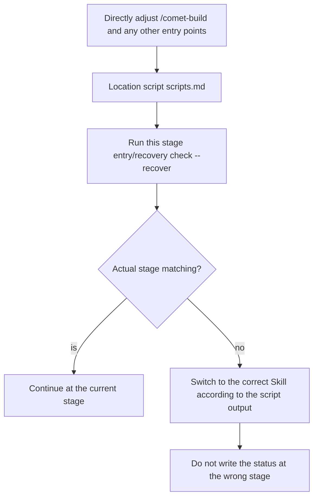

After a session is interrupted, the context is compressed, or the device is changed, simply re-enter `/comet` to restore it. Comet first reads the project root configuration, enters `/comet-native` or `/comet-classic`, and then continues from its own disk state by the corresponding workflow. Neither side will scan, guess or convert the change on the other side.

## The shortest path

Enter: In the Agent platform

```text
/comet continues
```

Comet does not rely on dialogue history: Classic re-read project configuration, OpenSpec, `.comet.yaml`, and runtime evidence.

<Tip>
  <strong>
Recovery does not require running <code>comet status</code> or <code>comet doctor</code> first.
  </strong>
Those two are diagnostic commands and are only used when <strong> appears to have a problem with </strong> (CLI/Skill)
The installation is broken, the change does not route, and the evidence does not match. Recovery is <code>/comet</code>{" "} normally
One step to perfection.
</Tip>

## You can also directly say "continue".

Starting from 0.4.0-beta.4, `comet init` and `comet update` will incorporate a Comet recovery description into the project's `AGENTS.md` and `CLAUDE.md`. When a long-term task is compressed in context, continues across sessions or devices, the Agent may have forgotten that the current request originally belonged to Comet, and the user has not re-entered `/comet`. At this point, the Agent can first run the read-only `comet resume-probe` to determine whether "continue the previous login refactoring" corresponds to the existing change, and then decide whether to re-enter the workflow.

|Scene|Detection results|
| --------------------------------------------------- | ---------------------------------------- |
|By default, the workflow has only one clear target, and the state allows for recovery|Return to `auto_resume` and enter the corresponding permanent entrance|
|There are multiple candidates, statuses are corrupted, or users need to select|Return `ask_user` and ask only one question|
|Just asking questions, clearly not going through Comet, or currently within the Comet process|Return `out_of_scope` without re-entering the workflow|
|There is no active Comet Change|Return `none` and do not perform the recovery|

This description only restricts Comet's recovery detection and will retain the existing user rules in the file. The probe first parses the configuration and then only checks one set of workflows. It will not roll back when the configuration is damaged. The `ambient_resume: false` in `.comet/config.yaml` can turn off probes triggered by ordinary requests. It will not affect the explicit `/comet`, nor will it bypass existing decision points.

For details, please refer to the [Restore Detection Command ](/en/cli/resume-probe)

## How to restore Classic

<Note>
  This section also explains the <strong>background mechanism</strong>: which files <code>/comet-classic</code>{" "}
  rereads and which rules it uses to route to the next phase. You only need to enter{" "}
  <code>/comet continue</code>; Comet completes the routing below automatically.
</Note>

The recovery ability of `/comet-classic` depends on several mechanisms:

|Mechanism|Explanation|
| ---------------------------- | ----------------------------------------------------------------------------------------------------------------------------------------- |
|Re-read the file status without relying on conversations|Each time it is restored, it re-executes the discovery of active change + reads `.comet.yaml`, not relying on the chat history to guess the stage|
|"File status priority, self-healing metadata.|If there is a conflict between `.comet.yaml` and the actual file, the file shall prevail. Comet will automatically correct `.comet.yaml` before continuing|
|"Deterministic routing by stage.|Based on fields such as `phase`/`workflow`/`verify_result`, route to the corresponding stage Skill (including presets: build stage hotfix→`/comet-hotfix`, tweak→`/comet-tweak`)|

Routing during recovery (stops upon hit, subject to file status) :

|Current status|`/comet-classic` is routed to|
| ----------------------------------------- | -------------------------------------------------------------- |
| `archived: true`                          |The process has been completed.|
| `verify_result: pass`                     |`/comet-archive` (Confirm before filing first)|
| `verify_result: fail`                     |Verify the failure decision blocking point (you can choose to fix or accept the bias)|
|Check all of `phase: verify` or tasks| `/comet-verify`                                                |
| `phase: build`                            |According to workflow: `/comet-hotfix`/`/comet-tweak`/`/comet-build`|
|`phase: design` may have change but no Design Doc| `/comet-design`                                                |
|`phase: open` or `.comet.yaml` is missing| `/comet-open`                                                  |
|No active change| `/comet-open`                                                  |

As long as there is ** one ** active Classic change, `/comet-classic` will automatically select it; When there are multiple options, make a list for you to choose one.

If you resume through natural language and there are multiple active changes, Comet will not pick one for you automatically; the recovery detection will return `ask_user` and wait for you to name the target.

### Workspace reuse of Classic Change

When creating or restoring a Classic change, Comet first reads the branch and worktree binding of the change record. The matched registered worktree will be directly reused. When a matching worktree cannot be found but the branch still exists, the recovery process will rebuild it. When the current directory, branch, and worktree do not match, Comet will pause and wait for selection instead of silently switching to another workspace.

You just need to enter `/comet` or `/comet continues` from the target project directory. If there are multiple active changes,    select the target first and then let the Classic continue. Do not manually copy the "change" directory to "restore"  the   work.

## It can also be restored by changing the device or platform

The Classic states that can be recovered across devices are saved in the repository files: `.comet/config.yaml`, OpenSpec product roots (new items are `docs/openspec/`), change's `.comet.yaml` and running evidence, `docs/superpowers/`. So when the same repository is opened on another device or another Agent platform, `/comet` can recover from the corresponding file. The cross-device recovery of Native change can be found in the recovery manual ](/en/native/recovery-playbook).

<Note>
The only point to note: Uncommitted workspace changes will not follow <code>git push</code>{" "}
Let's go Before crossing devices, push the change commit forward first; otherwise, the new device will show a clean workspace restoration.
The checkmark status of <code>tasks.md</code> is still valid.
</Note>

### Cross-device 0-context breakpoint recovery

The following figure shows cross-device breakpoint recovery: As long as the repositories are consistent, regardless of which device or platform it is, `/comet` can rebuild the breakpoint from the file state and continue without any additional operations or context passing.


## What should be done after context compression

If the Agent platform where Classic change is located automatically compresses the context, re-enter `/comet`. The project configuration will re-enter Classic, and the internal `/comet-classic` will be restored to the overloaded state according to the protocol. Read the `brainstorm-summary.md`, handoff handover packet and `.comet/subagent-progress.md` when necessary. You don't need to operate these files manually.

## Recover from any stage entry

Classic resumes normal use of `/comet`. The stage and preset entry points are only for manual control or debugging: `/comet-open`, `/comet-design`, `/comet-build`, `/comet-verify`, `/comet-archive`, `/comet-hotfix`, `/comet-tweak`.

There is a deterministic guarantee here: when each phase Skill enters, it first locates its own scripts, then runs the **entry check or recovery check** for that phase. The phase is always determined by the current file state.

```bash
comet state check <change-name> <phase> --recover
```

- If the inspection reveals that the actual phase, workflow or evidence belongs to ** another ** Skill, switch according to the script output and `/comet-classic` routing rules, ** do not continue writing the state in the wrong phase **.
- If there are any uncommitted changes to the working tree, first attribute them using the rule of `comet/reference/dirty-worktree.md`.



<Tip>
This rule enables you to skip the unified entry and Classic when <strong> already knows which stage </strong> you are in
Internal routing
Directly enter the corresponding stage, and at the same time ensure that even if the stage is remembered wrongly, the status will not be disrupted: The entry check will block calls that do not match the file state.
</Tip>

## Special circumstances for recovery during the build phase

The recovery during the build phase is the most complex, but in most cases, `/comet-classic` can also handle it automatically

|"Situation|"Behavior"|
| ------------------------------------------------------------------------ | ------------------------------------------------------------------- |
|`build_pause: plan-ready` and the configuration is complete|Re-initiates the same joint-decision confirmation; once you confirm, it clears the pause flag and continues|
|`build_pause: plan-ready`, the plan exists, but the execution configuration is not set|Return to the plan-ready joint decision and ** let you pick ** the execution mode, TDD, and review mode (without regenerating the plan)|
|`build_pause: plan-ready` but the plan file is missing|The status is damaged. Return to `/comet-build` for repair or regenerate the plan|
|`isolation`/`build_mode`/`tdd_mode` is not set|Reply to the corresponding steps of `/comet-build` ** to allow you to make additional selections **|
|All have been set, but there are still unfinished tasks|Read tasks.md to continue the execution of the next unselected task|

When the subagent mode (`build_mode: subagent-driven-development`) is restored, the main session will not directly execute the task. Instead, it will return to the backend sub-agent scheduling rules, where the main session only performs coordination.

## When there are unsubmitted changes

If there are uncommitted changes in the workspace, Comet will automatically make ** attribution ** without you having to explain what has been changed first:

- The changes belong to the current change → Fold in and continue
- Unrelated to the current change → Pause asked how to handle (merge/split new change/retain/discard)
- Source uncertain → Suspend the list of reporting documents and the basis for judgment

The built products (such as `node_modules/`, `dist/`, etc., `.gitignore`) will be automatically excluded and modified by improper users.

<Warning>
dirty worktree only represents code facts. <strong> will not automatically advance </strong>{" "}
<code>.com et. <code>tasks to yaml</code> <code>phase</code> or checked. Md</code>
Only after completing attribution, verification, and passing the stage guard will the status be advanced.
</Warning>

## When you need to intervene

`/comet-classic` can automatically promote unambiguous connections, but the ** decision point ** must be clearly chosen by you. Common situations that require your intervention during recovery:

- ** Verification Failed ** (`verify_result: fail`) : You need to decide whether to fix it or accept the deviation
- ** True plan-ready pause ** : You need to select the isolation and execution methods
- ** Missing build decision ** : You need to make up the selection of `isolation`/`build_mode`/`tdd_mode`
- ** Unattributed unsubmitted changes ** : You need to specify the attribution of the changes
- ** Multiple active changes ** : You need to choose which one to restore

The rest are the inherent pause points of each stage (see [Five-stage pause points ](/en/concepts/decision-points)). Beyond these, `/comet-classic` will automatically advance.

## When should comet status/comet doctor be used

These two are diagnostic tools, not essential steps for recovery:

|Command|When to use it|
| -------------- | ----------------------------------------------------------------------------------- |
| `comet status` |When the route of `/comet-classic` is incorrect or the evidence does not match, want to see "at which stage am I? Are all the declared products still there?|
| `comet doctor` |Environment or installation issues: CLI/Skill missing, `.comet.yaml` format broken, `/comet-classic` fails to start|

```bash
comet status        # Look at the phase/ task /runtime_eval of the active change
comet doctor        # Diagnose installation, environment, and Skill integrity
```

`runtime_eval` will tell you whether the evidence of the declared steps is really on the disk. When it fails,    `run < command > or restore missing evidence` will be prompted.

## Next step

- [Restore probe command ](/en/cli/resume-probe) - Learn about read-only probes before natural language restoration
- [Status Damage and Recovery ](/en/guides/state-recovery) - `/comet-classic` What should I do if the route is incorrect or the status is bad
- The project file structure ](/en/guides/project-structure) - in which files does the status exist
- Automatic propulsion mechanism ](/en/concepts/auto-transition) - Automatic connection after recovery
- Five-stage pause points and user selection points ](/en/concepts/decision-points) - Where your intervention is needed
