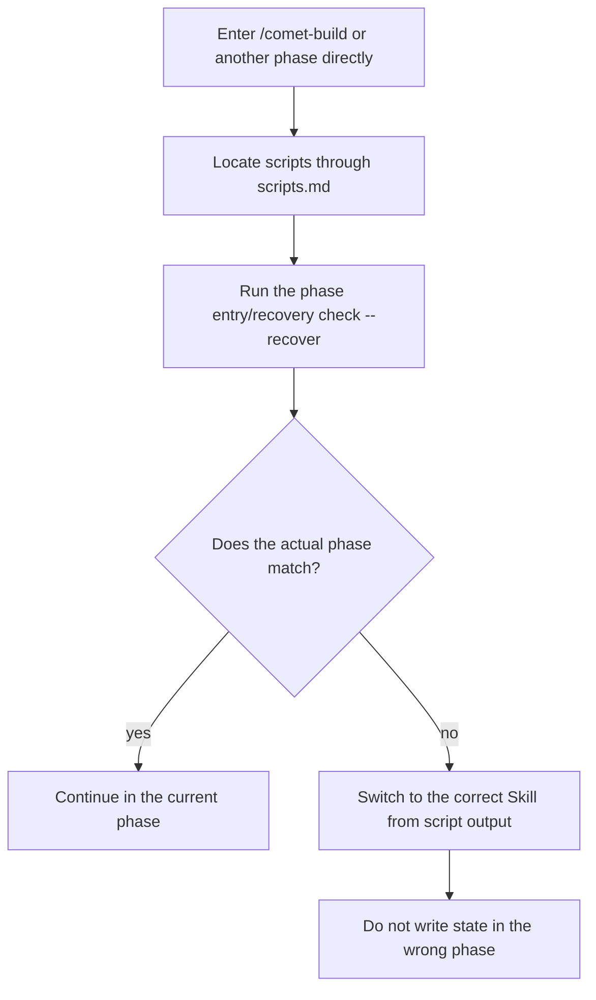

If a session ends, context is compressed, or you switch devices, **normally you only need to enter `/comet` again**. Comet reads the project-root configuration, enters `/comet-native` or `/comet-classic`, and lets that workflow continue from its own disk-backed state. Neither side scans, guesses, or converts changes from the other.

## Short path

Type this in your agent platform:

```text
/comet continue
```

That is all. Comet does not depend on conversation history. Native rereads `.comet/config.yaml`, `<artifact-root>/comet/`, implementation, and verification evidence. Classic rereads the same project configuration, OpenSpec, `.comet.yaml`, and runtime evidence.

<Tip>
  <strong>
    You do not need to run <code>comet status</code> or <code>comet doctor</code> before recovery.
  </strong>{' '}
  Those are diagnostic commands for when something <strong>looks wrong</strong>, such as broken CLI
  or Skill installation, incorrect change routing, or inconsistent evidence. Normal recovery is one
  step: <code>/comet</code>.
</Tip>

## You can also say “continue”

Starting in 0.4.0-beta.4, `comet init` and `comet update` merge Comet recovery instructions into `AGENTS.md` and `CLAUDE.md`. After context compaction or a cross-session or cross-device continuation, the agent may no longer know that the request belongs to Comet while the user has not invoked `/comet` again. The agent can run read-only `comet resume-probe` to decide whether “continue the login refactor” matches an existing change before re-entering the workflow.

| Situation                                                                  | Probe result                                                             |
| -------------------------------------------------------------------------- | ------------------------------------------------------------------------ |
| The default workflow has one clear target whose state allows recovery      | Returns `auto_resume` and enters the corresponding permanent entry point |
| Multiple candidates, damaged state, or a required user choice              | Returns `ask_user` and asks one question                                 |
| An informational request, explicit opt-out, or a turn already inside Comet | Returns `out_of_scope` and does not enter the workflow again             |
| No active Comet change                                                     | Returns `none` and does not resume                                       |

The managed instructions apply only to Comet's recovery probe and preserve existing user-authored rules in the file. The probe parses configuration first and then inspects only one workflow; malformed configuration does not fall back. Set `ambient_resume: false` in `.comet/config.yaml` to disable probing for ordinary requests. This does not affect explicit `/comet` calls or bypass existing decision points.

See [Resume probe](/en/cli/resume-probe).

## How Native resumes

<Note>
  This section explains the <strong>background mechanics</strong>: after you type <code>/comet continue</code>, how the Native workflow rebuilds the breakpoint from on-disk state internally. You don't need to run any of the commands here manually.
</Note>

Every Native phase resumes through the permanent `/comet-native` entry point. The entry point first runs `status` and `show`, reads the brief, complete target specifications, canonical specifications, repository implementation, and tests, then decides whether to continue Shape, Build, Verify, or Archive. Uncommitted changes are worksite evidence and do not by themselves block recovery; the model must still preserve unrelated changes.

`comet native next` advances state after phase conditions are met. It is not the Ambient Resume entry point. With multiple Native changes, an exact user-provided name takes precedence, followed by a valid selection. Otherwise, the probe asks for a choice instead of guessing from the request text.

## How Classic resumes

<Note>
  This section is also <strong>background mechanics</strong>: it explains which files <code>/comet-classic</code> re-reads internally and the rules it uses to route to the next phase. You only need to type <code>/comet continue</code> — the routing below is handled automatically by Comet.
</Note>

`/comet-classic` can recover because of three mechanisms:

| Mechanism                                             | Description                                                                                                                                                                    |
| ----------------------------------------------------- | ------------------------------------------------------------------------------------------------------------------------------------------------------------------------------ |
| **Reread file state instead of conversation history** | Every recovery discovers active changes and reads `.comet.yaml` again instead of guessing the phase from chat history                                                          |
| **File state wins and metadata self-heals**           | If `.comet.yaml` conflicts with actual files, Comet uses file facts, repairs `.comet.yaml`, and continues                                                                      |
| **Deterministic phase routing**                       | Fields such as `phase`, `workflow`, and `verify_result` route to the corresponding phase Skill, including `hotfix` → `/comet-hotfix` and `tweak` → `/comet-tweak` during Build |

Recovery uses the first matching route, with file state as the source of truth:

| Current state                                    | `/comet-classic` routes to                                                                           |
| ------------------------------------------------ | ---------------------------------------------------------------------------------------------------- |
| `archived: true`                                 | The workflow is complete                                                                             |
| `verify_result: pass`                            | `/comet-archive` after pre-archive confirmation                                                      |
| `verify_result: fail`                            | Verification-failure decision point, waiting for a choice between repair and accepting the deviation |
| `phase: verify` or every task checked            | `/comet-verify`                                                                                      |
| `phase: build`                                   | `/comet-hotfix`, `/comet-tweak`, or `/comet-build` according to `workflow`                           |
| `phase: design` or a change without a Design Doc | `/comet-design`                                                                                      |
| `phase: open` or missing `.comet.yaml`           | `/comet-open`                                                                                        |
| No active change                                 | `/comet-open`                                                                                        |

With exactly **one** active Classic change, `/comet-classic` selects it automatically. With **multiple**, it presents a list and asks you to choose.

Natural-language recovery never guesses among multiple active changes. The recovery probe returns `ask_user` until you name the target.

## Resume across devices and platforms

All state is stored in repository files. Both workflows share `.comet/config.yaml`; Native changes use `<artifact-root>/comet/` and `comet-state.yaml`, while Classic changes use `.comet.yaml`, OpenSpec, and `docs/superpowers/`. Open the same repository on another device or agent platform and `/comet` can recover from the corresponding files.

<Note>
  Uncommitted worktree changes do not travel with <code>git push</code>. Commit and push before
  switching devices, or the new device will recover from a clean worktree. Checked tasks in{' '}
  <code>tasks.md</code> still persist when committed.
</Note>

### Zero-context recovery across devices

The following image shows a real cross-device, zero-context recovery. As long as the repository is the same, `/comet` reconstructs the checkpoint from file state and continues without additional context transfer:


## After context compression

If the agent platform compresses earlier conversation for a Classic change, enter `/comet` again. Project configuration selects Classic again, and the internal `/comet-classic` entry reloads state through the context-compression recovery protocol. It reads `brainstorm-summary.md`, the handoff package, and `.comet/subagent-progress.md` when needed. You do not manage these files manually.

## Resume from a specific phase entry point

Normal Classic recovery uses `/comet`. Phase and preset entry points are for manual control or debugging: `/comet-open`, `/comet-design`, `/comet-build`, `/comet-verify`, `/comet-archive`, `/comet-hotfix`, and `/comet-tweak`.

This is a deterministic guarantee of the progressive loading introduced in 0.4.0-beta.1. Every Classic sub-Skill first uses `comet/reference/scripts.md` to locate scripts, then runs its own **entry or recovery check** instead of inferring a phase from conversation history.

```bash
comet state check <change-name> <phase> --recover
```

- If the check finds that the actual phase, workflow, or evidence belongs to **another** Skill, follow the script output and `/comet-classic` routing rules. **Do not keep writing state from the wrong phase.**
- If the worktree has uncommitted changes, attribute them using the rules in `comet/reference/dirty-worktree.md` first.



<Tip>
  When you <strong>know the current Classic phase</strong>, this rule lets you skip the routing
  overhead of <code>/comet-classic</code> and work directly. If you remember incorrectly, the entry
  check stops the mismatch before it damages state.
</Tip>

## Special cases when resuming Build

Classic Build has the most complex recovery cases, but `/comet-classic` handles most of them automatically:

| Situation                                                                     | Behavior                                                                                                               |
| ----------------------------------------------------------------------------- | ---------------------------------------------------------------------------------------------------------------------- |
| `build_pause: plan-ready` with `isolation` and `build_mode` already set       | Clears the stale pause automatically and continues                                                                     |
| `build_pause: plan-ready` with a plan but without `isolation` or `build_mode` | Returns to the plan-ready checkpoint and asks you to choose isolation and execution mode without regenerating the plan |
| `build_pause: plan-ready` but the plan file is missing                        | Treats state as damaged and returns to `/comet-build` to repair or regenerate the plan                                 |
| `isolation`, `build_mode`, or `tdd_mode` is unset                             | Returns to the corresponding `/comet-build` step and asks you to choose                                                |
| All choices are set and tasks remain                                          | Reads the next unchecked task from `tasks.md` and continues                                                            |

In `build_mode: subagent-driven-development`, the main session does not execute tasks directly after recovery. It returns to the background-subagent dispatch protocol and acts only as coordinator.

## When the worktree has uncommitted changes

Comet attributes uncommitted changes automatically; you do not need to explain them in advance:

- Changes belonging to the current change are folded in and work continues.
- Unrelated changes pause the workflow and ask whether to include them, create another change, preserve them separately, or discard them.
- If origin is uncertain, Comet pauses and reports the file list and reasoning.

Ignored build artifacts such as `node_modules/` and `dist/` are excluded and are not treated as user changes.

<Warning>
  A dirty worktree represents code facts only. It does <strong>not automatically advance</strong>{' '}
  the <code>phase</code> in <code>.comet.yaml</code> or check tasks in <code>tasks.md</code>. State
  advances only after attribution, verification, and the phase checks pass.
</Warning>

## When you must intervene

`/comet-classic` automatically handles unambiguous transitions, but **decision points** require an explicit user choice. Common recovery cases include:

- **Verification failed** (`verify_result: fail`): choose whether to repair or accept the deviation.
- **A genuine plan-ready pause**: choose isolation and execution mode.
- **Missing Build decisions**: choose `isolation`, `build_mode`, or `tdd_mode`.
- **Unattributable uncommitted changes**: explain where the changes belong.
- **Multiple active changes**: select the target to recover.
- Other phase-specific pauses described in [Five-phase decision points](/en/concepts/decision-points).

Outside these cases, `/comet-classic` continues on its own.

## When to use comet status or comet doctor

These are **diagnostic tools**, not mandatory recovery steps:

| Command        | When to use it                                                                                                                                                   |
| -------------- | ---------------------------------------------------------------------------------------------------------------------------------------------------------------- |
| `comet status` | You want to inspect the current phase and whether declared artifacts still exist, especially when `/comet-classic` routes incorrectly or evidence does not match |
| `comet doctor` | Installation or environment is broken, such as a missing CLI or Skill, invalid `.comet.yaml`, or `/comet-classic` failing to start                               |

```bash
comet status        # Inspect active changes, phase, tasks, and runtime_eval
comet doctor        # Diagnose installation, environment, and Skill integrity
```

`runtime_eval` reports whether declared step evidence actually exists on disk. On failure, it prompts you to `run <command> or restore missing evidence`.

## Next steps

- [Resume probe](/en/cli/resume-probe) — Understand the read-only check before natural-language recovery
- [Broken state and recovery](/en/guides/state-recovery) — Troubleshoot incorrect routing or damaged state
- [Project file structure](/en/guides/project-structure) — See where workflow state is stored
- [Automatic progression](/en/concepts/auto-transition) — Understand transitions after recovery
- [Five-phase decision points](/en/concepts/decision-points) — See where user input is required
