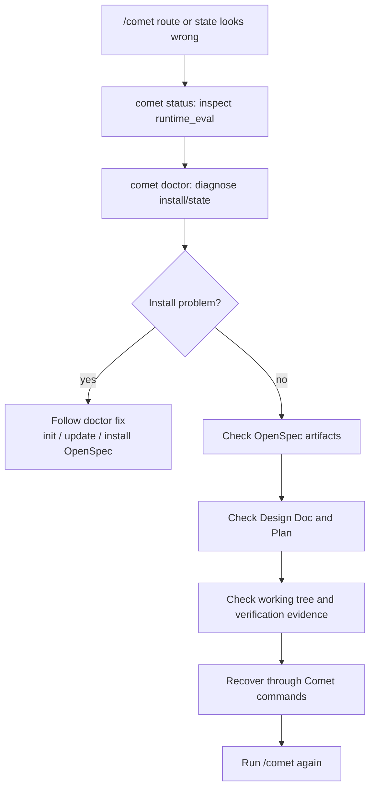

Normal recovery only needs `/comet`; see [resuming interrupted work](/en/guides/resuming-workflow). This page is for cases where `/comet` routes to the wrong phase or the state looks damaged.

When state is damaged, the goal is to **recover the real facts**, not to force fields forward until the workflow continues.

<p align="center">
  
</p>

<p align="center">Recover state by diagnosing real file evidence first. Do not fake state just to move the workflow forward.</p>

## First check: damaged state or normal interruption?

| Situation | What it means | What to do |
| --- | --- | --- |
| Session ended, context compacted, or device changed | Normal interruption | Run `/comet`. |
| `/comet` routes to the wrong phase | Metadata and files may disagree | `/comet` tries to self-heal from files; if not, run diagnostics. |
| `.comet.yaml` is missing or malformed | Damaged state | Run `comet doctor`. |
| Declared artifacts or evidence are missing | Missing evidence | Run `comet status` and inspect `runtime_eval`. |

## Diagnostic commands

```bash
comet status
comet doctor
```

Use `--json` for agents and automation. For humans, start with text output.

### What comet status shows

`comet status` reports active changes, phase, task progress, workflow/build mode, runtime mode, current step, runtime evidence, design doc, plan, verification result, and the recommended next command.

When `runtime_eval` fails, it tells you which command to run or which evidence to restore.

### What comet doctor checks

`comet doctor` checks the Comet CLI version, OpenSpec CLI, Superpowers, working directories, platform Skill integrity, scripts, CodeGraph, `.comet.yaml` validity, and runtime evidence for each active change.

## Common symptoms

| Symptom | Likely cause | Start with |
| --- | --- | --- |
| `comet status` has no next step | Missing or malformed `.comet.yaml` | `comet doctor` |
| Build cannot enter verify | Missing `build_mode`, `isolation`, or `tdd_mode` | Return to build through `/comet`. |
| Verify passed but archive is blocked | Missing verification report or unhandled branch state | Restore report or set branch handling through the workflow. |
| Archived change still appears active | Directory/state mismatch | Compare `openspec status` and rerun archive script if recoverable. |
| `/comet` reports malformed YAML | Manual edit or broken merge | Run `comet doctor`; restore from Git if severe. |

## Recovery principles

- Treat OpenSpec artifacts, Design Docs, Plans, tests, and the working tree as facts.
- Do not hand-edit machine-owned Run fields such as `.comet/run-state.json`.
- Do not confuse `build_pause` with `build_mode`.
- Do not skip the verification-failure decision point.
- Do not fake archive state by hand.
- Do not advance `.comet.yaml` phase manually; use guard `--apply` or `comet-state transition`.

## Missing or broken .comet.yaml

`/comet` has compatibility paths for damaged state:

- If `.comet.yaml` is missing, it reconstructs from `openspec status --json`, `tasks.md`, and `docs/superpowers/` evidence.
- If YAML is malformed, it uses file state and `comet-state set` to repair supported fields.
- If phase is `open` but proposal/design/tasks are complete, guard `--apply` can correct the phase.

If `/comet` cannot repair the state, restore `.comet.yaml` from Git and run `comet doctor` again.

## Recommended flow



## Next steps

- [Resuming interrupted work](/en/guides/resuming-workflow)
- [Project file structure](/en/guides/project-structure)
- [State and configuration](/en/concepts/state-management)
