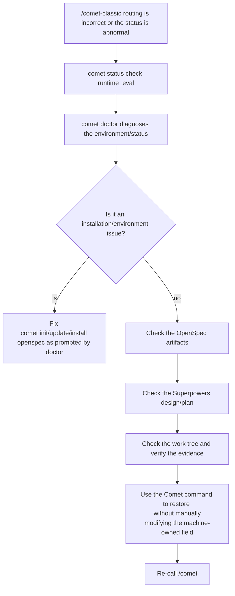

To restore Classic normally, only the unified entry `/comet` is required (see [Restoring Interrupted Work ](/en/guides/resuming-workflow)). After configuring and entering Classic, the internal `/comet-classic` will read the file status and select the stage; this page only handles this internal routing exception or status damage.

When the state is damaged, first restore the true facts, and then allow the process to continue based on the correct state. Do not forcibly modify the fields just to understand the lock process.

<p align="center">
  
</p>

To restore the status of <p align="center">, first diagnose the real file evidence, and then repair it as prompted. Do not manually forge the status </p> in order to advance the process

## First, determine: Is the status broken or is it just an interruption

|"Situation|What is this?|What should I do?|
| ---------------------------------- | -------------------------- | ----------------------------------------------------------------- |
|The session was interrupted, the context was compressed, and the device was changed|Normal interruption|Directly `/comet` (see [Restoring Interrupted Work ](/en/guides/resuming-workflow))|
|Natural language requests hit multiple active changes|It is necessary to confirm the target, not the state damage|Check the `reason` in the recovery probe results and name the change to be restored|
|There are unsubmitted changes to the work tree|It needs to be attributed first, not due to state damage|Confirm which change the change belongs to before continuing|
|The stage to which `/comet-classic` is routed is incorrect|There might be a conflict between the metadata and the file|`/comet-classic` will self-heal based on the file. If it still doesn't work, go for a diagnosis|
|`.comet.yaml` is missing or has an abnormal format|"Status damaged"|`comet doctor` diagnosis|
|The product/evidence of the claim cannot be found on the disk|Lack of evidence|For `comet status`, look at `runtime_eval`|

## Diagnostic command

```bash
comet resume-probe . --utterance "Continue with the work just now"  # Only read to determine whether it should be restored
comet status        # Look at the phase, task completion degree, and runtime_eval of the active change
comet doctor        # Diagnose installation, environment, Skill integrity, and the validity of.comet.yaml
```

Adding `--json` is suitable for reading to Agents or automated tools. Ordinary users first look at the text output.

Recovery detection is only responsible for the judgment before entering the workflow. When it returns `ask_user`, it usually represents multiple changes, uncommitted changes or user decision points, and does not mean that the state has been corrupted. For details, please refer to the [Restore Detection Command ](/en/cli/resume-probe)

### What to watch on comet status

Each active change reports: `phase`, task `done/total`, `workflow | build_mode`, `run_step`, `runtime_mode`, `runtime_eval` (whether the declared step evidence is truly on the disk), `design`, `plan`, `verify_result`, and `next:` prompt.

When `runtime_eval` fails, `run < command > or restore missing evidence (...)` will be prompted - follow the prompt to provide evidence or restore.

### What does comet doctor watch

Check the Comet CLI version, openspec CLI, Superpowers, working directories (`docs/superpowers/specs`, `docs/superpowers/plans`), the integrity of skills on each platform, whether scripts exist, and CodeGraph And the validity of `.comet.yaml` and `runtime_eval` for each change. Common repair tips: `npm install -g @fission-ai/openspec@latest`, `run: comet init`, `run: comet update --scope ...`.

## Common symptoms and management

|Symptoms|Possible reasons|What to do first?|
| ------------------------------------------ | -------------------------------------- | ------------------------------------------------------------------------- |
|`comet status` has no next step|`.comet.yaml` is missing or has an abnormal format| `comet doctor`                                                            |
|build cannot enter verify|Missing `build_mode`/`isolation`/`tdd_mode`|Re-call `/comet` to route Classic back to build for supplementary selection|
|verify passed but cannot archive|Missing verification reports, branch binding drift or abnormal status|Supplement the verification report, switch back to the bound branch, and keep verify guard `branch_status: pending`|
|After archiving, it still shows "active"|Manual movement of directories or status is not synchronized|Check with `openspec status` and re-run with the archive script (recoverable)|
|`/comet-classic` reports an abnormal format of `.comet.yaml`|The document was manually corrupted|`comet doctor`;" In severe cases, restore `.comet.yaml` from git|

## Restoration principle

- ** With documents as evidence ** : OpenSpec artifacts, Design Doc, Plan, test results, and actual working tree are the sources of facts.
- ** Do not manually write the machine-owned Run field ** (`.comet/run-state.json`, etc.).
- Don't mistake `build_pause` for `build_mode` - they are different fields.
- ** Do not skip the verify failure decision point ** - It is up to you to choose to fix or accept the bias.
- ** Do not manually forge the archive status ** - Archiving is completed by `/comet-archive` or `comet archive`.
- ** Do not manually edit the `.comet.yaml` advance phase** - use `comet guard --apply` or `comet state transition`.

## What should I do if.comet.yaml is missing or broken

`/comet-classic` has compatible paths for bad states:

- When `.comet.yaml` is missing, roll back to the `openspec status --json` + `tasks.md` + `docs/superpowers/` file to check the reconstruction status.
- When the format is abnormal, the file status shall prevail. Correct it with `comet state set` and then continue.
- When proposal/design/tasks are complete, guard `--apply` to correct the status first and then make a judgment.

If `/comet-classic` cannot be repaired by itself (for example, if the file is severely damaged), restore `.comet.yaml` from git and then run `comet doctor` to confirm.

## Recommended processing flow



## Next step

- Restore the probe command ](/en/cli/resume-probe) - Distinguish between requests that can be automatically restored, those that require confirmation, and those that should not enter the workflow
- To resume the operation of the interrupt, ](/en/guides/resuming-workflow) - Classic normal interrupt only requires `/comet`
- The project file structure ](/en/guides/project-structure) - in which files does the status exist
- [Status management ](/en/concepts/state-management)-`.comet.yaml` fields and status guards
