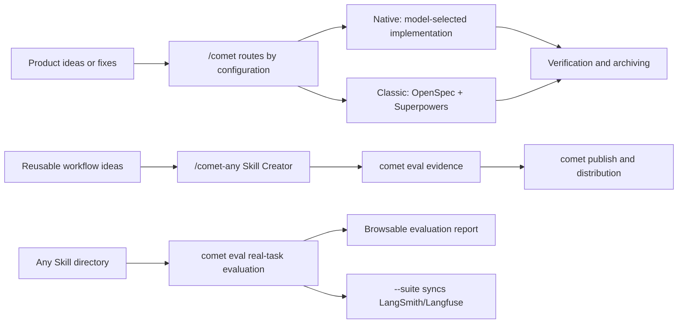

Comet provides a recoverable development workflow for AI coding, together with tools for creating, evaluating, and publishing Skills. Projects can use either of two independent workflows:

- **Native** targets Fable 5, GPT-5.6, and models at a similar capability level. It constrains requirements, state, and acceptance evidence while leaving implementation choices to the model.
- **Classic** targets models that need explicit process constraints. It combines OpenSpec and Superpowers and advances a change through five stages.

  

Project configuration, change documents, and verification evidence preserve the task state.

## What can you do with Comet

- Use `/comet` to enter Native or Classic from the project configuration, then create, implement, verify, and archive a change.
- Use `/comet-any` to turn a workflow into a reusable Skill.
- Run real-task evaluations with `comet eval`.
- Use [`comet dashboard`](/en/dashboard/overview) to view Classic, Native, and Supervisor Change stages, tasks, acceptance, risks, artifacts, and Git information. The Dashboard is read-only.
- Use `comet publish` to review, approve, publish, and distribute `/comet-any` artifacts.
- Use `comet status` and `comet doctor` to view the current stage, next step, and diagnostic results.

## What state does Comet save

Comet writes requirements, workflow state, and verification results to project files. When a task resumes, the Agent reads those files instead of relying on the previous conversation.

| Scenario | How Comet handles it |
| --- | --- |
| Interruption recovery | Uses `.comet/config.yaml`, change state, and existing evidence to determine where to resume. |
| Stage control | Native checks Shape, Build, Verify, and Archive results; Classic uses a five-stage guard. |
| Workspace management | Records the change's branch or worktree binding and pauses when the directory does not match. |
| Parallel tasks | Supervisor Change prepares child workspaces according to dependencies and validates the integrated result. |
| Personal Memory | Stores user preferences that were explicitly requested for long-term use, with support for viewing, correction, forgetting, and rollback. |
| Project Knowledge | Stores sourced project records with an applicability range; reassesses them when the source changes. |
| Skill evaluation | Runs tasks in an isolated environment and records checks, rubrics, `pass@k`, `pass^k`, and failure attribution. |

  

Comet restores a change from project files instead of reconstructing it from the previous conversation.

## Main entry points

For project changes, call `/comet`. It reads the project configuration and enters Native or Classic. Workflow-specific Skills mainly support internal routing and advanced troubleshooting.

<CardGroup cols={2}>
  <Card title="Native workflow" icon="meteor" href="/en/concepts/native-workflow">
    For Fable 5, GPT-5.6, and similar strong models. Requirements, state, and evidence remain explicit while the model chooses the implementation method.
  </Card>
  <Card title="Classic workflow" icon="signature" href="/en/concepts/workflow">
    For models that need explicit stage guidance. OpenSpec and Superpowers advance the change through five stages.
  </Card>
  <Card title="CLI console" icon="terminal" href="/en/guides/install-and-update">
    Install, diagnose, update, manage Skills, evaluate, and publish from the CLI.
  </Card>
  <Card title="/comet-any Skill Creator" icon="blackberry" href="/en/skill-creator/getting-started">
    Create, optimize, or combine reusable Skills.
  </Card>
  <Card title="Skill Evaluation" icon="vial-circle-check" href="/en/eval/quickstart">
    Verify Skill behavior with browsable reports and use the results as publishing evidence.
  </Card>
</CardGroup>

## Related design material

<Info title="Comet and industry practice" icon="scale-balanced">
  [Comet and industry practice](/en/tech-blog/comet-vs-industry) covers mainstream technologies used by Comet for evaluation, runtime, workflow, and Skill distribution.
</Info>

## What installation provides

`comet init` installs Comet Skills, rules, hooks, runtime assets, and platform adapters to the selected project-level or global location.

<Tip>
  To start a project change, read the [Quickstart](/en/quickstart). To create a reusable Skill, read [Create a Skill](/en/skill-creator/getting-started).
</Tip>
