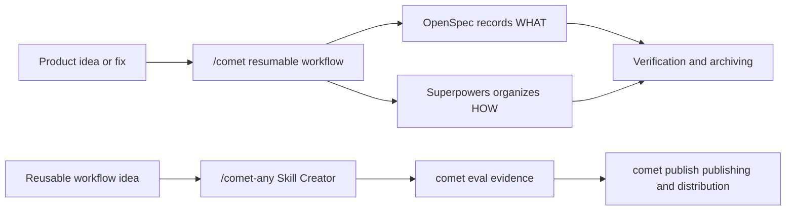

Comet is a resumable workflow and Skill platform for AI coding. It brings OpenSpec, Superpowers, Skill Creator, Eval, and publishing gates together into a single toolchain, so you can use one approach to handle requirements, design, implementation, verification, archiving, and Skill distribution.

  

Comet consolidates ideas, state, evidence, and Skill distribution onto a single resumable workbench

## What You Can Do with Comet

- Use `/comet` to drive a product or code change from idea to archive.
- Use `/comet-any` to distill your own workflow into a reusable Skill.
- Use `comet eval` to generate pre-publish evidence for a Skill.
- Use `comet publish` to review, approve, publish, and distribute `/comet-any` artifacts.
- Use `comet status` and `comet doctor` to see the current phase, next step, and recovery recommendations.

## What's Different from Ordinary Prompts

Ordinary prompts rely on conversation history. Comet relies on file-based state and inspectable evidence.

| Concern | Without Comet | With Comet |
| --- | --- | --- |
| Interruption recovery | The Agent needs to recall context, burning lots of tokens before even writing code | Recovers from the `.comet.yaml` state machine, OpenSpec, and runtime evidence — **supports zero-context scene recovery across devices** |
| Phase boundaries | The Agent easily skips design or verification — e.g., code is implemented but the checklist isn't ticked, or code is written during a phase that shouldn't | The five-phase flow has clear quality gates — **you cannot exit a phase without completing that phase's tasks**, forcing the Agent to finish everything required in each phase |
| Auto-advancement | Requires memorizing lots of Skill flows — which Skill to use first, which one next, with manual progression in between | **Auto-advancement** — Comet automatically drives the core Skill flow, and **aside from necessary HITL interaction points, no user takeover is needed** |
| Lightweight fixes | Easily triggers the full Skill flow, causing unnecessary token consumption | Built-in hotfix and tweak provide a lightweight path for small requirements — **less Superpowers, more OpenSpec** |
| Skill artifact form | Just a single `SKILL.md` file — can't be composed, can't carry dependencies, can't be distributed | `/comet-any` generates a stable, composable **Skill Bundle** — rules, hooks, and Engine metadata can be assembled; it's **reviewable** and **distributable** (landed on 33 AI coding platforms via `comet publish distribute`, just like `comet init`) |
| Skill quality verification | Relies on feel — if the Agent runs it once without errors, it passes | `comet eval` produces a **browsable evaluation report**; eval/review/approval/readiness are all **bound to the current hash**, with traceable evidence |

  

Comet doesn't guess the scene from conversation memory — it recovers work from file-based state and an evidence chain

## Four Main Lines

<CardGroup cols={2}>
  <Card title="/comet-classic Classic Workflow" icon="signature" href="/en/concepts/workflow">
    Suited for requirements, features, refactors, fixes, and project changes that need archiving.
  </Card>
  <Card title="CLI Console" icon="terminal" href="/en/cli/quickstart">
    Suited for installation, diagnostics, updates, Skill management, evaluation, and publishing.
  </Card>
  <Card title="/comet-any Skill Creator" icon="blackberry" href="/en/skill-creator/getting-started">
    Suited for creating, optimizing, or composing reusable Skills.
  </Card>
  <Card title="Skill Evaluation System" icon="vial-circle-check" href="/en/eval/quickstart">
    Suited for verifying Skill behavior with browsable reports and using them as publishing evidence.
  </Card>
</CardGroup>

## Recommended Reading — Comet vs Industry Practices

<Danger title="🏆 Comet vs Industry Practices" icon="scale-balanced">
  Want to know how Comet's approach maps to industry practices? This article lists, by dimension, every Comet practice across evaluation methodology, runtime and workflow, and Skill creation and distribution, noting which industry references (SkillsBench, LangChain, Tencent, Alibaba, etc.) they correspond to. If you care about "why Comet does it this way and how the industry does it," start here.

  **[Read the full article →](/en/tech-blog/comet-vs-industry)**
</Danger>

## What You Get After Installation

`comet init` installs the Comet Skills, Rules, Hooks, scripts, and platform adapter files to a project-level or global location of your choice.

The Comet 0.4.0-beta.1 runtime depends only on Node.js. The built-in state, guard, handoff, and archiving scripts are all executed through Node entry points — it no longer treats Bash, Git Bash, or WSL as workflow prerequisites.

<Tip>
  If you just want to start a project change, read [Quickstart](/en/quickstart) first. If you want to create reusable Skills, go straight to [Compose Any Skill Quickstart](/en/skill-creator/getting-started).
</Tip>
