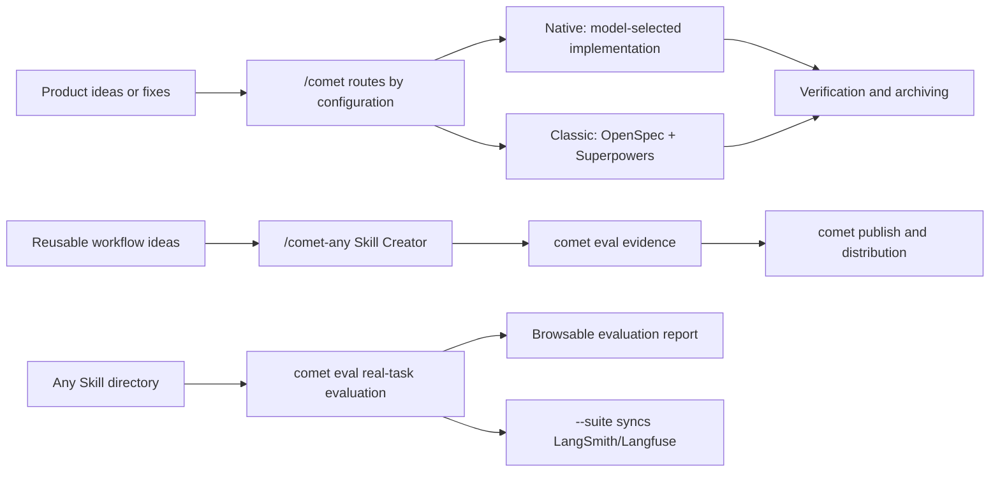

Comet provides a recoverable development workflow for AI coding, together with tools for creating, evaluating, and publishing Skills. Projects can use either of two independent workflows:

- **Native** targets Fable 5, GPT-5.6, and models at a similar capability level. It constrains requirements, state, and acceptance evidence while leaving implementation choices to the model.
- **Classic** targets models that need explicit process constraints. It combines OpenSpec and Superpowers and advances a change through five stages.

  

Project configuration, change documents, and verification evidence preserve the task state.

## What can you do with Comet

- Use `/comet` to enter Native or Classic from the project configuration, then create, implement, verify, and archive a change.
- Use `/comet-any` to turn a workflow into a reusable Skill.
- Run real-task evaluations with `comet eval`.
- Use [`comet dashboard`](/en/dashboard/overview) to view Classic, Native, and Supervisor Change stages, tasks, acceptance, risks, artifacts, and Git information. The Dashboard is read-only.
- Use `comet publish` to review, approve, publish, and distribute `/comet-any` artifacts.
- Use `comet status` and `comet doctor` to view the current stage, next step, and diagnostic results.

## Not using Comet vs Use Comet

| Feature | Without Comet | With Comet |
| --- | --- | --- |
| Interruption recovery | The Agent has to reconstruct context from the conversation, spending a large amount of tokens before any code is written | Resumes from `.comet/config.yaml`, per-workflow Native/Classic change state, and run evidence, without depending on the original conversation |
| Stage control | Agents tend to skip requirements or verification — for example, the code is finished but the checklist stays unchecked, or code gets written in a stage that should not contain code | Native constrains Loop results and evidence; Classic provides a five-stage flow with explicit quality gates — **a stage cannot be exited until its tasks are complete**, forcing the Agent to finish everything for the current stage |
| Automatic progression | You must memorize a long Skill sequence and take over step by step | **Automatic progression**: Comet advances the core Skill flow on its own, and **apart from the required HITL checkpoints, needs no user intervention** |
| Workspace management | Developers create, switch between, and keep track of the branch and worktree for each task by hand | Choose `current`, `branch`, or `worktree` when creating a change; Comet **creates or reuses the workspace, records the branch binding, and locates the correct directory on resume** |
| Parallel work | Developers split tasks, work out dependencies, assign working directories, track completion, and merge results themselves | Supervisor Change **automates the DAG and analyzes child dependencies**, prepares a **dedicated worktree** for each child task, and validates the integrated result |
| Personal memory | Users have to re-explain language preferences, communication style, and collaboration habits in every task | **Stores user preferences and collaboration experience that still help future tasks**, filtered by the current task before injection; users can view, correct, forget, and roll them back, so the Agent does not have to learn who you are all over again |
| Project knowledge | Every Agent has to re-explore the project structure, dependencies, decisions, flows, and constraints, repeatedly costing time and tokens | **Accumulates sourced project facts and project experience**, retrieved by relevance to the current task |
| Constraint strength | A single Skill flow can hardly fit models at different capability levels | Strong models use Native with lightweight method constraints; lower-capability models use Classic, with additional lightweight hotfix/tweak presets |
| Composable Skills | Just a single `SKILL.md` file — no composition, no dependencies, no distribution | `/comet-any` produces a stable **composable Skill Bundle** — assemble rules, hooks, and Engine metadata; **reviewable** and **distributable** (deployed to 37 AI coding platforms via `comet publish distribute`, just like `comet init`) |
| Skill evaluation | Judged by feel — a run without errors counts as a pass | `comet eval` runs **real tasks** in an isolated environment, **quantifying** capability and reliability with multi-dimensional rubric scores and `pass@k` / `pass^k`; on failure it automatically **attributes** what to fix — each iteration is compared against baseline data, so you can see at a glance whether an improvement worked, and Skill evolution is driven by measured scores rather than gut feeling |

  

Comet restores a change from project files instead of reconstructing it from the previous conversation.

## Main entry points

For project changes, call `/comet`. It reads the project configuration and enters Native or Classic. Workflow-specific Skills mainly support internal routing and advanced troubleshooting.

<CardGroup cols={2}>
  <Card title="Native workflow" icon="meteor" href="/en/concepts/native-workflow">
    For Fable 5, GPT-5.6, and similar strong models. Requirements, state, and evidence remain explicit while the model chooses the implementation method.
  </Card>
  <Card title="Classic workflow" icon="signature" href="/en/concepts/workflow">
    For models that need explicit stage guidance. OpenSpec and Superpowers advance the change through five stages.
  </Card>
  <Card title="CLI console" icon="terminal" href="/en/guides/install-and-update">
    Install, diagnose, update, manage Skills, evaluate, and publish from the CLI.
  </Card>
  <Card title="/comet-any Skill Creator" icon="blackberry" href="/en/skill-creator/getting-started">
    Create, optimize, or combine reusable Skills.
  </Card>
  <Card title="Skill Evaluation" icon="vial-circle-check" href="/en/eval/quickstart">
    Verify Skill behavior with browsable reports and use the results as publishing evidence.
  </Card>
</CardGroup>

## Related design material

<Info title="Comet and industry practice" icon="scale-balanced">
  [Comet and industry practice](/en/tech-blog/comet-vs-industry) covers mainstream technologies used by Comet for evaluation, runtime, workflow, and Skill distribution.
</Info>

## What installation provides

`comet init` installs Comet Skills, rules, hooks, runtime assets, and platform adapters to the selected project-level or global location.

<Tip>
  To start a project change, read the [Quickstart](/en/quickstart). To create a reusable Skill, read [Create a Skill](/en/skill-creator/getting-started).
</Tip>
