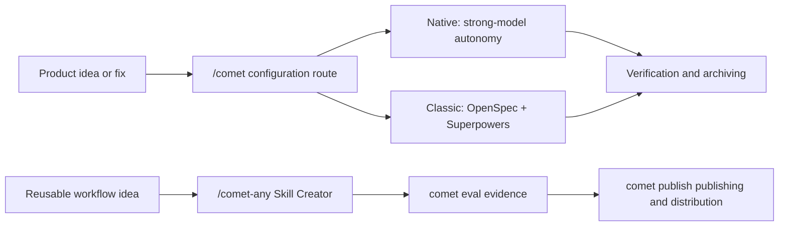

Comet is a resumable workflow and Skill platform for AI coding. It provides two independent requirements workflows: self-contained Native for strong models such as Fable 5 and GPT-5.6, and Classic for lower capability tiers through OpenSpec and Superpowers. Together with Skill Creator, Eval, and publishing gates, they form one toolchain from requirements and archiving to Skill distribution.

  

  Comet consolidates ideas, state, evidence, and Skill distribution onto a single resumable
  workbench

## What You Can Do with Comet

- Use `/comet` to enter Native or Classic from project configuration and drive a product or code change from idea to archive.
- Use `/comet-any` to distill your own workflow into a reusable Skill.
- Use `comet eval` to generate pre-publish evidence for a Skill.
- Use `comet publish` to review, approve, publish, and distribute `/comet-any` artifacts.
- Use `comet status` and `comet doctor` to see the current phase, next step, and recovery recommendations.

## What's Different from Ordinary Prompts

Ordinary prompts rely on conversation history. Comet relies on file-based state and inspectable evidence.

| Concern                    | Without Comet                                                                                     | With Comet                                                                                                                                                                                                                                             |
| -------------------------- | ------------------------------------------------------------------------------------------------- | ------------------------------------------------------------------------------------------------------------------------------------------------------------------------------------------------------------------------------------------------------ |
| Interruption recovery      | The Agent must recall context, spending tokens before implementation resumes                      | Recovers from `.comet/config.yaml`, workflow-specific state, and runtime evidence instead of guessing from the original chat                                                                                                                           |
| Phase boundaries           | The Agent may skip requirements or verification and modify implementation at the wrong time       | Native constrains outcomes and evidence across Shape/Build/Verify/Archive; Classic supplies finer five-phase process constraints                                                                                                                       |
| Auto-advancement           | Requires remembering Skill order and taking over between steps                                    | Both workflows resume from disk phase and continue when conditions pass, pausing for user decisions or safety blockers                                                                                                                                 |
| Constraint strength        | One process rarely fits every model capability tier                                               | Strong models use lighter-method Native; lower capability tiers use Classic, with hotfix/tweak presets for smaller Classic work                                                                                                                        |
| Skill artifact form        | Just a single `SKILL.md` file — can't be composed, can't carry dependencies, can't be distributed | `/comet-any` generates a stable, composable **Skill Bundle** — rules, hooks, and Engine metadata can be assembled; it's **reviewable** and **distributable** (landed on 34 AI coding platforms via `comet publish distribute`, just like `comet init`) |
| Skill quality verification | Relies on feel — if the Agent runs it once without errors, it passes                              | `comet eval` produces a **browsable evaluation report**; eval/review/approval/readiness are all **bound to the current hash**, with traceable evidence                                                                                                 |

  

  Comet doesn't guess the scene from conversation memory — it recovers work from file-based state
  and an evidence chain

## Main Entry Points

Invoke `/comet` for project changes. It reads project configuration and enters the Native or Classic workflow below. Workflow-specific Skills are permanent internal entries and advanced debugging surfaces, not commands users normally need to remember.

<CardGroup cols={2}>
  <Card title="Native workflow" icon="meteor" href="/en/concepts/native-workflow">
    For strong models such as Fable 5 and GPT-5.6: retain requirements, state, and evidence while
    letting the model choose implementation methods.
  </Card>
  <Card title="Classic Spec workflow" icon="signature" href="/en/concepts/workflow">
    For models below the Fable 5 or GPT-5.6 tier that benefit from finer phase guidance through
    OpenSpec and Superpowers.
  </Card>
  <Card title="CLI Console" icon="terminal" href="/en/guides/install-and-update">
    Suited for installation, diagnostics, updates, Skill management, evaluation, and publishing.
  </Card>
  <Card title="/comet-any Skill Creator" icon="blackberry" href="/en/skill-creator/getting-started">
    Suited for creating, optimizing, or composing reusable Skills.
  </Card>
  <Card title="Skill Evaluation System" icon="vial-circle-check" href="/en/eval/quickstart">
    Suited for verifying Skill behavior with browsable reports and using them as publishing
    evidence.
  </Card>
</CardGroup>

## Recommended Reading — Comet vs Industry Practices

<Danger title="🏆 Comet vs Industry Practices" icon="scale-balanced">
  Want to know how Comet's approach maps to industry practices? This article lists, by dimension, every Comet practice across evaluation methodology, runtime and workflow, and Skill creation and distribution, noting which industry references (SkillsBench, LangChain, Tencent, Alibaba, etc.) they correspond to. If you care about "why Comet does it this way and how the industry does it," start here.

**[Read the full article →](/en/tech-blog/comet-vs-industry)**

</Danger>

## What You Get After Installation

`comet init` installs the Comet Skills, Rules, Hooks, scripts, and platform adapter files to a project-level or global location of your choice.

The Comet 0.4.0-beta.1 runtime depends only on Node.js. The built-in state, guard, handoff, and archiving scripts are all executed through Node entry points — it no longer treats Bash, Git Bash, or WSL as workflow prerequisites.

<Tip>
  If you just want to start a project change, read [Quickstart](/en/quickstart) first. If you want
  to create reusable Skills, go straight to [Compose Any Skill
  Quickstart](/en/skill-creator/getting-started).
</Tip>
