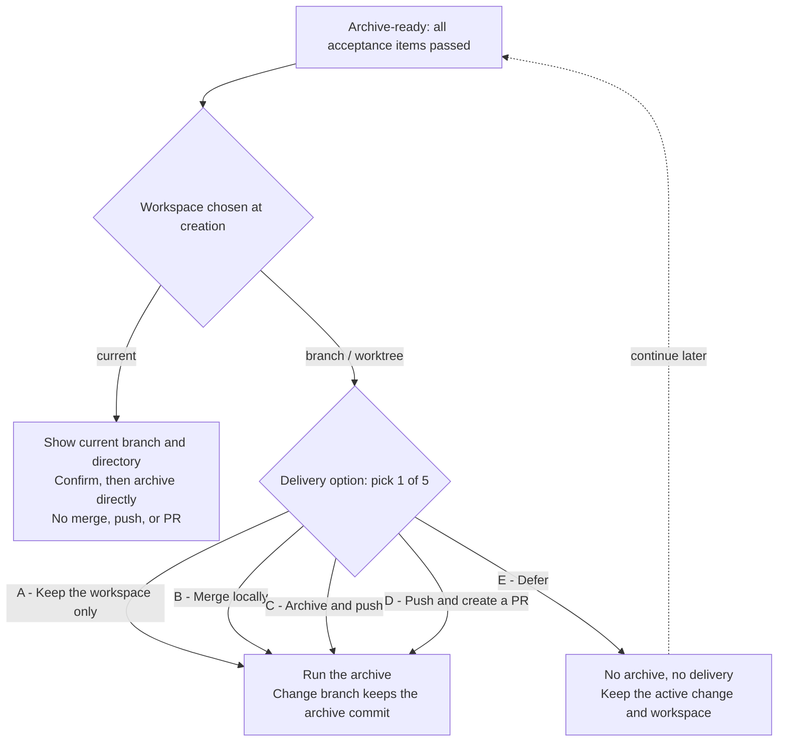

After all acceptance items pass and the change reaches the Archive-ready state, you need to decide how this archive is delivered. Whether this decision is needed at all, and which options you see, depends on the workspace chosen when you created the change. Before you choose, Comet shows the current branch, the target branch, the directories, and the actual impact of each option; you can confirm right away or defer.

## Delivery options and workspace type

When you create a change, you can keep using the current directory or let Comet create a branch or worktree. When the change reaches Archive, the delivery method depends on that earlier choice:

- **current workspace**: the change completes directly in the current branch and directory, so no delivery method needs to be chosen when archiving. Comet shows the current branch and directory and explains that archiving performs **no merge, push, or PR**; after you confirm, it completes the archive directly.
- **branch / worktree isolation**: the change runs in its own branch and directory. After archiving, you decide whether to merge into the target branch, push to the remote, or open a PR. Comet shows the actual change branch, the target branch, and the directories, and presents the five mutually exclusive options below as a single decision.

## The five delivery options

| Option | Command | What actually happens |
| --- | --- | --- |
| A - Keep the workspace only | `keep` | Complete the archive and create the archive commit on the change branch; no merge, no push, no PR; keep the current branch and directory |
| B - Merge locally | `merge` | Complete the archive and create the archive commit, then merge the change branch into the target branch locally; no push, no PR |
| C - Archive and push | `push` | Complete the archive and create the archive commit, then push the change branch; no merge into the target branch, no PR |
| D - Push and create a PR | `pull-request` | Complete the archive and create the archive commit, push the change branch, then open a PR against the target branch as its base |
| E - Defer the archive | — | Do not archive or deliver; keep the active change and workspace and come back later |

When you choose A–D, Comet runs the archive command with the corresponding argument (`--finish keep|merge|push|pull-request`); choosing E stops here. The whole decision path:

## Git state after each option

All of A–D complete the archive and create an archive commit on the change branch. They differ in what happens after that commit:

- **A - Keep the workspace only**: the change branch gains an archive commit, the target branch is unchanged, and the branch and directory stay as they are. This archive does not remove a retained worktree.
- **B - Merge locally**: the archive commit is merged from the change branch into the target branch locally; the remote is unaffected.
- **C - Archive and push**: the archive commit is pushed to the remote together with the change branch; the target branch is not merged and no PR is opened.
- **D - Push and create a PR**: after pushing the change branch, a PR is opened against the target branch as its base, and the merge from there goes through the PR flow.
- **E - Defer the archive**: neither the archive nor the delivery runs, and nothing changes on the Git side.

A worktree retained through option A is not removed by this archive. For B, C, and D, after the archive completes, Comet offers to clean up the worktree when it has no uncommitted changes, and waits for your confirmation.

## Final confirmation before archiving

Whether archiving needs one extra explicit decision is controlled by `native.archive_confirmation`, which defaults to `automatic`:

- `automatic`: after the final Verify passes, the Runtime may continue and complete the archive. Automatic archiving does not decide the delivery method for you — when you use a branch or a worktree, you still pick one of A–E.
- `required`: after the final Verify passes, the Runtime stops at the final Archive candidate and waits for an explicit decision about this one archive. Intermediate repair rounds do not trigger this confirmation; choosing not to archive yet also keeps the current active change.

See [Native configuration · Archive confirmation](/en/native/configuration#archiving-confirmation).

When `required` is active, Comet stops at this step and waits for your explicit consent to this archive; only after you confirm does it run the real archive command with `--confirmed`. `--dry-run` only previews the archive result and does not write a confirmation. `--confirmed` only comes into play when the change is genuinely stopped at an Archive-ready state waiting for final confirmation; intermediate repair rounds never ask for it. If the requirements or acceptance criteria are modified while you wait, the change first returns to Shape, and the previous verification results and archive approval become invalid.

## How to continue after deferring the archive

After you choose E, the change stays active and the workspace together with all passed results is kept. The next time you ask the Agent to continue this change, the Runtime reads back the recorded state and the next step, returns the change to Archive-ready, and presents the same decision again.

If you modify the visible requirements or acceptance criteria while waiting, the change first returns to Shape, gets confirmed again, and obtains new verification results before it comes back to Archive. The old verification results and archive approval are not reused.

## Handling archive interruptions and parallel changes

If an Archive transaction is interrupted midway, the Runtime keeps the transaction records and the executable state and continues from the steps already completed. For the specific recovery rules, see [Recovery playbook](/en/native/recovery-playbook).

When multiple active changes declare the same Spec, Archive first asks you to determine the archiving order before it reaches this delivery choice. For the ordering rules, see [Multi-change parallelism and conflict control](/en/native/multi-change-and-conflicts).

Continue reading: [Native products and state](/en/native/artifacts-and-state), [Multi-change parallelism and conflict control](/en/native/multi-change-and-conflicts), and [Recovery playbook](/en/native/recovery-playbook).
