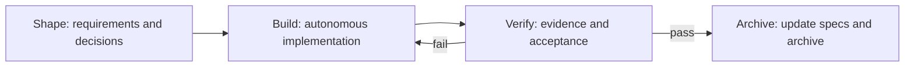

Native is Comet's self-contained Skill for strong coding models in the Fable 5 and GPT-5.6 capability tier. It preserves clarification, complete specifications, state, verification evidence, and archiving while leaving implementation plans, test depth, debugging, and review methods to the model's judgment based on repository facts and risk.

## 1. Initialize the project

Comet requires Node.js 22 or newer. Install the CLI, then run this at the project root:

```bash
npm install -g @rpamis/comet
comet init
```

Interactive initialization explains Native, Classic, and enabling both. New projects default to Native in non-interactive mode. You can also choose explicitly:

```bash
comet init --workflow native
comet init --workflow native --root .
comet init --workflow both
```

`--workflow both` installs two independent workflows while keeping `/comet` on Native by default. Native stores artifacts under `docs/comet/` by default. Pass `--root .` only when you explicitly want `<project>/comet/`. The option does not alter Classic directories.

The shared project configuration is stored at `.comet/config.yaml`:

```yaml
schema: comet.project.v1
default_workflow: native
workflows:
  - native
ambient_resume: true
native:
  artifact_root: docs
  language: en
  clarification_mode: sequential
  snapshot:
    include:
      - '**/*'
    exclude: []
    max_files: 10000
    max_total_bytes: 268435456
    max_duration_ms: 60000
```

Native does not depend on OpenSpec, Superpowers, CodeGraph, or any external Skill. Project initialization still installs one Comet-owned workflow Rule and, on platforms with Hook support, one Hook Router that sends each write to the Guard for the current change's workflow.

`snapshot` defines the auditable project scope and capture budgets for new changes. Keep the complete default scope for a typical project. Configure include/exclude for a monorepo or large repository only after identifying its dependency boundary. See [Native configuration](/en/native/configuration#content-snapshot-scope-and-budgets).

## 2. Start from the shared entry

Enter this in your Agent:

```text
/comet add avatar uploads to the user profile
```

`/comet` deterministically forwards to `/comet-native` from `default_workflow` in `.comet/config.yaml`. It does not guess from task size or convert a Native change into a Classic change.

You can call `/comet-native` directly when you need to bypass the default. It is a Skill entry, not a shell command.

## 3. Answer decisions that change product behavior

Native investigates repository facts first. It asks the user only about unresolved decisions that change scope, output, defaults, compatibility, risk, or irreversible results. The default `sequential` mode asks one upstream question per round. `batch` mode asks every question whose prerequisites are already settled. Both modes include a recommendation and the practical impact of each option.

The model cannot substitute a “reasonable default,” adjacent implementation, or industry convention for a user decision. Once clarification is complete, the answer is recorded in the brief and complete target specification before Build begins.

## 4. Let the workflow continue



After a phase passes, Native continues in the same Skill. `next: auto` means the Runtime allows continuation; it does not mean a background service invokes the model. The workflow stops with a concrete reason when it needs a user decision, encounters damaged state or conflicts, or sees repeated no-progress failures.

## 5. Inspect and resume

```bash
comet status
comet native status <change-name> --details
comet native doctor <change-name>
```

After an interrupted session, enter `/comet continue`. Ambient Resume reads disk state first and resumes only when the target is unambiguous. It asks when several candidates or an unclear request remain and never guesses across workflows.

To disable the read-only probe for ordinary requests, set this in `.comet/config.yaml`:

```yaml
ambient_resume: false
```

Continue with [Native workflow](/en/concepts/native-workflow), [Native configuration](/en/native/configuration), [Native FAQ](/en/native/faq), [Clarification modes and shared understanding](/en/native/clarification-modes), and [Artifacts and state](/en/native/artifacts-and-state). Deterministic commands are collected under [Native CLI](/en/cli/native).
