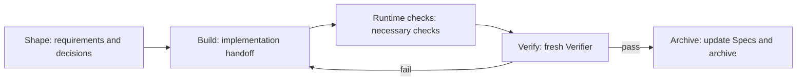

Native targets strong models such as Fable 5, GPT-5.6, and peers. It leaves planning and implementation methods to the model, but the Runtime owns the completion verdict. A Builder cannot finish a change by saying “done”: Runtime runs necessary checks and dispatches a fresh read-only Verifier to cover every acceptance item.

## Native's four stages



- **Shape**: investigate repository facts, clarify decisions that affect product behavior, and write the brief and complete target Specs.
- **Build**: the model chooses how to implement, test, and repair, then submits a Builder handoff.
- **Verify**: Runtime executes and reuses necessary checks; a fresh read-only Verifier reviews A1…An. Failure returns the change to Build with concrete gaps.
- **Archive**: after a pass, Runtime applies Specs, writes the final report, and archives. The normal path does not run Verify again.

## 1. Initialize the project

Comet requires Node.js 22 or newer. Install the CLI and run this at the project root:

```bash
npm install -g @rpamis/comet
comet init --workflow native
```

New Native documents default to `docs/comet/`, while machine Runtime stays under `.comet/runtime/native/`.

The shared configuration lives in `.comet/config.yaml`:

```yaml
schema: comet.project.v1
default_workflow: native
workflows:
  - native
ambient_resume: true
native:
  artifact_root: docs
  language: en
  clarification_mode: batch
  archive_confirmation: automatic
  max_verify_failures: 5
```

## 2. Start from the shared entry

Enter this in your Agent:

```text
/comet add avatar uploads to the user profile page
```

`/comet` deterministically enters `/comet-native` according to `default_workflow`. Use `/comet-native` to enter Native directly; it is a Skill entry, not a shell command.

## 3. Clarify real product decisions

Native investigates discoverable facts first and asks only about decisions that change scope, output, defaults, compatibility, risk, or irreversible results. New projects default to Batch, which asks every question whose prerequisites are settled in a round; Sequential asks one upstream question per round. Both require confirmation of shared understanding before Build.

## 4. Let the Runtime drive the Loop

Stage progression is handled by the Skill: it reads the Runtime `continuation` to decide what comes next, without relying on conversation memory or asking you to join stages manually. Your only normal participation is answering and confirming during Shape. A Verify failure returns to Build and increments the iteration. Repeated gaps, an exhausted execution-error budget, or a conflict returns `await-user` or `blocked`; only then does the workflow ask you to intervene.

When an extra check is needed, the current Verifier requests it through `request-checks`. Do not write a passing result yourself. A host that can provide an independent subagent starts a new Verifier execution; without one, Runtime marks the degraded path explicitly and waits for one user confirmation before Archive.

## 5. After an interruption

After a session interruption, window switch, or device switch, you do not need a recovery command. Enter `/comet` again, or say “continue the work,” and the Skill rereads the brief, Specs, and `comet-state.yaml` from disk and continues from the checkpoint. Recovery belongs to the Skill and Runtime, not to a manual procedure.

The following commands are optional. Use them when you want to inspect progress yourself or when the installation or state looks wrong:

```bash
comet status   # Inspect changes and their current phases
comet doctor   # Diagnose a suspicious installation or state
```

Cross-device recovery requires only one action from you: sync these files with the code: `.comet/config.yaml`, the brief, Specs, and `comet-state.yaml`. Runtime rebuilds a missing `verification.md` and a missing local `.comet/runtime/native/` overlay. If the code, branch, or worktree does not match, recovery waits for you instead of switching directories silently.

The final user-readable artifacts are the brief, Specs, `comet-state.yaml`, and `verification.md`. Local state, logs, locks, and transactions are Runtime files, not change documents.

Continue with [Artifacts and state](/en/native/artifacts-and-state), [Verification and repair](/en/native/verification-and-repair), [Clarification modes](/en/native/clarification-modes), and [Recovery and troubleshooting](/en/native/recovery-playbook).
