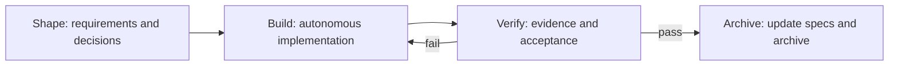

Strong models do not need to be taught the method step by step. Comet Native hands the planning, implementation, testing, and review methods to the model to judge for itself, and locks the outcome down with only a hashable requirements contract, content-addressed verification evidence, and a recoverable archive.

One Agent turn, one checkpoint, or the Agent's self-reported "done" does not count as the endpoint — the completion verdict belongs to the Runtime, not the model. Strong models can therefore swing freely and the result cannot drift off course.

## Native's four phases



- **Shape** — turns a vague requirement into a hashable contract: investigate the facts, ask only about decisions that genuinely affect product behavior, and write down the goal and acceptance.
- **Build** — the model chooses the implementation method itself; it does not need to follow a framework-mandated TDD, planning, or review flow.
- **Verify** — checks acceptance against real verification evidence; a check that has not been run cannot be written as passed; on failure, return to Build and continue.
- **Archive** — after verification passes, update the specs and archive; even if the run is interrupted midway, you can recover from disk.

## 1. Initialize the project

Comet requires Node.js 22 or newer. Install the CLI, then run this at the project root:

```bash
npm install -g @rpamis/comet
comet init
```

Interactive initialization explains the difference between Native, Classic, and enabling both at once. New projects default to Native in non-interactive mode. You can also choose explicitly:

```bash
comet init --workflow native
comet init --workflow native --root .
comet init --workflow both
```

`--workflow both` installs two independent workflows, but `/comet` still defaults to Native. Native stores artifacts under `docs/comet/` by default; pass `--root .` only when you explicitly want `comet/` at the project root.

After initialization, the shared project configuration lives at `.comet/config.yaml`:

```yaml
schema: comet.project.v1
default_workflow: native
workflows:
  - native
ambient_resume: true
native:
  artifact_root: docs
  language: en
  clarification_mode: sequential
  snapshot:
    include:
      - '**/*'
    exclude: []
    max_files: 10000
    max_total_bytes: 268435456
    max_duration_ms: 60000
```

For a typical project, keep the default complete snapshot scope and leave `snapshot` alone. Configure `include`/`exclude` for a monorepo or large repository in [Native configuration](/en/native/configuration#content-snapshot-scope-and-budgets).

## 2. Start from the shared entry

Enter this in your Agent:

```text
/comet add avatar uploads to the user profile
```

`/comet` forwards to `/comet-native` from `default_workflow` in `.comet/config.yaml`. It only reads the configuration and forwards deterministically; it does not guess the mode on the fly from task size.

To bypass routing and enter Native directly, or to diagnose "why did it not enter Native", use `/comet-native`. It is a Skill entry, not a shell command.

## 3. Answer decisions that genuinely affect product behavior

Native investigates repository facts first. Only decisions that still change scope, output, default behavior, compatibility, risk, or irreversible results go to the user; the implementation approach is the model's to decide.

The default `sequential` mode asks one upstream question per round. `batch` mode asks every question whose prerequisites are already settled. Both modes provide a recommendation and the impact of each option, and require you to confirm the complete shared understanding before entering Build.

## 4. Let the workflow keep advancing

After a phase passes, Native continues to the next phase in the same Skill; you do not need to switch manually. `next: auto` means the Runtime has allowed continuation — it is not a background daemon, it is a confirmation that "the current state can move forward".

The workflow stops and returns a concrete reason instead of forcing through when:

- there is still a product behavior that needs your decision;
- state is damaged, the configuration cannot be interpreted, or a concurrency conflict appears;
- the same verification failure recurs repeatedly without real progress.

## 5. Inspect and resume

```bash
comet status
comet native status <change-name> --details
comet native doctor <change-name>
```

After an interrupted session, enter `/comet continue` again. Context-aware recovery reads disk state first and enters the matching change automatically only when the target is unambiguous; with several candidates or an unclear request, it asks instead of guessing across workflows.

To stop ordinary requests from triggering the read-only recovery probe, set this in `.comet/config.yaml`:

```yaml
ambient_resume: false
```

Continue with [Native workflow](/en/concepts/native-workflow), [Native configuration](/en/native/configuration), [Native FAQ](/en/native/faq), [Clarification modes and shared understanding](/en/native/clarification-modes), and [Artifacts and state](/en/native/artifacts-and-state).
