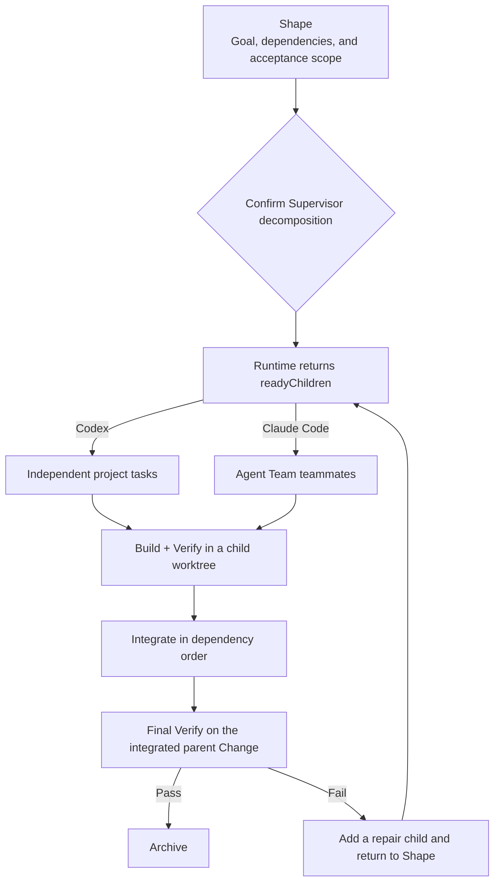

Supervisor Change is Native's collaboration model for large requirements that can be decomposed. It keeps the overall goal in a parent Change and splits independently implementable and verifiable outcomes into children. The parent Change owns the goal, dependencies, integration, and final acceptance. Each child owns its implementation and local verification.

It is appropriate when a requirement has genuine parallel value. For example, a permissions API, permissions settings page, and audit log can be implemented and verified separately. A long requirement description or a large task count alone does not justify decomposition.

## What you can see

During Shape, Supervisor Change shows:

- the parent goal and complete acceptance scope;
- each child's name, dependencies, and covered acceptance items;
- the children currently available in `readyChildren`;
- each child's worktree, execution status, and verification result;
- the integration order for completed children;
- the result and next action from the parent Change's final Verify.

No children, worktrees, or independent sessions are created before you confirm the decomposition. After confirmation, Runtime advances only children whose dependencies are satisfied.

## Lifecycle



Every child is a complete Native Change with its own task packet, `runId`, acceptance scope, and isolated worktree. The parent session does not edit a child's files directly or treat a child's verbal completion report as the final result. Completion is determined by Runtime's child status, integration status, and the parent Change Verify.

## Use in Codex

In Codex, describe the complete goal from the unified entry point:

```text
/comet-native Add a permissions API, permissions settings page, and audit log to the admin console, and verify each outcome separately.
```

Shape presents candidate children and their dependencies. After you select multi-session collaboration, the current session coordinates work, handles blockers, integrates results, and runs the final Verify. For every child that is ready, Comet creates a user-visible independent project task and passes it the Child Worktree, task packet, baseline commit, `runId`, and acceptance scope already created by Runtime.

An independent Codex project task is not ordinary parallel text inside the parent session. It has its own session context, while Native Runtime still determines where it writes. The parent session checks progress through both task status and Runtime status. After an independent task reports completion, the parent still waits for the child Verify and integration result.

View detailed parent Change status:

```bash
comet native status <supervisor-change> --details --json
```

If the host cannot create user-visible independent tasks, Comet falls back first to independent subagents and then to serial execution in one session. The decomposition, dependency, and acceptance semantics remain unchanged.

## Use in Claude Code

Claude Code Agent Teams must be enabled in an interactive session:

```bash
$env:CLAUDE_CODE_EXPERIMENTAL_AGENT_TEAMS="1"
```

After setting the equivalent environment variable in another shell, describe the full goal through `/comet-native` and confirm multi-session collaboration during Shape. The current session becomes the team lead, and every entry in `readyChildren` maps to a clearly named teammate.

Comet gives each teammate:

- the Child Worktree path;
- the child task packet and `runId`;
- its acceptance scope and dependency conditions;
- stop conditions that prohibit integrating the parent branch or claiming a child that is not ready.

Agent Teams do not create Native Child Worktrees for Comet. Every teammate that writes files must use the directory assigned by Runtime. A teammate cannot create a nested team or treat its own judgment as final acceptance for the parent Change.

If Agent Teams are unavailable, the session is not interactive, or the original team no longer exists during recovery, Comet rereads Native Runtime. It does not trust stale team state alone. When the execution mode must be selected again, Comet waits for your confirmation.

## Integration and final verification

After a child completes, Runtime integrates verified results into the Supervisor Change branch in dependency order. When every child reaches `integrated`, the parent Change immediately enters final Verify. This Verify checks the complete parent acceptance scope in the integration worktree and cannot be replaced by any child's Builder.

After final Verify passes, the Change follows the standard Native Archive flow. If final Verify fails, archived or integrated children are not reopened. Runtime creates a repair child from the failed acceptance items, extends the parent acceptance index, and continues after another Shape confirmation.

To limit concurrency, run children serially:

```bash
comet native next <supervisor-change> --max-parallel 1
```

This changes execution concurrency only. It does not change child dependencies or final parent acceptance.

## When to use it

Supervisor Change is appropriate when all of these conditions hold:

1. At least two outcomes can be implemented and verified independently.
2. The outcomes belong to one overall goal and require unified final acceptance.
3. Dependencies between children can be expressed clearly.
4. Every child can work in an isolated worktree.

If several goals do not share overall acceptance, create separate Changes instead. Multiple sessions are not a reason to bypass dependencies, share uncommitted files, or integrate early. The responsibilities of the parent Change, children, Runtime, and host team remain separate. Recovery always uses Native Runtime's persisted state as the source of truth.

Continue with [Native workflow](/en/concepts/native-workflow), [Multiple Changes and specification conflicts](/en/native/multi-change-and-conflicts), and [Native quickstart](/en/native/quickstart).
