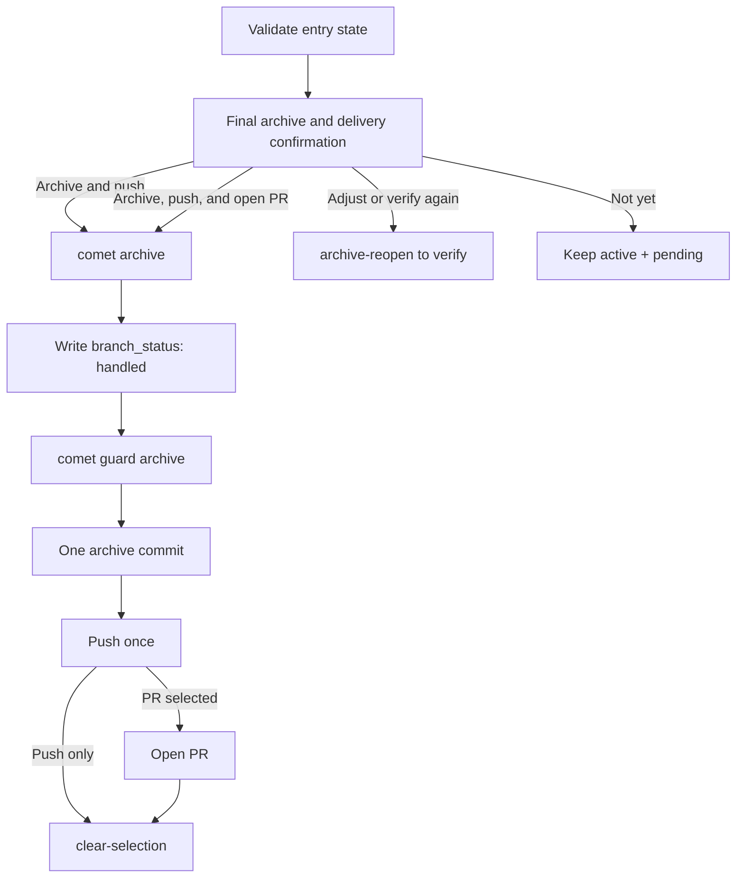

Archive merges a verified change into the main OpenSpec specs, annotates its artifacts, and moves it into the archive directory. Because this is irreversible, Comet confirms both archiving and immediate remote delivery before it starts.

<Tip>
  Normally, invoke <code>/comet</code>. When project configuration selects Classic, the internal{' '}
  <code>/comet-classic</code> router sends a verified change to <code>/comet-archive</code>.
</Tip>

## Prerequisites

- `phase: archive`
- `verify_result: pass`
- `branch_status: pending`
- The current branch matches the change's `bound_branch`

Verify records verification evidence only. `branch_status` remains `pending` until the user confirms immediate remote delivery in this phase.

## Flow



## Final archive and delivery confirmation

Before confirmation, Comet shows the change, verification report, bound branch, ownership of existing uncommitted changes, and the irreversible archive operations it is about to perform.

| Choice                            | Result                                                                                                  |
| --------------------------------- | ------------------------------------------------------------------------------------------------------- |
| **Confirm archive and push now**  | Archives, creates one complete commit, and pushes the current bound branch                              |
| **Confirm archive, push, and PR** | Archives, pushes the one complete commit, then opens a PR                                               |
| **Adjust or verify again**        | Runs `archive-reopen`, returns to Verify, and invokes `/comet-verify`                                   |
| **Do not archive yet**            | Does not confirm or archive; keeps the change active with `phase: archive` and `branch_status: pending` |

Only the first two choices run:

```bash
comet state transition <change-name> archive-confirm
```

`archive_confirmation` is maintained automatically by Comet (machine-owned) and must not be edited by hand.

## Execute archive

```bash
comet archive "<change-name>"
```

The command writes a recoverable checkpoint, invokes OpenSpec to merge the delta and move the change, validates the main specs, annotates the Design Doc and Plan, and writes `archived: true` in the actual archive directory.

Preview the operation without mutation:

```bash
comet archive "<change-name>" --dry-run
```

## Put the final state in one archive commit

After archiving, Comet runs these commands before committing:

```bash
comet state set <change-name> branch_status handled
comet guard <change-name> archive
```

Here, `handled` means that the **remote delivery method has been confirmed**. It does not mean that the push or PR creation has already succeeded. The guard must pass before the commit so that `archived: true` and `branch_status: handled` enter the same, unique archive commit.

Comet stages only paths attributable to the current change:

- The former active change path and actual archive path
- Main specs updated by this delta
- Archive metadata in the Design Doc and Plan
- The final `.comet.yaml` in the archive directory

After reviewing the staged diff, it commits:

```bash
git add -- <reviewed archive paths...>
git diff --cached --stat
git commit -m "chore: archive <change-name>"
```

It must not use `git add -A` or include unrelated user changes.

## Remote delivery and completion

After the archive commit succeeds, Comet performs only the delivery method selected during confirmation:

- Push the current bound branch once; or
- Push once, then open a PR.

Archive no longer loads Superpowers `finishing-a-development-branch` or asks about local merge, keeping the branch, or deferring the push after archiving. To defer delivery, choose “Do not archive yet” before the irreversible operation.

Only after all selected remote operations succeed does Comet run:

```bash
comet state clear-selection
```

At that point, the remote archive state is `handled`, and Comet has left no uncommitted `.comet.yaml` behind.

## Failure handling

- If archive, state persistence, guard, or commit fails, stop without running remote operations.
- If push fails, the complete archive commit remains local; retry only that same push in the current task.
- If PR creation fails, the branch is already pushed; retry only PR creation in the current task.
- Do not clear the current selection or declare the workflow complete after a failure.

## Next steps

- [Open phase](/en/phases/open)
- [Decision points](/en/concepts/decision-points)
- [comet archive script](/en/scripts/comet-archive)
- [State management](/en/concepts/state-management)
