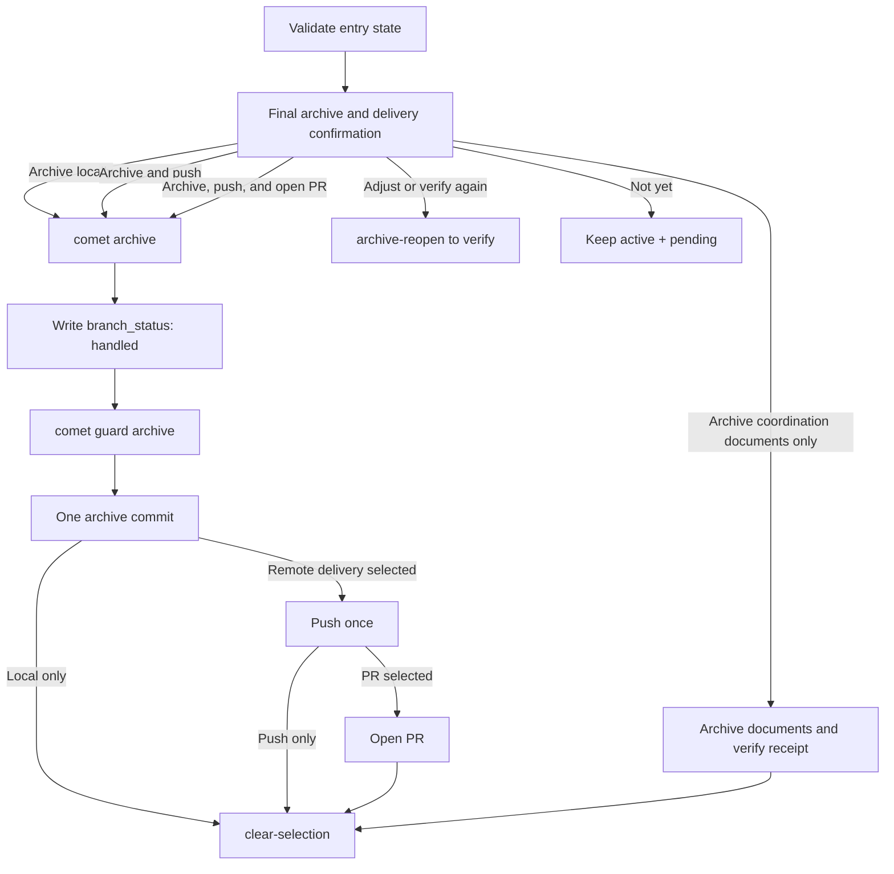

Archive merges a verified change into the main OpenSpec specs, annotates its artifacts, and moves it into the archive directory. Because this is irreversible, Comet confirms archiving and the delivery method before it starts.

<Tip>
  Normally, invoke <code>/comet</code>. When project configuration selects Classic, the internal{' '}
  <code>/comet-classic</code> router sends a verified change to <code>/comet-archive</code>.
</Tip>

## Prerequisites

- `phase: archive`
- `verify_result: pass`
- `branch_status: pending`
- If the coordination root is a Git worktree, the current branch matches the change's `bound_branch`

Verify records verification evidence only. `branch_status` remains `pending` until archive delivery is handled according to the confirmed choice in this phase.

## Flow


```mermaid
flowchart TD
    Entry["Validate entry state"] --> Confirm["Final archive and delivery confirmation"]
    Confirm -->|Archive locally| Archive["comet archive"]
    Confirm -->|Archive and push| Archive
    Confirm -->|Archive, push, and open PR| Archive
    Confirm -->|Archive coordination documents only| Documents["Archive documents and verify receipt"]
    Confirm -->|Adjust or verify again| Reopen["archive-reopen to verify"]
    Confirm -->|Not yet| Keep["Keep active + pending"]
    Archive --> State["Write branch_status: handled"]
    State --> Guard["comet guard archive"]
    Guard --> Commit["One archive commit"]
    Commit -->|Local only| Clear["clear-selection"]
    Commit -->|Remote delivery selected| Push["Push once"]
    Push -->|PR selected| PR["Open PR"]
    Push -->|Push only| Clear
    PR --> Clear
    Documents --> Clear
```

## The invoked skill

The archive stage loads no skills. State checks, archiving, and remote delivery are all done by the `comet state`, `comet guard`, and `comet archive` commands plus git operations; `comet archive` internally invokes OpenSpec archive to merge the delta into the main spec.

## Final archive and delivery confirmation

Before confirmation, Comet shows the change, verification report, bound branch, ownership of existing uncommitted changes, and the irreversible archive operations it is about to perform.

| Choice                             | Result                                                                                                              |
| ---------------------------------- | ------------------------------------------------------------------------------------------------------------------- |
| **Archive locally only (no push)** | Archives, creates the one archive commit, and keeps it on the current bound branch, without pushing or opening a PR |
| **Confirm archive and push now**   | Archives, creates one complete commit, and pushes the current bound branch                                          |
| **Confirm archive, push, and PR**  | Archives, pushes the one complete commit, then opens a PR                                                           |
| **Adjust or verify again**         | Runs `archive-reopen`, returns to Verify, and invokes `/comet-verify`                                               |
| **Do not archive yet**             | Does not confirm or archive; keeps the change active with `phase: archive` and `branch_status: pending`             |

After you choose to archive, Comet saves the delivery choice before confirming the archive:

```bash
comet state delivery <change-name> --file <delivery-choice.json>
comet state transition <change-name> archive-confirm
```

`archive_confirmation` is maintained automatically by Comet (machine-owned) and must not be edited by hand.

## Execute archive

```bash
comet archive "<change-name>"
```

The command writes a recoverable checkpoint, invokes OpenSpec to merge the delta and move the change, validates the main specs, annotates the Design Doc and Plan, and writes `archived: true` in the actual archive directory.

Preview the operation without mutation:

```bash
comet archive "<change-name>" --dry-run
```

## Archive documents from a non-Git coordination root

If the coordination root is outside a Git worktree and business code lives in independent child repositories, choose "Archive coordination documents only." Comet merges the main Specs, moves the change, and saves main Spec snapshots and a file-digest receipt. This choice creates no Git commit. Commit and push code separately through each child repository's delivery workflow.

The delivery choice contains only the following value. Save the input file outside the change directory:

```json
{ "action": "archive-only" }
```

After archiving, run `comet guard <change-name> archive` and `comet state delivery <change-name> --verify`. Clear the current selection only when verification returns `verification.status: complete`. Preserve the archive directory, main Spec snapshots, and receipt under `.comet/classic-deliveries/`. If archived files are missing or changed, resolve the verification failure before completing the workflow.

Git projects continue to use local archive, push, or PR delivery and follow the commit steps below.

## Put the final state in one archive commit

After archiving, Comet runs these commands before committing:

```bash
comet state set <change-name> branch_status handled
comet guard <change-name> archive
```

`handled` does not prove that a commit, push, or PR succeeded and cannot replace the delivery choice record. The guard must pass before the commit so that `archived: true` and `branch_status: handled` enter the same, unique archive commit.

Comet stages only paths attributable to the current change:

- The former active change path and actual archive path
- Main specs updated by this delta
- Archive metadata in the Design Doc and Plan
- The final `.comet.yaml` in the archive directory

After reviewing the staged diff, it commits:

```bash
git add -- <reviewed archive paths...>
git diff --cached --stat
git commit -m "chore: archive <change-name>"
```

It must not use `git add -A` or include unrelated user changes.

## Remote delivery and completion

After the archive commit succeeds, Comet performs only the delivery method selected during confirmation:

- Keep the commit locally; or
- Push the current bound branch once; or
- Push once, then open a PR.

Archive no longer loads Superpowers `finishing-a-development-branch` or asks about local merge, keeping the branch, or deferring the push after archiving. To defer delivery, choose “Do not archive yet” before the irreversible operation.

After the selected operations finish, run `comet state delivery <change-name> --verify` to check the actual result. Only when it returns `verification.status: complete` does Comet run:

```bash
comet state clear-selection
```

At that point, the Runtime has verified that the selected delivery is complete, and Comet has left no uncommitted `.comet.yaml` behind.

## Failure handling

- If archive, state persistence, guard, or commit fails, stop without running remote operations.
- If push fails, the complete archive commit remains local; retry only that same push in the current task.
- If PR creation fails, the branch is already pushed; retry only PR creation in the current task.
- Do not clear the current selection or declare the workflow complete after a failure.

## Next steps

- [Open phase](/en/phases/open)
- [Decision points](/en/concepts/decision-points)
- [comet archive script](/en/scripts/comet-archive)
- [State management](/en/concepts/state-management)
