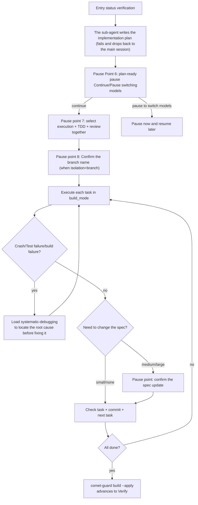

The build stage first creates an implementation plan. You then select execution, TDD, and review modes. The workflow implements and checks each task, records spec updates, and captures debugging results.

<Tip>
Under normal circumstances, you only need <code>/comet</code>. After selecting Classic for configuration, the internal {" "}
<code>/comet-classic</code> will read the status and automatically call {" "} after the design is completed
<code>/ Comet-build </code>. This article describes the internal stage Skill. Only thinking
<strong> manually controls </strong>
Direct input is only required for manual control. See <a href="#how-this-phase-is-triggered">How this phase is triggered</a>.
</Tip>

## How is this stage triggered

`/comet-build` is usually automatically connected by `/comet-classic`.

### Default: Use /comet for automatic connection

After exiting the design phase (`phase: build`), `/comet-classic` will automatically connect and call `/comet-build`. The next time `/comet-classic` is called, if `phase: build` is detected or there is a Design Doc but the execution is not completed, it will also be routed to build -- hotfix to run `/comet-hotfix`, tweak to run `/comet-tweak`, and full to run `/comet-build`. For details, please refer to [Automatic Propulsion Mechanism ](/en/concepts/auto-transition)

### Manual: When is direct /comet-build needed

- When the auto-connection (`auto_transition: false`) is turned off, `/comet-classic` will stop and print hints after the design is completed.
- I just want to run build alone (restore a change of `phase: build` to continue execution).
- After the verify failure, if you roll back through `comet-state transition verify-fail`, you need to re-enter the build to fix it.

Use the unified entry `/comet` normally; The stage command is directly invoked only during the manual control stage. **

---

## What will you experience

There are 4 pause points in the build phase (globally numbered 6-9, with a total of 13 in the entire five-stage workflow. See [Five-stage pause Points and User Selection points ](/en/concepts/decision-points)). The following is an explanation in the order of occurrence.



<p align="center">
  
</p>

<p align="center">
During the build phase, the plan is broken down into task cards, which are executed one by one, debugged, checked, and the submission evidence is left
</p>

### Step 0: Entry status verification

```bash
node "$COMET_STATE" check <name> build
```

Read the `base-ref` and `grep` in the head of the plan to find the first unfinished task. Idempotence: A submitted task will not be resubmitted.

### Step 1: Create an implementation plan

Comet assigns a sub-agent to load the `writing-plans` write plan (this does not occupy the main session context), and when the sub-agent fails, it falls back to the main session for inline loading. The frontmatter plan must include:

```yaml
---
change: <change-name>
design-doc: docs/superpowers/specs/...-design.md
base-ref: <git rev-parse HEAD> # The commit and verify before implementation are used to calculate the scale of the change
---
```

### Pause Point 6: plan-ready Pause

After the plan is written, Comet ** Pause for your choice ** :

|Options|"Behavior"|
| ------------------ | ------------------------------------------------------------------------------------------------------------------- |
|**A continues execution **|Stay in the current model and enter Step 3 to select execution, TDD and review modes|
|**B Pause the model switching **|Record `build_pause: plan-ready`. This time, `/comet-build` stops. After changing the model, you can restore it normally with `/comet`, or you can manually call `/comet-build`|

<Tip>
The purpose of option B is to change the <strong> model to </strong>
For instance, use one model to write the plan and switch to a stronger coding model for execution. When restoring, Comet will detect {" "}
<code>build_pause: plan-ready</code> and the plan exists, it tells you to stop
plan-ready, after you confirm to continue, clear the pause flag. <strong> will not regenerate plan</strong>
Directly enter the work mode selection.
</Tip>

### Pause point 7: Select three execution modes at once

After confirming to proceed, Comet ** asks you three execution options at once ** (not in three installments) : The following first explains the workspace bindings that have been determined in the Open phase, and then lists these three execution options.

#### Workspace Binding (isolation

The new change of Classic has been selected and the workspace is ready in the Open phase. The following values are used to illustrate the workspace binding of change; When restoring or checking, Comet will verify whether the current directory and branch match and will not silently change the directory during the build stage.

|Options|Explanation|"Recommended|
| ---------------------- | ----------------------------------- | ------------------------------ |
|The current branch of A works directly|Do not create a new branch and bind the current Git branch truthfully|The current branch is the target branch of change|
|**B creates a branch **|Creating branches in the current warehouse is simple and fast|Change no more than 3 files|
|**C creates worktree**|Independent workspace, allowing for parallel development|Parallel development or uncommitted changes in the current branch|

When creating, select `branch`. Comet will allow you to confirm or overwrite the branch name during the Open phase. The naming rules are: `feature/YYYYMMDD/<name>` (full), `hotfix/...` (hotfix), `tweak/...` (tweak). All three isolation methods are applicable to full, hotfix and tweak. The selection result will be written to `isolation`, and the current branch of the actual execution directory will be recorded as `bound_branch`. Subsequent entry checks will prevent accidental branch switching.

#### 1. Execution Mode (build_mode

|Options|Explanation|"Recommended|
| ----------------------------------- | ------------------------------------------------------------------------------------------- | --------------------------------------------------------- |
| **A `subagent-driven-development`** |The main session is only coordinated, while the backend sub-proxy is implemented. Each task runs in an isolated implement-sub-agent, and the review is driven by `review_mode`|The number of tasks is ≥ 3, and the complexity is high|
| **B `executing-plans`**             |Lightweight execution, no need for a sub-agent environment|Task ≤ 2. No cross-module dependencies; From the hotfix path|
| `direct`                            |"Direct implementation|Only hotfix/tweak defaults; full requires explicit `direct_override: true`|

<Warning>
To select <code>subagent-driven-development</code>, the platform must have genuine backend scheduling capabilities - otherwise
Comet will pause to allow you to choose <code>executing-plans</code>. By default, full workflow cannot use {" "}
<code>direct</code>, unless you explicitly set <code>direct_override: true</code>.
</Warning>

#### 2. TDD Mode (tdd_mode

|Options|Explanation|
| --------- | ----------------------------------------------------------------------------- |
| **`tdd`** |Write failure tests for each task first, Red-Green-Refactor (** Recommended **, involving business logic/new features /API)|
| `direct`  |Direct implementation, no mandatory TDD (default for hotfix/tweak)|

#### 3. Review Mode (review_mode

|Options|Explanation|"Recommended|
| -------------- | -------------------------------------------------------------------------------- | ------------------------------ |
| `off`          |No automatic review|Documents, configurations, copywriting, small-scale low-risk|
| **`standard`** |By default, no task reviewer is assigned. Only assign each task reviewer when the task hits a risk signal, plus one final lightweight review|** Default recommendation **, most common changes|
| `thorough`     |Each task is assigned a per-task reviewer (spec + quality), along with a final complete review|High risk, multi-module, architecture/security|

For details, please refer to [Code Review Mechanism ](/en/concepts/review-mode)

### Step 3: Execute task by task

After selection, press `build_mode` to execute. The experiences of the two execution methods are different:

|"Dimension"| `executing-plans`                                                                     | `subagent-driven-development`                                                      |
| -------- | ------------------------------------------------------------------------------------- | ---------------------------------------------------------------------------------- |
|Who writes the code?|Do it directly in the main session|The main session ** only coordinates **, and the backend sub-agent implementation (prohibiting direct code writing in the main session)|
|Task advancement|Execute in sequence and check each one individually|For each task, a new sub-agent is assigned. Once it passes the acceptance inspection, the next one is immediately assigned, constantly asking if you want to continue|
|Review|review gate scales by `review_mode` (standard= one final; thorough= every 3 task segments + final)|Assign each task reviewer + repair agent according to review_mode (thorough= each task; standard= only risk tasks)|
|Model selection|The main session is executed directly|Each distribution must explicitly specify the model (the implementer/fixer/reviewer scales separately)|
|The progress is visible|It can be directly seen in the conversation|Maintain the `.comet/subagent-progress.md` checkpoint|

<Tip>
Under the <code> subagent-driven development</code>, after each task is accepted and selected, it will
<strong> immediately dispatches the next task</strong>
I won't stop to summarize or ask you. There are only four situations when the review and repair rounds are exhausted (BLOCKED), when there is a real ambiguity, when the platform has no background scheduling, or when you explicitly want to stop. The review intensity is determined by {" "}
  <code>review_mode</code>{" "}
Decision (thorough= review for each task; standard= Review only for risk tasks).
</Tip>

<Note>
The sub-agent (implementer) <strong> cannot select the task </strong> by itself
-- Only the main session is selected after the two-phase acceptance is passed. The reviewer received the complete task plus its implementation
commit/diff + RED/GREEN evidence (in TDD)
One cannot draw a conclusion based solely on the summary of the implementer.
</Note>

### Step 3b: Abnormal Debugging Protocol (Mandatory)

When a crash, test failure, build failure or abnormal behavior occurs during execution, Comet forces the loading of `systematic-debugging`:

1. ** First identify the root cause ** - Read the complete error, check the recent changes, and trace the data stream. No fixes shall be proposed until the root cause investigation is completed. **
2. When the root cause is a bug in the source code, first add a minimum failure test to reproduce it, and then fix the source code.
3. After completing the run failure test, related tests, and project build/verification command confirmation, all passed.
4. Failed tests, source code fixes, and the tasks.md checkmark are all kept within the current change. Do not open a new "Write Test Cases "change to replace the current verification loop.

#### Parallel troubleshooting of multiple failures

Before entering the four-stage process, conduct a "failure independence assessment" first to determine whether it is serial or parallel:

|"Situation|"Processing"|
| ---------------------------------------------------------- | ----------------------------------------------------------------------------------- |
|** Serial ** (following `systematic-debugging`)|Failure ≤ 2; Failure-related (fixing one might fix another); Shared status It will move the same batch of documents. Independence has not been established.|
|"Parallelism" (Loading Superpowers `dispatching-parallel-agents`)|**≥ 3 failures from different problem domains ** (different test files, different root causes, independent damage of different subsystems)|

When the parallel condition is met:

1. Load Superpowers `dispatching-parallel-agents` using the Skill tool.
2. For each independent failure, assign a background troubleshooting agent (grouped by problem domain and all dispatched in the same response for concurrent execution). Each prompt contains the complete context (specific failure, error message, allowed troubleshooting scope, and prohibition of touching other problem domain code).
3. All agents are still subject to the constraint that "the source code cannot be modified before the root cause is located" - they only ** locate the root cause and return the discovery **, and do not directly submit the fix.
4. After all the troubleshooting returns, the main session ** serially ** summarizes the discovery and fixes. The repair still follows the current verification and review cycle of `review_mode`.

<Warning>
<strong> parallelism is only used for troubleshooting, not for repair. The </strong> fix is always serial, avoiding multiple agents
Simultaneously modifying the same batch of files conflicts - this is related to <code>subagent-driven development</code>
The red line for "Do not distribute multiple implementation sub-agents in parallel" is consistent. Even if <code>review_mode: off</code>
This is also an abnormal debugging protocol
<strong> does not skip </strong> -- <code>off</code>{" "}
Only skip code review, not the debugging of real problems.
</Warning>

### Step 4: spec Incremental update

When it is found during execution that the spec needs to be modified, handle it according to the scale:

|Scale|Trigger condition|"Method"|
| ------ | ------------------------------ | -------------------------------------------------------------------------- |
|small|Omitted acceptance scenarios and boundary conditions|Directly edit delta spec + design.md and append tasks|
|In the|Interface changes, new components added, and changes in data flow|** Pause for your confirmation **, load `brainstorming` to update Design Doc + delta spec|
|big|"Brand-new capability|** Pause for your confirmation of the split **, create a new change through `/comet-open` (`/opsx:new` cannot be used)|
|Over 50%|The number of newly added tasks exceeds half of the total number of initial tasks|** Pause Point 9** : Split into a new change/Continue to complete within the current change|

### Step 5: Check + Submit

For each task: Execute by `build_mode` → Review by `review_mode` (if applicable) → ** Main session ** check tasks.md → Submit. Check "Use directional Verification"

```bash
node "$COMET_STATE" task-checkoff "$PLAN_FILE" "$PLAN_TASK_TEXT"
```

The task text must appear uniquely and be checked. If verification fails, you cannot proceed to the next task. You can use `grep -c '\- \[ \]' tasks.md` to check the remaining unselected numbers.

### Exit

```bash
node "$COMET_GUARD" <change-name> build --apply
```

Advance to `phase: verify`, and set `verify_result: pending`.

---

## The invoked skill

| Skill                         |Purpose|When to call|
| ----------------------------- | ------------------ | ------------------------------------------------------------------------------------------------------------------------ |
| `writing-plans`               |Generate an implementation plan|Step 1, sub-agent execution, failure and fallback to the main session|
| `executing-plans`             |Lightweight execution plan| Step 3，`build_mode: executing-plans`                                                                                    |
| `subagent-driven-development` |Sub-agent-driven execution| Step 3，`build_mode: subagent-driven-development`                                                                        |
| `test-driven-development`     |Forced TDD|Step 3, `tdd_mode: tdd`|
| `requesting-code-review`      |Code review access control|Step 3, `review_mode: standard`/`thorough` (executing-plans zoom in review_mode; subagent mode zoom in reviewers per task/risk)|
| `systematic-debugging`        |Abnormal debugging|Step 3b: Forced loading when crash/test fails/build fails|
| `dispatching-parallel-agents` |Parallel troubleshooting of multiple failures|Step 3b: Load when ≥ 3 independent failures (Troubleshoot only, fix serial)|
| `brainstorming`               |Medium-scale spec update|Step 4, when discovering changes in interfaces/components/data flows|

## Product

|Product|Location|Explanation|
| -------------------- | ------------------------------------------------ | ----------------------------------------------- |
|Implementation plan| `docs/superpowers/plans/YYYY-MM-DD-<feature>.md` |Containing `change`/`design-doc`/`base-ref` frontmatter|
| subagent-progress.md | `.comet/subagent-progress.md`                    |Sub-agent scheduling checkpoint (subagent mode only)|
|Check the tasks.md box| `tasks.md`                                       | `- [ ]` → `- [x]`                               |
|Code modification|Repository code|Submit to the isolated branch /worktree|

## Exit condition (guard check)

- Check all of tasks.md
- The code has been submitted.
- Explicitly run the project build/test command and pass (do not rely solely on guard's automatic guessing)
- `isolation` is `current`, `branch` or `worktree`, and the current Git branch is consistent with `bound_branch`
- `build_mode` selected (for subagent mode, `subagent_dispatch: confirmed` is required)
- `tdd_mode` has been selected
- `review_mode` selected (complete by executing-plans review gate: standard/thorough requested review and fix CRITICAL or record non-critical acceptance reasons; off recorded skip reasons)

guard will automatically detect the project build entry (such as `npm run build`, Maven or Cargo) and take the failed output as evidence. `build_command`/`verify_command` has been removed and can no longer be written in `.comet.yaml` or the root configuration of the repository. If a fixed team-level verification process is required, please incorporate it into the project's own build script.

## "Restore

Build is idempotent. When resuming, `grep -n '\- \[ \]' tasks.md | head -1` finds the first unfinished task. For `build_pause: plan-ready`, see [Pause point 6](#pause-point-6-plan-ready). After context compression, run `comet-state check <name> build --recover` to restore context. In subagent mode, reread `.comet/subagent-progress.md` to recover the current task and review round; **do not execute tasks directly in the main session**. If a `full` workflow stops at plan-ready, first confirm the existing workspace binding, then complete or confirm `build_mode`, `tdd_mode`, and `review_mode`.

## Recommended path

<Tip>
For multi-person collaboration or high-risk changes, worktree + <code>review_mode: thorough</code> is preferred
. For minor explicit changes, use branch + <code>standard</code>.
</Tip>

## Next step

- [verify stage ](/en/phases/verify) - Enter verification after the build is completed
- Detailed Explanation of the Code Review Mechanism ](/en/concepts/review-mode) - review_mode
- [State management ](/en/concepts/state-management) -- build_mode/isolation/tdd_mode field
- Five-stage pause points and user selection points ](/en/concepts/decision-points) - the pause points of build
