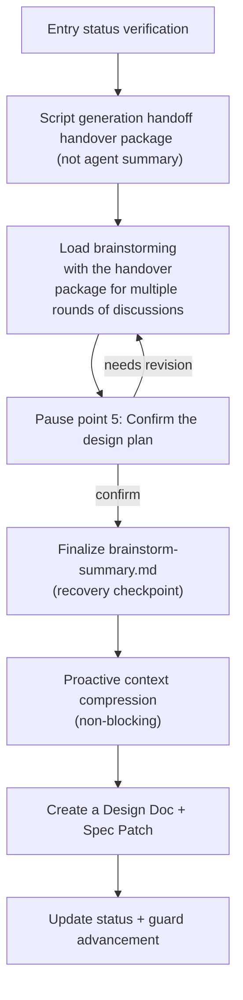

In the design stage, conduct in-depth technical design. It first packages the OpenSpec artifacts in the open phase into a handover package using a script, then hands it over to Superpowers `brainstorming`, guiding you through multiple rounds of solution discussions, and finally produces a Design Doc. From your perspective, this is a real brainstorming session - Comet will repeatedly discuss the implementation plan, trade-offs, and risks with you, and only write the documentation after confirming the plan.

<Tip>
Under normal circumstances, you only need <code>/comet</code>.
After the configuration is selected as Classic, the internal <code>/comet-classic</code> will read the status and automatically call {' '} after the open is completed
<code>/ Comet-design </code>. This article describes the internal stage Skill. Only <strong> can manually control </strong>
Direct input is only required for manual control. See <a href="#how-this-phase-is-triggered">How this phase is triggered</a>.
</Tip>

## How is this stage triggered

`/comet-design` is commonly connected automatically by `/comet-classic`.

### Default: Use /comet for automatic connection

After the open phase exits (`comet-guard <name> open --apply` advances `phase: design`), `/comet-classic` will automatically connect and call `/comet-design` - you don't need to manually enter the next phase command after the open phase is completed. The next time `/comet-classic` is called, if `phase: design` is detected or there is a change but the Design Doc is missing, it will also be routed to design. For details, please refer to [Automatic Propulsion Mechanism ](/en/concepts/auto-transition)

### Manual: When is direct /comet-design needed

- After the automatic connection (`auto_transition: false`) -- open is completed, `/comet-classic` will stop and print hints. You need to manually call `/comet-design`.
- Just want to run the design alone (restore a change that already exists but lacks the Design Doc, or want to redo the technical design).
- If the hotfix/tweak hits the qualitative change upgrade signal, roll back to design to complete the design.

Use the unified entry `/comet` normally; The stage command is directly invoked only during the manual control stage. **

---

## What will you experience

The core of the design stage is a brainstorming session based on real context. brainstorming directly uses scripts to generate "handover packages" from artifacts in the open phase, and the design basis thus comes from real requirements and project documents.



### Step 0: Entry status verification

```bash
node "$COMET_STATE" check <name> design
```

If `handoff_context` and `handoff_hash` already exist, first confirm whether they match the current artifacts, and then decide whether to regenerate them.

### Step 1a: Generate the handoff handover package

It must be generated by a script and cannot be replaced by a handwritten summary by the agent on the spot. This is the core of reliability in the design stage.

```bash
node "$COMET_HANDOFF" <change-name> design --write
```

The form of the handover package depends on the `context_compression` configuration:

|"Mode"|Output|"Content|
| ------------- | ----------------------------- | ----------------------------------------------------------------- |
|`off` (Default)| `design-context.json` + `.md` |Complete summary, each file with sha256, over 80 lines truncated (retaining the complete source path)|
| `beta`        | `spec-context.json` + `.md`   |delta spec verbatim projection, other file hash references (save approximately 25-30% token)|

Write both `handoff_context` and `handoff_hash` into `.comet.yaml` simultaneously. When complete context is needed, add `--full`.

The source of the handover package is the four artifacts in the open phase: `proposal.md` (target motivation range), `design.md` (high-level architecture), `tasks.md` (task boundary), and `specs/*/spec.md` (delta spec).

<p align="center">
  
</p>

The <p align="center">handoff handover package is directly generated by the script reading real artifacts to produce </p>

### Step 1b: Conduct brainstorming (with real context)

Load Superpowers `brainstorming` and conduct in-depth technical design with the handover package as the context. Comet will not skip the clarification process of brainstorming just because of "context redundancy" - it will:

- Discuss the implementation plan, technical risks, testing strategies, and boundary conditions
- If the target/scope/non-target/acceptance scenario/key constraints are still unclear, ** continue to ask questions **
- ** Do not create a Design Doc after just one round of Q&A ** -- Go through the complete process of clarification → 2-3 candidate proposals → step-by-step confirmation
- During the Design process, ** incremental update ** `brainstorm-summary.md` (restore checkpoints, not Design Doc) will be carried out. The confirmed facts, constraints, candidate solutions, trade-offs, and Spec Patch candidates will be recorded. Unconfirmed items will be marked as "pending confirmation" or "candidate".

<Warning>
Comet cannot write the second requirement of <strong> spec</strong> in the Design Doc. If the delta spec lacks acceptance scenarios, only {' '} can be written
<strong>Spec Patch</strong> (written back to OpenSpec delta
(spec) - Only for supplementary acceptance scenarios, correction of ambiguous wording, and addition of boundary conditions. Substantial changes to the structure or scope must be returned as design findings
brainstorming confirmation.
</Warning>

<Note>
If <code>brainstorming</code> skill is not available, the Comet will stop and prompt you to install/enable Superpowers,
<strong> will not use ordinary conversations instead of </strong>.
</Note>

### Pause point 5: Confirm the design plan

After brainstorming generates a plan, Comet pauses ** to wait for your clear confirmation **. Before confirmation, one cannot create a Design Doc, write `design_doc`, run design guard, or enter `/comet-build`. The summaries it presents include:

- The adopted technical solution
- Key trade-offs and risks
- Test strategy
- If there is a Spec Patch, list the delta spec changes that will be written back

You confirm → continue; You need to adjust → Go back to 1b and continue the discussion until you confirm.

### Step 1d: Finalizing brainstorm-summary.md

After confirmation and before creating the Design Doc, Comet writes the confirmed solution into `brainstorm-summary.md`. The structure is: confirmed technical solution/Key trade-offs and risks/Test strategy/Spec Patch. This is the recovery anchor point after context compression.

### Step 1e: Proactive context compression (non-blocking)

After the Design Doc, state, and handoff are all written to disk, and before entering build, Comet ** actively triggers context compression once **:

- When the platform has a native compression mechanism (compact/compaction command or UI), Comet triggers it once - it ** will not ** pretend to compress with a shell script.
- When the platform does not support automatically triggered compression, Comet gives a compression suggestion and ** continues directly **, without adding a pause point for this.

### Step 2: Create a Design Doc

Create a Design Doc in the main session using the full brainstorming context with minimal frontmatter:

```yaml
---
comet_change: <change-name>
role: technical-design
canonical_spec: openspec
---
```

Written in `docs/superpowers/specs/YYYY-MM-DD-<topic>-design.md`. If there is a Spec Patch, edit the corresponding `specs/*/spec.md`.

### Step 3: Update status + Advance

```bash
node "$COMET_STATE" set <name> design_doc <path>
# If the delta spec changed, regenerate the handoff to update its hash
node "$COMET_HANDOFF" <change-name> design --write
# Advance the phase guard
node "$COMET_GUARD" <change-name> design --apply
```

If the delta spec is not modified, skip handoff and regenerate. Advance to `phase: build`.

---

## The invoked skill

| Skill                   |Purpose|When to call|
| ----------------------- | ------------------------------------ | ------------------------------------ |
| `brainstorming`         |In-depth technical design (plan, risk, test strategy)|Step 1b, execute immediately, do not skip|
|`brainstorming` (Again)|Redesign when the medium-scale spec is updated|When changes in interfaces/components/data flows are detected during the build phase|

The OpenSpec skill is not called in the design phase -- OpenSpec artifacts have been created in the open phase.

## Product

|Product|Location|Explanation|
| --------------------- | ----------------------------------------------------- | ------------------------------- |
| Design Doc            | `docs/superpowers/specs/YYYY-MM-DD-<topic>-design.md` |Final technical design document|
|handoff handover bag| `.comet/handoff/design-context.json` + `.md`          |"OpenSpec→Superpowers Handover context.|
| brainstorm-summary.md | `.comet/handoff/brainstorm-summary.md`                |Context compression recovery checkpoint|

## Exit condition (guard check)

When leaving design, guard checks:

- The Design Doc has been created
- frontmatter includes `comet_change`, `role: technical-design`, and `canonical_spec: openspec`
- `handoff_context` and `handoff_hash` have been written into `.comet.yaml`
- `handoff_hash` matches the current OpenSpec artifacts (**a mismatch aborts immediately**)
- markdown handover tape traceable markers (source path, mode, sha256)
- The `spec-context.json` structure is effective in beta mode

## When to enter

Normally, `/comet-classic` enters Design automatically after Open completes (see [How this phase is triggered](#how-this-phase-is-triggered)). Manual scenarios include a hotfix/tweak that crosses the upgrade threshold and needs full Design, or a recovered Change whose design document is missing.

<Warning>
The full workflow should not skip the design. hotfix and tweak can be skipped, but once the range deteriorates, it should be upgraded back to full.
</Warning>

## "Restore

The design stage is idempotent and can be safely repeated. `brainstorm-summary.md` is a persistent recovery checkpoint - after context compression, reloading it along with two handover package files will allow you to continue. If the design plan has not been confirmed yet, go back to 1b/1c; If confirmed, create a Design Doc.

## Next step

- After the design is completed in the build phase, it enters the planning and execution stage
- Context Compression mechanism ](/en/concepts/context-compression) - Detailed Explanation of the off/beta Mode of handoff Handover Packet
- Workflow intermediate products such as ](/en/concepts/intermediate-artifacts) - brainstorm-summary, etc
- Five-stage pause points and user selection points ](/en/concepts/decision-points)-design pause points
